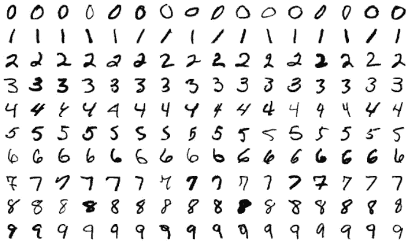
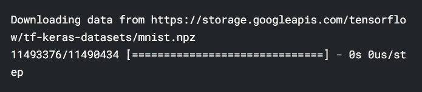
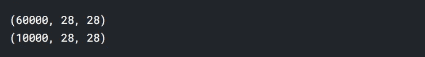
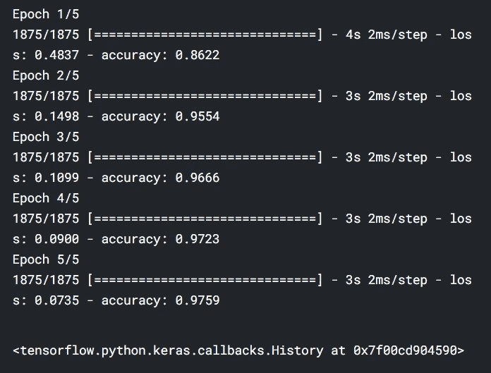
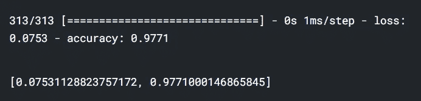

# TensorFlow 深度学习简介

> 原文：<https://levelup.gitconnected.com/introduction-to-deep-learning-with-tensorflow-2-f61decb13cdb>

## 深度学习教程

## TensorFlow 和 Keras 深度学习实用指南


安德里亚斯·克拉森在 [Unsplash](https://unsplash.com?utm_source=medium&utm_medium=referral) 上拍摄的照片

深度学习是基于人工神经网络架构的机器学习的一个子领域。神经网络背后的想法是受人类大脑中的神经元以及它们如何相互作用的启发。在这篇文章中，我将讨论以下主题:

*   什么是深度学习？
*   什么是张量流？
*   安装 Tensorflow
*   深度神经网络
*   Tensorflow 实践示例

让我们开始吧！

# 什么是深度学习？

机器学习技术用于从数据中提取信息。然而，机器学习技术不足以分析大数据。深度学习技术帮助我们在大数据中找到模式。这些技术大部分都是之前发现的，但随着数据量的增加和技术的发展，近年来用深度学习来执行人形任务。

# 什么是张量流？

TensorFlow 是 Google 开发的开源机器学习平台。可以用 TensorFlow 进行深度学习分析。你也可以选择脸书开发的 PyTorch 进行深度学习。但是 TensorFlow 更多的是用于端到端的项目。

# 安装 TensorFlow

要安装 TensorFlow，首先需要安装 Python。你可以从[这里](https://www.python.org/downloads/)安装 Python 到你的电脑上。要安装 TensorFlow，您需要安装最新版本的 pip。您可以使用以下代码来更新 pip。

```
pip install — upgrade pip
```

## 虚拟环境安装

有时，您可以同时处理多个项目。您可能希望为每个项目使用不同的库。通过使用虚拟环境，可以防止这些库发生冲突。

使用虚拟环境，您可以将每个项目使用的库分开。所以你的库不会冲突。您可以使用各种方法，如 *pipenv* 或 *venv* 来设置虚拟环境。要在 Windows 中设置虚拟环境，让我们首先打开命令行并创建一个新文件夹。

```
mkdir tf_project
cd tf_project
```

让我们用 *venv* 在这个文件夹中建立一个新的虚拟环境。

```
python3 -m venv tensorflow
```

之后就要激活这个环境了。为此，您可以使用下面的命令。

```
source env/bin/activate
```

从行首的虚拟环境名称可以了解到虚拟环境是活动的。您可以使用 pip 在这个虚拟环境中安装软件包或库。首先，让我们在这个虚拟环境中更新 pip。

```
pip install — upgrade pip
```

您可以使用下面的命令来查看虚拟环境中已安装的软件包。

```
pip list
```

让我们用 pip 安装 TensorFlow。

```
pip install tensorflow
```

您可以使用各种编辑器来编写代码，例如 vs code 和 sublime text。Jupyter Notebook 经常用于数据科学项目，因为它可以很好地可视化数据。让我们在虚拟环境中安装这个编辑器。

```
pip install notebook
```

要启动 Jupyter Notebook，只需在命令行中键入以下命令。

```
jupyter notebook
```

jupyter 笔记本打开后，创建一个新的 Python 文件。要使用 TensorFlow，您必须导入它。我们导入 TensorFlow 吧。

```
import tensorflow as tf
```

如果运行此命令时没有收到任何错误，则 TensorFlow 已安装，没有任何错误。

# 科拉布

您可以使用 Colab 来处理 TensorFlow。Colab 是谷歌提供的类似于 Jupyter Notebook 的云服务。Colab 中安装了 TensorFlow、Pandas、NumPy 等库。您可以通过直接导入来使用这些库。

要使用 Colab，可以去[这个地址](https://colab.research.google.com/)。在 Colab 中工作时，不要忘记点击右上角的*连接*。首先，我们导入 TensorFlow。

```
import tensorflow as tf
```

# 深度神经网络

人工神经网络(ann)是一种通过模仿人脑来发现数据模式的技术。人工神经网络已经成功地解决了线性问题，但它们未能解决非线性问题。人工神经网络增加了隐藏层来解决非线性问题。具有一个以上隐藏层的神经网络被称为*深度神经网络*。另一方面，使用深度神经网络技术从数据中提取信息被称为*深度学习*。通过深度学习，以前无法解决的问题得到了解决，例如

*   图像分类
*   声音识别
*   机器翻译
*   像 Siri 和 Alex 这样的助理助手
*   无人驾驶汽车
*   将语音转换成声音



MNIST 数据集

让我们使用 MNIST 数据集来展示深度神经网络。该数据集包含 28 * 28 像素的 0 到 9 位数的灰度图像。该数据集包含 60，000 张训练图片和 10，000 张测试图片。你可以把分析 MNIST 数据集想象成深度学习的“你好世界”。

我们先导入这个数据集。

```
mnist = tf.keras.datasets.mnist
```

让我们将这个数据集分成训练和测试两部分。请记住，模型是用训练数据构建的，模型是用测试数据评估的。

```
(x_train, y_train), (x_test, y_test) = mnist.load_data ()
```



图像被编码为 NumPy 数组。标签是从 0 到 9 的数字。让我们看看数据集的结构。

```
print (x_train.shape)
print (x_test.shape)
```



在深度学习分析中缩放数据既加快了网络的训练，又提高了网络的准确性。让我们在 0 和 1 之间调整数据。

```
x_train, x_test = x_train / 255.0, x_test / 255.0
```

现在我们可以开始构建神经网络了。您可以将神经网络创建为一系列层。您可以将图层视为从数据中提取信息的过滤器。我将使用序列技术进行分析。

```
model = tf.keras.models.Sequential([
   tf.keras.layers.Flatten(input_shape = (28, 28)),  **(1)**
   tf.keras.layers.Dense (128, activation = ‘relu’), **(2)**
   tf.keras.layers.Dropout(0.2),                     **(3)**
   tf.keras.layers.Dense(10)                         **(4)**
])
```

**(1)** 第一层是输入层。展平用于展平输入。

**②**第二层是致密层。密集层称为全连通。这一层的所有神经元都与前面的所有神经元相连。我确定这一层的神经元数量为 128，激活函数为 relu(矫正线性单位)。层只能学习输入的线性变换。激活函数用于学习数据中更复杂的模式。它有 elu、tanh 等激活函数，但大多是 relu 激活函数用于深度学习分析。relu 函数将负值取为 0。

**(3)** 如果模型在训练数据中表现良好，但在测试数据中表现不佳，则出现过拟合问题。正则化技术用于克服过拟合问题。有正则化技术，如 L1 和 L2。这里我使用了辍学技术。

Dropout 是用于神经网络的正则化技术。当对图层应用“丢弃”时，输出的随机部分会在训练过程中被丢弃。因此，防止了模型的过度记忆。

**(4)** 最后一层是输出层。我在这一层设置了 10，因为结果变量中有 10 个类。

在此之后，为了准备用于训练的神经网络，您需要编译模型。让我们在编译模型时指定三个参数。

```
model.compile (optimizer = ‘man’, **(1)**
    loss = tf.keras.losses.SparseCategoricalCrossentropy(
             from_logits = True), **(2)**
    metrics = [‘accuracy’]        **(3)**
)
```

**(1)** 损失函数测量神经网络在训练数据上的性能。这是通过将神经网络的估计值与实际值进行比较来实现的。当有两个或更多类时，可以使用 SparseCategoricalCrossentropy 作为损失函数。如果你有一个热点编码标签，你可以使用分类交叉熵损失。

**(2)** 优化器根据损失函数值更新神经网络中使用的权重。有各种优化器函数，如 RMSProp 和 SGD。Adam(自适应矩估计)优化器近年来变得特别流行。该算法是随机梯度下降法的扩展。

**(3)** 度量参数用于查看神经网络的性能。我使用准确性度量来分析分类问题。

到目前为止，我已经构建了模型的架构，并使用 compile 方法编译了模型。现在模型已经准备好进行训练了。让我们用拟合的方法来训练神经网络。

```
model.fit(x_train, y_train, epochs = 5)
```



> 训练数据的每次迭代称为一个时期。在每次迭代中，神经网络用损失函数更新权重。

训练时，网络的损耗和精度都写在屏幕上。该模型对训练数据的准确率约为 98%。定型模型后，可以使用 evaluate 方法来评估模型在测试集上的性能。

```
model.evaluate(x_test, y_test)
```



这样，模型对训练数据的准确性就写在屏幕上了。该模型对测试数据的准确率约为 98%。所以我们建立了第一个神经网络。你可以在我们的 GitHub 页面上访问我在本文中使用的笔记本。

# 结论

深度学习是当今最热门的领域之一。Tensorflow 和 Keras 经常用于深度学习分析。在这篇博客文章中，我向您展示了 Tensowflow 使用 MNIST 数据集进行的深度学习分析。就是这样。我希望你喜欢它。感谢您的阅读。

别忘了在[YouTube](https://www.youtube.com/channel/UCFU9Go20p01kC64w-tmFORw)|[GitHub](https://github.com/tirendazacademy)|[Twitter](https://twitter.com/TirendazAcademy)|[ka ggle](https://www.kaggle.com/tirendazacademy)|[Linkedin](https://www.linkedin.com/in/tirendaz-academy)上关注我们


[提伦达兹艾](https://tirendazacademy.medium.com/?source=post_page-----f61decb13cdb--------------------------------)

## 使用 Python 实践深度学习

[View list](https://tirendazacademy.medium.com/list/handson-deep-learning-with-python-6b46ad958b57?source=post_page-----f61decb13cdb--------------------------------)12 stories

如果这篇文章有帮助，请点击拍手👏按钮几下，以示支持👇