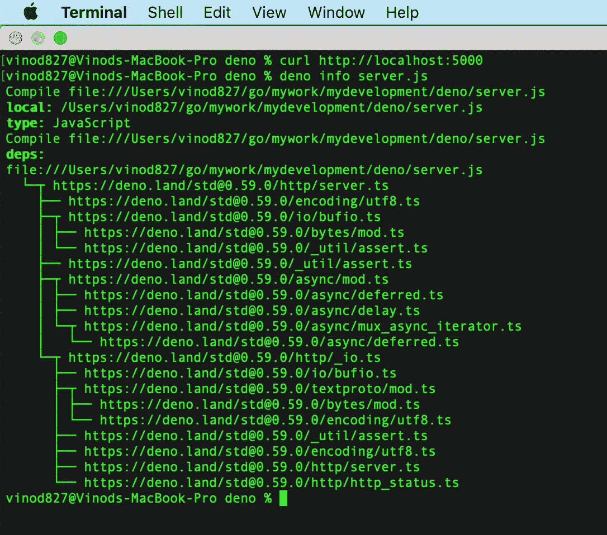
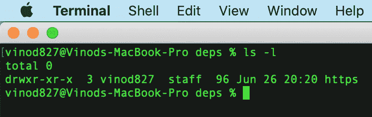

# Deno 介绍 NodeJS 运行时的下一个级别

> 原文：<https://levelup.gitconnected.com/introduction-to-deno-the-next-level-of-nodejs-runtime-eacaf2966d94>


德诺

**Deno** 是 **JavaScript** 和 **TypeScript** 的安全运行时。它是由开发 NodeJS 运行时的同一个人开发的， **Ryan Dahl** 。Deno 使用 **V8** 发动机，内置 **Rust** 。

Deno 在默认情况下是安全的，这意味着除非在运行程序时明确指定，否则不能访问网络、文件系统或环境等。

Deno 还支持开箱即用的 TypeScript，所有标准模块都从 HTTP 服务器导入并缓存在本地，这与 nodeJS 不同，NodeJS 在 node_modules 中维护模块，如果程序需要特定的模块，Node 将遍历整个树结构来解析该模块。

# **安装 Deno:**

如果您在 Mac 上使用自制软件，请执行:

```
brew install deno
```

或者在 Mac/Linux 上使用 shell:

```
curl -fsSL [https://deno.land/x/install/install.sh](https://deno.land/x/install/install.sh) | sh
```

对于 Windows，使用 PowerShell，执行:

```
iwr [https://deno.land/x/install/install.ps1](https://deno.land/x/install/install.ps1) -useb | iex
```

现在让我们使用 Deno runtime 编写一个简单的 web 服务器 JavaScript 程序。

**server.js**

```
import { serve } from "https://deno.land/std@0.59.0/http/server.ts";console.log('App is listening on Port: 5000');async function main(){ for await ( let request of serve(":5000")){ const resBody = new TextEncoder().encode("Hello Deno\n"); request.respond( { resBody }); }}main();
```

要运行该程序，请执行

```
deno run server.js
```

Deno 将开始从互联网下载标准模块 server.ts 到本地机器，并将缓存在/Users/<userid>/Library/Caches/deno(对于 Mac)</userid>

# **控制台输出:-**

```
vinod827@Vinods-MacBook-Pro deno % deno run server.js
Download [https://deno.land/std@0.59.0/http/server.ts](https://deno.land/std@0.59.0/http/server.ts)
Download [https://deno.land/std@0.59.0/encoding/utf8.ts](https://deno.land/std@0.59.0/encoding/utf8.ts)
Download [https://deno.land/std@0.59.0/io/bufio.ts](https://deno.land/std@0.59.0/io/bufio.ts)
Download [https://deno.land/std@0.59.0/_util/assert.ts](https://deno.land/std@0.59.0/_util/assert.ts)
Download [https://deno.land/std@0.59.0/async/mod.ts](https://deno.land/std@0.59.0/async/mod.ts)
Download [https://deno.land/std@0.59.0/http/_io.ts](https://deno.land/std@0.59.0/http/_io.ts)
Download [https://deno.land/std@0.59.0/async/deferred.ts](https://deno.land/std@0.59.0/async/deferred.ts)
Download [https://deno.land/std@0.59.0/async/delay.ts](https://deno.land/std@0.59.0/async/delay.ts)
Download [https://deno.land/std@0.59.0/async/mux_async_iterator.ts](https://deno.land/std@0.59.0/async/mux_async_iterator.ts)
Download [https://deno.land/std@0.59.0/textproto/mod.ts](https://deno.land/std@0.59.0/textproto/mod.ts)
Download [https://deno.land/std@0.59.0/http/http_status.ts](https://deno.land/std@0.59.0/http/http_status.ts)
Download [https://deno.land/std@0.59.0/bytes/mod.ts](https://deno.land/std@0.59.0/bytes/mod.ts)
Compile file:///Users/vinod827/go/mywork/mydevelopment/deno/server.js
App is listening on Port: 5000
error: Uncaught PermissionDenied: network access to “:5000”, run again with the — allow-net flag
 at unwrapResponse ($deno$/ops/dispatch_json.ts:43:11)
 at Object.sendSync ($deno$/ops/dispatch_json.ts:72:10)
 at Object.listen ($deno$/ops/net.ts:51:10)
 at Object.listen ($deno$/net.ts:155:22)
 at serve ([https://deno.land/std@0.59.0/http/server.ts:256:25](https://deno.land/std@0.59.0/http/server.ts:256:25))
 at main (file:///Users/vinod827/go/mywork/mydevelopment/deno/server.js:6:32)
 at file:///Users/vinod827/go/mywork/mydevelopment/deno/server.js:12:1
vinod827@Vinods-MacBook-Pro deno %
```

您还会遇到权限错误。就像我上面说的，Deno 在默认情况下是安全的，所以您需要明确地给出在您的机器上运行 HTTP 服务器的许可。

使用标志`--allow-net`重新运行相同的程序，如下所示:

```
deno run --allow-net server.js
```

# **新增** **控制台输出:**

```
vinod827@Vinods-MacBook-Pro deno % deno run — allow-net server.js
Compile file:///Users/vinod827/go/mywork/mydevelopment/deno/server.js
App is listening on Port: 5000
```

现在让我们调用我们的 API。

执行 GET curl 操作，您将看到输出

```
curl http://localhost:5000 HTTP Request:: ServerRequest {
 done: Promise { <pending> },
 _contentLength: undefined,
 _body: null,
 finalized: false,
 conn: ConnImpl {
 rid: 4,
 remoteAddr: { hostname: “127.0.0.1”, port: 56280, transport: “tcp” },
 localAddr: { hostname: “127.0.0.1”, port: 5000, transport: “tcp” }
 },
 r: BufReader {
 r: 78,
 w: 78,
 eof: false,
 buf: Uint8Array(4096) [
 71, 69, 84, 32, 47, 32, 72, 84, 84, 80, 47, 49, 46, 49, 13,
 10, 72, 111, 115, 116, 58, 32, 108, 111, 99, 97, 108, 104, 111, 115,
 116, 58, 53, 48, 48, 48, 13, 10, 85, 115, 101, 114, 45, 65, 103,
 101, 110, 116, 58, 32, 99, 117, 114, 108, 47, 55, 46, 54, 52, 46,
 49, 13, 10, 65, 99, 99, 101, 112, 116, 58, 32, 42, 47, 42, 13,
 10, 13, 10, 0, 0, 0, 0, 0, 0, 0, 0, 0, 0, 0, 0,
 0, 0, 0, 0, 0, 0, 0, 0, 0, 0,
 … 3996 more items
 ],
 rd: ConnImpl {
 rid: 4,
 remoteAddr: { hostname: “127.0.0.1”, port: 56280, transport: “tcp” },
 localAddr: { hostname: “127.0.0.1”, port: 5000, transport: “tcp” }
 }
 },
 method: “GET”,
 url: “/”,
 proto: “HTTP/1.1”,
 protoMinor: 1,
 protoMajor: 1,
 headers: Headers { host: localhost:5000, user-agent: curl/7.64.1, accept: */* },
 w: BufWriter {
 usedBufferBytes: 0,
 err: null,
 writer: ConnImpl {
 rid: 4,
 remoteAddr: { hostname: “127.0.0.1”, port: 56280, transport: “tcp” },
 localAddr: { hostname: “127.0.0.1”, port: 5000, transport: “tcp” }
 },
 buf: Uint8Array(4096) [
 0, 0, 0, 0, 0, 0, 0, 0, 0, 0, 0, 0, 0, 0, 0,
 0, 0, 0, 0, 0, 0, 0, 0, 0, 0, 0, 0, 0, 0, 0,
 0, 0, 0, 0, 0, 0, 0, 0, 0, 0, 0, 0, 0, 0, 0,
 0, 0, 0, 0, 0, 0, 0, 0, 0, 0, 0, 0, 0, 0, 0,
 0, 0, 0, 0, 0, 0, 0, 0, 0, 0, 0, 0, 0, 0, 0,
 0, 0, 0, 0, 0, 0, 0, 0, 0, 0, 0, 0, 0, 0, 0,
 0, 0, 0, 0, 0, 0, 0, 0, 0, 0,
 … 3996 more items
 ]
 }
}
```

让我们深入研究一下，看看 Deno 在运行这个程序时是如何缓存依赖项的，以及缓存在哪里。

```
deno info server.js
```



如果你看到上面的截图，我们的程序 server.js 依赖于 server.ts，而 server . ts 又依赖于其他各种类。

在 Mac 上，导航到/Users/<userid>/Library/Caches/deno，这是 Deno 的根文件夹，用于缓存本地机器上的资源。如果你注意到，有两个主文件夹: **gen** 和 **deps** 。从互联网上下载的所有资源都缓存在本地的 **deps** 文件夹中(在我们的程序中，我们只使用了 HTTP，它缓存在这里) :</userid>



在 **gen** 文件夹中，保存了所有编译好的类型脚本文件和源文件。

我希望你对 Deno 有所了解！

请分享你的反馈。

*欢呼*

[](https://skilled.dev) [## 编写面试问题

### 掌握编码面试的过程

技术开发](https://skilled.dev)