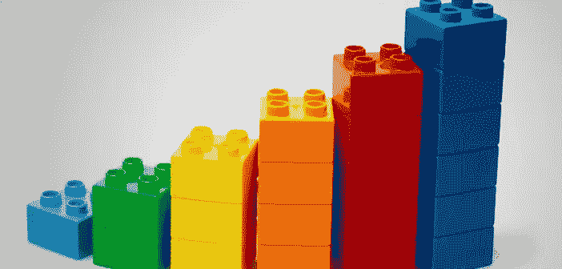
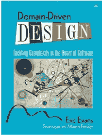

# 领域驱动设计简介

> 原文：<https://levelup.gitconnected.com/introduction-to-domain-driven-design-ded6a1bca6d4>

*“设计应用的艺术”*

来源:brandknewmag.com

D 域驱动设计(DDD)是由 Eric Evans 在大约 15 年前提出的，这意味着甚至在我们开始使用敏捷和微服务之前。DDD 最大的优点在于 DDD 是理想的，并且在这个敏捷和微观服务的时代仍然适用。这意味着 DDD 非常适合敏捷和微型服务。

# 什么是领域驱动设计？

**【DDD】领域驱动设计是一种通过将实现与核心业务概念的演进模型深度连接来开发复杂需求软件的方法。——(来源:**dddcomunity.org)**

*简而言之，当我们开发软件时，我们的焦点不应该主要集中在技术上，而应该主要集中在业务上或者我们试图用软件、领域来帮助的任何活动上。DDD 不是一种技术，而是一种强调核心领域和领域逻辑的设计技术。在为特定领域设计应用程序时，我们试图开发该领域的模型，并使我们的软件符合这一点。*

# ***DDD 的特点***

1.  ***协作**—***”****业务人员和开发人员必须在整个项目中每天一起工作。**DDD 认为，业务人员和开发人员之间的强大协作是开发一个有效系统的必要条件。**
2.  ****建模** —代码结构与领域结构一一对应。这有助于使我们的系统具有可伸缩性和可维护性，因为当领域中发生变化时，我们可以很容易地对它所映射的代码进行更改。建模还有助于业务用户了解应用程序的整体结构，并对其有所了解。**
3.  ****增量**——*DDD 是增量*。它旨在通过将软件的相关部分连接成一个不断发展的模型来简化复杂应用程序的创建。DDD 允许你的代码随时间递增。**

# ****DDD 的一些常用术语****

***领域驱动设计*定义了一些在描述和讨论 DDD 实践时有用的通用术语:**

1.  ****有界上下文:** *领域驱动设计是沿着某些明确定义的边界组织代码*。确定你领域内存在的自然划分。按照这种自然划分的方式来组织你的代码。换一种说法，就是事物可以独立发展的一个边界。**
2.  ****无处不在的语言:**一种围绕领域模型构建的、所有团队成员都能理解的语言(记住团队成员包括开发人员、领域专家、分析师、测试人员，以及其他人)。一个语境的语言不同于其他语境。当谈论你正在解决的问题时，你会用到这个短语。在白板讨论、规格和文档、应用程序代码、测试代码等中使用普遍存在的语言。**
3.  ****领域模型**::*领域模型是你对问题有组织有结构的知识。领域模型应该代表问题领域的词汇和关键概念，并且应该确定领域范围内所有实体之间的关系”。——(来源:*[culttt.com/2014/11/12/domain-model-domain-driven-design/](https://culttt.com/2014/11/12/domain-model-domain-driven-design/)*)***

# ****DDD 的积木****

1.  ****实体:**具有唯一标识且未由其属性定义的对象。通常是可变的，并且通常实现业务逻辑。**
2.  ****值对象:**不可变，只能通过属性来区分。与实体不同，值对象没有唯一的标识符。值对象降低了复杂性，并迫使无处不在的语言。**
3.  ****服务:**不是实体或价值对象的自然部分的操作。它通常与一个领域概念有关。**

***从伊文思的《DDD》来看，好的服务有这些特征:——***

*   ***该操作与不是实体或值对象的自然部分的域概念相关。***
*   **接口是根据领域模型中的其他元素来定义的。**
*   **操作是无状态的。**

**4.**聚集**:聚集是相关实体和值对象(域对象)的集合，聚集在一起代表一个明确定义的边界。**

***聚合是数据存储传输的基本元素——您请求加载或保存整个聚合。交易不应跨越合计界限。***

***——*[*马丁·福勒*](https://martinfowler.com/bliki/DDD_Aggregate.html)**

**5.**存储库:**存储库提供了一个接口，可以用来访问域/域服务层中存储的对象。在 Fowler 的 PoEAA 中，存储库模式被描述为:**

> **使用类似集合的接口访问域对象，在域和数据映射层之间进行协调。**

**6.**工厂:** DDD 建议使用工厂对对象构造进行抽象，从而对客户隐藏对象操作的内部工作。工厂可以返回一个集合根，或者一个实体或一个值对象。**

# ****收尾****

**简而言之，DDD 就是以自上而下的方式设计你的软件，非常强调领域。它完全是关于通过领域专家、分析师和开发人员之间的丰富协作，以渐进的方式解决业务问题。**

**喜欢读这个吗？然后看看这个 [在 S.O.L.I.D 原则上是否扎实](https://medium.com/@dinukjames/be-solid-on-s-o-l-i-d-principles-3683911257ed)**

# **参考**

*   **领域驱动设计。**
*   **[https://www.infoq.com/news/2013/06/actor-model-ddd](https://www.infoq.com/news/2013/06/actor-model-ddd)**
*   **[https://lostechies . com/jimmybogard/2008/08/21/域驱动设计中的服务](https://lostechies.com/jimmybogard/2008/08/21/services-in-domain-driven-design)**