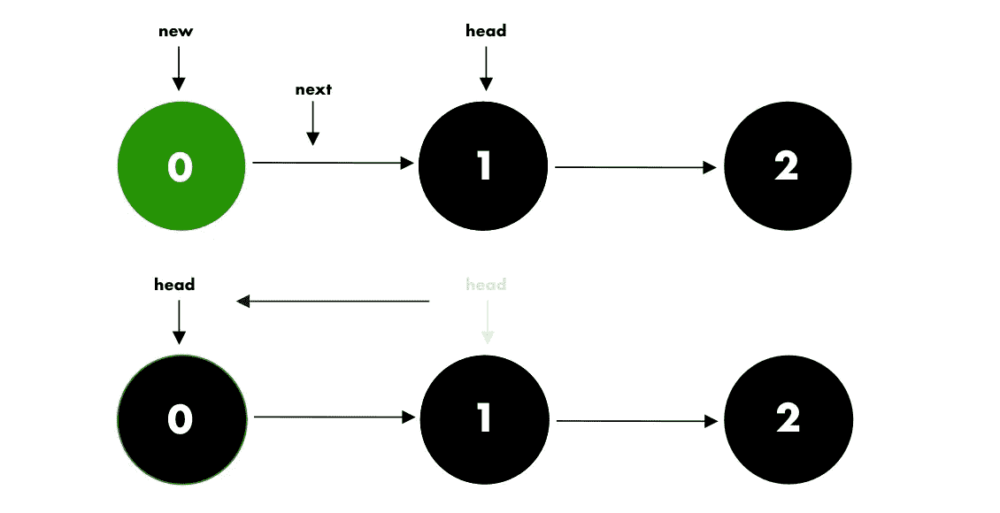
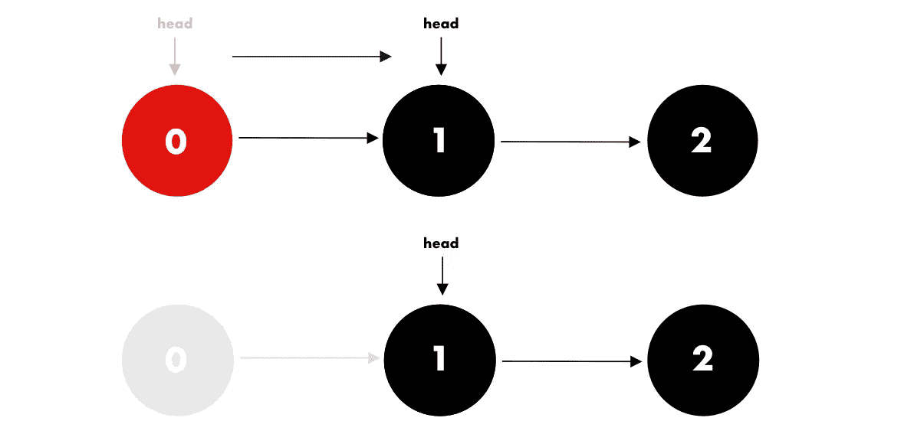
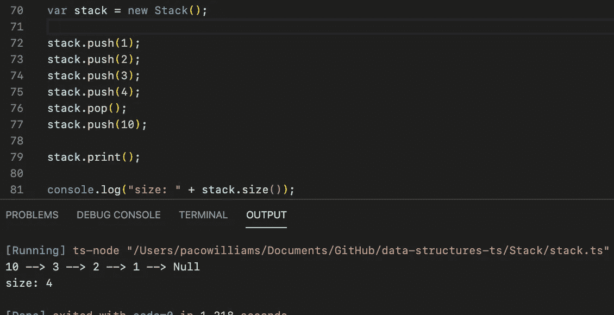

# 用 Javascript 实现堆栈

> 原文：<https://levelup.gitconnected.com/introduction-to-dynamic-stacks-in-javascript-13316dc9a54a>

伊瓦·拉乔维奇在 [Unsplash](https://unsplash.com?utm_source=medium&utm_medium=referral) 上的照片

## 迎接这个 javascript 挑战

栈是任何有能力的开发人员都应该理解的基本数据结构之一。简单，却不失优雅。栈在计算机科学中起着重要的作用，从解决复杂的面试问题到操作系统中的底层实现，比如调用栈。

# 堆栈是如何工作的？

就像现实生活中自助餐厅的托盘是堆叠在一起的，最后一个放进去的放在前一个上面。因此，要取出一叠托盘中的第一个托盘，你必须先把上面的所有托盘都拿走。

这种顺序叫做先入后出(**费罗)。**

**有趣的因素** t:

> 递归需要堆栈才能工作。在递归中，你深入问题，将每个函数调用添加到调用栈中，直到达到一个阈值。(基本情况)。然后，操作系统从堆栈中弹出所有调用。

# 使堆栈成为动态的

我们将在链表的顶部实现栈**。链表非常适合这个实现，因为我们只需要**跟踪堆栈上的最后一个项目**的**。****

我们需要创建一个链表的简化版本，只有**在链表**的**开始处添加**和**删除**值。

 [## 用 Javascript 实现一个链表

### 今天我们将创建一个二叉查找树的实现，但是在我们写一行代码之前，它…

medium.com](https://medium.com/javascript-in-plain-english/implementing-a-linked-list-in-javascript-717d2ab5d9a9) 

让我们开始吧！

# 创建链接列表节点

我们现在可以开始实现我们的动态堆栈了。让我们创建一些样板代码。首先，让我们组织我们需要做的一切。

现在我们已经有了“待办事项清单”，让我们开始分段实现所有这些。

# **检查堆栈是否为空**

在大多数编程语言中，可以返回一个布尔表达式。该表达式将返回 true 或 false。

我们返回长度属性:

# 推送、弹出和查看

让我们实现堆栈的以下基本方法。

# 推

我们可以通过将值添加到列表的前面，更新 head 属性 a，更新 length 属性，并添加

向堆栈中添加值

# 流行音乐

我们可以通过更新列表中第二个节点的 head 属性并从 length 属性中减去 1 来删除值

移除堆栈中的顶部

# 偷看

我们可以通过简单地返回 head 值(如果它存在，否则我们打印-1)来查看顶部(最后一个值)。

> 在任何情况下，我们都必须考虑到拐角情况。(检查列表是否不为空)

就是这样。使用链表大大降低了实现的复杂性，而不是使用静态数组。

 [## 用 Javascript 实现二叉查找树

### 今天我们将用 javascript 实现一个二叉查找树。如果你觉得没有准备好或者有困难…

medium.com](https://medium.com/swlh/implementing-a-binary-search-tree-in-javascript-78a2f28d0493) 

# 打印和测试堆栈

为了打印我们的堆栈，它实际上是一个非常简单的链表，我们使用指针作为我们的“索引”来遍历列表

我们可以看到最后一个值是 10，它在列表的顶部。也就是说，顶部从左到右。

您可以在本文末尾找到完整的代码。

# 结论

堆栈有许多用途。从解决面试问题和实现递归到操作系统，它是任何学生都应该学习的第一个数据结构。

当然，Javascript 已经有了包含 pop 和 push 方法的动态数组。尽管如此，理解它们是如何工作的是很重要的，因为它使我们不仅成为程序员，而且成为软件工程师。

对所有未来的软件工程师来说，像数据结构和算法这样的 CS 基础知识的强大技能是无价的。

如果您喜欢这篇文章，请随意查看我关于 Javascript 中数据结构的其他文章，并关注我即将发布的关于数据结构和算法的内容。

# 完全码