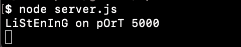
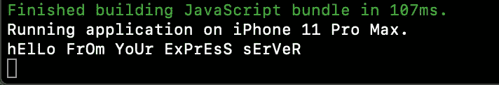

# Express.js 简介:Node.js 框架

> 原文：<https://levelup.gitconnected.com/introduction-to-express-js-a-node-js-framework-fa3dcbba3a98>


Express.js 是构建在 Node.js 之上的框架

狂热者终于找到了我。我决定深入研究 Express.js 框架以及它如何补充 React 前端。所以，让我们从 Node.js 的一些吸引人的统计数据开始，你可以在互联网上找到这些数据:

*   亚马逊、网飞、易贝、Reddit、LinkedIn、Tumblr 和 PayPal 都使用 Node。
*   **43%的 Node.js 开发者**将其用于企业应用。
*   85%的人主要将它用于 web 应用程序开发。
*   部署 Node.js 后，PayPal 的页面平均响应时间减少了 35%
*   Node.js 被发现**将应用程序的性能提高了 50%** 。
*   发现 node . js**降低开发成本 58%** 。
*   Node.js 在美国最受欢迎——几乎有 28，000 个网站在使用它。


太棒了

***对于这个演示，我将通过 Expo*** 与 React Native 合作

那么我们如何开始呢？首先，让我们创建一个 React 本地应用程序。当 CLI 中出现提示时，我选择了“tabs”选项。

```
expo init rn-express-app
cd rn-express-app
mkdir client
code .
```

太棒了。所以这里有一个额外的步骤，我们创建了一个目录，`client`，在那里我们将存储所有面向用户的 React 本地代码。

下一步，在您喜欢的文本编辑器中打开项目目录。一旦打开，将所有的样板 RN 代码移动到`client`目录中。接下来输入以下命令:

```
mkdir backend
cd backend
npm init y
```

在后台打开你的`package.json`文件，修改如下内容:

```
**{
  "name": "rn-express-app",
  "version": "1.0.0",
  "scripts": {
  "client": "cd client && yarn start",
  "server": "nodemon server.js",
  "dev": "concurrently --kill-others-on-fail \"yarn server\" \"yarn        client\""
  },
  "dependencies": {
  "body-parser": "^1.18.3",
  "express": "^4.16.4",
  "nodemon": "^2.0.2"
  },
 "devDependencies": {
  "concurrently": "^4.0.1"
  }
}**
```

接下来运行以下命令:

```
yarn
```

现在，让我们在`backend`目录的根目录下创建一个 *server.js* 文件:

```
touch server.js
```

现在我们可以跳到一些实际的代码中。对于这个例子，我们将从前端发出一个简单的`GET`请求和一个`POST`请求。

*Server.js*

```
const express = require("express");
const bodyParser = require("body-parser");const app = express();
const port = process.env.PORT || 3000;
```

使用 Express 时需要指出两点:

1.  Require 语句→ Node.js 和 CommonJS 一起运行真的很好。这意味着我们将使用模块和 require 语句。你通过*拉进来的这些模块需要语句*都有特定的任务。对于我们的例子，我们将发出一个 POST 请求，所以我们需要`body-parser`模块。`body-parser`是一个中间件模块，它解析使用`HTTP POST`请求提交的 JSON、buffer、string 和 URL 编码的数据。
2.  const app = express() →这个变量实际上代表你的 Express app。你对它调用的每一个方法，你做的每一个修改都将存储在这个变量中。

*Server.js*

```
app.listen(port, () => console.log(`LiStEnInG on pOrT ${port}`));
```

这告诉我们的 Express 服务器在端口 3000 上运行，或者在您的。环境文件。现在，让我们添加一些路线。

```
const express = require("express");
const bodyParser = require("body-parser");const app = express();
const port = process.env.PORT || 3000;**app.use(bodyParser.json());
app.use(bodyParser.urlencoded({ extended: true }));****app.get("/get", (req, res) => {
  res.send({ theServer: "hElLo FrOm YoUr ExPrEsS sErVeR" });
});****app.post("/wow/post", (req, res) => {
  console.log(req.body);
  res.send(`Here is what you sent me: ${req.body.post}`);
});**app.listen(port, () => console.log(`LiStEnInG on pOrT ${port}`));
```

让我们来分解一下`GET`请求。`.get()`方法有三个参数:路由、*尽可能多的回调、请求和响应。对于我们简单的`GET`请求，我们只想发送回一个包含好消息的对象。所以说白了，当用户向我们的/get 路由发出一个*请求*时，我们将发送一个包含消息的*响应*对象。*

在我们从前端进行初始提取之后，我们将返回到 POST 请求。在该目录中，输入以下命令:

```
node server.js
```

现在您的服务器应该已经启动并运行在 localhost:3000 上了。让我们直接进入 RN 代码。进入你的`client`目录，打开 *HomeScreen.js* ，添加以下代码:

*/Screens/HomeScreen.js*

```
**import React, { useEffect } from 'react'
...** export default function HomeScreen() {**useEffect(() => {
   fetch("http://localhost:3000/get")
    .then(res => res.json())
    .then(res => console.log(res.theServer))
  }, []);**...}
```

是啊，是啊，是啊，没有 ES8 异步函数等待获取挂钩等等等等。我试着保持简单。现在，让我们通过在“client”目录中输入以下命令来启动 RN 应用程序。

```
yarn start
```

如果一切都添加正确(或者如果我没有犯任何错误)，您应该在您的终端中看到以下内容:



你的服务器正在运转



通过面向用户的注册护士应用程序

太好了。现在我们来提一个`POST`要求。这里有一个简单的表单+提交处理程序，您可以通过替换`ScrollView`容器中的代码将它添加到 HomeScreen.js 中。

```
export default function HomeScreen() { **const [inputState, setInput] = useState("");
  const [response, setResponse] = useState();**useEffect(() => {
   fetch("http://localhost:3000/users")
    .then(res => res.json())
    .then(res => console.log(res.express));
   }, []);**async function handleSubmit() {**
   **const response = await fetch("http://localhost:3000/wow/post", {
     method: "POST",
     headers: {
      "Content-Type": "application/json"
      },
     body: JSON.stringify(inputState)
    });** **const body = await response.text();
  setResponse({ responseToPost: body });
}**return (
   <View *style*={styles.container}>
    <ScrollView
     *style*={styles.container}
     *contentContainerStyle*={styles.contentContainer}
    > **<Text
      *style*={{
       fontWeight: "900",
       fontSize: 24,
       marginTop: 200,
       marginLeft: "auto",
       marginRight: "auto"
       }}
     >
     Express Server Form
    </Text>
   <View
     *style*={{
       backgroundColor: "#F2EFEE",
       height: 75,
       marginTop: 20,
       marginBottom: "auto"
      }}>
     <TextInput
      *style*={{ color: "black", fontSize: 50 }}
      *value*={inputState}
      *onChangeText*={text => setInput(text)}
     />
   <TouchableOpacity
      *onPress*={handleSubmit}
      *style*={{
        borderRadius: 10,
        marginLeft: "auto",
        marginRight: "auto",
        marginTop: 30,
        backgroundColor: "#25aae1",
        padding: 5,
        height: 40,
        width: 80
        }}>
     <Text *style*={{ color: "white", fontWeight: "800", padding: 5 }}>
Submit
  </Text>
</TouchableOpacity>
   {response ? (
     <Text *style*={{ marginTop: 10, marginLeft: 20 }}>
       Response: {response.responseToPost}
     </Text>) : (
     <Text *style*={{ marginTop: 10, marginLeft: 20 }}>Response:</Text>
     )}
   </View>** </ScrollView>
  </View> **);
}**
```

旋转它，并通过您的注册护士应用程序发送请求:

```
yarn start
```

这个简单的例子展示了 Express.js 如何作为数据库之上的抽象层，比如 MongoDB。一旦你掌握了 MERN (MongoDB，Express，React，Node.js)栈，*并且只有到那时*，你才会被接受为一个真正的前端开发者(至少直到下一个，最好的框架，库等等)。出来)。