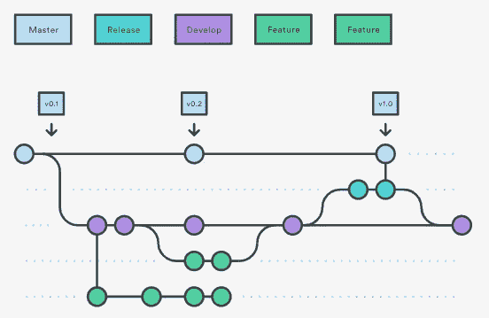

# Git 流简介

> 原文：<https://levelup.gitconnected.com/introduction-to-git-flow-3ad331d097fa>

# 概观

Git 流是 Git 工作流的抽象概念。它有助于持续的软件开发和实现 DevOps 实践。Git Flow 工作流定义了一个围绕项目发布设计的严格的分支模型。这为管理大型项目提供了一个健壮的框架。

Git 流非常适合具有预定发布周期的项目，以及持续交付的 DevOps 最佳实践。**它将非常具体的角色分配给不同的分支，并定义它们应该如何以及何时交互。它使用单独的分支来准备、维护和记录发布。**

# Git 流的工作

# 1.发展和掌握分支机构

Git Flow 使用两个分支来记录项目的历史，而不是一个主分支。它基于两个具有无限生命周期的主要分支，即**主控和开发**。

*   **主分支:**主分支包含生产代码并存储官方发布历史。
*   **开发分支:**开发分支包含预生产代码，并作为特性的集成分支。

主分支和开发分支工作流在给定的图表中演示:

用版本号标记主分支中的所有提交也很方便。

假设我们在总分行有回购协议。第一步是**用一个开发分支**来补充默认主文件。一个简单的方法是让一个开发人员在本地创建一个空的开发分支，并将其推送到服务器。这个分支将包含项目的完整历史。其他开发人员现在应该克隆中央存储库，并为 develop 创建一个跟踪分支。

## 1.1.创建开发分支

如果没有 git-flow 扩展:

*   `git branch develop`
*   `git push -u origin develop`

当使用 git-flow 扩展时:

*   `git flow init`

当使用 git-flow 扩展库时，在现有的 repo 上执行`git flow init` 将创建 develop 分支。

# 2.特征分支

每一个新特性都应该驻留在它的分支中，这个分支可以被推送到中央存储库进行备份/协作。特征分支使用最新开发的**作为其父分支**。当一个特性完成时，它会被**合并回开发**。特性应该**永远不要与主**分支**直接交互。**

特征分支工作流在给定的图表中演示:

## 2.1.创建特征分支

没有 git-flow 扩展:

*   `git checkout develop`
*   `git checkout -b feature_branch`

使用 git-flow 扩展:

*   `git flow feature start feature_branch`

## 2.2.完成特征分支

没有 git-flow 扩展:

*   `git checkout develop`
*   `git merge feature_branch`

使用 git-flow 扩展:

*   `git flow feature finish feature_branch`

# 3.发布分支

一旦 develop 为一个发布获得了足够的特性(或者预定的发布日期即将到来)，我们**从 develop** 中分出一个发布分支。创建这个分支**将开始下一个发布周期**，因此在这之后不能添加新的特性——只有错误修复、文档生成和其他面向发布的任务应该放在这个分支中。发布分支可能从开发分支，并且**必须合并到主和开发**中。

在给定的图表中演示了发布分支工作流:

一旦发布分支准备好发布，它就被合并到主版本中，并且用版本号标记**。此外，它应该被**合并回开发中，因为关键更新可能已经被添加到**发布分支中，并且它们需要被新特性访问。因此，一旦发布版本准备好发布，它将被合并到主开发中，然后**发布分支将被删除**。**

使用一个专门的分支来准备发布，使得一个团队可以改进当前的发布，而另一个团队可以继续为下一个发布开发特性。

## 3.1.创建发布分支

如果没有 git-flow 扩展:

*   `git checkout develop`
*   `git checkout -b release/0.1.0`

当使用 git-flow 扩展时:

*   `git flow release start 0.1.0`
*   `Switched to a new branch 'release/0.1.0'`

## 3.2.完成发布分支

没有 git-flow 扩展:

*   `git checkout master`
*   `git merge release/0.1.0`

使用 git-flow 扩展:

*   `git flow release finish 0.1.0`

# 4.修补程序分支

维护或“热修复”分支**用于快速修补生产版本**。热修复分支对于在不希望的主服务器状态下立即采取行动是必要的。热修复分支很像发布分支和特性分支，除了它们基于主分支而不是开发分支。这是唯一应该直接从主分叉的**分支。一旦修复完成，它应该被**合并到主和开发(或者当前发布分支)**中，并且**主分支应该被标记上更新的版本号**。**

热修复分支工作流在给定的图表中演示:

拥有一个专门的 bug 修复开发线**可以让你的团队在不中断工作流程的剩余部分**或者等待下一个发布周期的情况下解决问题。

## 4.1.创建修补程序分支

没有 git-flow 扩展:

*   `git checkout master`
*   `git checkout -b hotfix_branch`

使用 git-flow 扩展:

*   `git flow hotfix start hotfix_branch`

## 4.2.完成修复分支

没有 git-flow 扩展:

*   `git checkout master`
*   `git merge hotfix_branch`
*   `git checkout develop`
*   `git merge hotfix_branch`

使用 git-flow 扩展:

*   `git branch -D hotfix_branch`
*   `git flow hotfix finish hotfix_branch`

# Git 流的优势

现在让我们总结一下 Git flow 提供的主要优势:

*   确保在项目生命周期的任何给定时刻，分支都处于干净的状态
*   分支的命名约定遵循一个系统化的模式，这样更容易理解
*   在大多数使用的 git 工具上有扩展和支持
*   非常适合在生产中维护多个版本的情况
*   非常适合基于发布的软件工作流。
*   为生产热修复提供专用渠道。

# Git 流的缺点

没有什么是理想的，所以 Git 流也有一些缺点，比如:

*   Git 历史变得不可读
*   主/开发分支的分离被认为是多余的，并且使得连续交付/集成更加困难
*   在生产中维护单一版本的情况下，不建议使用

# 摘要

这里我们讨论了 Git 流工作流。Git 流是您和您的团队可以利用的许多 Git 工作流风格之一。让我们总结一下 Git Flow 的整个工作流程:

*   开发分支是从主文件创建的
*   特征分支是从开发中创建的
*   当一个特征完成时，它被合并到开发分支中
*   发布分支是从开发中创建的
*   当发布分支完成后，它将被合并到开发和主控中
*   如果检测到主服务器中有问题，将从主服务器创建一个热修复分支
*   一旦修补程序完成，它将被合并到开发人员和主控人员