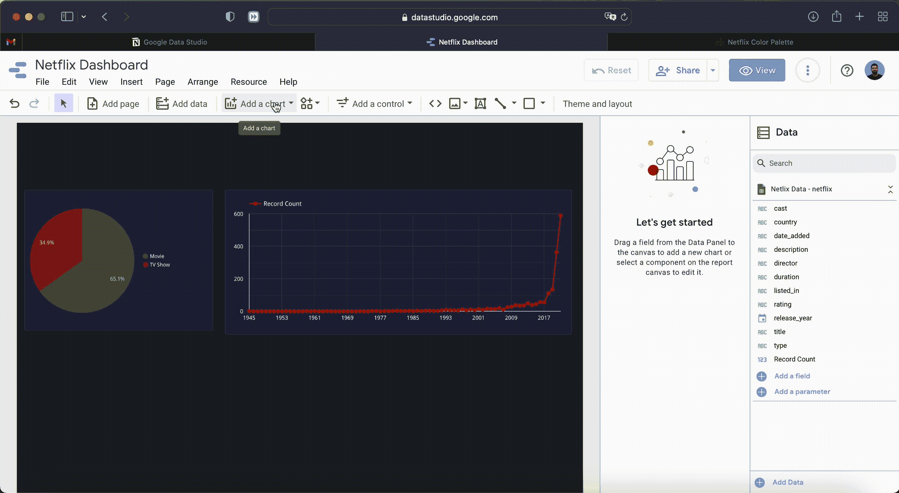

# Google Data Studio 简介

> 原文：<https://levelup.gitconnected.com/introduction-to-google-data-studio-34d700db9590>

除了数据收集、数据转换和数据建模，数据科学家的另一项主要任务是讲述故事的艺术。这是我们尝试以最有说服力的方式交流发现的见解的地方。一般来说，我们通过仪表板来做到这一点，因为**我们可以创建出色的视觉效果，并根据所描述的数据**的主题定制一切，并且具有随着数据的流入而不断更新的优势。最流行的仪表板工具是 Power BI 和 Tableu。就我个人而言，我更喜欢 Power BI，也更有经验，因为它是一个如此完整的工具，我的意思是你甚至可以在它上面运行 Python！。

Tableau 要保守得多。它在你能做的事情和它的图表的多样性和个性化上是非常狭窄的。Youtube 上有很多视频是关于如何通过重重关卡达到某些类型的。积极的一面是，学习曲线比使用 Power BI 容易得多。

**这两种工具虽然很棒，但可能很贵！**是的，他们有某种免费版本，但是**有了免费版本，你就不能分享**你制作的漂亮仪表板，这就是制作仪表板的全部意义。介绍**谷歌数据工作室**。

谷歌数据工作室

和许多谷歌服务一样，**谷歌数据工作室运行在云上**。这意味着你不需要安装任何东西就可以开始工作。**是的！不需要安装任何东西！**去[https://datastudio.google.com/](https://datastudio.google.com/)用你的谷歌账号登录，开始创建你的第一个仪表盘。**我提到它的免费了吗？**

# 如何在 Google Data Studio 中制作仪表板

在这个关于如何用 Google Data Studio 制作仪表板的教程中，我们将使用一个**公共网飞数据集**。该数据集包含大约 8500 部电影和电视节目的标题、演员、时长、流派等数据。

在浏览器上打开一个新窗口，然后前往[https://datastudio.google.com/](https://datastudio.google.com/)。它可能会要求您登录您的谷歌帐户

在谷歌数据工作室创建新的仪表板

然后点击创建“空白报告”。如果这是您第一次在这里创建仪表板，它会要求您填写一个简短的表格。如下图所示，在公司名称中，你可以只写上你的名字或任何你想写的东西。

我们同意并点击继续，我们准备好了。

# 向报告中添加数据

我们要做的第一件事是连接或上传我们想要使用的数据。与 Power BI 一样，有许多数据连接器可以连接不同的数据源。不得不提的是，即使大部分都是免费的，也有一些不是。在这个例子中，我们将从 Google Sheets 获取数据。可以在这里获取网飞数据集:[https://docs . Google . com/spreadsheets/d/1 ynjmembeptx 2 _ i1 y2 c 7 qfvxb _ yunar RS 2 turhlrzcqc/edit？usp =共享](https://docs.google.com/spreadsheets/d/1YNJmEmbEPTX2_i1Y2c7qfvXb_YUNArrs2tURhlrzcQc/edit?usp=sharing)

从 Google Sheets 添加数据

一旦我们将数据连接到 Google Data Studio，我们将会看到类似这样的内容:

Google Data Studio 编辑器视图

正如您所看到的，它甚至创建了一个包含一些示例数据的小表，以检查所有内容是否正确加载。**在上面的图片中，我添加了一些箭头来突出编辑器视图的一些重要部分**，我们将在接下来更深入地探讨。

## 添加页面

从左到右，第一个箭头显示选项“添加页面”。这个**创建了一个新的页面**，所有的页面都列在左边的栏上，就像幻灯片演示一样。

## 添加数据

正如我们已经试验过的，“添加数据”按钮**让我们添加数据集，或者更新当前的数据集**。我们已经将我们的仪表板连接到一个谷歌表单。我们只需更新这个 Google Sheet 并刷新仪表板来显示新数据。但是，例如在 CSV 的情况下，当您第一次添加文件时，这将创建一个“数据集”。然后**您可以继续向同一个数据集添加更多的 CSV 文件，只要它们具有相同的列集。**

## 添加图表

这个按钮让我们为我们的仪表板创建所有那些可爱的**视觉效果。我们可以添加表格和各种图表来讲述我们的故事。**

## 数据

这显示了数据集中所有列的列表。

## 添加字段

Data Studio 中的字段指的是**计算字段，是您可以定义在一个上下文中的航班**上计算的特定公式。它们就像功率 BI 上的测量一样工作。

## 添加参数

参数是可由仪表板用户插入或选择的值或**值列表。**例如，用户可以从 dropbox 中选择以下值之一:10%，20%，30%。**然后，我们可以使用用户在字段中的输入进行计算**，并根据参数更新显示的数据。

# 构建仪表板

现在我们对编辑器视图已经比较熟悉了，让我们继续为网飞数据构建一个仪表板。首先我会选择一个主题…我会选择一个深色的。

选择报告的主题

因为我们正在创建一个网飞主题的仪表板，这里是我们可以使用的网飞的**调色板。你可以用这个链接复制 de 码【https://www.color-hex.com/color-palette/22942 **

仪表板调色板

## 圆形分格统计图表

创建饼图

## 选择图表的颜色

更改图表颜色

以类似的方式，我们可以使用其他图表，如**条形图、折线图，甚至地图图**来显示各个国家的产量！

添加折线图

添加条形图

添加地理气泡图

仪表板的另一个重要方面是过滤器。我们添加了过滤器，这样我们可以让用户只看到感兴趣的数据。谷歌数据工作室有多种选择

向仪表板添加过滤器

最后，我们还可以添加公司徽标以实现个性化，并清楚地传达我们正在显示的数据类型。

向 Google Data Studio Dashboard 添加图像

# 成品

正如你所看到的，谷歌数据工作室的学习曲线非常小。从 CSV 到漂亮的仪表板非常简单。

谷歌数据工作室的网飞仪表板

您可以在此处查看该仪表板:

[https://data studio . Google . com/reporting/b 65 af 54d-b4f 0-4a ab-8194-F3 c6f 703 bad 7](https://datastudio.google.com/reporting/b65af54d-b4f0-4aab-8194-f3c6f703bad7)

现在就这些了！

如果您有任何问题或任何其他想要我查看的报告工具，请在评论中告诉我。