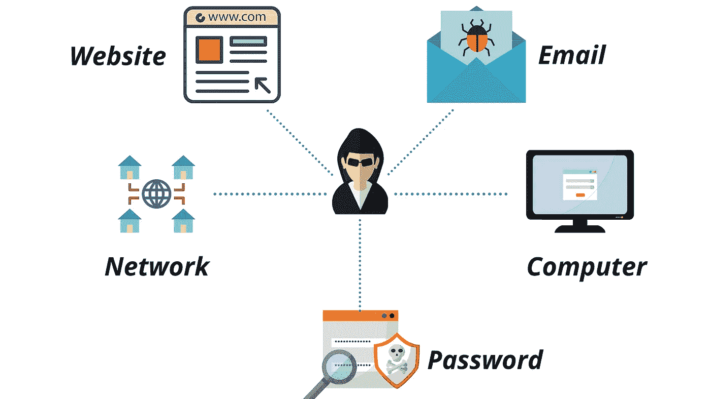
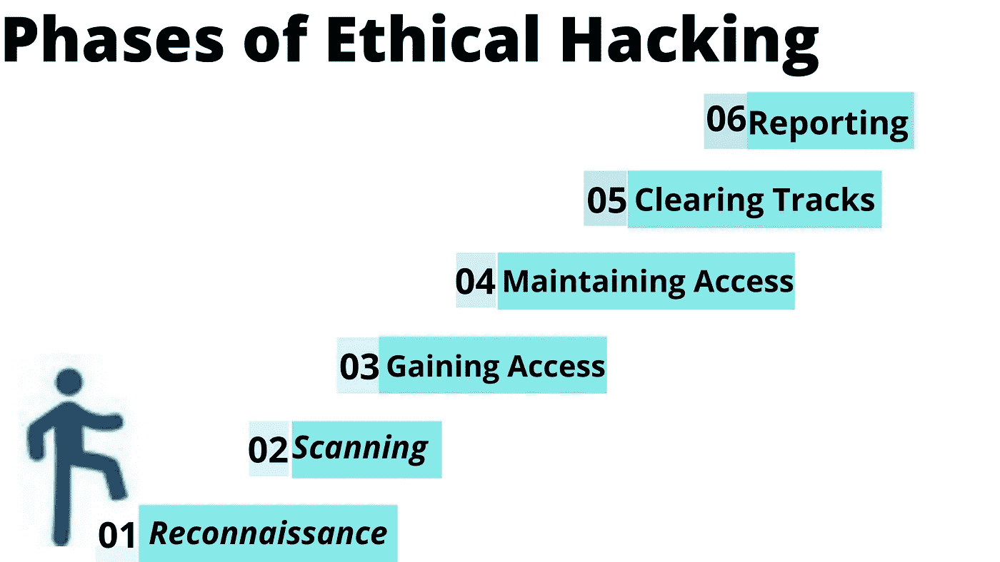
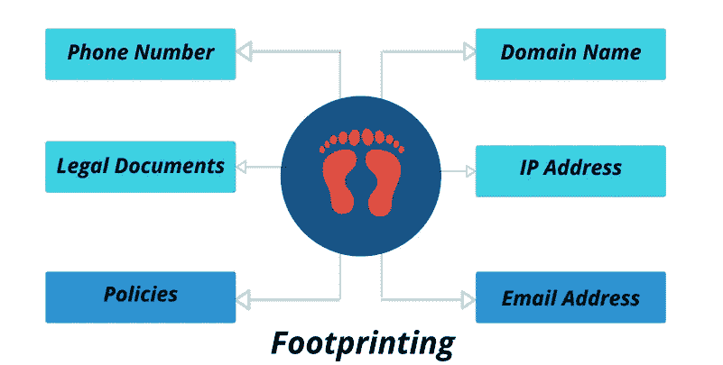

# 黑客入门

> 原文：<https://levelup.gitconnected.com/introduction-to-hacking-dd97c5572da4>

## 让我们试着去理解黑客。

使用 Canva 设计。

# 什么是黑客？

黑客无非是能够进入一个你不应该进入的系统或应用程序。简单来说，黑客可以被称为获得未经授权的访问。

# 谁是黑客？

黑客是任何使用计算机编程或技术技能来解决挑战或问题的人。正如人们所说的，有好的一面和坏的一面，也有介于两者之间的人。

# 黑客类型

使用 Canva 设计

黑客可以大致分为三种类型。他们是—

## 黑帽黑客

这些人获得对系统的未授权访问，以窃取金钱或实现他们自己的非法目标。这种类型的黑客也被称为黑客。

## 白帽黑客

这些人使用的技术与黑帽黑客使用的技术相同，但他们获得了访问系统的权限。白帽黑客的主要目的是利用系统中存在的漏洞。这种类型的黑客也被称为道德黑客。

## 灰帽黑客

这些都是白帽黑客和黑帽黑客的混合体，所以他们会侵入任何系统，即使他们没有任何权限来研究系统的安全性，但他们绝不会有偷窃金钱或破坏系统的意图。在大多数情况下，他们会告诉系统管理员，他们入侵了系统，这只是为了好玩。但这仍然是非法的，因为他们测试的系统的安全性并不是他们所拥有的，也没有被允许这样做。

# 为什么要学黑客？

1.我们将能够保护系统不被黑帽黑客利用。
2。由于黑客攻击数量的增加，对道德黑客的需求非常大。道德黑客有很多工作机会。

# 黑客攻击的类型

使用 Canva 设计

根据黑客试图达到的目的，我们可以将黑客行为大致分为五类。它们如下:

## 1.网站黑客

网站黑客可以定义为一种未经授权控制网站及其相关软件(如数据库和其他界面)的方式。

## 2.网络黑客

网络黑客是一种收集关于网络的所有关键信息的方式，目的是损害网络并阻止其运行。

## 3.电子邮件黑客

电子邮件黑客是一种未经授权访问电子邮件帐户的方式，用来欺骗所有电子邮件并发送包含垃圾邮件链接和第三方威胁的电子邮件。

## 4.密码黑客

密码黑客是一种恢复存储在数据库中或通过网络传输的秘密密码的方法。

## 5.电脑黑客

计算机黑客是一种通过泄露计算机凭证来获得对计算机系统的未授权访问的方式。

# 道德黑客的阶段

道德黑客有 6 个不同的阶段。这些更有可能是要遵循的指导方针。

使用 Canva 设计

## 1.侦察

侦察是收集信息的过程。在这个阶段，黑客试图收集尽可能多的关于目标系统的信息。网络范围、活动设备数量、发现开放端口和接入点等信息。侦察有两种类型。他们是:
**一**。**主动侦察:**
在这里，黑客直接与目标系统交互以获取信息。获得的信息可能是相关的和准确的，但是被发现的可能性很高。如果您被检测到，那么系统管理员可以对您的所有活动采取严厉的措施。
**b** 。**被动侦察:**
在这里，信息是在不与目标系统实际交互的情况下收集的。

## 2.扫描

在这个阶段，黑客试图利用目标系统的所有漏洞。

## 3.获得访问权限

在此阶段，黑客试图利用扫描阶段利用的漏洞访问目标系统，而不会发出任何警报。

## 4.保持访问

这是道德黑客最重要的阶段之一。在这个阶段，黑客在目标系统上安装各种后门和有效负载。有效负载是一个术语，用于描述获得未经授权的访问后在系统上执行的活动。后门有助于黑客在未来更快地访问目标系统。

## 5.清除轨道

这是一个不道德的阶段。在这种情况下，黑客试图删除黑客攻击过程中发生的所有活动的日志。即使是有道德的黑客也需要执行这个阶段来演示黑帽黑客如何进行他们的活动。

## 6.报告

报道是道德黑客的最后一个阶段。在这个阶段，有道德的黑客必须提供一份报告，包括他的所有发现、使用的工具和利用的各种漏洞。

# 道德黑客的一些术语

## 足迹

使用 Canva 设计。

足迹是侦察过程的一部分，用于收集有关目标系统的信息。收集的信息用于入侵目标系统，或者至少决定哪种类型的攻击更适合目标系统。足迹可以是被动的，也可以是主动的。
审查公司网站是被动的，而试图通过各种技术获取敏感信息会受到主动侦察。

## 指纹识别

指纹是指用于确定目标计算机上运行的操作系统的任何方法。指纹识别也有主动和被动之分。
主动指纹识别通过向目标系统发送专门创建的数据包来实现，然后分析响应以确定目标操作系统。
被动指纹识别是基于来自远程系统的嗅探器痕迹实现的。根据这些数据包的嗅探器跟踪，您可以确定目标主机的操作系统。

# 结论

在本文中，我介绍了黑客技术，并创造了一些与黑客技术相关的术语。希望你今天能有所收获。请随时分享反馈。如果您想联系， [**在 LinkedIn 上联系我。**](https://www.linkedin.com/in/gowtham-bhujam-30502017b/)