# 数字图像增强的直方图均衡化介绍

> 原文：<https://levelup.gitconnected.com/introduction-to-histogram-equalization-for-digital-image-enhancement-420696db9e43>

## Python 中的基本概念、算法和实现

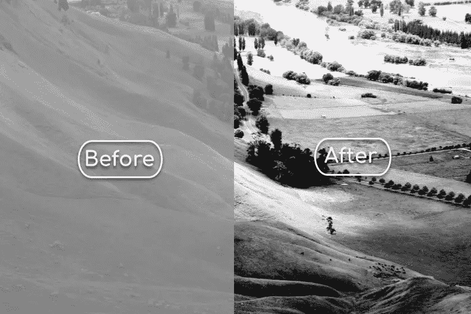

直方图均衡化提高了图像对比度[图片由作者根据菲利普·卡珀在[的原始图片](https://commons.wikimedia.org/wiki/File:Unequalized_Hawkes_Bay_NZ.jpg)创建]

H istogram 均衡是一种增强数字图像的简单技术。它是数字图像处理和计算机视觉应用中的标准工具。它在改善灰度图像的视觉质量方面特别有效。例如，直方图均衡化已经广泛应用于医学成像中，以提高 X 射线和 MRI 图像的对比度。这种改进使得医疗诊断更加准确。

在本文中，我将介绍直方图均衡化的基本概念。我们还将看看 Python 中的算法和实现。对于那些不熟悉这个领域的人来说，我包括了数字图像和直方图的简要概述。

# 概述

1.  **数字图像。**数字图像表示的快速概述。
2.  **什么是直方图？**直方图及其计算简介。
3.  **低对比度图像的直方图。**检查低对比度图像的直方图，了解直方图均衡化的作用。
4.  **直方图均衡化。**增强图像对比度的基本概念。
5.  **核心算法。**
6.  **Python 实现。**使用 NumPy 和 Pillow 库从头开始简单实现直方图均衡化。
7.  **结果。**我们用 Python 代码执行了直方图均衡化，并检查了结果。

# 1.数字图像

假设你想画一个黄色的，独眼的，全身穿着蓝色衣服的生物，叫做 *minion。*你将只用彩色圆点画画。你开始画画是用彩笔在纸上画小点。这些彩色的点被排列成你希望看到的一个小人的形象。生成的图像可能类似于下图。这类似于计算机屏幕呈现图像的方式。

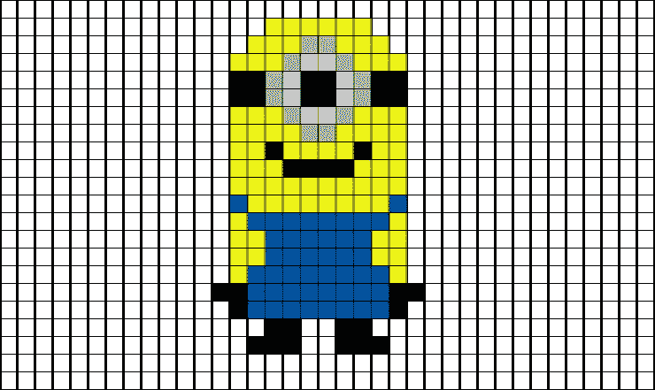

这幅小精灵的图像是由类似像素的彩色小点组成的

数字图像由称为*像素*的离散元素组成。每个像素由强度值表示，并且在 2D 图像平面中占据唯一的位置。在灰度图像中，每个像素由范围从 0 到 255 的单个强度值表示。具有最小亮度值的像素显示为黑色像素。随着强度值的增加，像素在各种灰色阴影中变亮。具有最大强度值的像素显示为白色像素。

彩色图像稍微复杂一些。每个像素由三个强度值表示，这三个强度值表示颜色分量的强度:红色、绿色和蓝色。改变这些原色的比例和强度能够在像素中呈现各种颜色。

# **2。什么是直方图？**

直方图表示数据的频率分布。它通常被可视化为条形图。我将使用上面的 minion 图像来说明这些要点。图像的尺寸是 22x37 像素，总共 814 像素。假设我们生活在一个只有五种可能颜色的世界里:黑色、灰色、白色、黄色和蓝色。为了获得直方图，我们可以计算每种可能颜色的像素数:

*   黑色— 34 像素
*   灰色— 12 像素
*   白色— 646 像素
*   黄色— 76 像素
*   蓝色— 46 像素

作为一个通用术语，每个可能的值被称为一个 ***bin*** ，计数被称为 ***频率*** 。因此，我们刚刚导出了具有五个面元的图像的 ***颜色直方图*** 。柱状图如下图所示。这里，x 轴是频段，y 轴是频率。在直方图均衡化中，我们感兴趣的是图像的 ***强度直方图*** 。这意味着对于每个可能的像素强度值(0 到 255)，我们计算具有相应值的像素的数量。

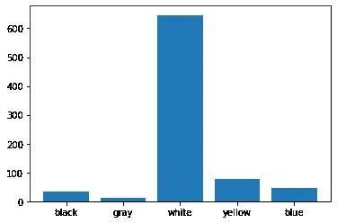

直方图通常被可视化为条形图，如下图所示[图片由作者提供]

# 3.低对比度图像的直方图

为了理解直方图均衡化的作用，我们来看两个低对比度图像的例子。对于每幅图像，显示直方图(蓝色图)和 ***累积直方图*** (橙色图)。累积直方图只是从第一个到最后一个柱的直方图频率的运行总和。累积直方图按比例缩小，因此它可以按与直方图相同的比例绘制。

## 情况 1:图像看起来太亮

下图看起来很亮，但已经褪色。解释可以在直方图中找到。像素强度集中在该范围的上部区域，大约在 125 和 200 之间。在这个区域中，像素被轻微地遮蔽，因此呈现明亮的外观。由于亮度范围较窄，像素在色调上非常相似，导致外观褪色。在这个狭窄的区域中，累积直方图以陡峭的斜率增加，而在其他地方是平坦的。

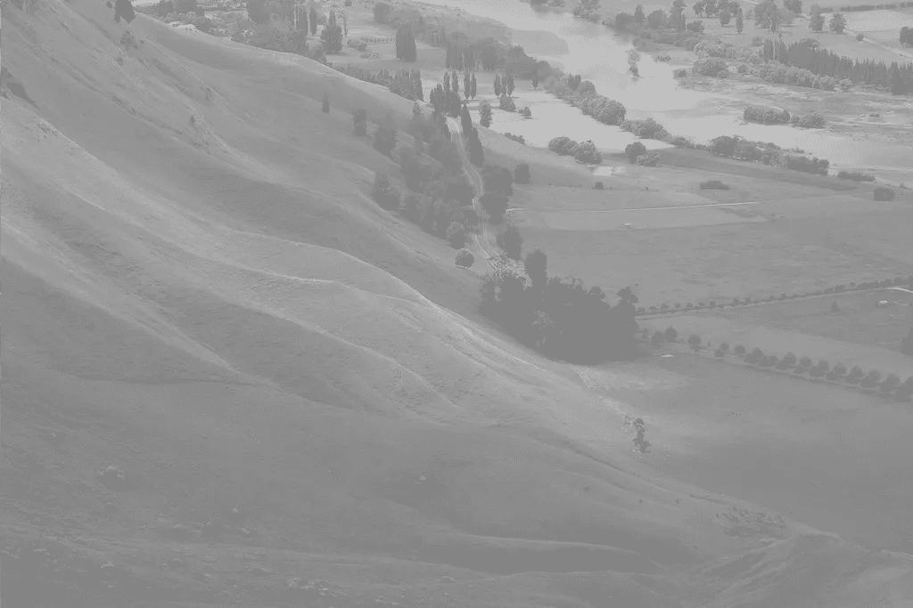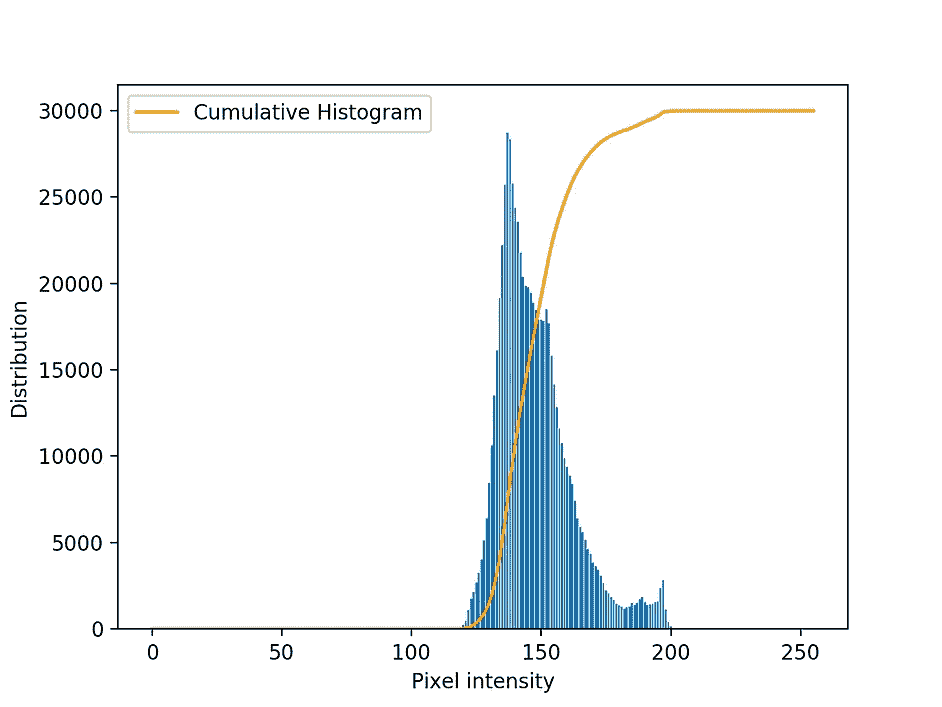

这个图像看起来褪色了。它的像素强度集中在 125 和 200 之间的高强度区域。[图片来自[本来源](https://commons.wikimedia.org/wiki/File:Unequalized_Hawkes_Bay_NZ.jpg)

## 情况 2:图像看起来太暗

下图看起来相当阴暗。查看直方图，强度集中在范围的较低区域，大约在 5 到 95 之间。在该区域中，像素在阴影中较暗。还可以观察到，累积直方图在该区域急剧增加，而在其他区域平缓。

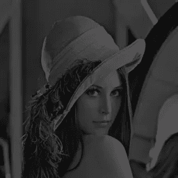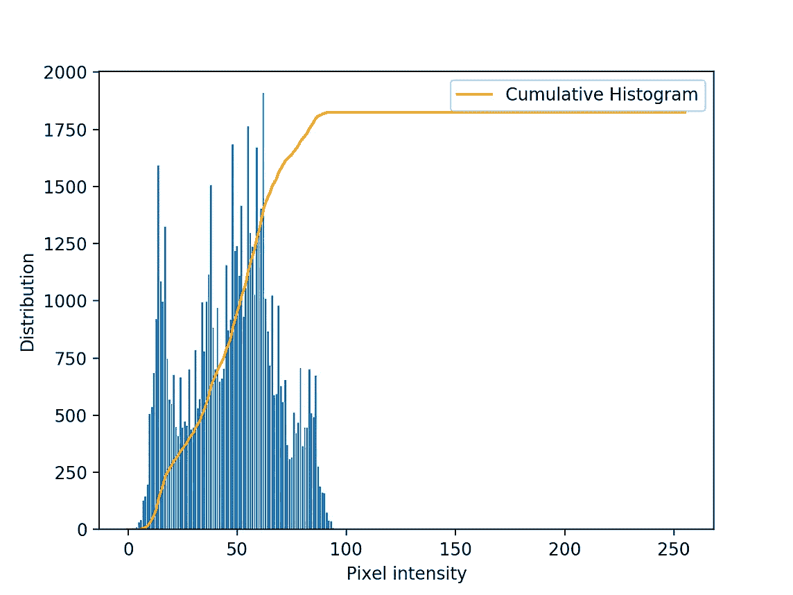

这个图像看起来很暗。它的像素强度集中在 5 和 95 之间的较低强度区域周围。[ [我](https://haltair.files.wordpress.com/2010/07/lena_dark.png)法师来自[本源](https://haltair.files.wordpress.com/2010/07/lena_dark.png)

在这两种情况下，直方图分析显示，在低对比度图像中:

*   像素强度集中在一个狭窄的区域，导致像素具有相似的阴影，给图像一个褪色的外观，并且
*   累积直方图在狭窄区域内以陡峭的斜率增加，而在其他区域则平坦。

# 4.直方图均衡

当图像中的各种阴影变得更加明显时，图像的对比度增强。我们可以通过加深较暗像素的阴影来做到这一点，反之亦然。这相当于扩大了像素强度的范围。为了获得良好的对比度，需要以下直方图特征:

*   像素强度均匀分布在整个数值范围内(每个强度值的概率相等)，以及
*   累积直方图在整个强度范围内线性增加。

直方图均衡化修改像素强度的分布以实现这些特征。

# 5.核心算法

## 步骤 1:计算归一化累积直方图

首先，我们计算图像的归一化直方图。归一化是通过将每个箱的频率除以图像中的像素总数来执行的。结果，累积直方图的最大值是 1。下图显示了与第 3 节中情况 1 相同的低对比度图像的*归一化累积直方图*。

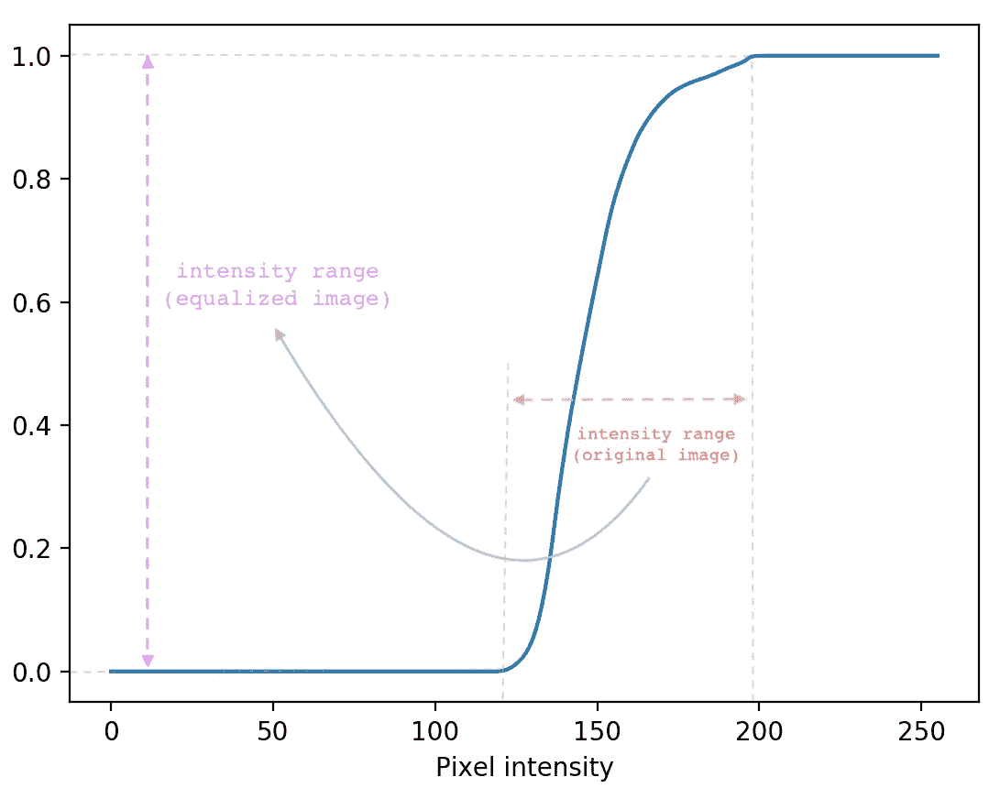

归一化累积直方图被用作直方图均衡化中的变换函数。它将窄像素亮度范围映射到全范围。[图片由作者提供]

## 步骤 2:导出强度映射查找表

接下来，我们导出一个查找表，该查找表映射像素强度以实现均衡的直方图特征。回想一下，均衡的累积直方图在整个强度范围内线性增加。对于每个离散强度等级 *i* ，映射的像素值根据以下等式从归一化累积直方图计算:

> ***mapped _ pixel _ value(I)=(L-1)*归一化 _ 累积 _ 直方图(i)***

其中 *L* = 256，用于像素强度的典型 8 位无符号整数表示。

为了直观地了解映射是如何工作的，让我们参考上图中显示的归一化累积直方图。最小像素强度值 125 被转换为 0.0。最大像素强度值 200 转换为 1.0。中间的所有值都相应地在这两个值之间映射。一旦乘以最大可能强度值(255)，得到的像素强度现在分布在整个强度范围内。

## 步骤 3:用查找表转换原始图像的像素亮度

一旦得到查找表，图像中所有像素的亮度都被映射到新的值。结果是均衡的图像。

# 6.Python 实现

直方图均衡是各种图像处理库中的标准操作，如 openCV 和 Pillow。但是，我们将从头开始实现这个操作。我们将需要两个 Python 库:**[**NumPy**](https://numpy.org/)**用于数值计算，以及**[**Pillow**](https://python-pillow.org/)**用于图像 I/O。在您的终端上输入以下命令，您就设置好了！********

```
****pip install numpy
pip install pillow****
```

******完整的代码如下所示，随后是均衡过程的详细解释。要平衡你自己的图像，只需相应地编辑`img_filename`和`save_filename`。演示版 Jupyter 笔记本和样本图片也可以从[我的 github 库](https://github.com/samsudinng/cv_histogram_equalization/tree/master/demo_notebook)获得。******

## ******图像输入/输出******

******为了读取和写入图像文件，我们将使用 Pillow 库。它读取图像文件作为`Image`对象。这些对象可以很容易地转换成 NumPy 数组，反之亦然。所需的 I/O 操作编码如下。为了简单起见，让图像文件名为 *input_image.jpg* ,与 Python 脚本位于同一个目录中。******

```
****import numpy as np
from PIL import Imageimg_filename = 'input_image.jpg'
save_filename = 'output_image.jpg'#load file as pillow Image 
img = Image.open(img_filename)# convert to grayscale
imgray = img.convert(mode='L')#convert to NumPy array
img_array = np.asarray(imgray) #PERFORM HISTOGRAM EQUALIZATION AND ASSIGN OUTPUT TO eq_img_array #convert NumPy array to pillow Image and write to file
eq_img = Image.fromarray(eq_img_array, mode='L')
eq_img.save(save_filename)****
```

## ******直方图均衡******

******主算法只用几行代码就可以实现。在这个例子中，强度映射查找表被实现为 1D 列表，其中索引表示原始图像像素强度。每个索引处的元素是相应的转换值。最后，有各种方法来执行像素强度映射。我使用[列表理解](https://www.w3schools.com/python/python_lists_comprehension.asp)，在映射之前和之后对 2D 图像阵列进行展平和整形。******

```
****"""
STEP 1: Normalized cumulative histogram
"""#flatten image array and calculate histogram via binning
histogram_array = np.bincount(img_array.flatten(), minlength=256)#normalize
num_pixels = np.sum(histogram_array)
histogram_array = histogram_array/num_pixels#cumulative histogram
chistogram_array = np.cumsum(histogram_array) """
STEP 2: Pixel mapping lookup table
"""
transform_map = np.floor(255 * chistogram_array).astype(np.uint8) """
STEP 3: Transformation
"""# flatten image array into 1D list
img_list = list(img_array.flatten())# transform pixel values to equalize
eq_img_list = [transform_map[p] for p in img_list]# reshape and write back into img_array
eq_img_array = np.reshape(np.asarray(eq_img_list), img_array.shape)****
```

# ******7.结果******

******让我们看看第 3 节中给出的两幅图像的直方图均衡化输出。对于每个结果，上面两个图像显示原始图像和均衡图像。可以清楚地观察到对比度的提高。下面两幅图像显示了直方图和累积直方图，比较了原始图像和均衡图像。直方图均衡化后，像素亮度分布在整个亮度范围内。累积直方图如预期的那样线性增加，同时呈现出阶梯模式。这是预期的，因为原始图像的像素强度被拉伸到更宽的范围。这在相邻的非零仓之间产生了具有零频率的仓的间隙，在累积直方图中表现为扁平线。******

## ******案例一:不平等 _Hawkes_Bay_NZ.jpg******

******************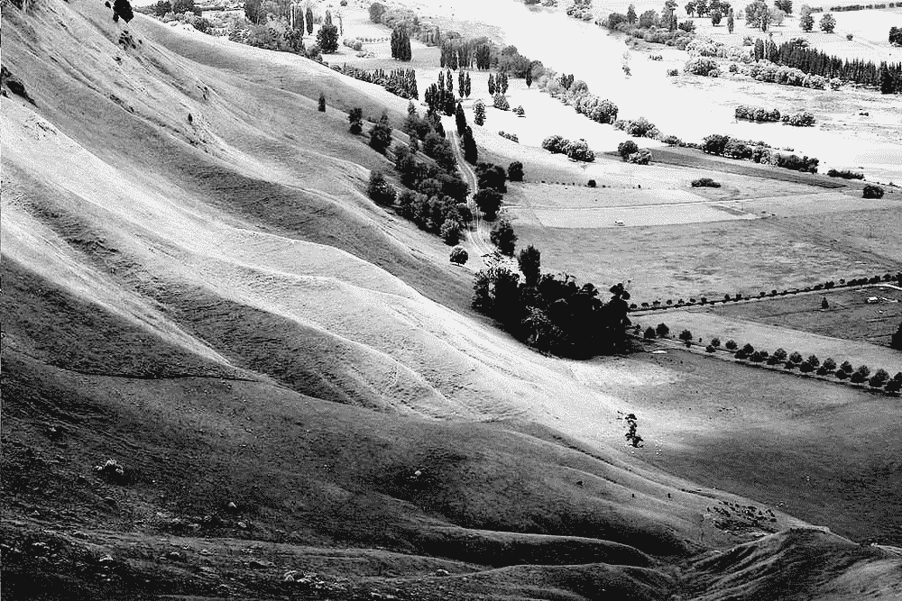************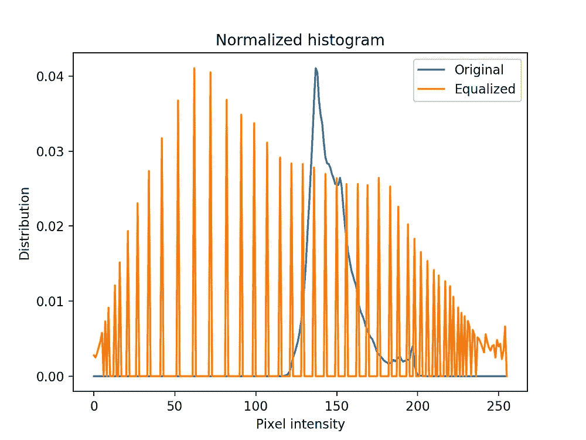************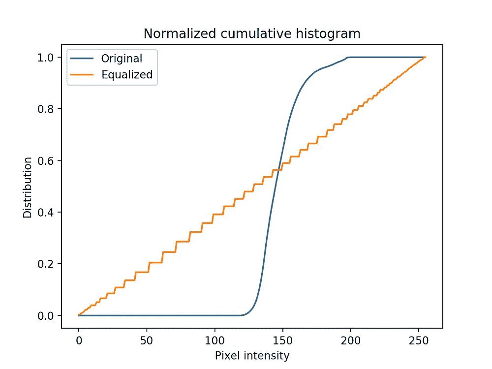******

******情况 1:均衡前后的图像、直方图和累积直方图。[图片由作者和[本来源](https://commons.wikimedia.org/wiki/File:Unequalized_Hawkes_Bay_NZ.jpg)******

## ******案例二:lena_dark.png******

******************************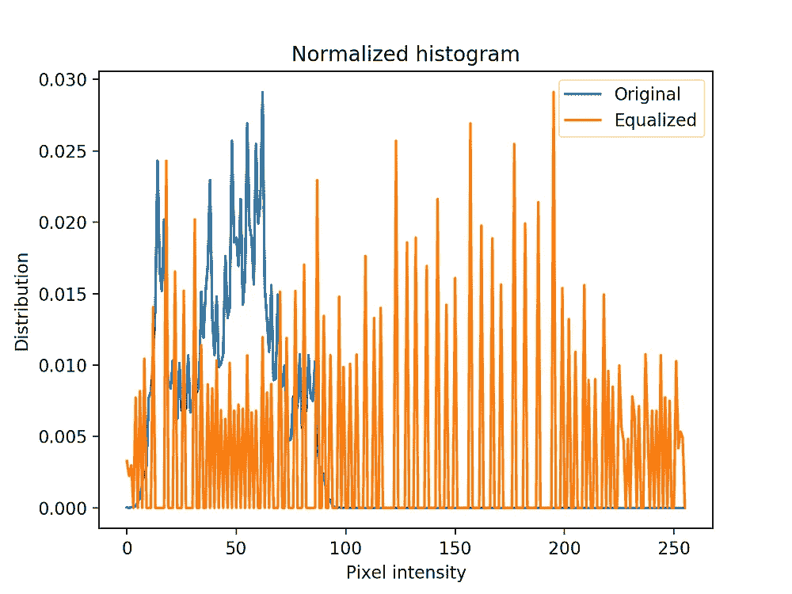************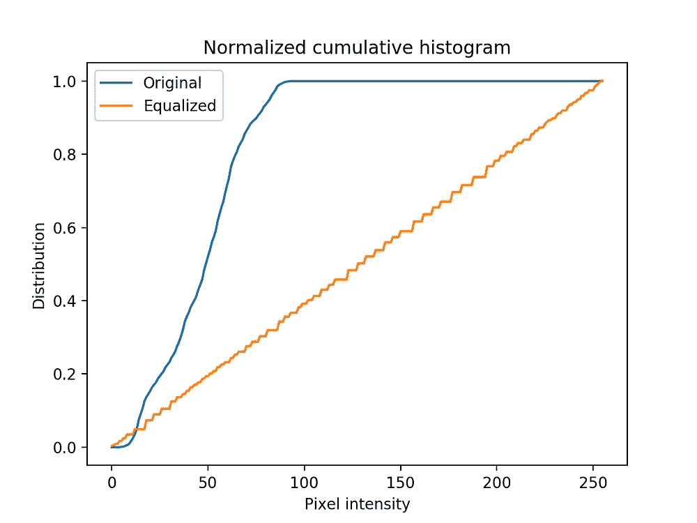******

******情况 1:均衡前后的图像、直方图和累积直方图。[图片作者和[此来源](https://haltair.files.wordpress.com/2010/07/lena_dark.png)******

# ******结论******

******在本文中，我们研究了基本的直方图均衡算法和实现。因为它是基于整个图像的直方图来执行的，所以它通常被称为*全局直方图均衡化*。这是一个简单而有效的工具来增加图像的整体对比度。但是，如果图像包含噪声，这些噪声也会被放大。有几种算法变体可以解决这个问题，比如*自适应直方图均衡* (AHE)和*对比度受限的自适应直方图均衡* ( [CLAHE](https://en.wikipedia.org/wiki/Adaptive_histogram_equalization) )。然而，这些是另一篇文章的主题！******