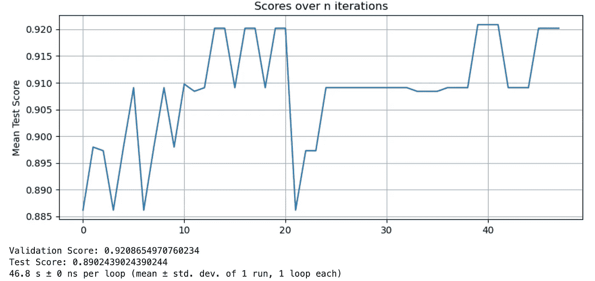
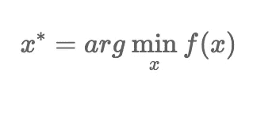
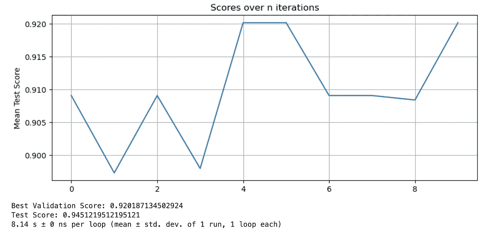
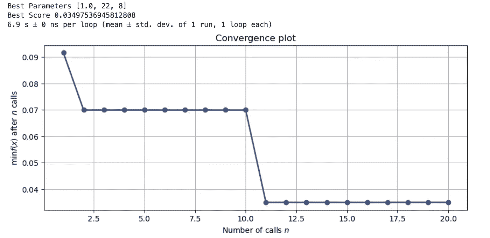

# 超参数调整和贝叶斯方法简介

> 原文：<https://levelup.gitconnected.com/introduction-to-hyperparameter-tuning-automated-methods-317b19542aa6>

在 [Unsplash](https://unsplash.com?utm_source=medium&utm_medium=referral) 上由 [Saj Shafique](https://unsplash.com/@saj_shafique?utm_source=medium&utm_medium=referral) 拍摄的照片

如果我们将机器学习分为三个部分:表示、评估和优化，超参数调整将根据您的评估标准调整模型表示的参数，以更好地适应测试集的数据。当我们创建和评估新模型时，我们还希望确保模型不会过度拟合或欠拟合数据。自动化方法的范围从蛮力到使用另一个模型，该模型观察 y = f(x)的行为并决定使用未探索的参数进入哪条路径，只选择可能减少损失的集合。

当您进入模型开发的训练阶段时，您可能知道您想要尝试的一系列参数—各种 C、alpha、学习率、树深度—但是您很可能不知道这些值的哪个组合在您的评估标准上产生最佳结果。在本教程中，我将谈到传统的监督机器学习模型表示，如 OLS 线性和逻辑回归，决策树，支持向量机，K-最近邻，树集成和朴素贝叶斯。

# **先决条件和一般最佳实践**

1.  对你的评估标准有一个清晰的概念。这方面的例子包括精度和召回，平方误差，信息增益，后验概率和可能性。这种模式的目标是什么？
2.  **充分了解您的算法和参数**，了解每个算法和参数控制的内容，以及它们如何改变其在生产中的推广能力。您会注意到，一些参数有很大的影响，而其他参数没有那么大的影响。
3.  记得加倍**检查数据泄漏**——你的测试集结果好得令人难以置信吗？您是否使用了在推断时不会有的数据？

在我们进入超参数调优方法之前，我将触及这个过程的几个目标。调整模型参数、重新训练和评分是一个非常计算密集型的过程。使用参数调整的基本方法，我们有一个指数函数；n 长度 O(n^k 的 k 个列表)，其中 k 是常数。我们的目标是花费最少的人力(数据科学家的时间)和计算能力，同时根据我们的评估标准获得最佳结果。快速迭代可能是有益的，因为您会注意到不同算法的不同类型的行为和参数，特别是关于您正在拟合的数据。例如，我们可能正在使用梯度增强决策树集成和随机森林，但我们希望在两者之间快速做出决定，并决定我们是否需要回到特征工程或前进到评估新数据的模型，并推出生产。由于前面提到的原因，我们不应该确定穷尽式的方法，所以我鼓励你推动目前可用的更有效的选择。

# **自动超参数调整选项**

1.  网格搜索和随机搜索
2.  [贝氏](https://proceedings.neurips.cc/paper/2012/file/05311655a15b75fab86956663e1819cd-Paper.pdf)
3.  [超波段](https://liamcli.com/assets/pdf/hyperband_jmlr.pdf)
4.  黑盒方法包括谷歌云的[维兹尔](https://research.google/pubs/pub46180/)和 [SigOpt](http://proceedings.mlr.press/v133/turner21a/turner21a.pdf)

# 测试方法

我的设置包括一个 64 核，240GB 内存，100GB 固态硬盘，Python 3 N1 笔记本在[谷歌云顶点人工智能](https://cloud.google.com/vertex-ai)。我尽可能在所有方法上使用相同的参数，并锁定在随机状态，包括在训练/测试分割上。您可以访问相同的数据，并且可以在本地机器或云中复制结果。我使用 python magic %timeit 来记录每个函数的运行时间。我包含了一个简单的 pyplot 函数，其中我绘制了每次迭代的平均分数。

# **网格搜索&随机搜索**

这是一种详尽的方法，我们基本上尝试了每一种可能的值组合，并返回一组参数和在测试集上具有最高评估结果的训练模型。我们知道，我们会以较高的计算成本找到最佳的参数集。当您没有很多参数要测试，并且对于给定的一组参数，训练您的模型只需要几秒钟时，我会推荐这个选项；也就是说，你的数据集并不大，你要把模型放进去。如果您对使用这种方法感兴趣，请查阅 SKLearn 的 GridSearchCV 的[文档。此外，看一看](https://scikit-learn.org/stable/modules/generated/sklearn.model_selection.GridSearchCV.html)[你可以传给 GridSearch 的评分方法](https://scikit-learn.org/stable/modules/model_evaluation.html#scoring-parameter)。这将允许您设置一个目标，如 F1、ROC AUC、R2 和解释方差。我在下面提供了一个例子，在这个例子中，我使用 GridSearchCV 来优化分类模型。

数据准备和绘图功能~

**网格搜索示例**

在这里，我们正在训练一个梯度增强分类器，我已经指定了一个参数网格，该网格具有模型将测试和评分的范围。新的模型适合于新的超参数组合的每一次迭代，适合于整个训练集-如上定义的 80/20 分割。我们设置了 5 个交叉验证折叠，并使用 R2 来计算损失。

# 贝叶斯优化

贝叶斯方法提供了在给定域上寻找最优参数的显著加速。我们感兴趣的是最小化这个函数:

鉴于这些限制:

1.  f 是一个黑箱，没有封闭形式的解决方案[4]
2.  评估 f 是昂贵的
3.  对 y = f(x)的求值是昂贵的

既然我们已经回顾了我们试图解决的问题，那么选择参数和迭代的过程是什么呢？为此有许多获取函数，包括预期改进、置信下限和改进概率。这些函数有许多参数，您可以调整这些参数，以便在利用和探索之间进行权衡。

我将演示两个贝叶斯示例，第一个使用 [BayesSearchCV](https://scikit-optimize.github.io/stable/modules/generated/skopt.BayesSearchCV.html#skopt.BayesSearchCV) ，另一个使用[自定义循环](https://scikit-optimize.github.io/stable/auto_examples/bayesian-optimization.html#sphx-glr-auto-examples-bayesian-optimization-py)。使用 BayesSearchCV，您可以通过采样的参数数量来微调搜索过程，从而权衡运行时和模型质量。开始使用 [sk-optimize](https://scikit-optimize.github.io/stable/index.html) api 很简单——你至少需要一个模型和一个评估目标(召回率、精确度、MSE、R2 等)。请注意，您还可以利用 n_jobs 参数来加速计算，利用 CPU 上的多线程，这里我利用了-1 中所有可用的内核。

下面是我的最后一个例子，使用一个定制的循环来计算并最小化每次迭代的损失:

# 结论

通过使用贝叶斯技术，总运行时间减少了 80%以上，而且正如我们前面提到的 O(n^k).网格搜索运行时间，随着测试参数数量的增加，总运行时间还会增加贝叶斯方法被证明是一种优化黑盒功能的有效方法，谷歌的 Vizier 等托管服务进一步提高了性能。在较大模型的超参数调整阶段，创建一个搜索空间并使用最佳方法是一种节省时间和计算能力的方法，并且可以让数据科学家专注于模型代码和业务目标。

# 参考文献和注释

1.  [关于机器学习需要知道的一些有用的事情](https://homes.cs.washington.edu/~pedrod/papers/cacm12.pdf)，多明戈斯 2012
2.  [机器学习算法的实用贝叶斯优化](https://proceedings.neurips.cc/paper/2012/file/05311655a15b75fab86956663e1819cd-Paper.pdf)，
3.  [带目的的贝叶斯优化](https://scikit-optimize.github.io/stable/auto_examples/bayesian-optimization.html#sphx-glr-auto-examples-bayesian-optimization-py)
4.  封闭形式的解决方案是那些可以用有限数量的众所周知的表达式来表达。通过偏最小二乘法的线性回归确实具有封闭形式的表达式，但是在我们具有弱学习器集合的梯度提升中，通常没有封闭形式的解，因为它们基本上依赖于迭代优化方法。