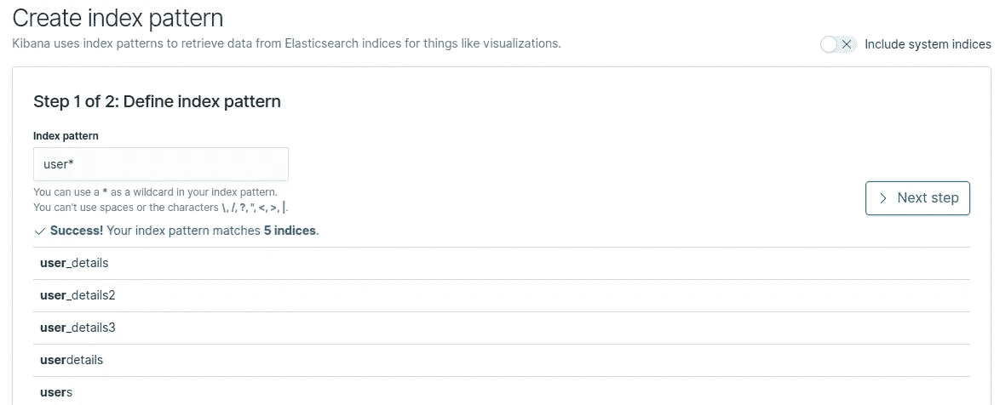
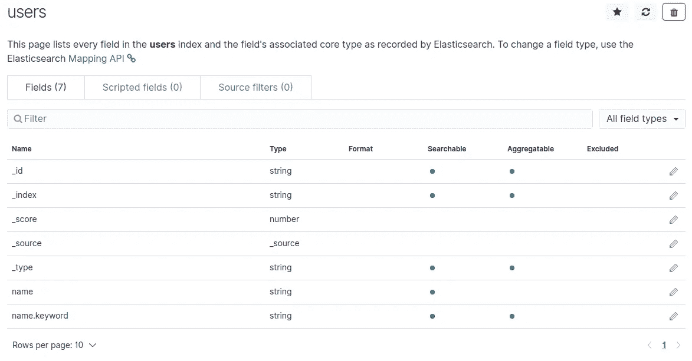
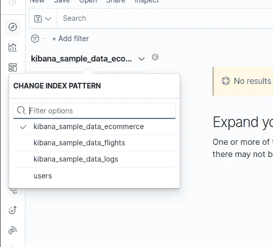
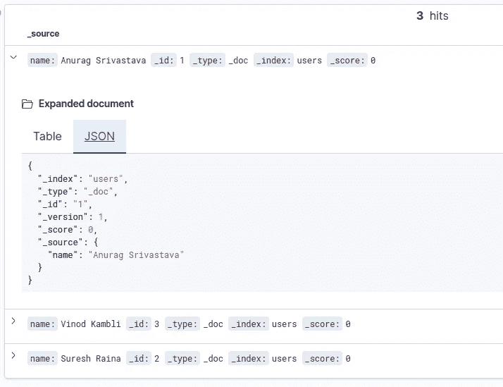

# 基巴纳简介

> 原文：<https://levelup.gitconnected.com/introduction-to-kibana-5ce16ae7244b>


我已经写了一些关于 Elastic Stack 的博客，其中我解释了 Elastic Stack 的不同组件，以及一些我们可以从 CSV、MySQL 和 MongoDB 等不同来源导入数据的用例。我从不同的用户那里收到不同的问题和聊天信息，关于 ***“什么是基巴纳”*** 和 ***“我们如何使用基巴纳”*** 。因为如果你想通过 Kibana 的 web 界面开始使用弹性堆栈，这是第一步。所以在这篇博客中，我将解释 Kibana 的基础知识，它的用例，以及我们如何在 Kibana 中创建索引模式来使用 Elasticsearch 索引数据。所以现在不浪费任何时间，让我们开始介绍基巴纳。

Kibana 是一个仪表板工具，与 Elasticsearch 紧密合作。Kibana 可以用于不同的用例，比如系统监控和应用程序监控。在传统的监控系统中，您可以监控系统性能、应用程序日志等等。但是有了 Kibana 和弹性堆栈，我们可以做很多事情，请提及以下几点:

*   我们可以为某些阈值创建警报，这样我们就可以在不进行持续监控的情况下获得警报
*   我们可以配置不同的 Beats 来监控系统指标、数据库指标和日志指标等。
*   我们可以配置 APM 来监控应用指标和任何与应用相关的问题。
*   我们可以配置 Logstash 的 JDBC 插件，将 RDBMS、CSV 或 NoSQL 数据拉入 Elasticsearch，使其在 Kibana 中可用，以创建不同 KPI 的可视化
*   我们可以使用不同的第三方插件来帮助我们从不同的来源获取数据。例如，我们可以使用 Twitter 插件来获取 Twitter 提要
*   我们可以将机器学习应用于我们的数据集，通过分析当前数据集来发现任何数据异常或未来趋势

这些是我们可以使用 Kibana 的一些用例。正如我提到的，Kibana 与 Elasticsearch 合作非常紧密，但是我忘了说**它目前只与 Elasticsearch** 合作。弹性搜索数据在 Kibana 中不能自动获得，如果我们想使用弹性搜索索引数据，那么我们需要在 Kibana 中为弹性搜索索引创建索引模式。现在让我们来看看如何在 Kibana 中为弹性搜索索引创建索引模式。

**创建索引模式:**

以弹性搜索指数“用户”为例，我们有用户的详细信息，请参考下面的例子:

```
{ 
  "_index" : "users", 
  "_type" : "_doc", 
  "_id" : "1", 
  "_score" : 1.0, 
  "_source" : 
  { 
     "name" : "Anurag Srivastava" 
  }
}
```

上面的例子显示了 Elasticsearch 的“用户”索引的文档。现在，如果我们想要在 Kibana 中创建索引模式，那么我们需要执行以下操作:

*   点击 Kibana UI 左侧菜单中的“管理”链接。这将打开 Kibana 的管理页面。
*   现在点击“Kibana”标题下的“索引模式”链接。这将打开 Kibana 的索引模式页面。
*   单击右上角的“创建索引模式”按钮，这将打开“创建索引模式”页面，其中包含第 1 步(共 2 步)“定义索引模式”。
*   在索引模式中，文本框键入索引“users”的名称以匹配索引用户。
*   此外，如果我们希望通过一个索引模式匹配多个索引，那么我们可以键入名称和通配符。例如，如果我们键入“user*”，那么它将与 user、users 和 user_details 索引相匹配。请参考下面的截图:



*   在任何情况下，如果它匹配任何索引，那么我们将获得成功消息，并且“下一步”按钮将被启用。
*   在下一步中，我们可以进行一些设置，如自定义索引模式 id。如果我们希望 Kibana 为我们设置它，那么我们可以点击“创建索引模式”按钮。
*   这将创建“用户”索引模式，并显示字段细节以及编辑不同字段的选项。在这里我们可以设置字段的格式。请参考下面的截图:



*   我们可以通过单击左侧菜单中的“发现”链接来验证索引模式，然后我们可以从下拉列表中选择索引模式，请参考下面的屏幕截图:



*   选择索引模式后，我们可以看到表格或 JSON 格式的文档。我们还可以对数据进行搜索和过滤，请参考下面的截图:



上面的截图显示了 Elasticsearch 用户索引的文档，我们可以在其中应用搜索或过滤。这样，我们可以使用 Elasticsearch 索引名称在 Kibana 中创建索引模式，一旦创建了索引模式，我们就可以在 Kibana 中执行数据分析和可视化。

*如果你觉得这篇文章很有趣，那么你可以探索一下“* [***【掌握基巴纳 6.0***](https://www.amazon.com/Mastering-Kibana-6-x-Visualize-histograms/dp/1788831039/ref=olp_product_details?_encoding=UTF8&me=) *”、* [***基巴纳 7 快速入门指南***](https://www.amazon.com/Kibana-Quick-Start-Guide-Elasticsearch/dp/1789804035) *”、* [***学习基巴纳 7***](https://www.amazon.com/Learning-Kibana-dashboards-visualization-capabilities-ebook/dp/B07V4SQR6T) *”和* [***弹性搜索***](https://www.amazon.com/gp/product/1789803322?pf_rd_p=2d1ab404-3b11-4c97-b3db-48081e145e35)

也可以关注我:
-Twitter:[https://twitter.com/anu4udilse](https://twitter.com/anu4udilse)
-Medium:[https://anubioinfo.medium.com](https://anubioinfo.medium.com/)

[Learning Kibana 7](https://www.amazon.com/Learning-Kibana-dashboards-visualization-capabilities-ebook/dp/B07V4SQR6T) 荣登最佳新弹力搜索书籍


我很高兴地宣布，我的书《[学习 Kibana 7:用 Kibana 的数据可视化功能构建强大的弹性仪表板](https://www.amazon.com/Learning-Kibana-dashboards-visualization-capabilities-ebook/dp/B07V4SQR6T)，第二版》入选 BookAuthority 最佳新弹性搜索书籍:

其他博客:

[Logstash 简介](https://faun.pub/introduction-to-logstash-afe109b886f0)

[基巴纳简介](/introduction-to-kibana-5ce16ae7244b)

[弹性叠加测井分析](https://faun.pub/log-analysis-with-elastic-stack-2a493c113084)

[open API 规范介绍](https://medium.com/swlh/introduction-to-openapi-specification-10c9d6fb0c8a)

[使用弹性搜索进行地理距离搜索](/geo-distance-search-using-elasticsearch-7e2e69d76343)

[将 CSV 数据加载到 Elasticsearch](/load-csv-data-into-elasticsearch-fdb562a7abd9)

[用 Jenkins 配置 SonarQube 扫描仪](https://faun.pub/configure-sonarqube-scanner-with-jenkins-27c23e7758fd)

[配置 Logstash 将 MongoDB 数据发送到 Elasticsearch](/configure-logstash-to-send-mongodb-data-into-elasticsearch-49cc0e9c2a8d)