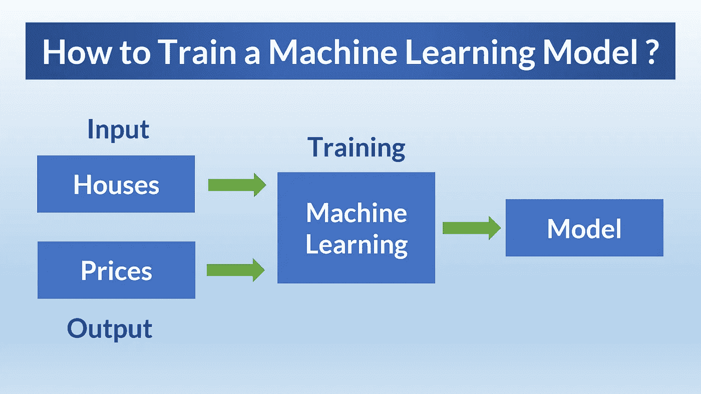
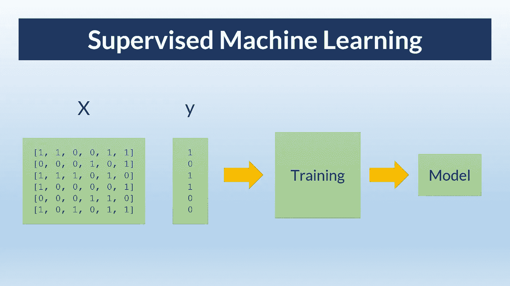
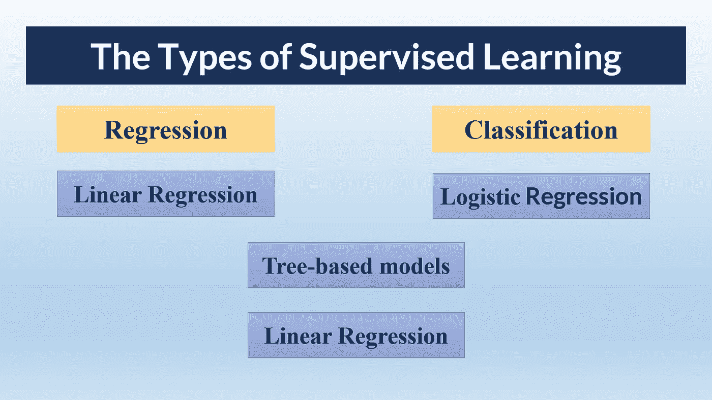
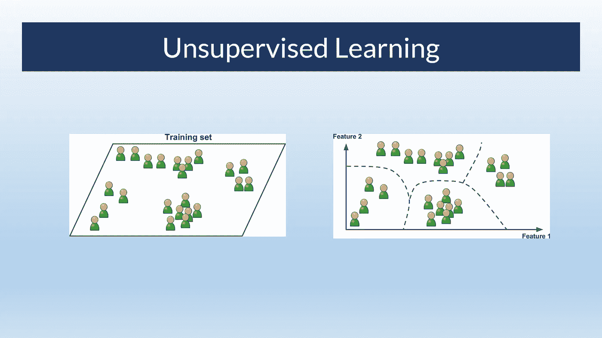
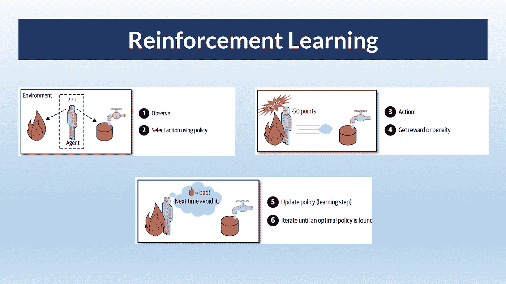
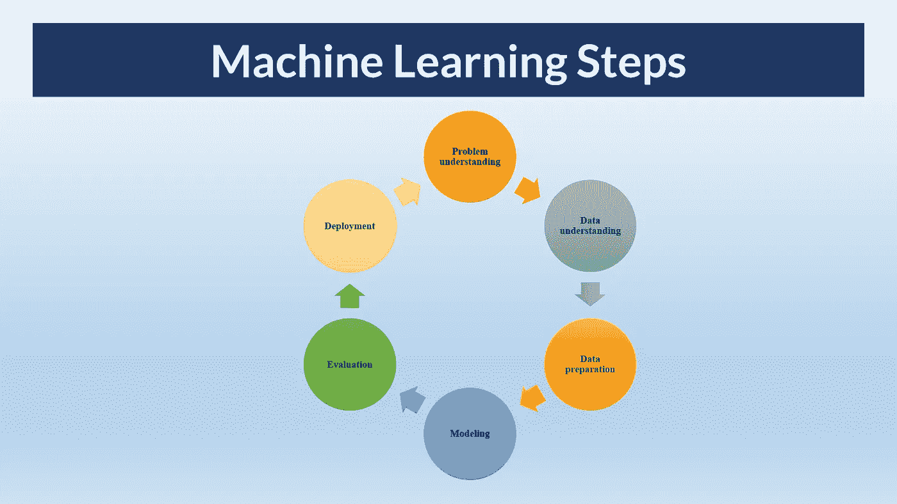

# 初学者机器学习入门

> 原文：<https://levelup.gitconnected.com/introduction-to-machine-learning-for-beginners-de3e6053760d>

## 机器学习教程

## 在这篇博文中，我将谈论机器学习，并展示机器学习项目的步骤。

图片来自 Pixabay

人工智能是近年来出现的最令人兴奋的技术之一。使用人工智能已经取得了巨大的进步，如无人驾驶汽车、语音助手、语言到语言的翻译、推荐系统。

机器学习是一个非常酷的领域。从金融到生物，从教育到健康，机器学习被用于许多领域。

那么什么是机器学习呢？机器学习是人工智能的一个子领域，旨在开发基于数据做出自动决策的程序。

在这篇博文中，我将涉及以下主题:

*   什么是机器学习
*   机器学习的类型
*   机器学习项目的步骤
*   模型验证

请不要忘记订阅我的 youtube 频道，我在那里创建关于人工智能、数据科学、机器学习和深度学习的内容。👇

 [## 蒂伦达兹学院

### Tirendaz Academy 是一个在线教育平台，在数据等领域创建视频和撰写博客文章

www.youtube.com](https://www.youtube.com/channel/UCFU9Go20p01kC64w-tmFORw) 

让我们继续讨论什么是机器学习。

# 什么是机器学习？

在机器学习之前，经典方法用于在数据集中寻找模式。在传统的方法中，规则以前被明确地输入到系统中。系统被期望根据这些规则做出预测。

作者图片

在这种方法中，模型没有有效地工作。因为规则是人工确定的。

例如，假设我们想要预测一封电子邮件是否是垃圾邮件。在传统方法中，单词被输入到系统中。如果邮件中有这些词，该邮件估计是垃圾邮件。但是，很难手动输入垃圾邮件中的所有单词。没错。

作者图片

此外，垃圾邮件中的文字也在不断变化，内容也像 covid 19 一样变异。所以，不断手动更新单词是相当困难的。

机器学习模型就是为了解决这个问题而开发的。有了机器学习，规则就不是明确给系统的了。系统从数据中学习规则。

作者图片

简而言之，机器学习会自动发现数据中隐藏的模式。现在我们来看看机器学习的类型。

# 机器学习的类型

机器学习有三种类型。这里有监督学习，无监督学习，强化学习。让我们来看看这些类型。

## 监督学习

如果数据集有标注，则可以使用监督学习。监督学习允许您通过将属性映射到目标变量来构建模型。

例如，如下图所示，在监督学习中，我们使用 X 属性和目标变量 y 来训练模型，您可以获得一个机器学习模型。

作者图片

让我们来看看监督学习的类型。

一般来说，监督学习分为回归和分类。

*   如果目标变量是数值型的，比如房价，可以使用**回归模型**。
*   如果目标变量是分类的，如女性或男性，您可以使用**分类模型**。

有许多模型可以用于回归和分类问题。

作者图片

例如，您可以对回归问题使用线性回归，对分类问题使用逻辑回归。对于分类和回归问题，您可以使用基于树的算法，如随机森林。你也可以利用神经网络来解决这两个问题。

## 无监督学习

作者图片

无监督学习用于没有标签的数据。通过这种方法，可以发现数据中没有标签的隐藏模式。最著名的无监督学习算法是聚类算法。

## 强化学习

作者图片

在这项技术中，目标是开发一个学习系统，通过与环境交流来改善决策过程。

行动被选择和执行，作为回报，奖励或惩罚被接受。因此，被称为政策的最佳策略是通过奖励和惩罚来学习的。

强化学习最流行的例子是国际象棋。系统决定石头的最佳位置。在游戏结束时，策略会以输赢来奖励。许多机器人使用这种算法来学习如何行走。

好吧，我喜欢机器学习。这是一个令人兴奋的领域。现在我要谈谈如何做一个机器学习项目。

# 机器学习项目的步骤

请注意，训练机器学习模型只是机器学习工作流程中的一个步骤。机器学习有许多步骤，如问题理解、数据预处理、部署模型等等。此外，这些步骤是迭代的。所以它一遍又一遍地重复。

大多数时候，你正在训练的模型的性能不会很好。在这种情况下，您需要重新训练模型。

机器学习工作流程有 6 个步骤。让我们仔细看看这些。

作者图片

首先，你从定义你的问题是什么开始。所以，你明白问题是否可以通过机器学习技术来解决。

机器学习需要数据，对吧？毕竟，您将基于数据构建一个模型。注意，如果你有好的数据，那么你就建立了一个好的模型。找到数据是不够的，数据足够也很重要。如果你有更少的数据，那么你应该收集更多的数据。

假设你已经准备好了数据。之后，您必须将数据转换为表格形式，即行和列。如果你有图像等非表格数据，那么你可以使用深度学习技术，这是机器学习的一个子领域。

假设你找到了好的数据并准备好了。在那之后，你就进入了构建模型的阶段。你根据你的数据训练你的模型。

假设你有一个训练有素的模型。那么我们怎么知道这个模型是好是坏呢？你赶紧别说模型完美了。你需要评估一下。为了评估模型，有各种度量标准，如准确性或 f1 分数。

假设你开发了一个完美的模型。当然是完成了，不是吗？构建模型后，您需要部署它。

机器学习项目的最后一步是部署模型。因此，当输入任何数据时，您的模型都会做出很好的预测。

我提到的步骤是标准的。每个机器学习工作流程都有这些步骤。现在，让我们继续解释模型验证。

 [## 7 大数据科学技能

### 数据科学技能面试问题 python 项目课程数据分析路线图机器学习应用…

www.youtube.com](https://www.youtube.com/shorts/mnf5x1EbtCg) 

# 模型验证

假设我们可以基于数据集选择一个模型，如逻辑或神经网络。如你所知，有许多机器学习模型。我建议首先使用简单的模型，比如线性回归。如果简单模型表现不佳，您可以使用复杂模型，如神经网络或基于树的算法。

那么我们如何确定自己的模型好不好呢？验证数据用于确定模型是否良好。可以通过拆分部分训练数据得到验证数据。

> 用训练数据训练该模型，并用验证数据评估其性能。

你找到最好的模特了吗？要理解这一点，可以使用测试数据。请记住，在训练模型时，根本不会使用测试数据。测试数据就像您训练的模型的新数据。有了这些测试数据，您可以衡量我们模型的性能。

# 结束语

到目前为止，我谈论了什么是机器学习，并展示了机器学习项目的步骤。最后，我讲述了如何进行模型验证。机器学习是一个伟大的领域。它在几乎每个领域都有应用。

就是这样。感谢您的阅读。我希望你喜欢它。你可能会对下面的文章感兴趣。

 [## 10 大 Python 库和 5 本最佳数据科学书籍

### 在这篇文章中，我将谈论数据科学家应该知道的 10 个 Python 库。我还会推荐 5 本书…

levelup.gitconnected.com](/top-10-python-libraries-and-5-best-books-for-data-science-fa0d0cf171a6)  [## 成为机器学习专家的 6 个步骤

### 机器学习是人工智能的一个子领域，旨在使用数据自动建立模型。在这篇文章中，我将…

medium.com](https://medium.com/geekculture/6-steps-to-become-a-machine-learning-expert-5a1f155f7207) 

别忘了在 YouTube 上关注我们🎞， [GitHub](https://github.com/tirendazacademy) 🌱， [*碎碎念*](https://twitter.com/TirendazAcademy) 😎*、*、[卡格尔](https://www.kaggle.com/tirendazacademy)📚，[*LinkedIn*](https://www.linkedin.com/in/tirendaz-academy)*👍*

*下一篇博文再见…*