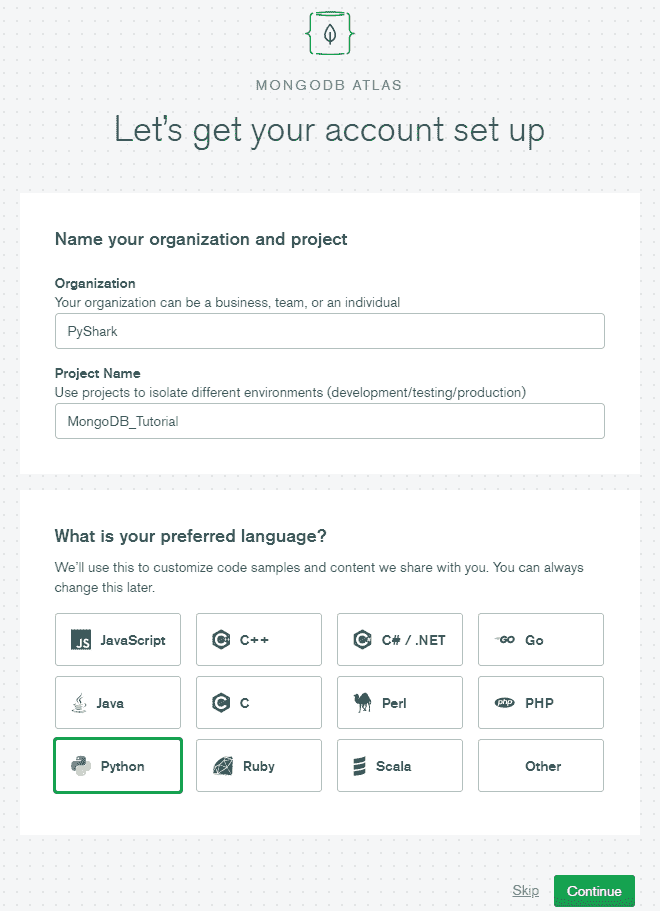
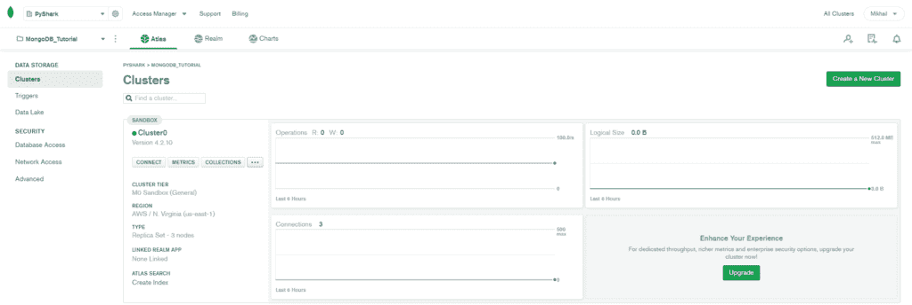
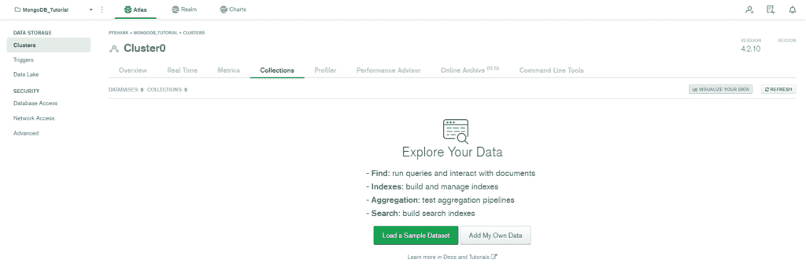
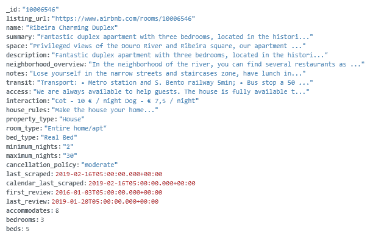
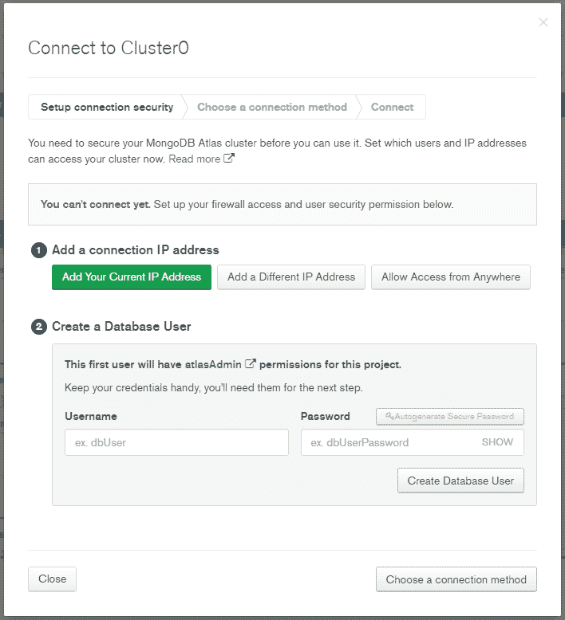
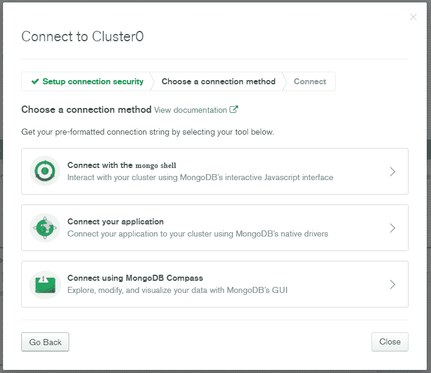
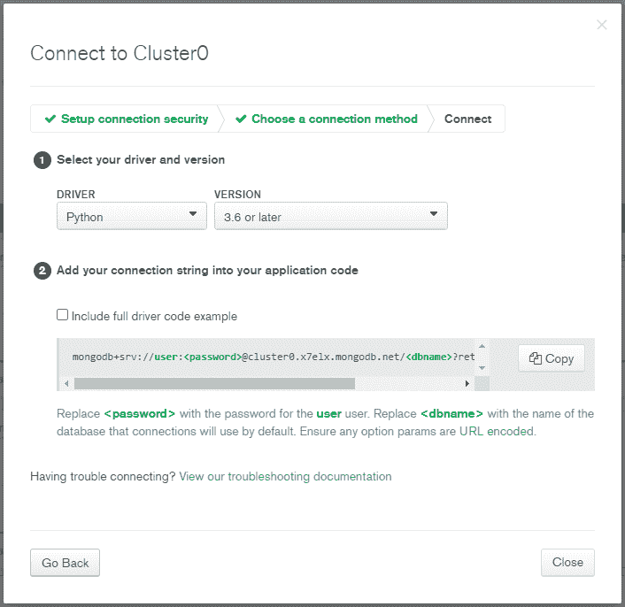

# 使用 Python 和 PyMongo 介绍 MongoDB

> 原文：<https://levelup.gitconnected.com/introduction-to-mongodb-using-python-and-pymongo-87797bbd5ad3>

## 在本教程中，我们将讨论如何使用 Python，特别是 PyMongo 来处理 NoSQL 数据库 MongoDB。


作者图片

**目录**

*   介绍
*   创建一个 MongoDB 帐户和集群
*   为 Python 应用程序创建到 MongoDB 数据库的连接
*   使用 Python 连接到 MongoDB 数据库
*   使用 Python 从 MongoDB 获取文档
*   使用 Python 更新 MongoDB 中的文档
*   使用 Python 将文档插入 MongoDB
*   结论

# 介绍

MongoDB 是该领域中最流行的 NoSQL 数据库之一。与使用 SQL 的标准关系数据库不同，MongoDB 有一个非关系模型，使用类似 JSON 的结构将数据存储为文档。

MongoDB 有各种好处，包括高可伸缩性，允许存储任何类型的数据，高灵活性，以及存储多层信息，而不必在模式和数据库设计上做很多工作。

MongoDB 允许多种连接数据库的方式。因为我们在教程中主要使用 Python，所以我们将利用 [PyMongo 库](https://pymongo.readthedocs.io/)。那么 PyMongo 是什么？PyMongo 是一个 Python 发行版，包含使用 Python 中的 MongoDB 的工具。

为了继续完成本教程的技术部分，我们需要安装 pymongo 和 pprint 库。

如果您没有安装它，请打开“命令提示符”(在 Windows 上)并使用以下代码安装它:

```
pip install pymongo
pip install pprint
```

# 创建一个 MongoDB 帐户和集群

首先，我们需要创建一个 MongoDB 帐户并配置我们的第一个集群。它非常简单，MongoDB 网站是设置初始工作空间的最用户友好的平台之一。

进入 [MongoDB 账户创建页面](https://www.mongodb.com/)，完成简单注册。您可以选择通过填写信息进行注册，也可以直接在 Google 上注册:


作者图片

注册后的下一步是填写一些关于您的组织、项目的信息，并选择首选的编程语言。我填了我的如下:



作者图片

在下一页中，您可以选择帐户的等级。我们只需继续进入“共享集群”，然后单击“**创建集群**”。

在下一页，您将看到云提供商和区域选项，以及集群层、一些设置和集群名称。我们可以将它们都保留为默认值:


作者图片

并点击“**创建集群**”。

之后，您将被重定向到项目的主页，创建一个集群需要几分钟时间。

设置好一切后，您的屏幕应该显示以下内容:



作者图片

# 创建一个 MongoDB 数据库

我们刚刚创建的集群是空的。让我们创建一个测试数据库，并在教程的后面利用它。

在群集页面中，单击带有群集名称的绿点正下方的“**集合**”气泡。它应该带你到这里:



作者图片

正如我们所看到的，我们的集群中还没有数据。

这里有两个选项，您可以加载一些示例数据，或者创建自己的数据。

对于本教程，让我们加载一个样本数据集。只需点击“**加载样本数据集**并继续。加载前需要几分钟时间。然后您可以刷新页面，您将看到一些数据库出现在集群上。

位于集群顶部的第一个数据库是“ **sample_airbnb** ”，在该数据库中，将有一个名为“ **listingsAndReviews** ”的集合。

单击该集合，查看一些存储的示例文档。这些记录包含一些 Airbnb 房产的信息，比如:



作者图片

注意:MongoDB 的工作方式是将数据记录存储为文档，文档被分组在一起并存储在集合中。一个数据库可以有多个集合。

至此，我们已经创建了一个 MongoDB 集群，并向其中添加了一些样本数据。下一步是使用 Python 连接到 MongoDB 数据库。

# 为 Python 应用程序创建到 MongoDB 数据库的连接

既然我们的集群已经创建，我们希望建立到它的连接并处理数据。

让我们回到我们的主群集页面:


作者图片



作者图片

在我们能够连接到我们的数据库之前的一个步骤是创建用户安全许可，这包括:添加您的 IP 地址和创建一个数据库用户。

*   首先，只需点击“**添加您当前的 IP 地址**，一个标签将显示您的 IP 地址，然后点击“**添加 IP 地址**”。
*   然后，填写您的数据库用户信息(我选择我的用户名为**用户**，密码为**测试**，点击**创建数据库用户**)。
*   填写完所有这些信息后，您会注意到右下角的“**选择连接方式**”按钮变成了绿色。我们可以继续了，继续点击它。

下一个菜单将询问我们将使用什么类型的连接方法:



作者图片

由于我们将使用 Python 和 PyMongo，我们选择“**连接您的应用程序**”:



作者图片

在此选项卡中，我们选择 Python 作为“驱动程序”，您已安装的 Python 版本作为“版本”。

现在连接字符串将被创建，我们需要复制它。我的看起来像这样:

```
mongodb+srv://user:<password>@cluster0.x7elx.mongodb.net/<dbname>?retryWrites=true&w=majority
```

完美。因此，连接字符串已经准备好，我们完成了从 web 浏览器端需要做的一切。教程的其余部分将在 IDE 中。

# 使用 Python 连接到 MongoDB 数据库

此时，我们将开始利用 Python 来访问 MongoDB 数据库。

首先，让我们建立到集群的连接:

请注意，我重新安排了上一节中的连接字符串，将之前定义的**用户**和**密码**作为字符串传递。

如果代码没有给出任何错误，那么我们是连接的。我们还可以通过打印出存储在集群中的数据库列表来仔细检查这一点:

根据我们得到的测试数据:

```
['sample_airbnb', 'sample_analytics', 'sample_geospatial', 'sample_mflix', 'sample_restaurants', 'sample_supplies', 'sample_training', 'sample_weatherdata', 'admin', 'local']
```

为了继续本教程的下一部分，我们需要连接到数据库，然后连接到数据库中的一个集合。

回想一下之前，我们想要使用的数据库是**‘sample _ Airbnb’**，我们想要使用的集合是**‘listingsAndReviews’**。

所以我们继续用 Python 定义它们:

# 使用 Python 从 MongoDB 获取文档

本节将主要关注如何使用 Python 和各种类型的数据查询从 MongoDB 中检索数据。

“listingsAndReviews”集合中有多个条目，作为工作示例，我们将使用以下条目:


作者图片

# 从 MongoDB 中检索单个文档

这是最基本的查询类型之一，只检索一个与给定查询参数匹配的文档。

这可以通过使用**来完成。find_one()** 方法:

样本输出预览:

```
{'_id': '10006546',
 'accommodates': 8,
 'address': {'country': 'Portugal',
             'country_code': 'PT',
             'government_area': 'Cedofeita, Ildefonso, Sé, Miragaia, Nicolau, Vitória',
             'location': {'coordinates': [-8.61308, 41.1413],
                          'is_location_exact': False,
                          'type': 'Point'},
             'market': 'Porto',
             'street': 'Porto, Porto, Portugal',
             'suburb': ''},
 'amenities': ['TV',
               'Cable TV',
               'Wifi',
               'Kitchen',
               'Paid parking off premises',
               'Smoking allowed',
               'Pets allowed',
               'Buzzer/wireless intercom',
               'Heating',
               'Family/kid friendly',
               'Washer',
               'First aid kit',
               'Fire extinguisher',
               'Essentials',
               'Hangers',
               'Hair dryer',
               'Iron',
               'Pack ’n Play/travel crib',
               'Room-darkening shades',
               'Hot water',
               'Bed linens',
               'Extra pillows and blankets',
               'Microwave',
               'Coffee maker',
               'Refrigerator',
               'Dishwasher',
               'Dishes and silverware',
               'Cooking basics',
               'Oven',
               'Stove',
               'Cleaning before checkout',
               'Waterfront'],
 'availability': {'availability_30': 28,
                  'availability_365': 239,
                  'availability_60': 47,
                  'availability_90': 74},
 'bathrooms': Decimal128('1.0'),
 'bed_type': 'Real Bed',
 'bedrooms': 3,
 'beds': 5}
```

您会注意到，即使没有任何给定的参数，这段代码也会工作，它会找到集合中的第一个文档并检索它(我没有添加输出，因为它是一个很长的文档)。

现在，如果我们想要一个特定的文档，而不是第一个文档呢？我们应该给这个方法提供一些搜索参数，信息就会被检索出来。例如，我们想要查找 ID = '10009999 '的列表。

搜索参数应添加到**。字典格式的 find_one()** 方法(键值对):

该查询的输出将打印出不同的文档。

样本输出预览:

```
{'_id': '10009999',
 'access': '',
 'accommodates': 4,
 'address': {'country': 'Brazil',
             'country_code': 'BR',
             'government_area': 'Jardim Botânico',
             'location': {'coordinates': [-43.23074991429229,
                                          -22.966253551739655],
                          'is_location_exact': True,
                          'type': 'Point'},
             'market': 'Rio De Janeiro',
             'street': 'Rio de Janeiro, Rio de Janeiro, Brazil',
             'suburb': 'Jardim Botânico'},
 'amenities': ['Wifi',
               'Wheelchair accessible',
               'Kitchen',
               'Free parking on premises',
               'Smoking allowed',
               'Hot tub',
               'Buzzer/wireless intercom',
               'Family/kid friendly',
               'Washer',
               'First aid kit',
               'Essentials',
               'Hangers',
               'Hair dryer',
               'Iron',
               'Laptop friendly workspace'],
 'availability': {'availability_30': 0,
                  'availability_365': 0,
                  'availability_60': 0,
                  'availability_90': 0},
 'bathrooms': Decimal128('1.0'),
 'bed_type': 'Real Bed',
 'bedrooms': 1,
 'beds': 2}
```

使用上面的代码，您可以通过文档中存在的任何键-值对来查询单个记录。例如，您可能希望提取一条记录，其中该酒店可容纳 5 个人:

您将看到的输出是一个不同的属性。

# 从 MongoDB 中检索多个文档

当您想要访问多个满足搜索条件的文档时，您很可能会遇到这种情况。

这里我们将使用**。find()** 方法，因为我们试图检索多个文档。值得注意的是，输出将是一个包含多个属性的对象，要打印每个属性，我们需要循环遍历它。

例如，您可能正在查找一个属性列表，这些属性:

*   容纳 5 人
*   有三间卧室
*   财产类型是房子

您应该会看到符合您的标准的大量属性的打印输出。

本节将主要关注如何在 MongoDB 中更新记录。

您可以使用**更新存储在 MongoDB 中的任何记录或文档。来自 PyMongo 库的 update_one()** 。

它需要两个参数:**。更新 _ 一(过滤，更新)**:

*   过滤器:帮助我们识别要更新的特定记录的查询
*   更新:包含要应用的更改的查询

例如，让我们使用与上一节相同的记录(ID = '10009999 ')。如果你打印出它的内容，你会看到这个属性容纳 4 人(“容纳”:4)。

现在，我们希望更改该数据，以显示该酒店可容纳 6 人。让我们来看看怎么做:

请注意，查询的“update”部分有一个带有“$set”操作符的特定格式，因为它需要传递给 MongoDB 以显示我们正在更新当前记录。

要查看发生的更改，只需检索该记录并将其打印出来:

当然，更新方法还有更多的内容，参数越多就越复杂。在这里，我们看一些基本的例子来帮助你理解流程和过程。

# 使用 Python 将文档插入 MongoDB

到目前为止，我们学习了如何检索记录(或文档)以及如何更新它们。一个自然的问题是，我如何向 MongoDB 添加新条目？

假设我们想在 AirBnB 目录中添加一个新的酒店。此列表包含以下信息:它可容纳 2 人，有一间带两张床的卧室。

回想一下，MongoDB 中的数据存储在 JSON 风格的文档中，所以我们的第一步是创建一个 Python 字典来表示我们的条目:

注意，MongoDB 中的每个文档都有一个惟一的“_id”键。这是一个特殊的键，除非指定，否则会自动添加。它在整个集合中必须是唯一的。

没有必要添加它，因为它是自动生成的，但是对于我们来说，如果我们已经知道它的 ID，检索记录将会更容易。因此，让我们为新文档添加一些 ID(我选择了一个大的数字，只是为了确保它是唯一的，并且没有被其他记录使用):

要使用 PyMongo 库将这个文档添加到 MongoDB，我们需要使用**。insert_one()** 方法，并简单地将新定义的文档作为参数传递给它:

太好了！新文档已添加到我们的收藏中。让我们来看看:

我们看到了我们添加的内容:

```
{'_id': '9999999', 'accommodates': 2, 'bedrooms': 1, 'beds': 2}
```

# 结论

在本教程中，我们探讨了如何使用 Python 和 PyMongo 库来运行 MongoDB。

对于希望了解更多关于 MongoDB 的知识并深入了解该主题的人来说，这里展示的例子是一个很好的起点。

我也鼓励你看看我在 [Python 编程](https://pyshark.com/category/python-programming/)上的其他帖子。

如果你有任何问题或者对编辑有任何建议，请在下面留下你的评论。

*原载于 2020 年 12 月 19 日*[*【https://pyshark.com】*](https://pyshark.com/introduction-to-mongodb-using-python-and-pymongo/)*。*