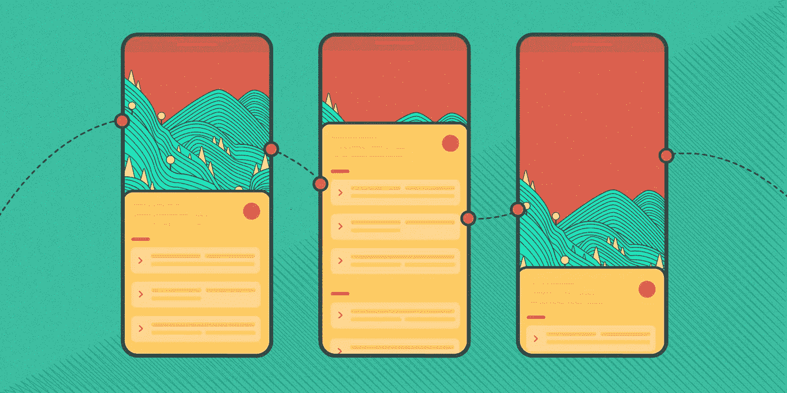
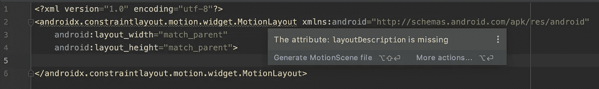
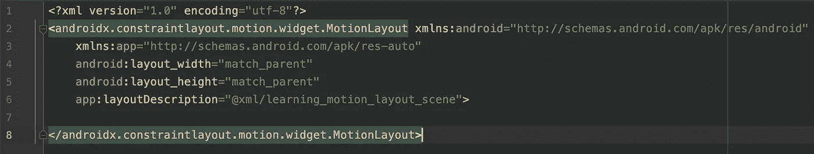
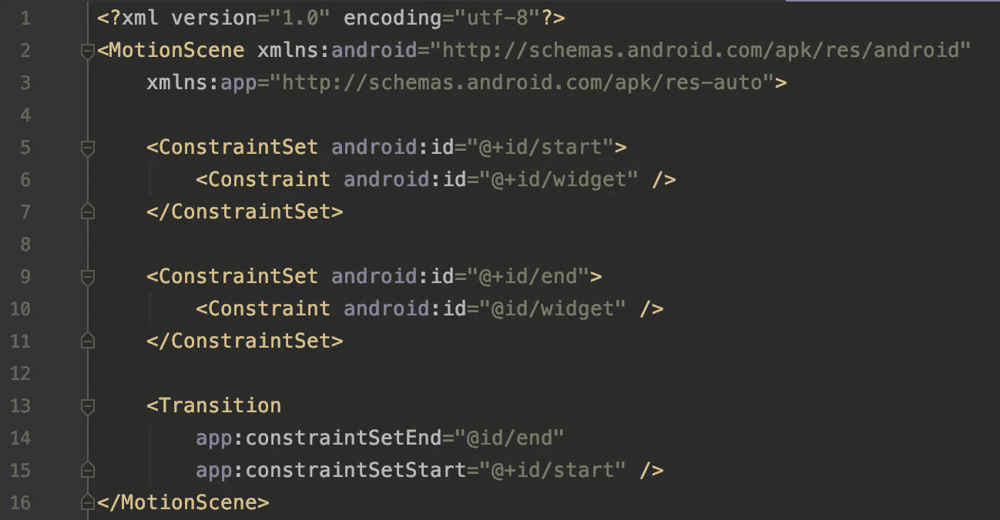
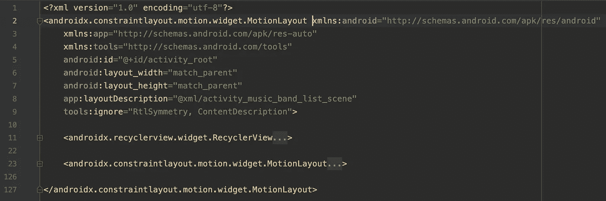
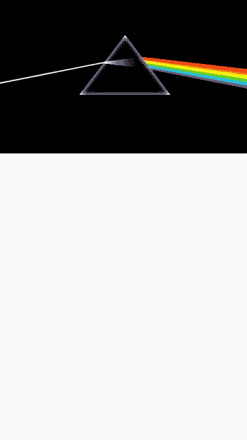
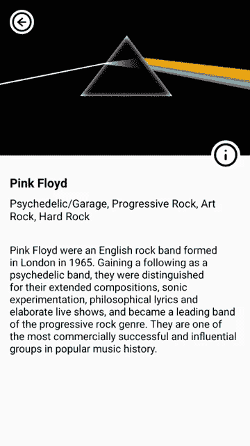
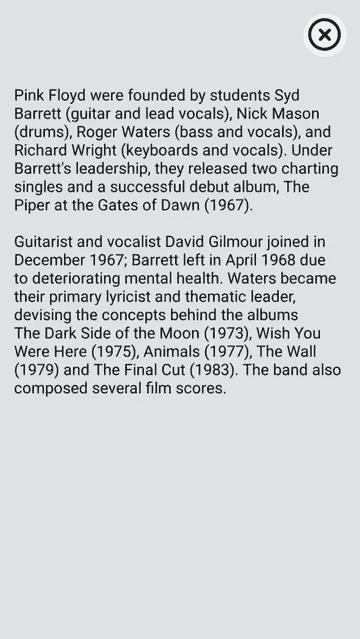

# Android 上的 MotionLayout 简介

> 原文：<https://levelup.gitconnected.com/introduction-to-motionlayout-on-android-f16420d42459>

## 想要在 Android 应用程序中让一些东西移动和移动吗？这里有一个快速的操作方法，包括示例动画。



在本文中，我们将浏览一下 [**MotionLayout**](https://developer.android.com/reference/androidx/constraintlayout/motion/widget/MotionLayout) 的一些基本信息，motion layout 是 [**ConstraintLayout**](https://developer.android.com/training/constraint-layout) 的子类。Android 开发人员用它来在他们的应用程序中创建动作和小部件动画。我们计划描述创建这些动画所需的构件。通过一个例子，我们将强调最重要的步骤。最后会列出有用的链接，以及更多的信息和例子。

# 介绍

如 [**文档**](https://developer.android.com/training/constraint-layout/motionlayout) 所述:

> *MotionLayout 是一种布局类型，可帮助您管理应用程序中的运动和小部件动画。它是 ConstraintLayout 的子类，构建于其丰富的布局功能之上。*

所以，它真的很强大，它有很大的潜力，但它只对它的直系子孙有效。它不支持嵌套的布局层次结构或活动转换，这一点应该考虑在内。

MotionLayouts 的一些关键特性是:描述布局之间的过渡，动画显示布局属性，支持可查找的过渡和自定义过渡的关键帧。最后，它是完全声明性的，它的任何转换都可以在 XML 文件中描述。

由于 MotionLayout 是 **ConstraintLayout** 的扩展，它继承了它的所有特性，您需要将以下依赖项添加到您的应用程序的 **build.gradle** :

```
dependencies {
    implementation 'androidx.constraintlayout:constraintlayout:2.0.0-beta4'
}
```

或者这个，如果你没有使用 AndroidX:

```
dependencies {
    implementation 'com.android.support.constraint:constraint-layout:2.0.0-beta4'
}
```

如果将 MotionLayout 添加到布局文件中，您会注意到 **Android Studio** (我使用的是 Android Studio 4.0 Beta 3)报错如下:



在这里，您可以点击**生成运动场景**文件按钮，一个运动场景文件就会为您生成。我将我的布局文件命名为 **motion_layout.xml** ，生成的文件命名为**motion _ layout _ scene . XML**(可以在 **res/xml** 文件夹中找到)。布局文件现在如下所示:



生成的**motion _ layout _ scene . XML**是这样的:



**MotionScene** 是一个运动场景文件的根元素，用于以**声明的方式**创建动画。同一个 **MotionScene** 文件可以重复使用并应用于不同的布局。

**ConstraintSet** 元素为您想要在运动序列中制作动画的每个**视图**提供了定义。

**约束**元素指定运动序列中单个**视图**的属性和位置。

**过渡**至少包含开始和结束**约束集**，它描述了从开始到结束状态的变化。它可以包含 **OnClick** 、**on switch**和 **KeyFrameSet** 元素。

关于提到的元素的更多信息可以在官方 [**文档**](https://developer.android.com/training/constraint-layout/motionlayout/ref) 中找到。

但是，足够的理论，让我们看看我们的例子！

# 示例动画


请随意查看下面的 Github repo 源代码。

[](https://github.com/dfodor/MotionLayoutSample) [## dfodor/MotionLayoutSample

### 在 Android 上使用 MotionLayout 的示例动画。-d fooder/MotionLayoutSample

github.com](https://github.com/dfodor/MotionLayoutSample) 

我们的布局文件**activity _ music _ band _ list . XML**具有以下层次结构:



在这里，您可以看到一个父级 **MotionLayout** 和两个子级 **RecyclerView** 和另一个 **MotionLayout** ，包含将被动画化的视图。父 **MotionLayout** 的目的是通过运动场景文件控制其子对象的可见性。

在我们深入研究动画实现之前，我想提一下这是一个多步动画。 **MotionLayout** 目前没有用于受控多步过渡的 API。由于我有 4 个**约束集**并需要处理 3 个过渡，我必须以编程方式开始一些过渡。对于更复杂的过渡，有更多的步骤，你可以看到克里斯·贝恩斯写的一篇 [**文章**](https://medium.com/androiddevelopers/suspending-over-views-example-260ce3dc9100) 。

当 **RecyclerView** 项被点击时，我们调用[**musicbandlistativity**](https://github.com/dfodor/MotionLayoutSample/blob/master/app/src/main/java/com/dfodor/motionlayout/sample/MusicBandListActivity.kt)中定义的 [**animate**](https://github.com/dfodor/MotionLayoutSample/blob/master/app/src/main/java/com/dfodor/motionlayout/sample/MusicBandListActivity.kt#L92...#L132) 方法。

**vhValues** 参数是一个带有两个方法的接口，这两个方法通过使用 **ConstraintSet** 提供定位视图所需的信息。

**musicBandModel** 代表被点击的 **RecyclerView** 项目的 POJO。

首先，我们需要用来自接口参数的值修改视图的边距:

```
private fun animate(
    vhValues: MusicBandAdapter.ViewHolderValues,
    musicBandModel: MusicBandModel) {

    val marginTop = 
        (vhValues.getThumbnailHeight() * SCALE).toInt() - (iconSize * SCALE / 2).toInt() - margin

    animatedView.also {
        var set = it.getConstraintSet(firstSet)
        set.setMargin(R.id.thumbnail, ConstraintSet.TOP, vhValues.getY())
        set.setVisibility(R.id.thumbnail, ConstraintSet.VISIBLE)
        set.setMargin(R.id.more_info, ConstraintSet.TOP, marginTop)
        set.applyTo(it)

        set = it.getConstraintSet(secondSet)
        set.setMargin(R.id.more_info, ConstraintSet.TOP, marginTop)
        set.applyTo(it)

        set = it.getConstraintSet(thirdSet)
        set.setMargin(R.id.more_info, ConstraintSet.TOP, marginTop)
        set.setMargin(R.id.about_container, ConstraintSet.TOP, marginTop)
        set.applyTo(it)
        // ...
    }
}
```

**动画视图**代表子视图 **MotionLayout** ，包含所有将被动画化的视图。**第一组**、**第二组**、**第三组**是**约束组**的 id。

```
private val firstSet = R.id.first_set
private val secondSet = R.id.second_set
private val thirdSet = R.id.third_set
```

它们在[**animated _ music _ band _ item _ scene . XML**](https://github.com/dfodor/MotionLayoutSample/blob/master/app/src/main/res/xml/animated_music_band_item_scene.xml)中定义。

之后，我们需要将数据设置为动画视图，设置转换监听器，启动父动画以隐藏 **RecyclerView** ，并显示子动画 **MotionLayout** 。下面是代码:

```
private fun animate(
    vhValues: MusicBandAdapter.ViewHolderValues,
    musicBandModel: MusicBandModel) {

    animatedView.also {
    	// ...
        with(binding) {
            thumbnail.background =
            ContextCompat.getDrawable(this@MusicBandListActivity, musicBandModel.drawableId)
            name.text = getString(musicBandModel.name)
            tags.text = getString(musicBandModel.tags)
            description.text = getString(musicBandModel.shortDescriptionStringRes)
            aboutText.text = getString(musicBandModel.aboutStringRes)

            it.setTransitionListener(transitionAdapter)

            root.transitionToEnd()
            it.setTransition(firstSet, secondSet)
            it.setTransitionDuration(ANIMATION_DURATION)
            it.transitionToState(secondSet)
            activeSet = ConstraintSetState.FIRST_TO_SECOND
        }
    }
}
```

**活动集**是一个**约束集状态**类型，它是一个帮助我们跟踪哪个**约束集**将是下一个或前一个的枚举。

```
private enum class ConstraintSetState {
    FIRST_TO_SECOND,
    SECOND_TO_THIRD,
    SECOND_TO_FIRST,
    THIRD_TO_SECOND
}
```

你会注意到**根**动画是通过使用 **transitionToEnd** ()方法启动的，该方法只有两个**约束集**→[**activity _ music _ band _ list _ scene . XML**](https://github.com/dfodor/MotionLayoutSample/blob/master/app/src/main/res/xml/activity_music_band_list_scene.xml)。**动画视图**上的动画却没有。这是因为我们有一个多步动画，我们必须手动设置过渡。

由于 MotionScene 文件中有相当多的 XML 代码，我不想在这里复制粘贴，您可以打开[**animated _ music _ band _ item _ scene . XML**](https://github.com/dfodor/MotionLayoutSample/blob/master/app/src/main/res/xml/animated_music_band_item_scene.xml)并检查所有**约束集**和**过渡**。

在 [**第一次过渡**](https://github.com/dfodor/MotionLayoutSample/blob/master/app/src/main/res/xml/animated_music_band_item_scene.xml#L278...#L290)([**first set**](https://github.com/dfodor/MotionLayoutSample/blob/master/app/src/main/res/xml/animated_music_band_item_scene.xml#L5...#L35)→[**secondSet**](https://github.com/dfodor/MotionLayoutSample/blob/master/app/src/main/res/xml/animated_music_band_item_scene.xml#L37...#L104))之后，屏幕看起来是这样的:



在 [**中首先 _ 设置**](https://github.com/dfodor/MotionLayoutSample/blob/master/app/src/main/res/xml/animated_music_band_item_scene.xml#L5...#L35) ，我们正在定位视图，设置缩略图尺寸比例和缩放比例。比例需要重置，因为我们希望在动画从头到尾运行时使用初始比例。实际比例从帧位置 80 开始应用(在 [**过渡**](https://github.com/dfodor/MotionLayoutSample/blob/master/app/src/main/res/xml/animated_music_band_item_scene.xml#L278...#L290) 块中定义)。我们还通过设置它的 **alpha** 和 **visibility** 值来隐藏返回箭头。在 [**秒 _ 设置**](https://github.com/dfodor/MotionLayoutSample/blob/master/app/src/main/res/xml/animated_music_band_item_scene.xml#L37...#L104) 中，我们必须再次设置刻度类型，这样它才不会丢失。我们还需要通过改变其他视图的 **alpha** 值来隐藏它们。

当第一个过渡完成后，我们立即准备开始第二个过渡([**secondSet**](https://github.com/dfodor/MotionLayoutSample/blob/master/app/src/main/res/xml/animated_music_band_item_scene.xml#L37...#L104)→[**thirdSet**](https://github.com/dfodor/MotionLayoutSample/blob/master/app/src/main/res/xml/animated_music_band_item_scene.xml#L106...#L211))在[**on transition completed**](https://github.com/dfodor/MotionLayoutSample/blob/master/app/src/main/java/com/dfodor/motionlayout/sample/MusicBandListActivity.kt#L55...#L81)回调中。这将导致以下屏幕:



我们从 [**第二组**](https://github.com/dfodor/MotionLayoutSample/blob/master/app/src/main/res/xml/animated_music_band_item_scene.xml#L37...#L104) 开始，在 [**第三组**](https://github.com/dfodor/MotionLayoutSample/blob/master/app/src/main/res/xml/animated_music_band_item_scene.xml#L106...#L211) 中，我们在控制动画从结束状态执行到开始状态的情况下，使视图可见。在 [**过渡**](https://github.com/dfodor/MotionLayoutSample/blob/master/app/src/main/res/xml/animated_music_band_item_scene.xml#L292...#L309) 块内， **OnClick** 动作用于在第二组和第三组之间切换。

动画的最后一步完全在 [**运动场景**](https://github.com/dfodor/MotionLayoutSample/blob/master/app/src/main/res/xml/animated_music_band_item_scene.xml#L213...#L276) 文件中定义，因为我们可以在用户点击视图时选择动作。在我们的场景中，我们在[](https://github.com/dfodor/MotionLayoutSample/blob/master/app/src/main/res/xml/animated_music_band_item_scene.xml#L311...#L346)**中又有一个 **OnClick** 动作，它为我们处理开始和结束状态。还有一个**关键帧集**元素，它包含用于在过渡期间更改特定视图的 **alpha** 值的 **KeyAttribute** 元素。属性 **app:framePosition** 可以保存 0 到 100 之间的任何值。另一个有用的类是 **ImageFilterView** ，在我们的例子中，它通过其 **crossfade** 属性在两个图像之间制作动画。**

**屏幕现在看起来像这样:**

****

# **结论**

**本文提供了一些关于 **MotionLayout** 的一般信息，以及一个将所有部分放在一起的示例动画。尽管它仍处于测试阶段，但这并不妨碍我们创作出漂亮的动画。如果你想了解更多关于 **MotionLayout** 的信息，这里有一些资源:**

*   **[**《motion layout 导论(第一部分)】**](https://medium.com/google-developers/introduction-to-motionlayout-part-i-29208674b10d) 尼古拉斯·罗阿德著**
*   **[**【motion layout 导论(第二部分)**](https://medium.com/google-developers/introduction-to-motionlayout-part-ii-a31acc084f59) 尼古拉斯·罗德著**
*   **[**【motion layout 导论(第三部分)**](https://medium.com/google-developers/introduction-to-motionlayout-part-iii-47cd64d51a5) 尼古拉斯·罗阿尔著**
*   **[**在 Nicolas Roard 的 MotionLayout**](https://medium.com/google-developers/defining-motion-paths-in-motionlayout-6095b874d37) 中定义运动路径**
*   **[**Android 上复杂的 UI/动画——以 Nikhil Panju 的 MotionLayout**](https://proandroiddev.com/complex-ui-animations-on-android-featuring-motionlayout-aa82d83b8660) 为特色**
*   **[**做运动布局:用运动布局**](https://www.youtube.com/watch?v=TcKGOxsrxCM) 制作动画**
*   **杰森·皮尔森 [**高级&实用动作布局**](https://www.droidcon.com/media-detail?video=362742385)**
*   **[**官方文档**](https://developer.android.com/training/constraint-layout/motionlayout)**

**我希望你在这篇文章中学到了一些新的东西。欢迎在下面发表任何问题或评论，或者通过[**denis@arsfutura.co**](mailto:denis@arsfutura.co)联系我。干杯！**

**最初发布于:**

**[](https://arsfutura.com/magazine/introduction-to-motionlayout-on-android) [## Android 上的 MotionLayout 简介

### 想要在 Android 应用程序中让一些东西移动和移动吗？这里有一个快速的操作方法，包括示例动画。在这个…

arsfutura.com](https://arsfutura.com/magazine/introduction-to-motionlayout-on-android) 

特别感谢[莉娅·梅特里奇](https://medium.com/u/8e1de1491ab4?source=post_page-----f16420d42459--------------------------------)、[安东尼娅·戈利奇](https://medium.com/u/ab14918cee6d?source=post_page-----f16420d42459--------------------------------)、乔西普·格鲁贝萨**