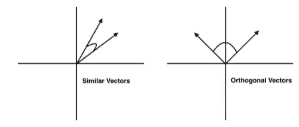
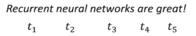
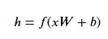
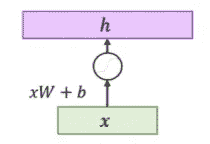
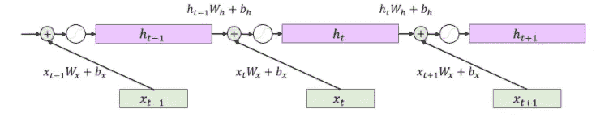

# PyTorch 中的自然语言处理(NLP)介绍

> 原文：<https://levelup.gitconnected.com/introduction-to-natural-language-processing-nlp-in-pytorch-8b7344c9dfec>


照片由 [Pietro Jeng](https://unsplash.com/@pietrozj) 在 [Unsplash](https://unsplash.com/) 上拍摄

# 单词嵌入

单词嵌入或单词向量提供了一种将单词从词汇表映射到低维空间的方法，在低维空间中，具有相似含义的单词靠得很近。让我们使用一组预先训练好的单词向量来熟悉它们的属性。存在多组预训练的单词嵌入；这里，我们使用 ConceptNet Numberbatch，它以易于使用的格式(h5)提供了一个相对较小的下载。

```
# Download word vectors
from urllib.request import urlretrieve
import os
if not os.path.isfile('datasets/mini.h5'):
    print("Downloading Conceptnet Numberbatch word embeddings...")
    conceptnet_url = '[http://conceptnet.s3.amazonaws.com/precomputed-data/2016/numberbatch/17.06/mini.h5'](http://conceptnet.s3.amazonaws.com/precomputed-data/2016/numberbatch/17.06/mini.h5')
    urlretrieve(conceptnet_url, 'datasets/mini.h5')
```

要读取 h5 文件，我们需要使用`h5py`包。如果您遵循了 PyTorch 在 1A 的安装说明，您应该已经下载了它。否则，您可以使用

```
*# If you environment isn't currently active, activate it:*
*# conda activate pytorch*pip install h5py
```

您可能需要重新打开此笔记本，安装才能生效。

下面，我们用包打开刚刚下载的`mini.h5`文件。我们从文件中提取一个 utf-8 编码的单词列表，以及它们的 300 维向量。

```
# Load the file and pull out words and embeddings
import h5pywith h5py.File('datasets/mini.h5', 'r') as f:
    all_words = [word.decode('utf-8') for word in f['mat']['axis1'][:]]
    all_embeddings = f['mat']['block0_values'][:]

print("all_words dimensions: {}".format(len(all_words)))
print("all_embeddings dimensions: {}".format(all_embeddings.shape))print("Random example word: {}".format(all_words[1337]))
```

现在，`all_words`是一列𝑉字符串(我们称之为*词汇表*)，而`all_embeddings`是一个𝑉×300 矩阵。琴弦的形式是`/c/language_code/word`——例如`/c/en/cat`和`/c/es/gato`。

我们只对英语单词感兴趣。我们使用 Python list comprehensions 来提取英语单词的索引，然后只提取英语单词(去掉六个字符的`/c/en/`前缀)及其嵌入。

```
# Restrict our vocabulary to just the English words
english_words = [word[6:] for word in all_words if word.startswith('/c/en/')]
english_word_indices = [i for i, word in enumerate(all_words) if word.startswith('/c/en/')]
english_embeddings = all_embeddings[english_word_indices]print("Number of English words in all_words: {0}".format(len(english_words)))
print("english_embeddings dimensions: {0}".format(english_embeddings.shape))print(english_words[1337])
```

单词向量的大小不如它的方向重要；数量可以被认为代表使用的频率，与单词的语义无关。在这里，我们将对语义感兴趣，所以我们*归一化*我们的向量，将每个向量除以它的长度。结果是，我们所有的单词向量的长度都是 1，因此，位于单位圆上。两个向量的点积与它们之间角度的余弦成正比，并提供了相似性的度量(余弦越大，角度越小)。



图片来自作者

```
import numpy as npnorms = np.linalg.norm(english_embeddings, axis=1)
normalized_embeddings = english_embeddings.astype('float32') / norms.astype('float32').reshape([-1, 1])
```

我们想方便地查找单词，所以我们创建了一个字典，它将我们从一个单词映射到它在单词嵌入矩阵中的索引。

```
index = {word: i for i, word in enumerate(english_words)}
```

现在我们准备好测量单词对之间的相似度。我们用 NumPy 取点积。

```
def similarity_score(w1, w2):
    score = np.dot(normalized_embeddings[index[w1], :], normalized_embeddings[index[w2], :])
    return score# A word is as similar with itself as possible:
print('cat\tcat\t', similarity_score('cat', 'cat'))# Closely related words still get high scores:
print('cat\tfeline\t', similarity_score('cat', 'feline'))
print('cat\tdog\t', similarity_score('cat', 'dog'))# Unrelated words, not so much
print('cat\tmoo\t', similarity_score('cat', 'moo'))
print('cat\tfreeze\t', similarity_score('cat', 'freeze'))# Antonyms are still considered related, sometimes more so than synonyms
print('antonym\topposite\t', similarity_score('antonym', 'opposite'))
print('antonym\tsynonym\t', similarity_score('antonym', 'synonym'))int('antonym\tsynonym\t', similarity_score('antonym', 'synonym'))
```

例如，我们还可以找到与给定单词最相似的单词

```
def closest_to_vector(v, n):
    all_scores = np.dot(normalized_embeddings, v)
    best_words = list(map(lambda i: english_words[i], reversed(np.argsort(all_scores))))
    return best_words[:n]def most_similar(w, n):
    return closest_to_vector(normalized_embeddings[index[w], :], n)print(most_similar('cat', 10))
print(most_similar('dog', 10))
print(most_similar('duke', 10))
```

我们也可以使用`closest_to_vector`来寻找我们自己创造的“附近”的单词向量。这让我们能够解决类比。比如为了解决类比“男:弟::女:？”，我们可以计算一个新的向量`brother - man + woman`:兄弟的意思，减去男人的意思，加上女人的意思。然后，我们可以询问哪些单词在嵌入空间中最接近这个新向量。

```
def solve_analogy(a1, b1, a2):
    b2 = normalized_embeddings[index[b1], :] - normalized_embeddings[index[a1], :] + normalized_embeddings[index[a2], :]
    return closest_to_vector(b2, 1)print(solve_analogy("man", "brother", "woman"))
print(solve_analogy("man", "husband", "woman"))
print(solve_analogy("spain", "madrid", "france"))
```

这三个结果都挺好的，但总的来说，这些类比的结果可能会令人失望。尝试其他类比，看看你是否能想出办法来解决你注意到的问题(例如，对`solve_analogy()`算法的修改)。

# 在深度模型中使用单词嵌入

单词嵌入很有趣，但它们的主要用途是让我们认为单词存在于连续的欧几里得空间中；然后，我们可以使用现有的具有连续数字数据的机器学习技术(如逻辑回归或神经网络)来处理文本。让我们来看一个特别简单的版本。我们将对一组电影评论进行*情感分析*:特别是，我们将尝试根据文本将电影评论分为正面或负面。

我们将使用一个简单的单词嵌入模型来完成这个任务。我们将代表一篇评论，因为*表示单词在评论中的嵌入*。然后我们将训练一个两层 MLP(一个神经网络)来将评论分为正面或负面。正如你可能猜到的那样，仅仅使用嵌入的平均值会丢弃句子中的大量信息，但是对于情感分析这样的任务，它会有惊人的效果。

如果您还没有，请下载`movie-simple.txt`文件。该文件的每一行包含

1.  数字 0(表示负数)或数字 1(表示正数)，后面跟着
2.  一个制表符(空白字符)，然后
3.  评论本身。

让我们首先读取数据文件，将每一行解析成一个输入表示及其对应的标签。同样，因为我们使用 SWEM，我们将把所有单词的单词嵌入的平均值作为我们的输入。

```
import string
remove_punct=str.maketrans('','',string.punctuation)# This function converts a line of our data file into
# a tuple (x, y), where x is 300-dimensional representation
# of the words in a review, and y is its label.
def convert_line_to_example(line):
    # Pull out the first character: that's our label (0 or 1)
    y = int(line[0])

    # Split the line into words using Python's split() function
    words = line[2:].translate(remove_punct).lower().split()

    # Look up the embeddings of each word, ignoring words not
    # in our pretrained vocabulary.
    embeddings = [normalized_embeddings[index[w]] for w in words
                  if w in index]

    # Take the mean of the embeddings
    x = np.mean(np.vstack(embeddings), axis=0)
    return x, y# Apply the function to each line in the file.
xs = []
ys = []
with open("datasets/movie-simple.txt", "r", encoding='utf-8', errors='ignore') as f:
    for l in f.readlines():
        x, y = convert_line_to_example(l)
        xs.append(x)
        ys.append(y)# Concatenate all examples into a numpy array
xs = np.vstack(xs)
ys = np.vstack(ys)print("Shape of inputs: {}".format(xs.shape))
print("Shape of labels: {}".format(ys.shape))num_examples = xs.shape[0]
```

注意，在这个设置中，作为预处理的一部分，我们的输入单词已经被转换为向量。与学习单词嵌入相反，这实质上是在整个训练过程中将我们的单词嵌入锁定在适当的位置。学习单词嵌入，无论是从零开始还是从一些预先训练的初始化中进行微调，通常都是可取的，因为它使它们专门用于特定的任务。然而，因为我们的数据集相对较小，而且我们的计算预算也有限，所以我们将放弃学习这个模型的单词嵌入。我们稍后将再次讨论这个问题。

现在我们已经解析了数据，让我们保存 20%的数据(四舍五入为整数)用于测试，其余的用于训练。我们加载的文件首先有所有的负面评价，然后是所有的正面评价，所以我们需要在将它拆分成训练和测试拆分之前对其进行洗牌。然后我们将数据转换成 PyTorch 张量，这样我们就可以将它们输入到我们的模型中。

```
print("First 20 labels before shuffling: {0}".format(ys[:20, 0]))shuffle_idx = np.random.permutation(num_examples)
xs = xs[shuffle_idx, :]
ys = ys[shuffle_idx, :]print("First 20 labels after shuffling: {0}".format(ys[:20, 0]))import torchnum_train = 4*num_examples // 5x_train = torch.tensor(xs[:num_train])
y_train = torch.tensor(ys[:num_train], dtype=torch.float32)x_test = torch.tensor(xs[num_train:])
y_test = torch.tensor(ys[num_train:], dtype=torch.float32)
```

我们可以在将每一批数据输入到模型中时分别对其进行格式化，但是为了方便起见，让我们创建一个 TensorDataset 和 DataLoader，就像我们过去对 MNIST 使用的那样。

```
reviews_train = torch.utils.data.TensorDataset(x_train, y_train)
reviews_test = torch.utils.data.TensorDataset(x_test, y_test)train_loader = torch.utils.data.DataLoader(reviews_train, batch_size=100, shuffle=True)
test_loader = torch.utils.data.DataLoader(reviews_test, batch_size=100, shuffle=False)
```

是时候在 PyTorch 中构建模型了。

```
import torch.nn as nn
import torch.nn.functional as F
```

首先，我们构建模型，组织成一个`nn.Module`。我们可以将 MLP 的输出数设为该数据集的类数(即 2)。然而，由于我们这里只有两个输出类(“正”与“负”)，我们可以生成一个输出值，将所有大于 00 的称为“正”，将所有小于 00 的称为“负”。如果我们通过 sigmoid 运算传递此输出，则值被映射到[0，1][0，1]，0.50.5 是分类阈值。

```
class SWEM(nn.Module):
    def __init__(self):
        super().__init__()
        self.fc1 = nn.Linear(300, 64)
        self.fc2 = nn.Linear(64, 1)def forward(self, x):
        x = self.fc1(x)
        x = F.relu(x)
        x = self.fc2(x)
        return x
```

为了训练模型，我们实例化模型。请注意，因为我们只进行二进制分类，所以我们使用二进制交叉熵(BCE)损失，而不是我们之前看到的交叉熵损失。为了数值稳定性，我们使用“带逻辑”的版本。

```
## Training
# Instantiate model
model = SWEM()# Binary cross-entropy (BCE) Loss and Adam Optimizer
criterion = nn.BCEWithLogitsLoss()
optimizer = torch.optim.Adam(model.parameters(), lr=0.001)# Iterate through train set minibatchs 
for epoch in range(250):
    correct = 0
    num_examples = 0
    for inputs, labels in train_loader:
        # Zero out the gradients
        optimizer.zero_grad()

        # Forward pass
        y = model(inputs)
        loss = criterion(y, labels)

        # Backward pass
        loss.backward()
        optimizer.step()

        predictions = torch.round(torch.sigmoid(y))
        correct += torch.sum((predictions == labels).float())
        num_examples += len(inputs)

    # Print training progress
    if epoch % 25 == 0:
        acc = correct/num_examples
        print("Epoch: {0} \t Train Loss: {1} \t Train Acc: {2}".format(epoch, loss, acc))## Testing
correct = 0
num_test = 0with torch.no_grad():
    # Iterate through test set minibatchs 
    for inputs, labels in test_loader:
        # Forward pass
        y = model(inputs)

        predictions = torch.round(torch.sigmoid(y))
        correct += torch.sum((predictions == labels).float())
        num_test += len(inputs)

print('Test accuracy: {}'.format(correct/num_test))
```

我们现在可以检查我们的模型已经学习了什么，看看它如何响应不同单词的单词向量:

```
# Check some words
words_to_test = ["exciting", "hated", "boring", "loved"]for word in words_to_test:
    x = torch.tensor(normalized_embeddings[index[word]].reshape(1, 300))
    print("Sentiment of the word '{0}': {1}".format(word, torch.sigmoid(model(x))))
```

试试自己的一些话吧！你也可以尝试改变模型，重新训练它，看看结果如何变化。能否修改架构以获得更好的性能？或者，你能在不牺牲太多准确性的情况下简化模型吗？如果你尝试直接对均值嵌入进行分类呢？

# 学习单词嵌入

在前面的例子中，我们使用了预先训练的单词嵌入，但没有学习它们。单词嵌入是预处理的一部分，并且在整个训练中保持不变。如果我们有足够的数据，我们可能更喜欢学习单词 embeddings 和我们的模型。预训练单词嵌入通常是在具有无监督目标的大型语料库上训练的，并且通常是非特定的。如果我们有足够的数据，我们可能更喜欢学习单词嵌入，要么从零开始，要么通过微调，因为使它们特定于任务可能会提高性能。

我们如何学习单词嵌入？为此，我们需要让它们成为我们模型的一部分，而不是加载数据的一部分。在 PyTorch 中，这样做的首选方式是使用`nn.Embedding`。像我们见过的其他`nn`层(例如`nn.Linear`)一样，`nn.Embedding`必须首先被实例化。实例化有两个必需的参数，即嵌入的数量(即词汇大小𝑉)和单词嵌入的维度(在前面的例子中是 300)。

```
VOCAB_SIZE = 5000
EMBED_DIM = 300embedding = nn.Embedding(VOCAB_SIZE, EMBED_DIM)embedding **=** nn.Embedding(VOCAB_SIZE, EMBED_DIM)
```

在引擎盖下，这创建了一个 5000×300 的单词嵌入矩阵。

```
embedding.weight.size()
```

请注意，这个矩阵基本上是一个 300 维的单词嵌入 5000 个单词中的每一个，堆叠在彼此的顶部。在这个嵌入矩阵中查找一个单词嵌入，就是简单地选择这个矩阵的特定行，对应于这个单词。

当学习单词嵌入时，`nn.Embedding`查找通常是模型模块中的第一个操作。例如，如果我们要为之前的 SWEM 模型学习单词 embeddings，该模型可能看起来像这样:

```
class SWEMWithEmbeddings(nn.Module):
    def __init__(self, vocab_size, embedding_size, hidden_dim, num_outputs):
        super().__init__()
        self.embedding = nn.Embedding(vocab_size, embedding_size)
        self.fc1 = nn.Linear(embedding_size, hidden_dim)
        self.fc2 = nn.Linear(hidden_dim, num_outputs)def forward(self, x):
        x = self.embedding(x)
        x = torch.mean(x, dim=0)
        x = self.fc1(x)
        x = F.relu(x)
        x = self.fc2(x)
        return x
```

这里，我们将模型各层的大小抽象为构造函数参数，因此我们需要在初始化时指定这些超参数。

```
model = SWEMWithEmbeddings(
    vocab_size = 5000,
    embedding_size = 300, 
    hidden_dim = 64, 
    num_outputs = 1,
)
print(model)
```

注意，通过使嵌入成为我们模型的一部分，对`forward()`函数的预期输入现在是输入句子的单词标记，所以我们也必须修改我们的数据输入管道。我们将在下一个笔记本(4B)中看到如何做到这一点。

# 递归神经网络

在深度学习的背景下，序列数据通常用递归神经网络(RNNs)建模。由于自然语言可以被看作是一个单词序列，自然神经网络通常用于自然语言处理。正如我们之前看到的全连接和卷积网络一样，rnn 使用线性和非线性变换的组合来将输入投影到更高级别的表示中，这些表示可以与其他层堆叠在一起。

## 作为序列的句子

顺序模型与我们之前看到的模型之间的关键区别在于“时间”维度的存在:句子(或段落、文档)中的单词有一个传达意义的顺序:



作者图片

在上面的示例序列中，单词“Recurrent”是𝑡=1 单词，我们用𝑤1 表示；同样，“神经”是𝑤2，等等。正如前面几节所希望给你留下的印象，将单词建模为嵌入向量𝑥1,…,𝑥𝑇通常比一键向量(𝑤1,…𝑤𝑇对应的令牌)更有利，所以我们的第一步通常是为每个输入单词做一个嵌入表查找。让我们假设 300 维的单词嵌入，并且为了简单起见，假设一个大小为 1 的小批量。

```
mb = 1
x_dim = 300 
sentence = ["recurrent", "neural", "networks", "are", "great"]xs = []
for word in sentence:
    xs.append(torch.tensor(normalized_embeddings[index[word]]).view(1, x_dim))

xs = torch.stack(xs, dim=0)
print("xs shape: {}".format(xs.shape))
```

请注意，我们将输入格式化为(单词×小批×嵌入尺寸单词×小批×嵌入尺寸)。这是 PyTorch RNNs 的首选输入顺序。

假设我们想要处理这个例子。在我们之前的情感分析例子中，我们只是取了一段时间内的平均嵌入，将输入视为一个“单词包”对于简单的问题，这可以出奇地好，但是正如您可能想象的那样，句子中单词的顺序通常很重要，有时，我们也希望能够对这种时间意义进行建模。输入 RNNs。

## 回顾:全连接层

在我们介绍 RNN 之前，让我们再次回顾一下我们在逻辑回归和多层感知器示例中使用的全连接层，在符号上有一些变化:



作者图片

对于隐藏状态，我们将把全连接图层的结果称为ℎ，而不是𝑦。变量𝑦通常保留给神经网络的最后一层；因为逻辑回归是单层的，所以使用𝑦就可以了。然而，如果我们假设有一个以上的层，更常见的是将中间表示称为ℎ.注意，我们也使用𝑓(来表示非线性激活函数。过去，我们将𝑓()视为 ReLU，但这也可能是𝜎()或 tanh()非线性。可视化:



作者图片

这里要注意的关键是，我们用线性变换(用𝑊W 和𝑏b)投射输入𝑥x，然后对输出应用非线性，在训练期间给我们ℎh.，我们的目标是学习𝑊W 和𝑏b.

## 基本的 RNN

与我们之前看到的使用全连接图层的示例不同，顺序数据具有多个输入𝑥1,…,𝑥𝑇，而不是单个𝑥.我们需要根据 RNN 的情况调整我们的模型。虽然有几种变体，但 RNN 的一种常见基本配方是埃尔曼 RNN，如下所示*:

ℎ𝑡=tanh((𝑥𝑡𝑊𝑥+𝑏𝑥)+(ℎ𝑡−1𝑊ℎ+𝑏ℎ))

其中 tanh()t 是双曲正切，一个非线性激活函数。RNNs 按顺序一次处理一个单词(𝑥𝑡)，在每个时间步产生一个隐藏状态ℎ𝑡ht。上面等式的前半部分应该看起来很熟悉；与全连接层一样，我们对每个输入𝑥𝑡进行线性变换，然后应用非线性。请注意，我们在每个时间步都应用了相同的线性变换(𝑊𝑥，𝑏𝑥)。不同之处在于，我们还对之前隐藏的状态ℎ𝑡−1 应用了单独的线性变换(𝑊ℎ，𝑏ℎ),并将其添加到我们的投影输入中。这种反馈被称为*循环*连接。

RNN 架构中的这些有向循环赋予了它们对时间动态进行建模的能力，使它们特别适合对序列(例如文本)进行建模。我们可以将 RNN 图层可视化如下:


作者图片

我们可以在时间中展开一个 RNN，让它的时序性更加明显:



作者图片

您可以将这些循环连接视为允许模型在计算当前输入的隐藏状态时考虑序列的先前隐藏状态。

*注意:我们实际上不需要两个单独的偏差𝑏𝑥和𝑏ℎ，因为你可以将两个偏差合并成一个单一的可学习参数𝑏.然而，单独编写它有助于清楚地表明我们正在对𝑥𝑡和ℎ𝑡−1.执行线性转换说到组合变量，我们也可以通过将𝑥𝑡xt 和ℎ𝑡−1 串联成单个向量𝑧𝑡，然后执行单个矩阵乘𝑧𝑡𝑊𝑧+𝑏来表达上述操作，其中𝑊𝑧本质上是𝑊𝑥和𝑊ℎ串联。事实上，这就是实现的“官方”RNNs 模块的数量，因为单独矩阵乘法运算数量的减少使得计算效率更高。这些都是实现细节。

## PyTorch 的 RNNs

我们如何在 PyTorch 中实现 RNN？有相当多的方法，但让我们首先从零开始建立埃尔曼 RNN，使用输入序列“递归神经网络是伟大的”。

```
# As always, import PyTorch first
import numpy as np
import torch
```

在 RNN 中，我们将输入𝑥𝑡和之前隐藏的状态ℎ𝑡−1 都投影到某个隐藏的维度，我们将选择该维度为 128。为了执行这些操作，我们要定义一些我们将要学习的变量。

```
h_dim = 128# For projecting the input
Wx = torch.randn(x_dim, h_dim)/np.sqrt(x_dim)
Wx.requires_grad_()
bx = torch.zeros(h_dim, requires_grad=True)# For projecting the previous state
Wh = torch.randn(h_dim, h_dim)/np.sqrt(h_dim)
Wh.requires_grad_()
bh = torch.zeros(h_dim, requires_grad=True)print(Wx.shape, bx.shape, Wh.shape, bh.shape)
```

为了方便起见，我们为 RNN 的一个时间步长定义一个函数。该函数采用当前输入𝑥𝑡和先前隐藏的状态ℎ𝑡−1，执行线性变换𝑥𝑊𝑥+𝑏𝑥和ℎ𝑊ℎ+𝑏ℎ，然后是双曲正切非线性。

```
def RNN_step(x, h):
    h_next = torch.tanh((torch.matmul(x, Wx) + bx) + (torch.matmul(h, Wh) + bh))return h_next
```

我们的 RNN 的每一步都需要输入(即单词表示)和之前的隐藏状态(之前序列的总结)。注意，在句子的开头，我们没有先前的隐藏状态，所以我们将其初始化为某个值，例如，全零:

```
# Word embedding for first word
x1 = xs[0, :, :]# Initialize hidden state to 0
h0 = torch.zeros([mb, h_dim])
```

为了采取 RNN 的一次性步骤，我们调用我们编写的函数，在𝑥1 和ℎ0.传递在这种情况下，

```
# Forward pass of one RNN step for time step t=1
h1 = RNN_step(x1, h0)print("Hidden state h1 dimensions: {0}".format(h1.shape))
```

我们可以再次调用`RNN_step`函数，从我们的 RNN 中获得下一个时间步长输出。

```
# Word embedding for second word
x2 = xs[1, :, :]# Forward pass of one RNN step for time step t=2
h2 = RNN_step(x2, h1)print("Hidden state h2 dimensions: {0}".format(h2.shape))
```

我们可以根据需要继续展开 RNN。对于每一步，我们馈入当前输入(𝑥𝑡)和先前的隐藏状态(ℎ𝑡−1)以获得新的输出。

## 使用`torch.nn`

在实践中，很像全连接和卷积层，我们通常不像上面那样从头实现 RNNs，而是依赖于更高级别的 API。PyTorch 在`torch.nn`库中实现了 RNNs。

```
import torch.nnrnn = nn.RNN(x_dim, h_dim)
print("RNN parameter shapes: {}".format([p.shape for p in rnn.parameters()]))
```

请注意，由`torch.nn`创建的 RNN 产生的参数与我们从上面的例子中得到的参数具有相同的维度。

为了使用 RNN 执行向前传递，我们将整个输入序列传递给`forward()`函数，该函数返回每个时间步长的隐藏状态(`hs`)和最终的隐藏状态(`h_T`)。

```
hs, h_T = rnn(xs)print("Hidden states shape: {}".format(hs.shape))
print("Final hidden state shape: {}".format(h_T.shape))
```

我们如何处理这些隐藏状态呢？这取决于型号和任务。就像多层感知器和卷积神经网络一样，rnn 也可以堆叠在多个层中。在这种情况下，输出ℎ1,…,ℎ𝑇是下一层的顺序输入。如果 RNN 层是最终层，则ℎ𝑇或ℎ1,…,ℎ𝑇的平均值/最大值可以用作数据序列的汇总编码。预测的结果也会对 RNN 产出的最终用途产生影响。

## 门控 RNNs

虽然我们刚刚探索的 rnn 可以成功地模拟简单的序列数据，但它们往往难以处理较长的序列，其中[消失梯度](https://en.wikipedia.org/wiki/Vanishing_gradient_problem)是一个特别大的问题。多年来已经提出了许多 RNN 变体来缓解这个问题，并且经验表明这些变体更加有效。特别是，长短期记忆(LSTM)和门控循环单元(GRU)最近在深度学习中得到了广泛的应用。我们不打算在这里详细讨论它们与普通 rnn 在结构上有什么不同；一个奇妙的总结可以在这里找到[。注意,“RNN”作为一个名字有点超载:它既可以指我们之前讨论过的基本递归模型，也可以指一般的递归模型(包括 LSTMs 和 GRUs)。](https://colah.github.io/posts/2015-08-Understanding-LSTMs/)

创建 LSTMs 和 GRUs 图层的方法与创建基本 RNN 图层的方法大致相同。同样，不要自己实现它，建议使用`torch.nn`实现，尽管我们强烈建议您查看源代码，这样您就能理解幕后发生了什么。

```
lstm = nn.LSTM(x_dim, h_dim)
print("LSTM parameters: {}".format([p.shape for p in lstm.parameters()]))gru = nn.GRU(x_dim, h_dim)
print("GRU parameters: {}".format([p.shape for p in gru.parameters()]))
```

# 火炬报

就像 PyTorch 拥有用于计算机视觉的 [Torchvision](https://pytorch.org/docs/stable/torchvision/index.html) 一样，PyTorch 也拥有用于自然语言处理的 [Torchtext](https://torchtext.readthedocs.io/en/latest/) 。与 Torchvision 一样，Torchtext 拥有大量流行的 NLP 基准数据集，涵盖广泛的任务(如情感分析、语言建模、机器翻译)。它也有一些预先训练好的单词嵌入，包括流行的单词表示全局向量(GloVe)。如果您需要加载自己的数据集，Torchtext 有许多有用的容器，可以使数据管道更容易。

您需要安装 TorchText 来使用它:

```
*# If you environment isn't currently active, activate it:*
*# conda activate pytorch*pip install torchtext
```

一旦你理解了这句话，你就已经完成了 PyTorch 中自然语言处理(NLP)入门的所有步骤

以下是您今天的成就总结:

*   **单词嵌入**
*   **在深度模型中使用单词嵌入**
*   **学习单词嵌入**
*   ***递归神经网络(RNNs):句子作为序列，复习:全连接层，基本 RNN，PyTorch 中的 RNNs，使用 torch.nn，门控 RNNs，***
*   **火炬文本**