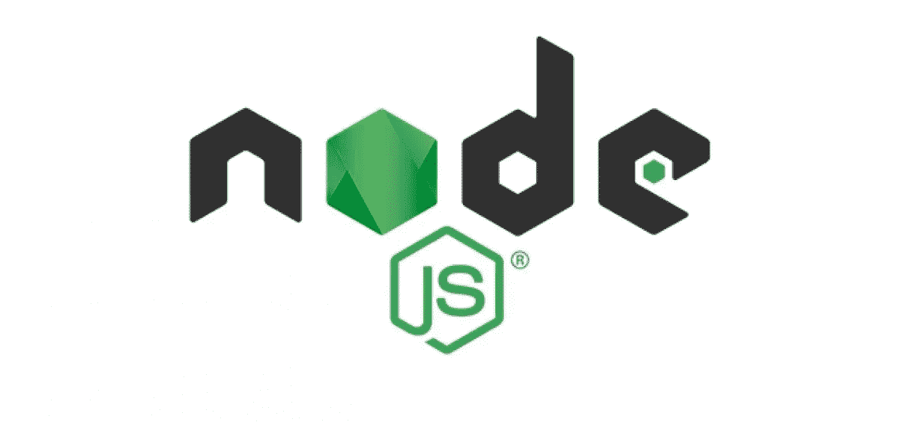
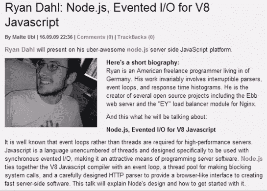
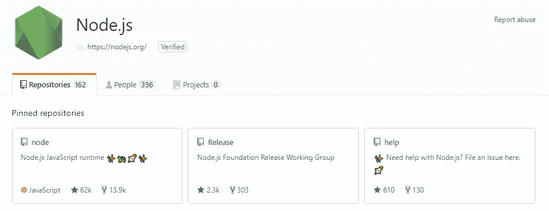
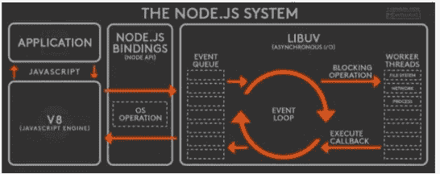

# Node.js 简介

> 原文：<https://levelup.gitconnected.com/introduction-to-nodejs-fb9a6f540be9>

Node.js 是一个开源的跨平台 JavaScript 运行时环境。它运行在 V8 JavaScript 引擎(Google Chrome 的核心)上，允许 JavaScript 在浏览器之外的任何平台上运行。JavaScript 代码可以在任何安装了 Nodejs 的系统上运行。



# **Nodejs 背景**

Node.js 的创建者 Ryan Dhal 在 2009 年的 JS-EU 会议上首次将 node . JS 引入社区。他发现了 I/O 阻塞的问题，以及 JavaScript 如何成为让主流程序员在服务器上进行异步编程的完美语言。他的演讲受到了起立鼓掌欢迎。



Ryan Dhal 在 2009 年 JS-EU 会议上的发言人简介

在击败 Ruby on Rails 和 jQuery 等重量级项目后，Node.js 成为 Github 上最受欢迎的项目之一。



github 上的节点报告

# 跨平台

Node.js 是跨平台的。它可以在 Windows、Unix 和 Mac OS X 上运行。

# NPM(节点包经理)

与节点一起自动安装

命令:`npm help` | `install` | `ls` | `search`

软件包可以通过-g 进行本地或全局安装(对于将软件包用作命令行工具很有用)

Npm 安装将创建一个目录。/节点模块/

# **Nodejs 构建模块**

一个事件循环和一个低级 I/O API 调用 Libuv，Google Chrome 的 V8 和自定义 C++，以及专门为 Node.js 平台本身开发的 JavaScript 代码。这三样东西组成了 Nodejs 平台。



# 事件循环

事件循环通过将操作卸载到系统内核(操作系统的核心)，允许 Node.js 执行非阻塞 I/O 操作，即使 JavaScript 是单线程的。当这些操作中的一个完成时，内核告诉 Node.js 适当的回调可以被添加到轮询队列中以最终被执行。

# **node . js 启动时**

1.  初始化事件循环
2.  处理提供的输入脚本。这可以进行异步 API 调用，调度定时器，或者调用`process.nextTick()`。
3.  开始处理事件循环，直到没有更多的事件可用

# **事件循环结构**

由阶段组成。每个阶段都有一个 FIFO(先进先出)回调队列来执行。

在每个阶段，Node.js 运行特定于该阶段的任何操作，然后在该阶段的队列中运行回调，直到执行了空队列或最大数量的回调，然后移动到下一个阶段。

由于任何操作都可能调度更多的操作，并且在轮询阶段处理的新事件由内核排队，所以轮询事件可以在处理轮询事件的同时排队。

在事件循环的每次运行之间，Node.js 检查它是否在等待任何异步 I/O 或计时器，如果没有，就彻底关闭。

**定时器:**执行`setTimeout()`和`setInterval()`安排的回调。计时器指定阈值，在该阈值之后可以执行所提供的回调，而不是人们希望它运行的确切时间。

**挂起的 I/O 回调**:执行除关闭回调、定时器调度的回调和`setImmediate`之外的几乎所有回调。

**闲置，准备:**仅供内部使用。

**轮询:**检索新的 I/O 事件；节点将在适当的时候阻塞这里。

两个主要功能:

1.  为超过阈值的计时器执行脚本，然后
2.  处理轮询队列中的事件。

# 模块和包

模块是可以由 Node.js 使用`require()`加载的任何文件或目录。

包是一个由`package.json`描述的文件或目录。

在 Node.js 模块系统中，每个文件都被视为一个单独的模块

```
// mymodule.jsconst anotherModule = require(‘anotherModule’)console.log(module);
```

在每个模块中，模块自由变量是对代表当前模块的对象的引用。

当一个文件直接从 Node.js 运行时，`require.main`被设置为它的模块。这意味着可以通过测试`require.main===module`直接确定文件是否已经运行。

对于一个`file foo.js`，如果通过节点`foo.js`运行则为`true`，如果通过`require(‘./foo’)`运行则为 false，因为模块提供了一个 filename 属性，可以通过检查`require.main.filename`获得当前 app 的入口点。

# **核心模块**

核心模块被编译成节点二进制分布，并在节点进程启动时自动加载。尽管如此，为了在您的应用程序中使用，这些仍然需要被导入。

一些核心模块: **http，url，querystring，path，fs，util。**

# 实践中的 Node.js

**JavaScript**

**分型:**动态，弱

**多范例:**命令式、面向对象、函数式、事件驱动。

**标准:** ECMAScript — ES'2015 (ES6):类、模块、生成器、箭头函数、承诺。

**受**影响:Java，C，Python。

**原始类型**:数字、字符串、布尔、空、未定义。

# 例子

```
var x = 10.7; // hoisted at global or function levelconst y = “hello”; // block-level scopedvar arr = [1,2,3];for(var i = 0; i<arr.length; i++) {
  console.log(arr[i]);
}
```

# 学习途径和资源

要学习 Node.js，你需要 3 样东西。

*   JavaScript 知识
*   了解服务器端如何工作
*   节点. js

**教程**

[学习 Node.js —最佳 Node.js 教程](https://gitconnected.com/learn/node-js)
[通过视频截屏一周学习 Node JS](https://ilovecoding.org/courses/learn-node-js-in-a-week/)
[Node school](http://nodeschool.io/)
[Felix 的 Node.js 指南](http://nodeguide.com/)
[Node Tuts](http://nodetuts.com/)
[Node . JS 适合初学者](http://net.tutsplus.com/tutorials/javascript-ajax/node-js-for-beginners/)
Thinkful [Web 开发训练营](https://www.thinkful.com/bootcamp/web-development/flexible/)|[Node 技能课程](https://www.thinkful.com/courses/learn-nodejs-online/)

**书籍**

[Node 初学者书籍](http://nodebeginner.org/)
[熟练掌握 Node.js](http://visionmedia.github.com/masteringnode/)
[启动并运行 Node.js](http://chimera.labs.oreilly.com/books/1234000001808/index.html)
[Node.js 在行动](http://www.manning.com/cantelon/)
[粉碎 Node . js:JavaScript ever wher](http://amzn.com/B008Z5OEUY)
[Node . js&co .(德文)](http://www.amazon.de/dp/389864829X)
[最详细的免费 JavaScript 书籍列表](http://jsbooks.revolunet.com/)