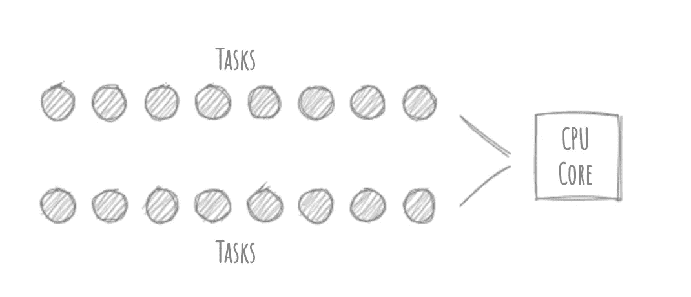
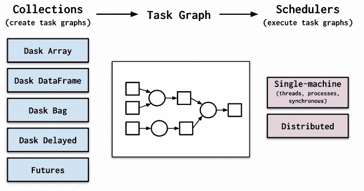
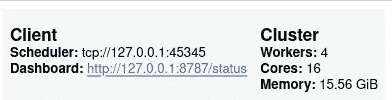
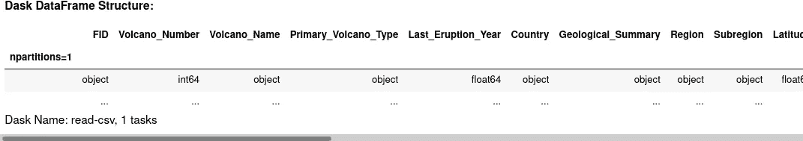
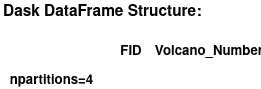
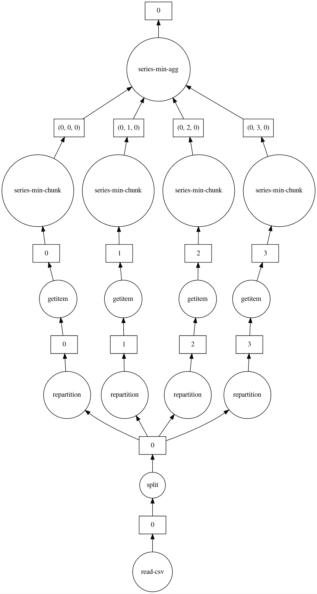

# 大数据分析中的并行计算简介(第 1 部分)

> 原文：<https://levelup.gitconnected.com/introduction-to-parallel-computing-in-big-data-analysis-part-1-959024183b73>

## 使用 Dask 运行并行和分布式人工智能任务

人工智能(AI)任务通常涉及来自多个输入源的大量数据。这些数据集通常太大、太多样化，以至于单台机器无法正确有效地处理。因此，通常通过并行化和批处理这些任务来寻求机器集群。


莫里茨·金德勒在 [Unsplash](https://unsplash.com?utm_source=medium&utm_medium=referral) 上拍摄的照片

因此，这篇文章将向您介绍使用 Dask 的并行计算。此外，我们将使用一个气候科学的例子来说明本文中讨论的一些要点。事不宜迟，我们开始吧！

**注**:这是我致力于探索大数据分析中的并行计算，尤其是新兴领域地理信息的两部分系列文章的第**篇**篇。第二部马上就要来了，一定要跟着来获取最新的更新！

# 目录:

1.  并行计算简介
2.  Dask 是什么？
3.  正在创建集群
4.  Dask 数据帧
5.  Dask 中的并行

# 并行计算简介

***并行*** ***计算*** 允许将任务拆分成可并行执行的批次，以最大限度地利用资源，如您的 CPU、GPU 或 ram。

然而，在大多数情况下，人们倾向于将术语**并行**与**并发**混淆，尽管它们有所不同。我们不会讨论这两者之间的区别，但是如果你想知道更多，你可以看看这个[帖子](https://medium.com/mineiros/how-to-use-multithreading-and-multiprocessing-a-beginners-guide-to-parallel-and-concurrent-a69b9dd21e9d)。



并行计算批处理较大的任务

本质上，并发和并行在概念上是相同的。但是关键的区别在于这样一个事实，即**并发**线程和/或进程不一定必须同时**并行**运行*。*由此可见，所有的并行编程都是并发的，但不是所有的并发编程都是并行的。

现在我们已经正式定义了什么是并行计算，让我们介绍一下我们的并行计算库 Dask。

# Dask 是什么？

Dask 是一个灵活的并行计算库，它提供了一种动态并行任务调度方法。它能够处理一些更流行的大数据格式集合，比如`dask.array`和`dask.dataframe`。



Dask 设计范例(来源:【Dask.org】T2)

如上图所示，您可以创建和定制自己的任务图，在任务图中您可以定义并行化进程的外观。Dask 还相对容易地将并行进程从一台笔记本电脑扩展到数百台机器。

现在我们已经对 Dask 及其设计概念有了一些了解，让我们开始看看这些想法是如何付诸实践的。

# 正在创建集群

首先，我们必须将 Dask 安装到我们的机器中。我建议您使用 conda 虚拟环境来防止弄乱您机器的 Python 发行版。

```
conda install dask
```

如果您想使用 pip，您可以运行以下命令。

```
python -m pip install "dask[complete]"
```

接下来，我们需要安装本教程所需的一些其他依赖项。

```
conda install aiohttp
conda install graphviz
pip install graphviz #System-wide installation of graphviz
```

现在，我们可以开始创建集群了。

**但是，什么是集群呢？**集群是一组协同工作的计算机，因此它们可以被视为一个系统。

> 在 Dask 中，有不同类型的集群。例如， [LocalCluster](https://distributed.dask.org/en/latest/local-cluster.html) 有时可以指您自己的笔记本电脑或台式电脑， [PBSCluster](http://jobqueue.dask.org/) 指您的高性能计算机(HPC)，或者 [Kubernetes Cluster](http://kubernetes.dask.org/) 指在云上运行和托管的机器。

每个集群都有一定数量的计算资源，称为“工作线程”，它们将被分配一定数量的 CPU、RAM 或 GPU 计算。集群由 Dask 调度系统的单一接口控制，无论您使用哪种类型的集群，它的实现语法都非常相似！

让我们首先初始化我们自己的 LocalCluster，并将其连接到客户机。

```
from dask.distributed import Client, LocalClustercluster = LocalCluster()
client = Client(cluster)client
```



您的本地集群

您将能够看到新初始化的本地集群总共有 4 个工作线程、16 个 CPU 内核和 16GB RAM 为您服务！

做得好！如果您想在自己的机器之外初始化一个更大的集群，可以使用类似的语法。

# Dask 数据帧

如果您熟悉 Pandas，那么您也应该熟悉它的原生数据类型 Dataframe。Dataframe 通常用于处理大数据分析，包括我们将要展示的这个。

> 我们将使用的数据集描述了世界各地的历史火山活动事件。

让我们导入`dask.dataframe`(类似于`pandas.dataframe`)并定义我们将要用来下载 CSV 文件的服务器和查询字符串。

```
import dask.dataframe as ddserver = '[https://webservices.volcano.si.edu/geoserver/GVP-VOTW/ows?'](https://webservices.volcano.si.edu/geoserver/GVP-VOTW/ows?')
query = 'service=WFS&version=2.0.0&request=GetFeature&typeName=GVP-VOTW:Smithsonian_VOTW_Holocene_Volcanoes&outputFormat=csv'
```

接下来，我们将把 CSV 加载到我们的`dask.dataframe`对象中，如下所示。

```
df = dd.read_csv(server+query, blocksize=None)df
```



Dask 数据帧结构

在这里，您只能查看元数据。在执行特定查询之前，不会显示实际记录。

现在，让我们尝试将数据帧分成 4 个部分，这样我们就可以将它们加载到本地集群的 16 个 CPU 核心中的 4 个。

```
df = df.repartition(npartitions=4)df
```



在划分数据帧后

您现在会注意到分区的数量从 1 增加到了 4！我们已经成功完成了第一轮并行化。

# Dask 中的并行

现在，让我们执行一个简单的任务，使用下面的调用找出最后一次喷发事件的最小年份。

```
last_eruption_year_min = df.Last_Eruption_Year.min()
```

但是，在检索实际的年份值之前，让我们先想象一下并行性是如何与之前分区的数据帧(npartitions=4)一起工作的

```
last_eruption_year_min.visualize(format='png')
```



我们的并行性是如何工作的

上图显示了我们的并行系统(自下而上):

1.  读取 CSV 并将其加载到数据帧中，
2.  将我们的数据帧分成 4 个独立的分区，
3.  对于 4 个分区中的每一个，执行 min()操作，
4.  结合结果，
5.  执行最后的 min()运算，并
6.  输出值

# 结论

这篇文章展示了如何在大数据分析中执行并行计算，尤其是在地理任务中。我将继续这个系列，展示一些使用 Dask 的更具挑战性的并行概念，包括如何并行化函数；所以一定要关注以获取最新通知！

***做订阅我的邮件简讯:***[*【https://tinyurl.com/2npw2fnz】*](https://tinyurl.com/2npw2fnz)****在这里我定期用通俗易懂的语言和漂亮的可视化总结 AI 研究论文。****

# *进一步阅读*

*[](https://towardsdatascience.com/geopandas-hands-on-building-geospatial-machine-learning-pipeline-9ea8ae276a15) [## Geopandas 实践:构建地理空间机器学习管道

towardsdatascience.com](https://towardsdatascience.com/geopandas-hands-on-building-geospatial-machine-learning-pipeline-9ea8ae276a15) [](https://towardsdatascience.com/interactive-geospatial-ai-visualization-in-jupyter-notebook-f3223f534327) [## Jupyter 笔记本中的交互式地理空间人工智能可视化

towardsdatascience.com](https://towardsdatascience.com/interactive-geospatial-ai-visualization-in-jupyter-notebook-f3223f534327) [](http://gallery.pangeo.io/repos/TomAugspurger/pangeo-dask-gateway/index.html) [## Pangeo & Dask 网关。— Pangeo 画廊文件

### 如何在 Pangeo Hubs 和 Binders 上使用 Dask Gateway 进行可扩展计算。

gallery.pangeo.io](http://gallery.pangeo.io/repos/TomAugspurger/pangeo-dask-gateway/index.html)*