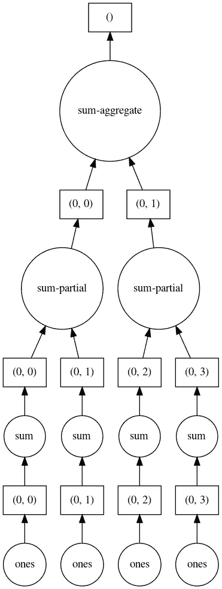

# 大数据分析中的并行计算介绍(第二部分)

> 原文：<https://levelup.gitconnected.com/introduction-to-parallel-computing-in-big-data-analysis-part-2-62f761c9efcf>

## 使用 Dask 运行并行和分布式人工智能任务

人工智能(AI)任务通常涉及来自多个输入源的大量数据。这些数据集通常太大、太多样化，以至于单台机器无法正确有效地处理。因此，通常通过并行化和批处理这些任务来寻求机器集群。


莫里茨·金德勒在 [Unsplash](https://unsplash.com?utm_source=medium&utm_medium=referral) 上拍摄的照片

因此，这篇文章将向您介绍由 Pangeo 使用 Dask(一个用于并行计算的 Python 库)标准化的并行计算。此外，我们将使用一个气候科学的例子来说明本文中讨论的一些要点。事不宜迟，我们开始吧！

**注意:**这是我致力于探索大数据分析中的并行计算，尤其是新兴的地理信息领域的两部分系列文章的第二篇。在继续之前，请确保您已经阅读了下面的第一部分！

[](/introduction-to-parallel-computing-in-big-data-analysis-part-1-959024183b73) [## 大数据分析中的并行计算简介(第 1 部分)

### 使用 Dask 运行并行和分布式人工智能任务

levelup.gitconnected.com](/introduction-to-parallel-computing-in-big-data-analysis-part-1-959024183b73) 

# 目录:

1.  概述
2.  Dask 阵列
3.  复变函数
4.  Dask 归约
5.  Dask 延迟

# 概述

在前一篇文章中，我们讨论了并行计算的基本原理、建立集群的方法以及如何并行化数据帧操作。

在这篇文章中，我们将通过理解除了数据集之外，函数如何被减少和延迟以实现并行性来更深入地挖掘这一思想。

我们开始吧！

# Dask 阵列

dask 数组看起来和感觉起来很像 numpy 数组。然而，dask 数组不直接保存任何数据，而是充当占位符，直到最终计算需要它。这种类型的操作被称为“懒惰”，因为它允许在将复杂的计算发送给调度程序执行之前象征性地构造这些计算。

让我们首先创建一个形状为(1000，4000)的 dask 数组。

```
import dask.array as dashape = (1000, 4000)
ones = da.ones(shape)ones
```


Dask 阵列

与 dataframe 中的分区类似，我们也可以使用指定的形状在 dask 数组中创建“块”,如下所示:


Dask 数组块(来源:[pangeo.org](http://gallery.pangeo.io/repos/pangeo-data/pangeo-tutorial-gallery/dask.html#Dask-Arrays))

```
chunk_shape = (1000, 1000)
ones = da.ones(shape, chunks=chunk_shape)ones
```


分块 dask 阵列

让我们试着总结一下数组的元素，并想象分块是如何帮助我们并行的。

```
sum_of_ones = ones.sum()
sum_of_ones.visualize(format='png')
```



按区块排列的 Dask 阵列并行度

与 dask 数据帧中的分区类似，dask 阵列中的并行性包括:

1.  将 1 的数组分成四个块，
2.  对每个组块执行求和，
3.  总结他们，和
4.  输出结果

# 复变函数

现在，您已经熟悉了如何使用 Dask 并行化数据集(数据帧和数组),让我们构建一个复杂的函数，看看如何让它并行运行。

```
complex_fn = (ones * ones[::-1, ::-1]).sum()
complex_fn.visualize(format='png')
```


复杂函数的任务图

上面的任务图看起来很复杂。我甚至不会试图跟踪并行任务中完成的单个操作。尽管如此，这就是 Dask 的美妙之处:您能够定义一些复杂的函数，并且该库将处理实际的并行性如何在幕后工作。

# Dask 归约

归约将预定义的函数应用于数组。例如，让我们定义一个函数如下:

```
import numpy as npones_reduce = (np.cos(ones)**2).mean(axis=1)
ones_reduce
```


数组的简化

dask 中的归约方法仍然遵循一种“懒惰”模式，在这种模式下，数组不保存任何值，直到在计算过程中真正需要时才保存。

# Dask 延迟

如果您想控制任务图表的外观，该怎么办？Dask delayed 通过授予您对并行任务的完全控制权来实现这一点。

让我们来看一组简单的除法、乘法和加法函数:

```
import timedef div(x, y):
    time.sleep(0.1)
    return x / y def mul(x, y):
    time.sleep(0.1)
    return x * ydef add(x, y):
    time.sleep(0.2)
    return x + y
```

您可能会注意到，上面的三个函数彼此独立，通过巧妙的设计，它们可以很容易地并行化。

首先，我们在 dask 中设置这些函数的延迟版本:

```
import daskdiv = dask.delayed(div)
mul = dask.delayed(mul)
add = dask.delayed(add)
```

然后我们依次调用这些函数:

```
x = div(4,2)
y = mul(2,3)
z = add(x, y)z
```

Dask 将在幕后执行并行处理。您可以直观地观察任务图的外观。

```
z.visualize(format='png', rankdir='LR')
```


Dask 中的函数并行性

从上图中，我们可以看到，在执行最后的加法运算之前，除法和乘法函数是并行运行的。

# 结论

就是这样！现在，您可以在更大的集群集中执行更复杂的并行任务。你现在怎么看待排比？

***做订阅我的邮件简讯:***[*【https://tinyurl.com/2npw2fnz】*](https://tinyurl.com/2npw2fnz)****在这里我定期用通俗易懂的语言和漂亮的可视化总结 AI 研究论文。****

# *进一步阅读*

*[](https://towardsdatascience.com/geopandas-hands-on-building-geospatial-machine-learning-pipeline-9ea8ae276a15) [## Geopandas 实践:构建地理空间机器学习管道

towardsdatascience.com](https://towardsdatascience.com/geopandas-hands-on-building-geospatial-machine-learning-pipeline-9ea8ae276a15) [](https://towardsdatascience.com/interactive-geospatial-ai-visualization-in-jupyter-notebook-f3223f534327) [## Jupyter 笔记本中的交互式地理空间人工智能可视化

towardsdatascience.com](https://towardsdatascience.com/interactive-geospatial-ai-visualization-in-jupyter-notebook-f3223f534327) [](http://gallery.pangeo.io/repos/TomAugspurger/pangeo-dask-gateway/index.html) [## Pangeo & Dask 网关。— Pangeo 画廊文件

### 如何在 Pangeo Hubs 和 Binders 上使用 Dask Gateway 进行可扩展计算。

gallery.pangeo.io](http://gallery.pangeo.io/repos/TomAugspurger/pangeo-dask-gateway/index.html)*