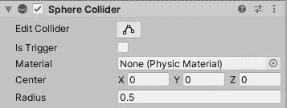
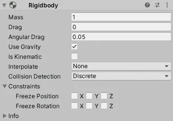
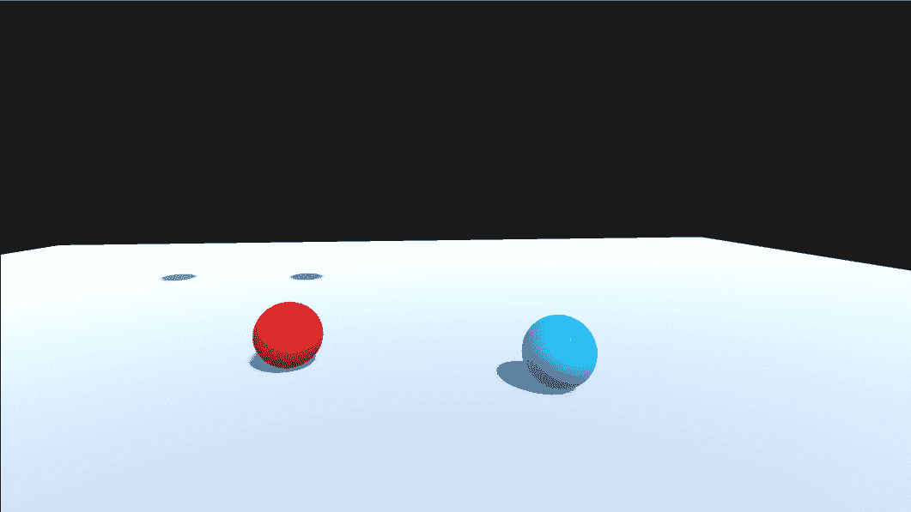
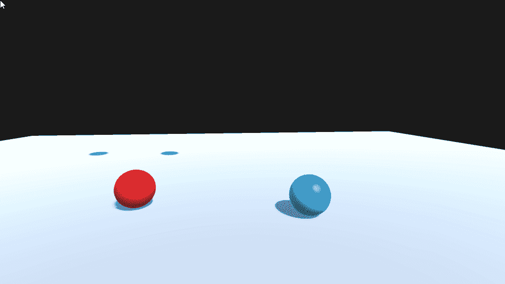
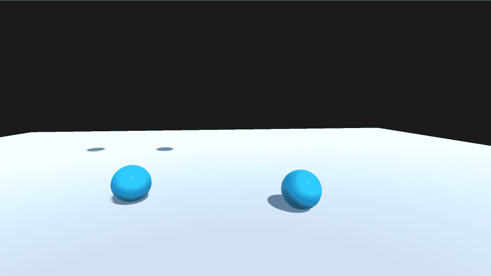
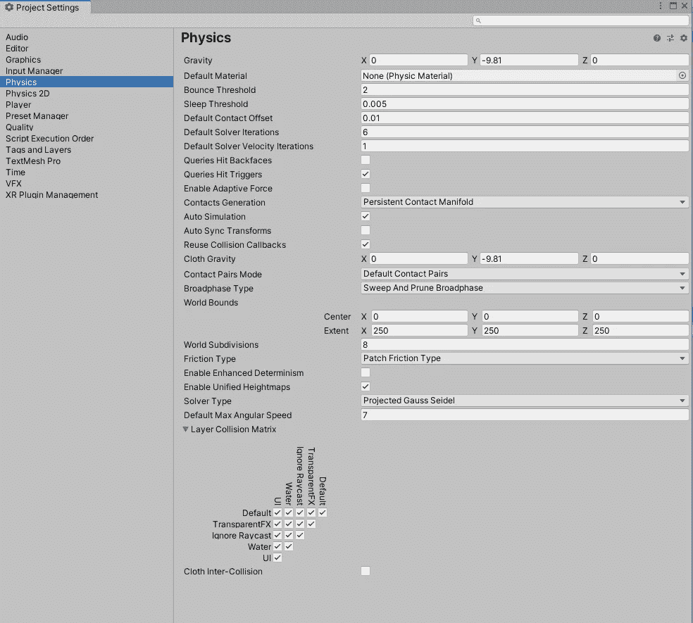
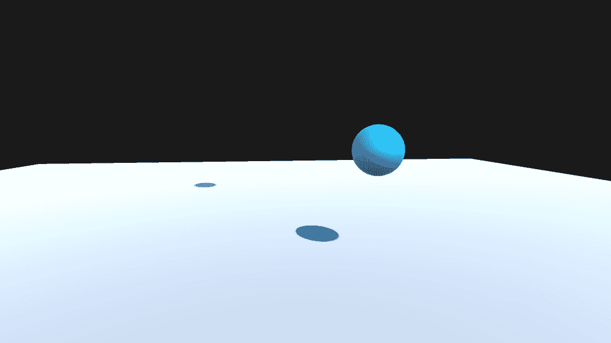
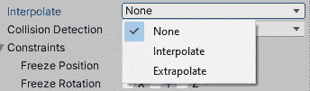
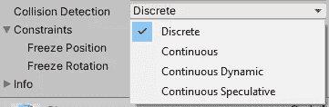

# Unity 中的物理学导论

> 原文：<https://levelup.gitconnected.com/introduction-to-physics-in-unity-1113ff12397b>

Unity 中的物理由内置的物理引擎处理。Unity 中内置的物理引擎处理游戏对象交互的物理过程以及各种效果，如重力、加速度、碰撞等。

# 碰撞机

如果你想让游戏对象检测到与场景中其他游戏对象的碰撞，就需要一个碰撞器。但是如果你想让带有碰撞器的游戏对象受到物理影响，或者想知道碰撞如何影响其他游戏对象，你需要一个刚体。

## 是触发器

当启用 Is Trigger 时，它会将碰撞器变成一个触发体，允许其他游戏对象通过它，并且当刚体进入、停留或退出触发体时，它会发送一个 OnTriggerEnter、OnTriggerStay 或 OnTriggerExit 消息，而不是记录碰撞。

## 材料

如果你想让对撞机有任何独特的物理材料。一种物理材质允许你调整碰撞器的摩擦力和弹力。

# 刚体

Unity 中的物理引擎只知道，如果刚体组件被添加到游戏对象中，对象就意味着被物理作用，如果没有刚体组件，引擎就认为游戏对象是静态和不动的。当静态游戏对象(没有刚体)移动时，它会导致物理引擎重新运行计算，以优化场景中的静态对象。因此，确保在任何将要移动的游戏对象上有一个刚体，以使 Unity 尽可能最佳地运行。在 OnCollision 或 OnTrigger 事件期间，至少在两个相互作用的对象之一上也需要刚体。刚体组件有许多属性可以调整，以使游戏对象对力和碰撞做出不同的反应。

## 团

物理引擎测量的游戏物体上刚体的质量，以千克为单位。就像在现实生活中，质量较大的游戏对象对质量较小的游戏对象有更大的反应。

蓝色球体的质量更大

## 拖

拖动属性是游戏对象在场景中移动时受到的阻力大小。如果阻力大于 0，它将最终导致游戏对象停止，除非施加恒定的力，在这种情况下，阻力将阻碍其运动并使其减速(即下落更慢)。

红色球体的阻力大于 0

## 角阻力

角阻力的工作方式非常类似于阻力，但只对游戏对象的旋转速度施加阻力，这在大多数情况下类似于阻力。当游戏物体移动而不旋转时，就像垂直下落一样。

黄色表示阻力= 1，红色表示角阻力= 1

## 利用重力

当打开时，游戏对象将被 Unity 设置中定义的重力所吸引。默认设置是 y 轴上的-9.81，可以在“物理”下的项目设置中更改。

## 是运动学的

运动学控制物理是否影响游戏对象。关闭时，游戏对象受物理影响，打开时，游戏对象只能通过代码或动画改变变换来移动。如果游戏对象大部分时间是静态的，但在动画或脚本中会移动，那么请确保添加一个刚体并启用“运动学”,以便引擎知道对象可能会移动，并且在移动时不会浪费资源。

蓝色球体已经开启

## 插入

由于 Unity 中的物理是在 FixedUpdate 中处理的，它每 0.02 秒或每秒 50 次运行一次，因此 Interpolate 可以帮助修复固定帧速率可能导致的任何抖动运动。插值会占用大量资源，所以除非你发现问题，否则应该保留默认值。插值的三个设置是无、插值和外推。

**无:**关闭，默认情况下，不使用额外的资源。

**插值:**使用之前的帧来平滑移动，并且是启用的资源最少的。

**外推:**使用下一帧来平滑运动，非常耗费资源。

## 冲突检出

是刚体的碰撞检测模式，它有 4 个设置，离散，连续，连续动态和连续推测。

***注意:*** *连续碰撞检测仅支持带有球体、胶囊或盒子碰撞器的刚体*

**离散:**这是碰撞检测的默认模式。这是资源最少的冲突检测方法，并且在大多数情况下足以处理检测需求。你唯一需要改变的是当你遇到快速移动的游戏物体的碰撞问题时。

**连续:**当处理与静态(无刚体)游戏对象的高速碰撞时，使用该模式。这对资源是非常沉重的。

**连续动态:**此模式几乎与连续相同。不同之处在于，这适用于静态和动态(带有刚体)游戏对象。这也是非常耗费资源的。

**连续推测:**这种模式做连续动态所做的事情，但通常以准确性为代价，在资源使用上更便宜。也可以用于运动游戏对象。

## 限制

约束阻止游戏对象在选定的 x、y 或 z 轴或物理轴上移动或旋转，但仍然可以通过脚本或动画移动或旋转。