# Python 简介

> 原文：<https://levelup.gitconnected.com/introduction-to-python-6c17499cd9da>

## 了解如何在您的系统上安装和验证 Python 安装


Python 简介

# Python 的过去和现在

吉多·范·罗苏姆在 1991 年创造了 Python 0.9.0。吉多·范·罗苏姆在 20 世纪 80 年代后期开始研究 Python，作为 T2 ABC 编程语言 T3 的继承者。Python 的设计考虑到了可读性。Python 的结构及其面向对象的方法旨在帮助程序员为小型和大型项目编写清晰的逻辑代码。

在 Python 0.9.0 之后， **Python 软件基金会**开发并发布了主要的 Python 版本(从 2.1 开始)。Python 主要有两个版本， **Python 2** 和 **Python 3** 。从更高的层次来看，除了一些语法上的变化之外，两者看起来完全相同，但是它们是完全不同的。

Python 2 于 2000 年发布，具有许多新特性，比如列表理解和垃圾收集系统。然而，Python 3 发布于 2008 年，是该语言的主要修订版，并不完全向后兼容。根据 Python 软件基金会指南，Python 2 将于 2020 年从版本 2.7.18 中停止使用。

在[官方文档](https://docs.python.org/3/license.html)或[维基百科](https://en.wikipedia.org/wiki/Python_(programming_language)上找到更多关于 Python 历史的细节。

# Python 的特性

Python 是一种**动态**、**高级**、免费**开源**和**解释的**编程语言。Python 支持面向对象的编程以及面向过程的编程。

Python 的主要特性是:

1.  *易学易用:*
    Python 相对于其他编程语言来说比较易学。任何人都可以非常容易地记住 Python 的语法、规则和规定。
2.  *富有表现力的语言:*
    Python 可以使用几行代码执行复杂的任务。
3.  *平台无关性和可移植性:*
    Python 在 Windows、Linux、UNIX、MacOS 等不同平台上运行方式相同。在一个平台上用 python 开发的应用程序可以在任何其他平台上执行/运行，而无需进行任何更改。
4.  *解释语言:*
    在 Python 中，代码是逐行执行的。不像 C、C++、Java 等其他语言。python 不需要编译代码。作为一种解释型语言，python 代码很容易调试。python 的源代码被转换成称为字节码的直接形式。要了解更多关于编译语言和解释语言的区别，你可以在 [GeeksForGeeks](https://www.geeksforgeeks.org/difference-between-compiled-and-interpreted-language/) 或 [FreeCodeCamp](https://www.freecodecamp.org/news/compiled-versus-interpreted-languages/) 上阅读这篇博客。
5.  *动态类型化语言:*
    Python 不要求你*声明一个变量的类型*。
6.  *面向对象语言:*
    Python 支持面向对象的方法和概念。我们可以实现封装、多态、继承、抽象等 OOPs 特性。在 Python 中。
7.  *大型标准库:*
    Python 提供了数量庞大的内置库。您可以为您的应用程序使用这些库中的任何一个。您也可以从 [Python 包索引](https://pypi.org/)下载并安装任何第三方模块。
8.  *GUI 编程支持:*
    你可以使用 PyQT5、Tkinter、Kivy 等模块创建图形用户界面(GUI)
9.  *可扩展、集成和可嵌入:*
    根据 GeeksForGeeks，我们可以将一些 Python 代码编写成 C 或 C++语言，也可以用 C/C++语言编译这些代码。我们可以很容易地将 python 与其他语言如 C、C++等集成起来。Python 代码也可以嵌入到其他语言中。通过嵌入，我们可以为其他语言提供一些脚本功能。我知道这很难理解，但我只想展示所有的特征。通常，您不会使用此功能。
10.  *免费开源&再分发:*
    Python 是免费提供的，因为它是开源的，所以源代码也对公众开放。Python 采用了许可证，因此任何人都可以在修改后使用和共享它。

通过向您展示这些功能，我不想让您不知所措。我想向您展示这个，让您了解 Python 的能力。所以，在将来，你会知道你能出于什么目的使用 Python，不能出于什么目的。

# 如何安装 Python

最后，哇呜！Python 编程的第一个可执行的实际步骤。因此，要为您的系统下载 python，请访问官方 Python 网站[并下载最新版本。为什么是最新版本？](https://www.python.org/downloads/)

到目前为止，python 3 是向后兼容的。这意味着您可以在新版本的 Python3 上运行旧版本 Python3 的代码。

# Windows 系统

一旦下载了可执行的 python 安装程序(带有。msi)扩展名，打开该文件并按照图片中显示的步骤操作。

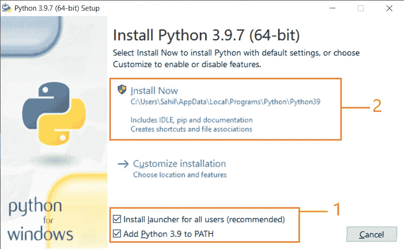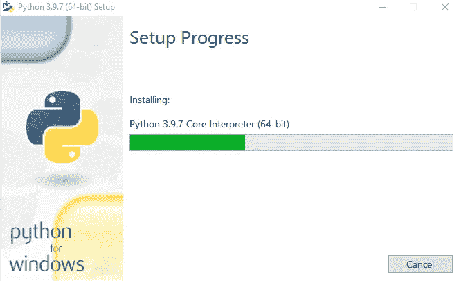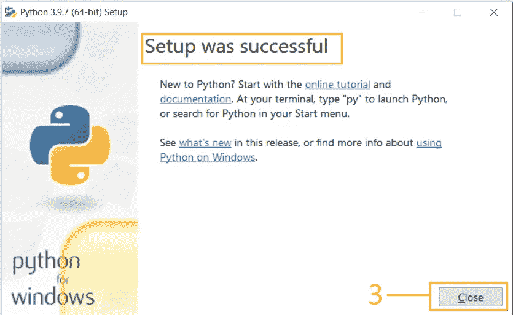

验证安装是否成功。打开 **CMD** 或 **PowerShell** ，写下如下命令:

```
python -V
```

您将看到类似于图中所示的输出。请注意，版本可以不同。版本将基于您下载 python 的时间。

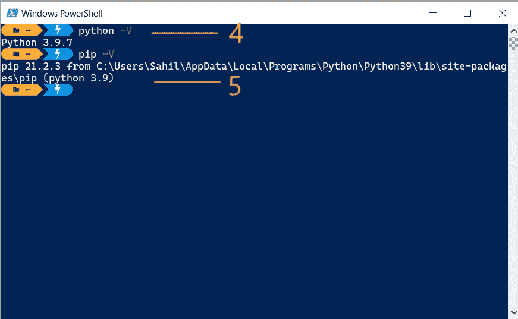

# MacOS 系统

下载安装程序后，打开该安装程序并按照图片中显示的步骤操作。

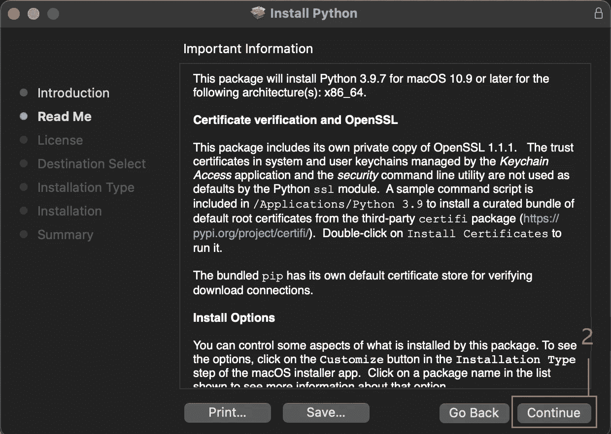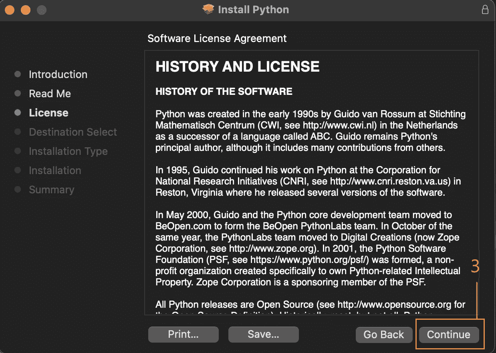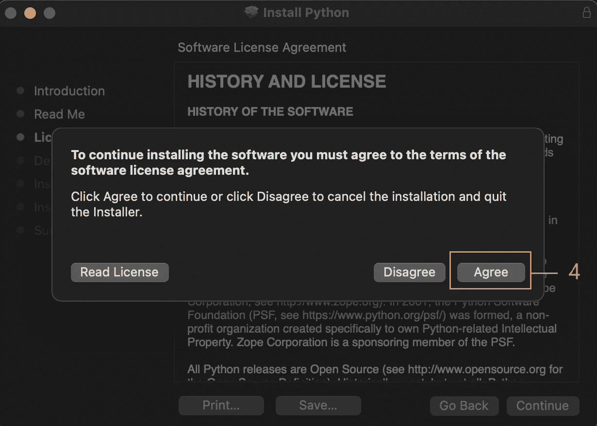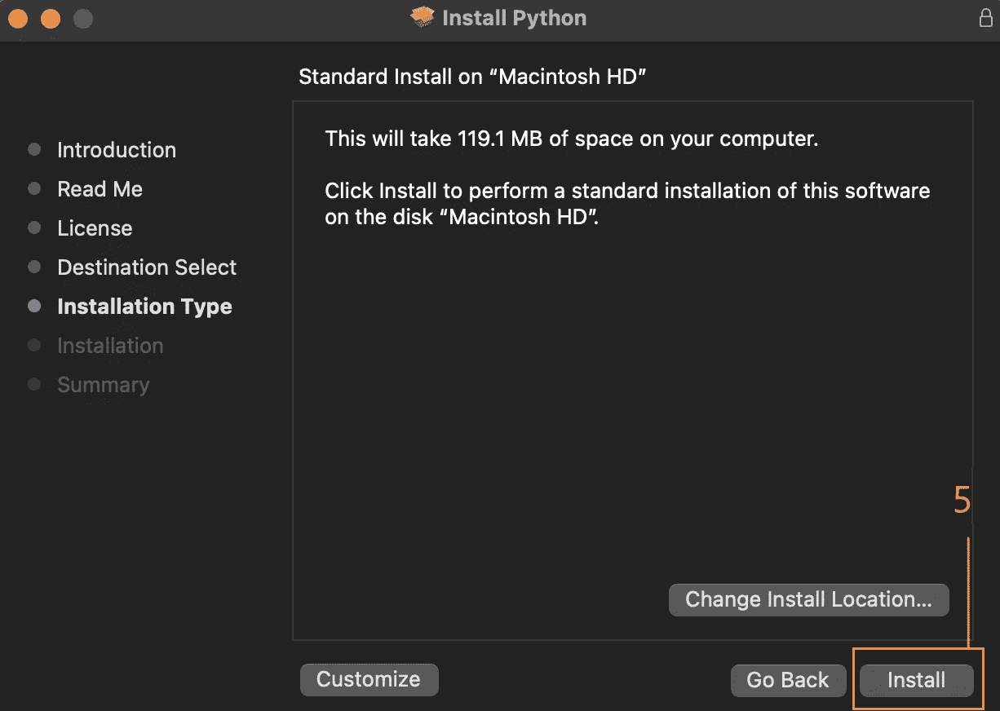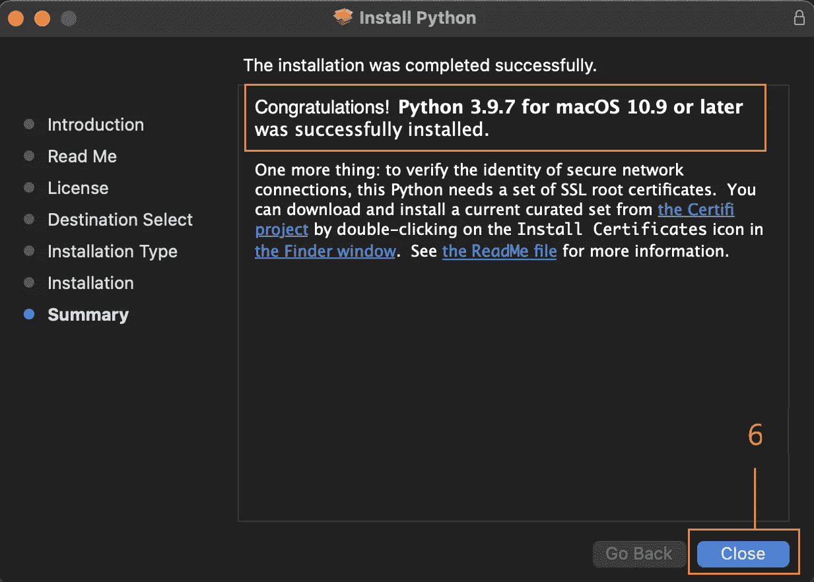

为了验证成功安装，打开**端子**并写入以下命令:

```
python3 -V
```

您将看到类似于图中所示的输出。请注意，版本可以不同。版本将基于您下载 python 的时间。

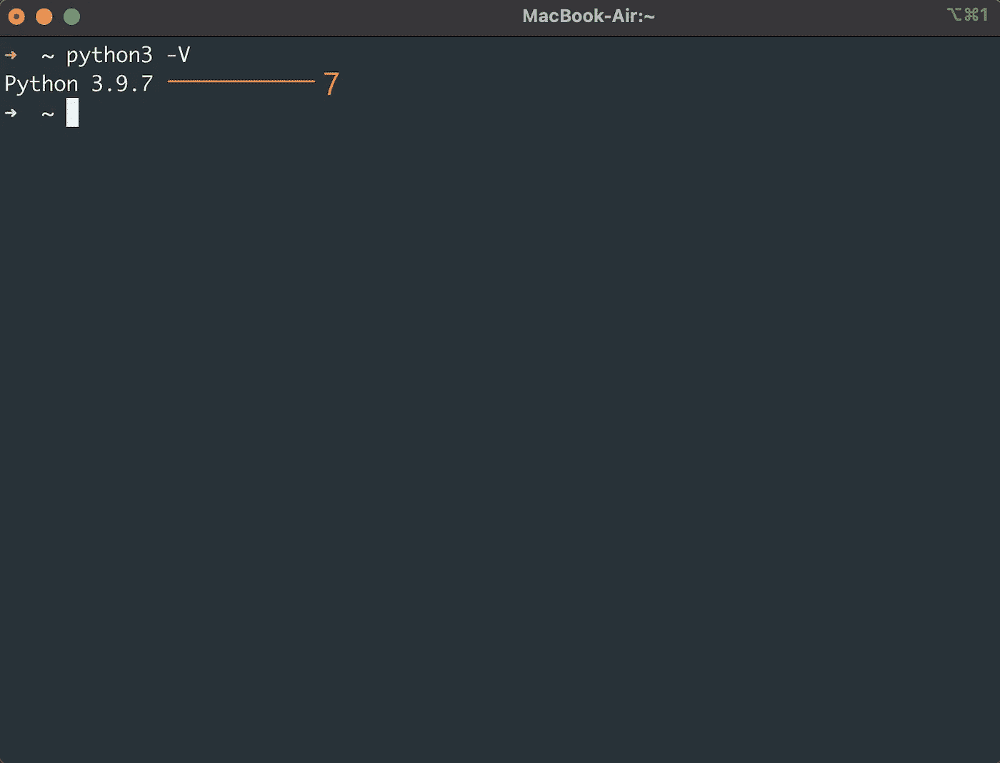

# Linux 系统

大多数 Debian / Ubuntu / Linux Mint 操作系统都预装了 python3。要验证您的 Ubuntu 是否安装了 python3，请在终端中使用以下命令。

```
python3 -V
```

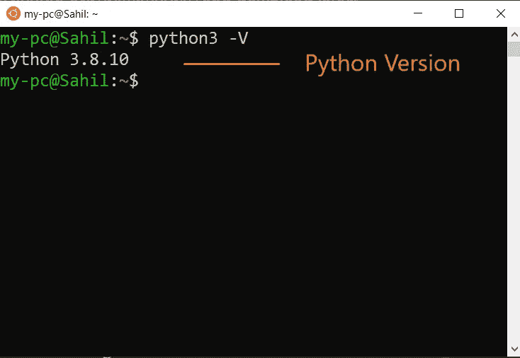

如果您没有看到任何类似的输出，如图所示，然后在终端中运行以下命令。

```
sudo apt updatesudo apt install python3
```

**基于 Redhat / RHEL / CentOS 的**操作系统默认自带 python 2。使用以下命令验证 python 3 on:

```
python3 -V
```

要安装 Python 3，请使用:

```
yum update -yyum install -y python3
```

您将看到类似于图中所示的输出。请注意，版本可以不同。版本将基于您下载 python 的时间。

# Python 代码一瞥

经过安装和验证过程，终于，是时候了！是时候用 python 运行一小段代码了。

我们将运行旧的普通程序来打印 **Hello World！**在 Python 中。要编写此代码，请打开任何文本编辑器或代码编辑器，并编写以下代码:

```
print("Hello World")
```

现在，将这个文件保存为`**hello.py**`，并在保存这个文件的目录中打开任何终端。

如果您在 windows 上，请编写以下代码:

```
python hello.py
```

在基于 Linux 的系统和 Mac 上，编写:

```
python3 hello.py
```

您将看到类似于图中所示的输出。

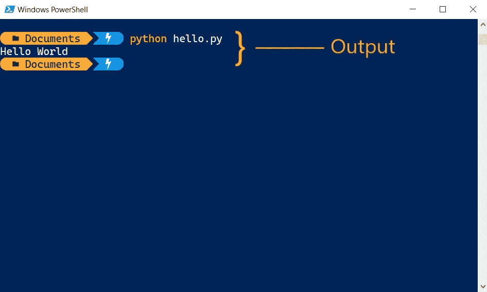

# 结论

嗯，终于来了！我们已经到了这一节的末尾。我知道这里有很多事要处理。功能、安装过程和历史。但就是这样了。

我希望您喜欢这一部分，并对 Python 有所了解。

如果你喜欢这个，与你想学习 Python 的朋友或同事分享。如果你需要任何帮助或者想讨论什么，请告诉我。在推特[或 LinkedIn](https://bit.ly/3KjwgZV) 上联系我。

> ***想了解更多？***
> 
> *注册我的* [*简讯*](https://bit.ly/3Menk8Q) *，将最好的文章放入您的收件箱。*

谢谢你的时间，🧡

查看 Python 101 系列的其他博客:👇

[](/variables-and-data-types-in-python-eee80a886a17) [## Python 中的变量和数据类型

### Python 初学者的变量和数据类型完全指南

levelup.gitconnected.com](/variables-and-data-types-in-python-eee80a886a17)