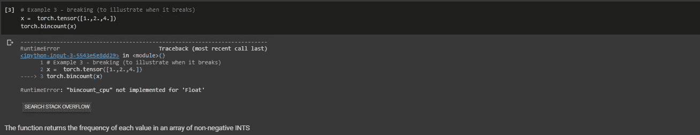

# Pytorch 和操作简介

> 原文：<https://levelup.gitconnected.com/introduction-to-pytorch-and-operations-3bb128a1f2b0>

# **py torch 是什么？**

PyTorch 是一个开源学习框架，它加速了从研究原型到生产部署的过程。

PyTorch 主要用于计算机视觉和自然语言处理等应用。PyTorch 是深度学习和人工智能领域的一个强有力的参与者，它可以被认为主要是一个研究优先的库。

# 【PyTorch 入门

PyTorch 易于学习和理解，并为用户提供了多种功能。

开始学习 PyTorch 的先决条件是对 python 或任何编程语言的基本了解，以及对了解机器学习和深度学习的基础知识的浓厚兴趣。

通过安装所需的库和包，您可以在本地机器上编码

我更喜欢在[***Google Colab***](https://colab.research.google.com/)***上编码。* Google Colab** 是免费云服务，现在支持免费 GPU！您可以提高您的 Python 编程语言编码技能，使用 Keras、TensorFlow、PyTorch 和 OpenCV 等流行的库开发深度学习应用程序。

## **导入火炬库**

导入 torch 库，开始使用 PyTorch。

# **关于张量**

张量是一个普通的 n 维数组，非常类似于 numpy 数组。一般来说，使用 pytorch 张量的好处是，你可以很容易地将它们放在 gpu 上(与只存在于 cpu 上的 numpy 数组相反)

# **功能入门**

现在我们将讨论几个 PyTorch 函数。我们将看到几个工作示例和一个显示错误的示例，以描述该函数如何在特定输入下给出错误。

## **1。新的 _ 新的**

返回一个用 1 填充的大小为“size”的张量。默认情况下，返回的张量与此张量具有相同的 torch.dtype 和 torch.device。

**何时使用*new _ ones***

使用这个函数可以很容易地用 1 初始化你的张量

## 2.火炬。张量. item()

它用于从包含单个值的张量中获取一个 python 数。

**何时使用*焊枪。tensor . item()***

使用手电筒。Tensor.item()从包含单个值的张量中获取一个 Python 数

## **3。torch .亲笔签名**

可以用 requires_grad=True 创建张量，以便 torch.autograd 记录对它们的操作，以便自动微分。

**何时使用*火炬***

可以用 requires_grad=True 创建张量，以便 torch.autograd 记录对它们的操作，以便自动微分。

## **4。torch.bincount(输入，权重=无，最小长度=0) →张量**

计算非负整数数组中每个值的频率。

**何时使用*torch . bin count()***

它可以用来计算非负整数数组中每个值的出现频率

## **5。torch.ceil(input，out=None) → Tensor**

返回一个新的张量，其输入元素的上限是大于或等于每个元素的最小整数。

**何时使用 *torch.ceil()***

它可用于计算给定数量的 float 类型输入的上限。

# 总结我们到目前为止所涵盖的内容！

PyTorch 是一个库，可用于实现机器学习和深度学习的概念，如计算机视觉和自然语言处理。PyTorch 易于学习和理解，并提供了各种功能和操作，以减轻我们的工作。

点击 [**笔记本**](https://colab.research.google.com/drive/11c_XLykJ1UtaKig0ILlzvYViaAPQ7JRh?usp=sharing) 进一步查阅我的作品。

您也可以访问 [**官方文档**](https://pytorch.org/docs/stable/index.html) 了解更多关于 PyTorch 的信息。

 [## 编写面试问题

### 一个完整的平台，在这里我会教你找到下一份工作所需的一切，以及…

技术开发](https://skilled.dev)