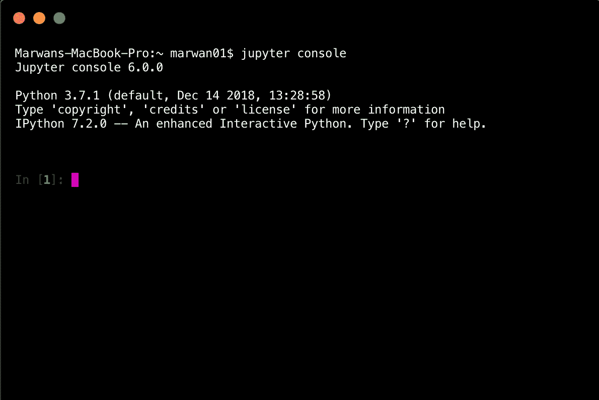
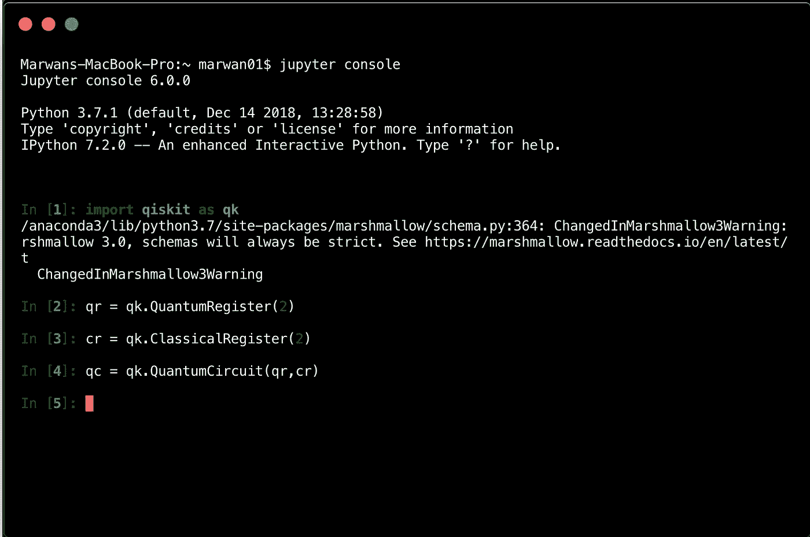
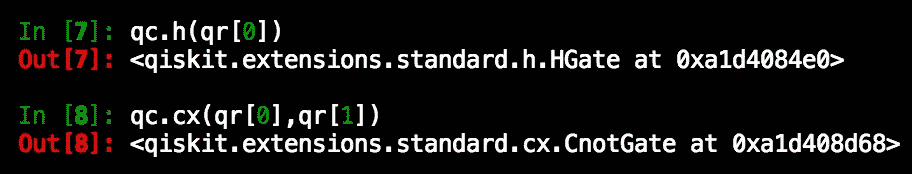
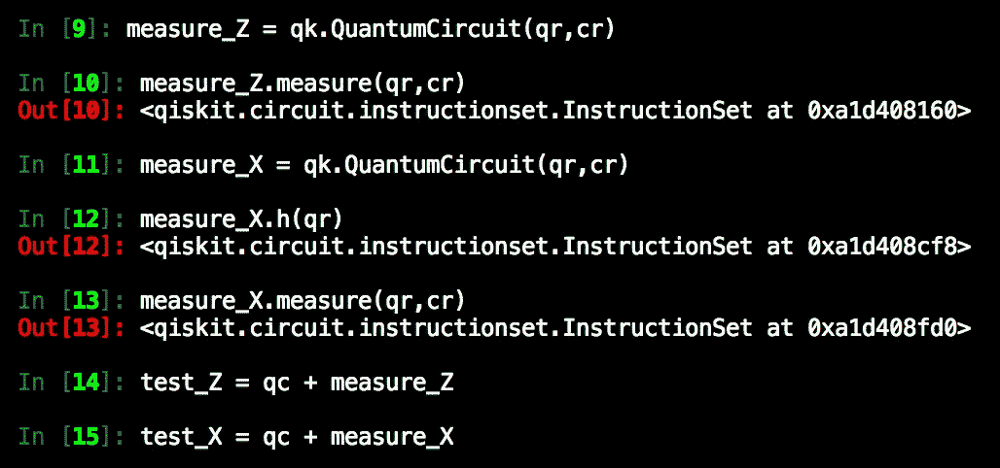
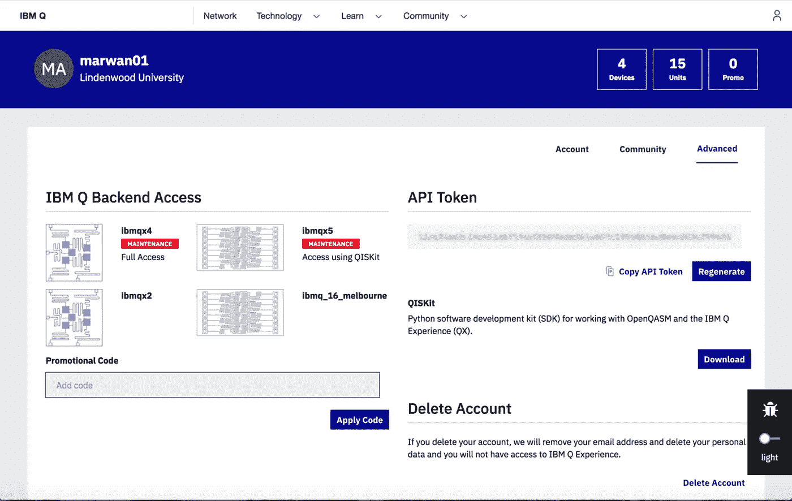
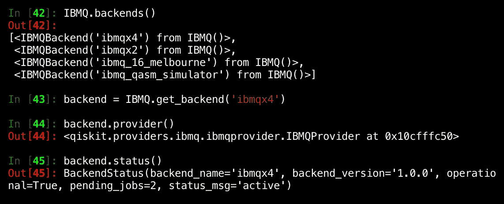
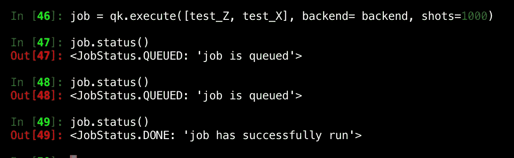
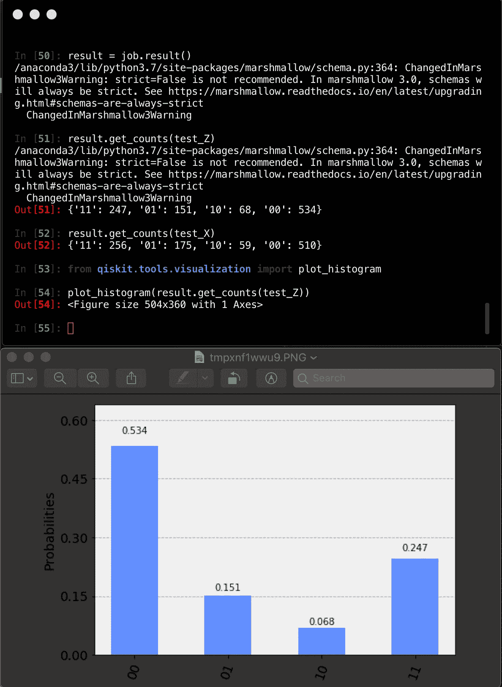
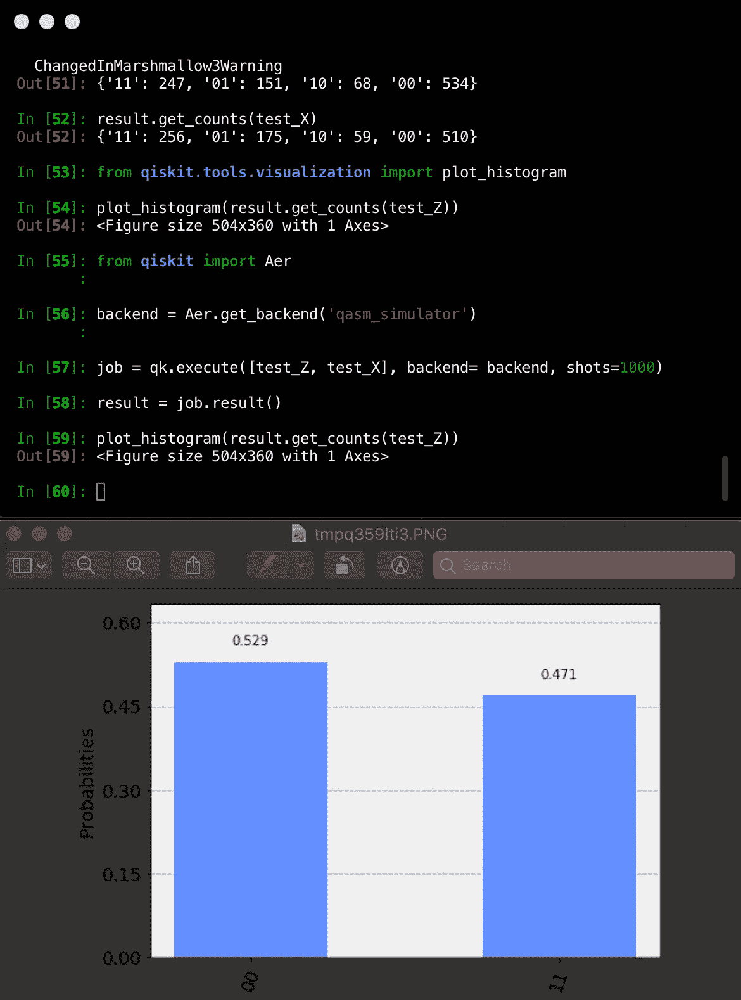

# 使用 Qiskit 和 IBM Q 介绍量子计算

> 原文：<https://levelup.gitconnected.com/introduction-to-quantum-computing-using-qiskit-and-ibm-q-a4c4fead6344>


图片来源:[https://i.ytimg.com/vi/2B680d-qvhI/maxresdefault.jpg](https://i.ytimg.com/vi/2B680d-qvhI/maxresdefault.jpg)

本教程结束时，您将能够使用 Qiskit 在您的计算机上模拟量子电路的行为。您还将能够连接到 IBM Q 后端，并通过云访问 IBM 的量子计算机(信不信由你，它是免费的，每个人都可以访问)。

在我们开始真正的工作之前，我想提出一些要求，以及如何达到这些要求:

您将需要 Python(版本> 3.5)、Anaconda 和 Jupyter 控制台。您可以同时安装所有这些组件，只需获得 Anaconda 发行版。你可以在这里找到[。](https://www.anaconda.com/distribution)

接下来，您需要安装 Qiskit 库。为了做到这一点，您可以使用任何包管理系统，但是为了本教程的目的，我将演示使用 PIP 的步骤。现在，你需要获得 PIP，它是 Python 的一个包管理系统。使用此命令安装 PIP:

```
sudo apt install python-pip
```

然后使用 pip 安装 Qiskit，使用以下命令:

```
pip install qiskit
```

你就快到了。现在你需要做的就是打开一个终端窗口。然后，键入:

```
jupyter console
```



您应该有一个与此类似的屏幕。

恭喜你，现在你已经准备好开始执行命令，探索量子电路的行为。

我想介绍我们将要做的实验背后的理论，但是首先，知道量子位和常规位之间的区别是有好处的。如果你还没有听说，量子计算机使用量子比特而不是经典比特来执行任务。量子位是量子力学系统，可以产生 0 或 1 或它们的某种叠加。这里有一个很好的图片来说明:


参考:【https://sureshemre.wordpress.com/2016/11/27/qubit/ 

在最后一张图中，你可以看到左边是经典比特的可能值，而右边是量子比特的可能值。这些值可以用在一个叠加态或另一个叠加态中找到量子位的相对概率的百分比来表示。该概率可以由单位球内位置中心的距离给出。所以基本上，如果它更靠近底部(相对于图片)，那么它将是 1，否则它将是 0。

为了避免混淆，我想强调，量子位元就像经典位元一样，结果总是 0 或 1。他们没有任何其他不同的价值观。但是它们是如何到达那里的，这就是与经典比特不同的地方，这就是它的强大之处。

回到理论上。因此，我们在本教程中要做的主要工作是试图产生一个纠缠态(也称为[贝尔态](https://en.wikipedia.org/wiki/Bell_state))。抛开流行词汇，看看过去的领域:沿着从 0 到 1 的轴的状态本质上是经典状态。现在想象两个量子位的位置正好在球体的赤道上(与两极等距)。有 50%的几率是 0 或 1，这是一个纠缠态。在这样的叠加状态下，每个量子位都具有相关性，使得如果不参考另一个量子位的状态，任何一个量子位的状态都不能被完全描述。这是展示量子计算机和经典计算机之间区别的最简单的方法。

在确保您在首选目录下工作后，让我们开始编码。让我们首先创建一个由量子寄存器和经典寄存器组成的量子电路。为此，您需要导入 qiskit，并定义一些变量。如果你熟悉 Python，你会发现这样做很容易，因为在幕后，我们只是用 Python 编码。

```
import qiskit as qkqr = qk.QuantumRegister(2)cr = qk.ClassicalRegister(2)qc = qk.QuantumCircuit(qr,cr)
```



在这里，我想介绍一款手机应用，名为 Hello Quantum。它是由 IBM 制造的，看起来很像一个益智游戏。然而，它很好地解释了量子门的工作原理及其行为。如果您有兴趣了解更多关于电路组成的信息，我建议您先玩一会儿。该应用程序的图标如下所示:


回到代码，现在我们可以添加操作到我们的电路。我们之前定义了两个寄存器(一个量子寄存器和一个经典寄存器)并用它们制作了一个电路。接下来，让我们在量子寄存器上应用 Hadamard 门，在经典寄存器上应用 cnot(受控非)门。

```
qc.h(qr[0])qc.cx(qr[0],qr[1])
```



让我们将测量值添加到刚刚创建的电路中。由于我们希望事先在有和没有哈达玛门的情况下进行测量，因此为测量创建单独的电路并将其与我们的缠绕电路相结合会更容易。

measure_Z 电路将在标准基础上进行测量。然后，我们使用 qiskit 函数将结果存储在经典寄存器中

```
measure_Z = qk.QuantumCircuit(qr,cr)
measure_Z.measure(qr,cr)
```

我们将我们的第二个测量称为 measure_X，我们将在测量之前对其应用哈达玛门。

```
measure_X = qk.QuantumCircuit(qr,cr)
measure_X.h(qr)
measure_X.measure(qr,cr)
```

既然我们已经定义了我们的测量电路，我们可以将它们附加到我们的缠绕电路，创建两个新的电路，我们将标记为 test_Z 和 test_X。

```
test_Z = qc + measure_Z
test_X = qc + measure_X
```

这些都是之前成功执行的命令，有助于确保您找到它们。



现在我们开始更令人兴奋的东西！真正的量子计算机连接！

导航至[https://quantumexperience.ng.bluemix.net/qx](https://quantumexperience.ng.bluemix.net/qx/login)，创建账户并登录。登录后，点击右上角的头像图片，进入账户，然后进入高级。您将能够看到与此类似的屏幕。



复制您的 API 令牌，我们将很快使用它。

接下来导入 IBMQ，准备连接量子计算机！

```
from qiskit import execute, IBMQIBMQ.enable_account("Paste your APItoken here")
```

确保将 APItoken 作为字符串传递。现在，如果您运行 IBMQ.backend()，您应该能够看到 IBM 提供给您的所有后端。如果你仔细看，它们在你的 IBM Q 账户的 IBM Q 后端访问下。现在让我们为后端定义一个变量，并开始在 QC 上执行一些代码。

```
backend = IBMQ.get_backend('ibmqx4')
```

对于这个例子，我选择了 ibmqx4，但是这完全取决于您使用什么。有时一些后端会继续维护，所以我总是在选择一个后端之前检查有哪些后端可用。这里是后端连接的快速总结。



还记得我们之前在赛道外准备的测试工作吗？现在我们要用它们了！让我们以这种方式创建一个作业:

```
job= qk.execute([test_Z, test_X], backend = backend, shots = 1000)
```

接下来，让我们执行几次 job.status()来监视作业的状态。如果大量使用量子机器(或者如果您选择了一个繁忙的机器，一个快速的解决方法是返回并使用不同的提供者为后端重新定义变量！)，再过一点，应该就成功了。这是我从跟踪中得到的。



此时，下一步是获取作业执行的结果。

```
result = job.result()
result.get_counts(test_Z)
result.get_counts(test_X)from qiskit.tools.visualization import plot_histogramplot_histogram(result.get_counts(test_Z))
```



这些是我行刑的结果。您的可能会有所不同。对此的解释是，由于在量子计算机上的执行，我们已经证明了“贝尔态”的存在，即当一个量子位处于 0 和 1 之间的中间位置时，并且只发生在量子系统中。这是 x 轴上的中间值(01 和 10)给我们的，它代表“贝尔态”，也称为纠缠态。

不相信我？自己看吧！让我们通过在本地模拟器(不是 quantum)上执行相同的作业来总结一下。这些是您将需要连接到 Aer 并使用他们的本地模拟器，并重新执行过去的工作的命令:

```
from qiskit import Aerbackend = Aer.get_backend('qasm_simulator')job = qk.execute([test_Z, test_X], backend= backend, shots=1000)result = job.result()plot_histogram(result.get_counts(test_Z))
```

结果如下:



从图中可以看出，没有纠缠态。所有无聊的常规 0 和 1 位。然而，这只是你使用量子计算机的证明！

如果您已经走了这么远，并且能够连接到 ibm Q 后端并执行您的第一个作业，那么恭喜您！

我要感谢麦克卢尔先生，他是我撰写这篇文章的最大资源。我用了很多他的 Youtube 视频，我建议你去看看！