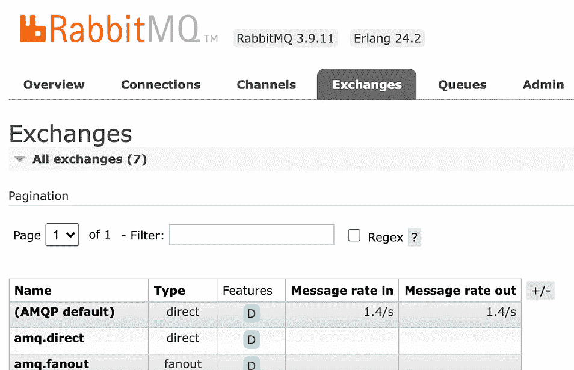

# 带 Nodejs 的 RabbitMQ 简介

> 原文：<https://levelup.gitconnected.com/introduction-to-rabbitmq-with-nodejs-61e2aec0c52c>

## 事件驱动服务的异步通信


# 同步和异步通信

在涉及多种服务的复杂生态系统中，服务之间需要进行通信。然而，有两种不同的通信模式，即同步和异步通信。

同步 **通信**仅仅意味着服务 A 将调用服务 B 来执行一些任务或获取一些数据。这里需要注意的一点是，现在服务 A **被** **阻塞** **和** **等待服务 B 上的**完成任务。这将导致服务 A 现在依赖于服务 b 之间的**紧密** **耦合**，同步通信的一个例子是 REST API 中的 GET、POST 操作，它必须等待结果，并且可能使用结果。

**异步** **通信**是服务 A **没有** **被**服务 B**阻塞** **，但是服务 A **要求** **到** **在后台执行******任务**于服务 B，所以系统会导致**最终** **一致性****松散** **耦合** & **可扩展性**是异步通信的主要原因。********

# 兔子 q

异步通信是由处理服务间消息的消息代理实现的。RabbitMQ 是一个消息代理，它将在**消费者**和**发布者**之间**接收**、**存储** **&** **和** **消息**。RabbitMQ 使用 **AMQP** (高级消息队列协议)通过定义生产者、代理和消费者来标准化 **消息传递**。然而 RabbitMQ 支持其他协议，如 MQTT、HTTP，但是对于本教程，它将使用 Nodejs 来转换 AMQP。

 [## 有效的消息传递- RabbitMQ

### RabbitMQ 拥有成千上万的用户，是最受欢迎的开源消息代理之一。从 T-Mobile 到…

www.rabbitmq.com](https://www.rabbitmq.com/) 

# RabbitMQ 架构


*   **连接** →双向**有状态** **TCP** **连接**的创建是为了用 RabbitMQ 服务连接发布者和消费者。
*   **通道**→TCP 连接内的一个**逻辑** **连接**，用于分离共享同一 TCP 连接的同一物理消费者内的多个消费者，提供**复用**。
*   **交换** →负责**发送** **消息** **到** **所需** **队列**依靠**绑定** **键**在交换和队列之间进行。下面讨论不同类型的交换。
*   **队列** →负责**存储要消费的** **消息**，队列通过绑定键连接到交换机。因此，根据交换机的类型和消息的路由关键字，它将被交换机路由到首选队列。

## 交易所的类型

*   **直接** **交换** →如果队列的绑定关键字与消息的路由关键字相同，则转发消息。
*   **扇出**
*   **主题** **交换** →查找消息路由关键字和交换路由模式之间的通配符匹配
*   **报头** **交换** →使用消息报头进行路由

对于本教程，它将使用**默认** **交换**，这是直接交换类型的预定义交换。这里消息的**路由关键字与队列名**匹配。

## RabbitMQ 中的消息流

总之，**生产者将向交易所**发出信息。使用绑定密钥将交换机连接到队列**。从而**根据绑定密钥、路由密钥和交换类型交换转发接收到的消息到相关队列**。最后**消费者从队列**接收消息。**

# 用 Docker 创建 RabbitMQ 服务器

这里使用的是`**rabbitmq**` **官方** **Docker** **图片**启用**管理插件**，会被`**rabbitmq:management**` **标记。然而默认的`rabbitmq`图像也可以通过手动启用插件来使用。**

 [## Rabbitmq -官方图片| Docker Hub

### RabbitMQ 是一个开源的多协议消息传递代理。

hub.docker.com](https://hub.docker.com/_/rabbitmq) 

这里端口`**5672**`在 **amqp** 协议中启用用于消息传递，而端口`**15672**`在 **http** 协议中启用用于管理门户。

*   运行 RabbitMQ 的 Docker 映像

```
docker run -d -p **5672**:**5672** -p **15672**:**15672** \
   --name rabbitmq-server **rabbitmq:management**
```

*   通过 Docker 日志验证 RabbitMQ 服务状态

```
$ docker logs rabbitmq-server> Ready to start client connection listeners
> **started TCP listener** on [::]:**5672**
> **Server** **startup complete**; 4 plugins started.
```

*   验证 RabbitMQ Cli 和服务管理插件

```
$ docker exec -it rabbitmq-server bash> rabbitmqctl version
3.9.11> rabbitmq-plugins list
[E*] rabbitmq_management               3.9.11
```

*   位于[的管理门户 http://localhost:15672/](http://localhost:15672/) (凭证:`guest/guest`)


通过 **guest/guest** 的默认凭证登录。可以看到节点和端口。

# 为发布者和消费者创建项目

如上所述，RabbitMQ 通信通过**AMQP**协议进行，对于 Nodejs，有`**amqplib**` npm 包与 RabbitMQ 进行交互。

出于演示目的，本教程将使用一个包含发布者和消费者的 Nodejs 项目。让我们启动示例 Nodejs 项目并安装所需的 npm 包。

```
$ npm init
$ npm install --save **amqplib**// Creating two empty files
$ touch publisher.js
$ touch consumer.js
```

# 使用 Nodejs 创建发布者

这里，publisher 试图通过用于消息传递的 AMQP 协议将`{number: 10}`消息发送到`"number"`队列。

```
const amqp = require("**amqplib**");async function connect() {
 const msgBuffer = Buffer.from(JSON.stringify({ number: 10 }));
 try {
   const connection = await **amqp.connect**("amqp://localhost:5672");
   const channel = await **connection.createChannel**();
   await **channel**.**assertQueue**("number");
   await **channel**.**sendToQueue**("number", msgBuffer);
   console.log("Sending message to number queue");
   await **channel**.**close**();
   await **connection**.**close**();
 } catch (ex) {
   console.error(ex);
 }
}connect();
```

*   `amqp.connect` →创建与 RabbitMQ 服务的 **TCP** 连接
*   `connection.createChannel` →在创建的连接中创建**虚拟**链接
*   `channel.assertQueue` → **连接** **或** **创建**队列(如果不存在)
*   `channel.sendToQueue` → **向指定队列发送**消息
*   `channel.close` →关闭已创建连接内的**虚拟**链接
*   `connection.close` →关闭 **TCP** 与 RabbitMQ 服务的连接

这里让我们将上述内容添加到`publisher.js`中，并通过执行`node publisher.js`向 RabbitMQ 发送消息。它会将 1 条消息推送到**默认**交换**到`**"number"**`队列**中**。因为没有消费者，所以从管理门户可以看到 1 条消息被保留，并且一直在队列中，直到被消费。还要注意，Nodejs publisher 脚本在发送消息后终止，因此**连接** **保持为 0** 。**



# 使用 Nodejs 创建消费者

在这里，消费者将尝试接收已经由出版商发送消息，并继续通过 AMQP 收听来自 RabbitMQ 的任何新消息。

```
const amqp = require("amqplib");async function connect() {
 try {
   const connection = await **amqp**.**connect**("amqp://localhost:5672");
   const channel = await **connection**.**createChannel**();
   await **channel**.**assertQueue**("number");
   **channel**.**consume**("number", message => {
     const input = JSON.parse(message.content.toString());
     console.log(`Received number: ${input.number}`);
     **channel**.**ack**(message);
   });
   console.log(`Waiting for messages...`);
 } catch (ex) {
   console.error(ex);
 }
}connect();
```

*   `amqp.connect` →创建与 RabbitMQ 服务的 **TCP** 连接
*   `connection.createChannel` →在创建的连接中创建**虚拟**链接
*   `channel.assertQueue` → **连接** **或** **创建**队列(如果不存在)
*   `channel.consume` → **等待接收来自指定队列的**消息，当消息发出时执行回调函数
*   `channel.ack` → **向 RabbitMQ 服务确认**收到了特定的消息，因此它不会再次重试

在这里，让我们将上述内容添加到`consumer.js` &中，通过执行`node consumer.js`将消息接收到 RabbitMQ。它将从**默认** **交换**的`**"number"**` **队列**中读取现有的 1 条报文。还要注意，Nodejs 消费者脚本在收到消息后不会终止，它将继续监听任何即将到来的消息。这是通过管理门户中的“连接”选项卡确定的，其中连接了一个连接。此外，可以看出，现有的 1 条消息被消耗，并从 RabbitMQ 中移除。这是因为消费者已经确认收到并使用了消息，RabbitMQ 可以删除已使用的消息。


# 创建具有多个消费者的应用程序

在本例中，publisher 将把数字列表作为输入，并根据数字发送到`odd`或`even`队列。然后将有多个消费者监听每个队列来检查行为。


要检查实时行为，需要在发布者发送消息之前连接消费者。因此，按照消费者代码，在三个不同的终端中运行三个消费者:将有两个消费者监听`odd`队列，一个消费者监听`even`队列。

```
$ node ./consumer.js odd
$ node ./consumer.js odd
$ node ./consumer.js even
```

现在从下面的 publisher 代码，它可以发送数字列表到两个队列。这里它将添加 5 个数字作为检查行为的输入。

```
$ node ./publisher.js 1,2,3,4,5
```

用一个发布者和三个消费者执行的输出将是:

```
$ **node publisher.js 1,2,3,4,5**
Start publishing
Publishing number: 1 to queueName: odd
Publishing number: 2 to queueName: even
Publishing number: 3 to queueName: odd
Publishing number: 4 to queueName: even
Publishing number: 5 to queueName: odd
End publishing$ **node consumer.js odd**
Waiting for messages from queueName: odd
Received number: 1 from queueName: odd
Received number: 5 from queueName: odd$ **node consumer.js odd**
Waiting for messages from queueName: odd
Received number: 3 from queueName: odd$ **node consumer.js even** Waiting for messages from queueName: even
Received number: 2 from queueName: even
Received number: 4 from queueName: even
```

这里的一个重要观察是`odd`队列有两个消费者，但是每个消费者消费的东西并不重复。这意味着 **RabbitMQ 将允许一条消息只被一个消费者**消费。当同一个队列有多个消费者时， **RabbitMQ 将按照循环轮换法在消费者之间做出决定**。这就是为什么对一个消费者来说是 T3 和 T4，对另一个消费者来说是中间 T5。

# 用 RabbitMQ 监控

如上所述，RabbitMQ 管理门户有助于监控 RabbitMQ 服务的状态，并配置服务。然而 RabbitMQ 支持与更先进和更流行的 **Prometheus** 和 **Grafana** 的集成。

# 使用 RabbitMQ 进行聚类

对于事件驱动系统，RabbitMQ 将在通信中发挥重要作用，因此需要避免复杂生态系统中的单点故障。因此 RabbitMQ 提供了集群能力，其中多个 RabbitMQ 实例可以协同工作，提供高可用性。

# Kubernetes with RabbitMQ

RabbitMQ 集群可以轻松设置，也可以**集成** **到** **Kubernetes** ，因此，如果生态系统在 Kubernetes 中运行，集成 RabbitMQ 集群以实现高可用性消息服务是可行的。

总之， **RabbitMQ** 是微服务架构中提供异步通信的常用可靠方法。它易于使用，并消除了应用程序中消息传递的复杂性，从而允许开发人员更多地关注应用程序。