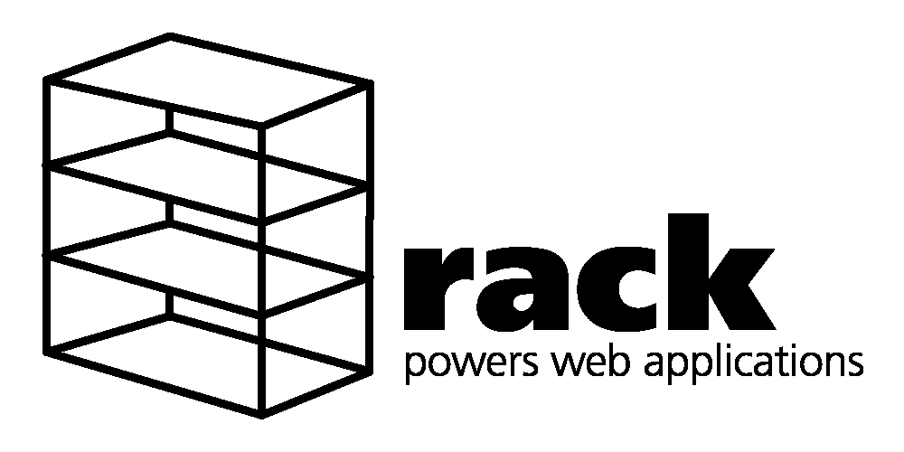
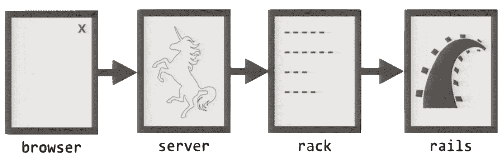

# 机架中间件简介

> 原文：<https://levelup.gitconnected.com/introduction-to-rack-middleware-97d87474632d>

什么是 Rack，我们如何使用它？

作为一名 Rails 开发人员，在软件开发的美丽旅程中，我经常对这个美丽框架的不同组成部分感到好奇。每当我有时间的时候，我都喜欢深入其中的一个主题，阅读它并试图理解它们，如何使用它们，并利用这些知识来开发更好的应用程序。



Ruby on Rails 的其中一个重要部分当然是 Rack，它值得我们花时间去了解一下。在学习 Rack 的过程中，我发现了许多优秀的用法来提高我的技能，让我的生活更加轻松。

# **什么是中间件？**

T 他的术语被大量使用，以至于很难准确定义它，而是在整个行业给它一些不同的定义。我们将主要关注 web 开发和中间件在 Rails 应用程序中的使用。

> 中间件是一个(定义宽松的)术语，指的是使系统各部分能够通信和管理数据的任何软件或服务。它是处理组件和输入/输出之间的通信的软件，因此开发人员可以专注于他们的应用程序的特定目的。

在像 Ruby on Rails 这样的服务器端 web 应用程序框架中，这个术语通常用来指像 Rack 中间件这样的预构建组件或库，它们可以被添加到框架的请求/响应处理管道中，在该管道中，数据流经一系列任务或阶段。非常常见的例子是日志记录、身份验证和其他，这些往往是每个人在多个应用程序中都需要的助手，它们基本上拦截一个请求，对它做一些事情并传递它。

# 什么是 Rack？

ack 为用 Ruby 开发 web 应用程序提供了一个最小的、模块化的、适应性强的接口。通过以尽可能简单的方式包装 HTTP 请求和响应，它将 web 服务器、web 框架和它们之间的软件(所谓的中间件)的 API 统一和提取到一个方法调用中。

Rack 应用程序的特点是应用程序对象响应调用方法。call 方法接受环境对象作为参数，并返回 Rack 响应对象。



就其核心而言，理解 Rack 不仅仅是一个请求/响应过滤器是很重要的，它还有更多的功能，Rack 是一个 web 服务器接口约定，是 web 服务器和用 Ruby 编程语言开发的 web 应用程序之间的模块化接口。

## 简单的机架应用

为了更好地理解，让我们来看看这个漂亮而简单的 Rack 应用程序，看看它的代码。

我们将使用 WEBrick 作为机架兼容的 web 服务器，但它们中的任何一个都可以。让我们创建一个返回 JSON 字符串的简单 web 应用程序。首先，我们需要在我们的目录中创建一个 config.ru 文件，在我们的配置文件中，我们将有以下代码:

```
**class Application
 def** **call**(env)
    status  **=** 200
    headers **=** { "Content-Type" **=>** "text/html" }
    body    **=** ["This is our small Rack app."]

    [status, headers, body]
  **end**
**end**

run Application.**new**
```

Rack gem 附带了一个名为 rackup 的小可执行程序(命令行程序),所以让我们运行它。

```
$ rackup
[2015-05-15 18:37:42] INFO  WEBrick 1.3.1
[2015-05-15 18:37:42] INFO  ruby 2.2.1 (2015-02-26) [x86_64-darwin14]
[2015-05-15 18:37:42] INFO  WEBrick::HTTPServer#start: pid=17588 port=9292
```

现在我们的 web 应用程序已经启动，我们可以将浏览器指向 localhost:9292，我们应该会看到文本`This is our small Rack app.`

例如，在 Ruby on Rails 中，Rack 请求命中`ActionDispatch::Routing.Mapper`并依赖于 env 散列，如果任何路由匹配，它将 env 散列传递给应用程序以计算响应，否则它立即用 404 响应。

# 把宝石放在架子上

除了作为一个惯例，它还是一个众所周知的瑰宝，它提供了强大的功能。在我们前面提到的例子中，我们已经使用了 Rack gem 附带的 rackup 命令。


在服务器和框架之间，可以使用中间件根据您的应用需求定制 Rack。Rack 本身附带了相当多的服务静态文件的中间件，设置默认的 Content-Type 头来响应删除请求期间创建的临时文件。所有[中间件](https://github.com/rack/rack)的详细列表请参见文档。

# 社区

围绕 Rack gem 还有一个很棒的社区，它生产预构建的机架组件，帮助您处理诸如认证、授权、缓存、装饰等任务。如需完整列表，请访问关于[机架中间件](https://github.com/rack/rack/wiki/List-of-Middleware)的机架官方文档。

但是，既然我们在这里，让我们来看几个例子。

## SEO 优化

SEO 代表“搜索引擎优化”这是一种提高网站流量的质量和数量的做法，也是对你的品牌曝光率的一种做法，如今，在打造产品时，它得到了很多关注。

最近，我的工作伙伴接到了删除 URL 末尾的斜杠的任务，我们可以找到一个由其社区开发的 rescue in Rack 组件。

Rack-rewrite 是用于定义和应用重写规则的 Rack 中间件，它非常容易使用，对于我们的目的来说，我们需要做的就是安装 gem 并在我们的应用程序中调用它。

```
config.middleware.insert_before(Rack::Runtime, Rack::Rewrite) do
 r301 %r{^/(.*)/$}, ‘/$1’
end
```

## 证明

从头开始进行身份验证可能会很困难，并且可能会导致不可预见的问题。这里我们可以从另一个 Rack 中间件 [Warden](https://github.com/wardencommunity/warden) 得到很多帮助，Warden 提供了一种在基于 Rack 的 Ruby 应用中进行认证的机制。它考虑到了在同一个机架实例中共享多个应用程序。

典狱长天生就是偷懒的。也就是说，如果您不使用它，它不会做任何事情，但当您使用它时，它会立即开始工作，并提供一种底层机制，允许在任何基于机架的应用程序中进行身份验证。

# 结论

当我开始写和读关于这个话题的文章时，我真的没有太在意这个问题，这很容易被认为是理所当然的，但它让我们的生活变得更加轻松。

虽然我不是一个疯狂的科学家、大师或前辈，但我发现写关于 Rails 的主题，尤其是关于 Rails 框架的重要部分，是令人满意的。

希望你会发现这篇文章很有趣，很有帮助。

# 参考

[*官方文档*](https://github.com/rack/rack)

[*这个超赞的 StackOverflow 线程*](https://stackoverflow.com/questions/2256569/what-is-rack-middleware)

[试管架上的 Rubymonsters 主题](https://webapps-for-beginners.rubymonstas.org/rack/hello_world.html)