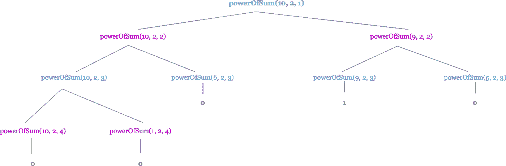
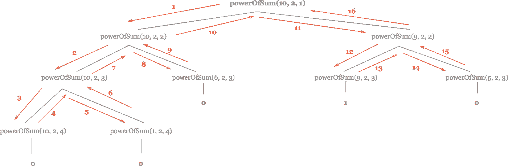

# 递归介绍

> 原文：<https://levelup.gitconnected.com/introduction-to-recursion-7848231b0d1b>

## 递归如何工作的可视化表示和解释。


[https://I . redditmedia . com/lmkj 4 copim 1 duxr _ 4 wiqt 1 teslytpk vqb 1 zesgscm . jpg？s = fc 887 c7be 031 ee 51426 b 8379 C5 b 76024](https://i.redditmedia.com/LMkJ4cPOIM1DUXr_4WiqtTa1TesLyTPKvQB1zeSGsCM.jpg?s=fc887c7be031ee51426b8379c5b76024)

我清晰地记得在大学的那一天，我的《数据结构导论》教授介绍了递归的概念。我的大脑立刻爆炸了。

这是一个如此激进的想法，我觉得自己就像一个长着腿的土豆，试图弄清楚到底发生了什么。

是的，递归可能是一个令人头疼的问题……但是一旦你把它抽出来，解决方案就变得清晰多了。所以今天，我将分解一个简单的递归问题，希望你也能掌握这个复杂的主题。

# 什么是递归？

递归是 [*“一种解决问题的方法，其解决方案依赖于同一问题的较小实例的解决方案(与迭代相反)*](https://en.wikipedia.org/wiki/Recursion_(computer_science)) *”*

**递归示例#1:玉米饼摊**


假设你在排队买玉米卷，但不幸的是你看不到有多少人在你前面排队。你可以走到队伍的前面，数人数(迭代)。这是一件令人头疼的事情，因为它要求你离开你的位置，而你正在犹豫。

相反，你可以问你前面的人，他们前面有多少人在排队。他们不知道答案，所以他们问排在他们前面的人，他们前面有多少人。

这种模式一直持续到问题排到队伍的前面，最后被问的人说“我前面没有人。”然后，每个排队的人都会转过身，告诉他们的邻座他们前面的人数，再加一。这种情况一直持续到你得到最终答案。

JavaScript 代码可能如下所示:

```
function findPlaceInLine(numberOfPeopleInLine) {
    if(numberOfPeopleInLine === 1) {
        return 0;
    }
    return 1 + findPlaceInLine(numberOfPeopleInLine-1);
}
```

并且为了简洁进行了重构:

```
function findPlaceInLine(numberOfPeopleInLine) {
    return numberOfPeopleInLine === 1 ? 0 : 1 + findPlaceInLine(numberOfPeopleInLine-1);
}
```

你可能想知道…好吧，但是这两种解决方案都需要你遍历整行才能得到答案，所以在这里使用递归没有任何好处。

你完全正确。但是在一些用例中，递归可以大大超越迭代解决方案。

**递归示例#2:地址簿**


假设你要结婚了。你发出了所有的邀请，收到了所有的回复，除了一个人:莎伦阿姨。

莎伦阿姨是出了名的可疑…所以你决定打电话给她，要求知道她的反应。

你拿出你的地址簿，有两个选择。你可以从第一页开始，一页一页翻，直到找到她的联系方式。如果莎伦阿姨的姓以 Z 开头，这可能会非常耗时；或者，如果她的姓以 a 开头会更有效率。嗯…我不想两面下注(尽管我知道莎伦阿姨的姓…在这里和我一起工作。)

相反，你决定翻到书的中间，用“二分搜索法算法”来查找她。

我不打算深入研究算法，但二分搜索法算法的前提是，它抓取一个排序数组中的中间元素，并将目标值与中间元素进行比较。如果目标值和中间元素相等，则返回中间元素(woohoo！)如果目标低于中间，则在数组的下半部分递归，否则在上半部分递归(并丢弃中间的元素)。

因为莎伦阿姨的姓很古怪，而且字母表有 26 个字母，所以我们从字母“M”开始(因为有偶数个字母，所以我四舍五入)。因为“F”在 M 之前，我们做同样的事情，但是使用字母 A 到 L 作为新的“数组”。这个过程看起来像这样:

```
letters = [A - Z]
target = F
middle = Mtarget < M
// recurse on lower halfletters = [A - L]
middle = F
target = middle
FOUND!
```


通过使用递归，我们非常快地找到了莎伦阿姨的名字！不幸的是，这个疯女人忘了她买了当天“猫咪博览会”的门票，所以她不会参加你们的婚礼了。

如果这个例子在小范围内为我们节省了宝贵的时间，想象一下在大范围内可以节省多少计算时间。

当然，在某些情况下递归是有问题的(堆栈溢出)，但这是另一天的主题。

# 破解递归编码问题

完成编码面试的许多焦虑是可怕的递归问题。所以我将带你了解一个常见面试问题的解决方案。

这是取自编码网站[黑客等级](https://www.hackerrank.com/challenges/the-power-sum/problem)的问题。

问题提示:

*找出给定整数 X 可以表示为唯一自然数的 n 次方之和的方法。*

嗯……什么？？

让我们举几个例子:

1.  如果 X = 10，N = 2，找出所有加起来等于 10 的唯一正方形的组合。对此只有一个唯一的解决方案，那就是 1 + 3。
2.  100 = (10²) = (6² + 8²) + (1² + 3² + 4² + 5² + 7²).

好的，我们开始吧。

首先，让我们创建函数框架:

```
function powerSum(X, N, number) {}
```

*   x 是我们要寻找的目标值
*   n 是我们要乘以的指数
*   number 是我们提升到 N 次方的值

*注意，随着递归的进行，X 和 number 将改变值，但是 N 将保持不变。*

好吧，我们首先需要什么？

**在递归函数中，你首先需要有一个** **基础用例**。如果你没有一个基本情况(一个条件，当满足时，将触发递归冒泡备份)，你将得到一个堆栈溢出错误。

在这种情况下，我们将进行 3 次检查:

*   number 的 N 次方的值小于 X 吗？
*   number 的 N 次方值等于 X 吗？
*   number 的 N 次方值是否大于 X？

让我们概述一下这三种情况下的每一种情况。为了简单起见，我将 num 的值称为 N 的幂。

*number 的 N 次方值是否小于 X？*

如果 powerof sum< X, we need to recurse on the left and right side.

*   On the left side, we call 【 with X = 10, N = 2, and number = 2.
*   On the right side, we call 【 with X having the value of X minus the 【 variable we declared above (num to the power of N), N stays 2, and number = number + 1;

*number 的 N 次方的值等于 X？*

如果`powerOfNum`的值等于 X，则返回 1，因为我们已经得到了加起来等于目标的平方和！

*number 的 N 次方值是否大于 X？*

在这种情况下，我们没有等于目标的平方和，所以只返回 0。

太好了！所以我们来写代码吧。

```
function powerSum(X, N, number) {
   let powerOfNum = Math.pow(number, N); if(powerOfNum < X) {
      return powerSum(X, N, number+1) + powerSum(X - powerOfNum, N, number + 1);
   } else if (powerOfNum === X) {
       return 1;
   } else {
       return 0;
   }  
}
```

这有点难以理解，所以这里有一个 X = 10 和 N = 2 的递归树的图示。你可以看到，当 X = 10 时，只有一个解。



这是流程的样子:



如果其他方法都失败了，就用蛮力吧。

# 结论

我并不自称是递归专家，但是以这种方式思考复杂的主题有助于使它更容易理解。

如果你喜欢这篇文章，我令人敬畏的类比，或者我高超的图表制作技巧，请随意给我一两下掌声，然后跟我来！

感谢阅读！


Emma Bostian 是德国卡尔斯鲁厄 LogMeIn 公司的一名软件工程师。她喜欢看书，写娱乐性的博客，用第三人称谈论自己。