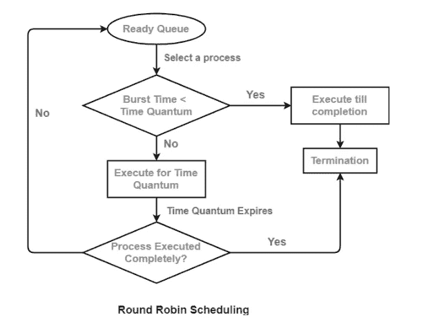
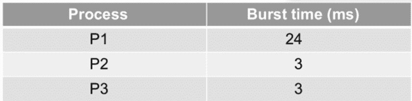
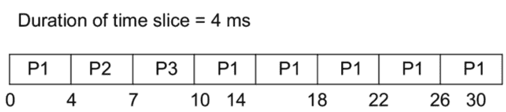
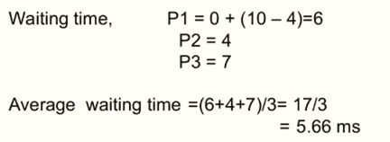

# 循环调度算法介绍(C++和 Java 代码)

> 原文：<https://levelup.gitconnected.com/introduction-to-round-robin-scheduling-algorithm-c-and-java-code-fa1909dd46ab>

# 什么是循环调度，它是如何工作的？

循环概念是一种向 CPU 分配任务的方法。在这个算法中，每个个体得到等量的东西，反过来，受这个方法名字的启发。它是最简单、最古老的调度方法，多用于多任务处理。

循环调度允许每个就绪作业在循环队列中运行一段时间。这种技术还允许流程执行时没有饥饿。

**本文涵盖了以下主题:**

*   循环算法简介
*   循环算法的利弊
*   算法的计算
*   Java 和 C++代码实现
*   结论

# 循环算法简介

1.  它是一种抢占式算法，这意味着操作系统可以随时从 CPU 中强制(抢占)一个进程，要么是为了释放 CPU 用于其他更高优先级的任务，要么是因为时间片已经结束。被抢占/强制的进程被移动到队列的末尾。
2.  它是为分时系统开发的。
3.  分配给进程的最大时间段称为“量程”。
4.  CPU 调度程序一次为就绪队列中的每个任务分配一个时间片。
5.  该算法使用先进先出(FIFO)排队系统。
6.  当前的 CPU 突发可能会影响分配给 CPU 的进程:-

a)与时间片相同—该过程将自行释放 CPU

b)小于时间间隔—该过程将自行释放 CPU

c)超过时间间隔—现有进程被抢占

7.应该为必须处理的特定作业设置最小时间片。然而，它可能因操作系统而异。在定义的时间间隔之后，CPU 被转移到下一个进程，这被称为时间段/时间片。

8.循环模式是一种时钟驱动的混合模式。

9.这是一种实时算法，在设定的时间内对事件做出反应。

# 循环算法的利弊

## 优势

*   实现起来简单明了。
*   每个进程都有平等的运行机会。
*   以非优先方式管理所有流程。
*   不会有饥饿。
*   在这种调度中，每个进程都有机会在某个时间段后重新调度。
*   每个工作都被赋予相同数量的 CPU 时间。
*   它处理所有进程，不考虑优先级。
*   如果知道运行队列中的进程总数，就可以估计出同一进程最坏情况下的响应时间。
*   这种类型的调度与突发时间无关。因此，很容易集成到系统中。
*   就平均响应时间而言，它的性能最好。

## 不足之处

*   这取决于时间片有多长。
*   如果时间片无限大，和 FCFS 一样。
*   由于频繁的上下文变化，一点点时间切片就会退化。
*   如果用于计划的量程时间较少，甘特图会显得过大。例如，对于大型调度，1 ms 是一个很好的起点。)
*   安排一点量程(时间段)需要很长时间。
*   不能为流程定义优先级。
*   循环调度不会给特殊任务更多的优先级。
*   有时，找到正确的时间段是一项具有挑战性的任务。

# 算法的计算

现在您已经熟悉了 Round-Round 算法，是时候了解它到底是如何工作的了。

让我们学习一些可能会遇到的术语-

1.  完成时间—一个过程完成其执行所需的时间。
2.  周转时间—完成和到达之间的时间差称为周转时间。

周转时间=完成时间-到达时间

3.等待时间(W.T) —周转时间和突发时间之差。

等待时间=周转时间-突发时间

考虑下面的例子:

在本例中，给出了 3 个过程及其突发时间。此外，还提到时间片的持续时间为 4 毫秒，这意味着进程运行的最长时间为 4 毫秒。因此，对于每个需要超过 4 毫秒的进程，我们将首先运行它 4 毫秒，然后再运行 4 毫秒，以此类推，直到其突发时间结束。

上面显示的表格被称为“甘特图”。让我们看看如何制作一个。

*   每个流程的到达时间没有给定，就当是 0 ms，所以，完成时间和周转时间是一样的。
*   从进程 1 开始，它的突发时间是 24 毫秒。但是我们知道，我们最多只能运行进程 4 毫秒。因此 P1 进程将运行 0 到 4 毫秒
*   接下来是 P2，它只需要 3 毫秒。所以 P2 将运行 4 到 7 毫秒。接下来 P3 将运行 7 到 10 毫秒，因为它的突发时间也是 3 毫秒
*   现在每道工序都完成了一次。再次从 P1 开始，运行接下来的 4 ms，即从 10 到 14。现在进入下一个过程。
*   P2 和 P3 的爆发时间已经在第一轮完成。因此，我们将继续运行 P1 最多 4 毫秒，直到它的爆发时间达到 24 毫秒

现在，让我们找出每个进程的等待时间。

P1 从 0 毫秒开始，所以它一开始没有等待。但是它必须等待 P2 和 P3 正在运行的时间进程，即从 4 毫秒到 10 毫秒，所以它的等待时间= 10–4 = 6 毫秒

P1 跑的时候，P2 一开始等了 4 毫秒。所以它的等待时间= 4 ms。

P3 为 P1 等待了 4 毫秒，为 P2 等待了 3 毫秒。所以它的等待时间是 4+3=7 ms。

# Java 和 C++代码实现

## //C++程序

## //Java 程序

你可以在 [**采访位**](https://www.interviewbit.com/online-java-compiler/) 上运行程序

# 结论

循环调度是传统操作系统中最古老、最公平、使用最广泛的调度算法之一。循环调度算法最大的好处是所有的作业都能得到公平的 CPU 分配，而且它处理所有的进程都没有任何优先级。这种技术需要更多的时间在上下文之间转换。