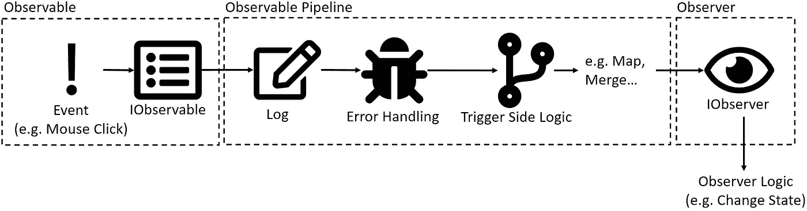

# Rx 简介。网

> 原文：<https://levelup.gitconnected.com/introduction-to-rx-net-87e4a6c6e71b>

## 反应式编程。网


照片由 [Unsplash](https://unsplash.com?utm_source=medium&utm_medium=referral) 上的 [Clément Hélardot](https://unsplash.com/@clemhlrdt?utm_source=medium&utm_medium=referral) 拍摄

在首次发现[反应性延伸](https://github.com/dotnet/reactive)后。NET，我发现学习它非常困难，因为几乎没有任何例子或文档真正涵盖所有情况，或者它们太复杂，乍一看难以理解。网上有一些教程，大部分可以在这里找到。

如果您还没有使用过。NET，我可以推荐 [IntroToRx](http://introtorx.com/) 。这是一个很好的开始。然而，在我的项目中，我很快遇到了用例，这些用例在任何文档或教程中都没有被完全覆盖。我尤其难以实现多播和稳定的可观察流，除非我真的打算这样做，否则无法完成。

在这篇文章中，我将向您介绍。NET 以及如何处理一些一开始不太明显的用例。

# 介绍

[Reactive Extensions](https://github.com/dotnet/reactive) 是一个库，通过它你可以使用[观察者模式](https://en.wikipedia.org/wiki/Observer_pattern)用类似 LINQ 的操作符处理异步数据流。



示例可观察管道的抽象(来自 [FontAwesome](https://fontawesome.com/license) 的图标)

上图显示了可观察管道的**示例**实现。你有发出事件的可观察物。这些事件然后由管道异步处理。在这种情况下，它首先被记录，然后检查错误，然后我们触发一个侧面逻辑，最后观察器接收事件并可以用它做自己的逻辑，例如改变一个状态。

可观察不一定会产生事件，你也可以创造一个数据流或任何你能想象的东西。你也可以让可观察管道完全空着，只直接观察可观察物。

# **要求**

要开始使用 Rx.NET，您需要安装以下软件包:

*   [系统。无功](https://www.nuget.org/packages/System.Reactive/)

# 基础:可观察对象/观察者创建

让我们从创建可观察对象和观察者开始。初始化观察器(*，即处理管道末端的事件或数据流*)的昂贵方式是手动实现所需的方法或事件处理程序，名为:`OnNext()`、`OnError()`和`OnCompleted()`。

可以想象，如果你需要很多观察者，这需要太多的代码。

让我们也展示如何创建一个可观察的。一个可观察对象正在观察器或管道处理程序上调用方法`OnNext()`、`OnError()`、`OnCompleted()`(如果可用的话)。

这也是一个有点多的代码开始，可能不是很可读，如果它变得更多。这就是为什么**反应式扩展**包具有许多扩展，这将简化可观测量和观察者的创建。

不用像 observer_creation.cs 那样创建一个类，您可以只使用 lambda 函数:

在`Subscribe()`方法中，您可以在 lambda 函数上实现观察者功能。您甚至可以选择忽略`OnError()`或`OnCompleted()`处理程序。请记住，只有当您导入了`System;`名称空间时，这个扩展方法才可用！

# 错误处理

我对反应式扩展的第一个困惑是在错误处理和重试期间，这也是为什么我想在一开始就更详细地讨论这个话题。

看看下面的代码:

如果你像我一样，你可能会想到传统的 try-catch 子句，在这种情况下，执行只是在一个异常之后跳转到 catch 子句，并且你可以继续你的逻辑。然而，在这种情况下，你向观察者返回了一个全新的**可观察值，而观察者并不知道这个可观察值是在哪里被截断的。输出如下所示:**

```
//  0
//  1
//  Exception: i is 2
//  *Whatever you define as result of the errorHandler*
```

这个新的可观察物通常会完成并触发观察者不再观察可观察物。这完全停止了你的可观察性，你打算不断地产生新的事件，在某一点上，你可能想知道发生了什么。为了应对这种行为，我们必须实现一个重试逻辑。

我们可以使用的反应式扩展中的两个选项是`Retry()`和`RetryWhen()`。

**重试**

乍一看，最有希望的似乎是。你可能会遇到一个例外，可观察的只是从头开始。`Retry()`的大问题是，我们无法处理发生的异常。您可能想要区分几个异常，当它是轻微异常时重试，当它是严重异常时快速失败。

下面是这个问题的一个可能的解决方案。我们只需添加一个`Catch()`方法并指定一个错误处理程序，它可以区分不同类型的错误。之后，我们添加了`Retry()`方法，它将重试 n 次或永远重试。

最近我有一个用例，其中源可观察对象不断地从消息队列中发出新事件。如果我不使用 Catch & Retry 组合，我的应用程序将会崩溃，不再处理重要的事件。

**返回时间**

`RetryWhen`几乎和`Retry`一样，除了你还需要一个可观察到的触发信号，这是再次重试的信号。

这里发生的是，可观测的源正在发射`0, 1, error`。`RetryWhen()`捕捉异常并等待，直到`signal`发出任何值，这将在 1 秒后发生。当检测到该信号时，源可观测信号将被重新订阅并再次发射`0, 1, error`。

# **可连接的可观测量**

第二个也是更令人困惑的话题，我遇到了所谓的`Connectable Observables`。可连接观察物，更好地称为**热观察物**，能够为零到任意数量的订户产生通知。这意味着，他们可以发射事件，即使还没有人订阅它们。

当您有一个外部源发出事件，并且您希望只将它们发送给任何感兴趣的观察者，或者甚至保留这些事件的历史，以备新的观察者订阅时，它们就派上了用场。

让我们看看下面的代码，我起初认为它是正确的:

我简单地将`Replay()`添加到我的 source observable 中，希望它能为每个新订户重放我最近的 3 个事件。如果我是正确的，这就是在 Rx 中可行的方法。Js，但是在这里，我们没有得到任何结果在我们的控制台。

原因很简单。`Replay()`函数返回一个`IConnectableObservable`，它本身就像一个观察者。这个观察器还没有初始化，所以它订阅了它的底层可观察对象。这可以通过使用`Connect()`方法来实现，正如你在这里看到的:

现在，您可以将任意数量的观察者连接到这个源，每个观察者都将收到最近发出的 3 个通知。

为了完整起见，IConnectableObservables 由:`Publish()`、`PublishLast()`和`Multicast()`产生。处理这些问题时，请特别注意。还有一点，您调用`Connect()`方法的地方是相关的，因为这将已经开始订阅，您可能会丢失通知，直到第一个观察者订阅。

# 添加

可观察模式与反应式扩展相结合也使得以一种非常干净的方式实现[管道和过滤器模式](https://learn.microsoft.com/en-us/azure/architecture/patterns/pipes-and-filters)变得非常容易。为了使它更加干净和直观，同时也支持依赖注入，我创建了一个名为 **ObservablePipelines** 的 Nuget 包。您可以查看它的工作原理，并从本文下载:

[](https://betterprogramming.pub/the-best-approach-for-a-pipeline-architecture-in-net-d0ad0332ea24) [## 中管道体系结构的最佳方法。网

### 用最少的代码创建一个干净的管道

better 编程. pub](https://betterprogramming.pub/the-best-approach-for-a-pipeline-architecture-in-net-d0ad0332ea24) 

我希望这两个例子可以消除一些困惑，帮助你掌握反应式扩展。

如果您对源代码感兴趣，可以看看我为本文准备的知识库:

[](https://github.com/TobiStr/Understanding-Reactive.NET) [## GitHub-TobiStr/Understanding-Reactive。NET:这个库展示了如何正确使用…

### 这个库展示了如何在. NET 中正确使用反应式扩展。

github.com](https://github.com/TobiStr/Understanding-Reactive.NET) 

感谢您花时间阅读这篇文章。我希望，你会觉得它有知识性、教育性和趣味性。非常感谢您的支持和参与。

如果您有兴趣了解干净架构、干净编码和最新技术栈的最新趋势、技巧和诀窍，尤其是在 C#环境中。净和有棱角——如果你考虑跟踪我，我会很感激。

祝你有美好的一天！


如果你还没有每天使用媒体来增长你的知识，现在是开始的最佳时机！借助 Medium，您可以轻松获得更多关于高度专业的主题的知识，发布高质量的内容，并接触到更广泛的受众。要开始，只需使用以下链接创建一个中型帐户:

[*加入中现*](https://medium.com/@tobias.streng/membership)

通过这样做，你将获得一个强大的平台，可以帮助你联系新的作者和读者，每天学习新的东西。