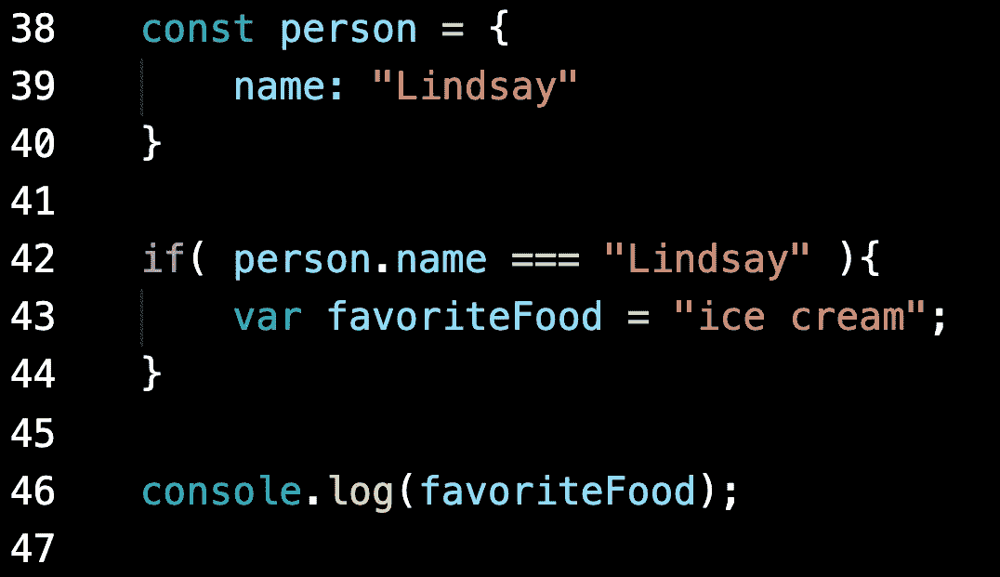

# JavaScript 中作用域的介绍

> 原文：<https://levelup.gitconnected.com/introduction-to-scope-in-javascript-faf174dd6b1b>

理解范围对于编写成功的代码至关重要，并且可以帮助您避免引入难以跟踪的错误。我在 Flatiron School 的第一个项目中犯了一个巨大的错误，使用了一堆全局变量，这使得很难跟踪我代码中的问题来自哪里。可以肯定地说，犯错和失败是一位强有力的老师。我永远不会忘记那个教训。不管怎样，这里我将介绍 JavaScript 中可变范围的概念。

**全局范围**

全局范围的变量在函数或块之外声明，在窗口对象的任何地方都可用。它们可以使用*变量*、 *let* 或 *const* 变量声明来定义。

最好避免全局变量，保持代码模块化，保持函数和文件专用于某个目的。比如保持一个整洁的壁橱，你知道你的鞋子、裤子、衬衫、珠宝等都在一个特定的区域，很容易找到东西的位置，而不是把你所有的东西都扔在地板上。任何时候你去寻找某个物品的位置，光是整理它就要花费你很长时间。如果您将变量保存在具有特定用途的特定函数的本地，那么您将更容易组织文件。如果您需要返回并调试某些东西，您知道该问题是函数的局部问题。

**功能范围**

当变量在函数内部定义时，不能在函数外部使用。这非常有用，因为您可以使用相同的变量名，并且知道您不会与其他函数和文件发生冲突。

变量不会相互竞争，因为它们的作用域是局部的。

**阻塞范围**

如果在花括号{}之间定义了任何变量，那么这些变量的作用域是局部的。(*让*和*保持不变*)。以下面的代码为例。

错误

第 46 行返回一个错误，说明变量 *favoriteFood* 未定义，因为该变量在块外不存在。当 let 和 const 用于声明和定义一个块中的变量时，它们的作用域是局部的。把花括号想象成你的变量不能跳过的栅栏。 *var* ，但是不是块范围的…

“冰淇淋”

在这种情况下，第 46 行能够记录字符串“ice cream ”,因为 var 变量是函数范围的，而不是块范围的。最佳实践是避免使用 var 变量，除非您正在处理遗留代码。

在函数中避免这种块范围问题的一种方法是在块外部使用 let 声明变量，然后在块内部定义它。这里有一个例子。

变量**城市**在街区外不可用。

变量**城市**已经在函数中声明，然后在块中定义。

下面的例子是可行的，因为 *let* 关键字允许你声明一个变量而不用定义它。它在声明它的范围内可用。使用 let 定义的变量也可以根据需要进行修改。正是因为这个原因，变量通常应该使用 *const* 关键字来定义，这样就不会出现变量定义意外改变的问题。

在研究可变范围时，还有许多其他的主题需要探讨。这是对变量声明和定义以及全局、函数和块范围的简要概述。