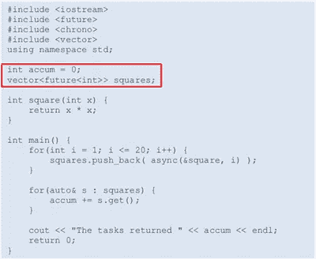

# C 和 C++中的安全编码介绍

> 原文：<https://levelup.gitconnected.com/introduction-to-secure-coding-in-c-and-c-d8ece627facb>

两种语言(C 和 C++)都是通用的结构化编程语言，适合系统和嵌入式编程。

C++从一开始就被设计成一种面向对象的语言，支持封装、数据隐藏、继承和多态。

# 传统攻击媒介

1.  不安全的内存处理
2.  竞赛条件
3.  不安全的 I/O 处理
4.  通过异常处理的信息披露
5.  拒绝服务

# 1.不安全的内存处理

## 堆栈溢出

当应用程序的执行堆栈增长到超出为其保留的内存时，就会发生堆栈溢出。发生这种情况的一个常见例子是使用递归函数时。递归函数通常会调用自己，直到达到某个终止条件。对该函数的每次递归调用都会导致一个新的堆栈帧被创建并放置在堆栈上。一旦满足终止条件，函数返回值，堆栈展开，收缩到原始大小。然而，如果终端条件从未满足，新的堆栈帧将继续创建，最终堆栈将消耗比为其保留的更多的内存。因此，强烈建议彻底测试递归函数。

## 缓冲区溢出和堆溢出

缓冲区溢出或缓冲区溢出是一种异常现象，在这种情况下，程序在向缓冲区写入数据时，会超出缓冲区的边界并覆盖相邻的内存位置。

缓冲区是为保存数据而留出的内存区域。缓冲区对于将数据从程序的一部分移动到另一部分或者在程序之间移动很有用。格式错误的输入通常会触发缓冲区溢出。如果假设所有输入都小于某个大小，并且缓冲区被创建为该大小，则产生更多数据的异常事务可能会导致其写入超过缓冲区的末尾。

另一方面，堆溢出是一种特定类型的缓冲区溢出。当应用程序写入的数据超出为任何缓冲区或数据结构分配的内存时，就会发生缓冲区溢出。如果这个结构或缓冲区位于堆上，则溢出称为堆溢出。但是，请记住，缓冲区或数据结构也可以在堆栈上分配。在这种情况下，漏洞仍然是缓冲区溢出，但它被称为基于堆栈的缓冲区溢出。旧的 C 和 C++应用程序在接受和处理来自最终用户的字符串输入时特别容易出现缓冲区溢出，尽管许多系统在接受和处理来自网络的输入时也遇到过这个问题。

## 不安全的内存处理—破坏堆栈

在我们进入下一个主题之前，让我们快速地看一下一些简单的基于堆和基于栈的缓冲区溢出。

我们在这里看到的代码，由 StackOverflow.com 提供，容易受到经典的基于堆和基于栈的缓冲区溢出的攻击。在顶部，我们看到了 heap_overflow 函数的定义。使这个函数易受攻击的是，无论我们如何调用它，它总是从堆中要求一个太少的字符，然后在内存分配结束后写入。在我们这里的例子中，我们发送四个字节的数据:字符:a、b、c 和一个空字符，但是 malloc 返回的内存量只有三个字节。

关于这两个漏洞，需要认识的一点是，如果被熟练的攻击者利用，它们最终会导致任意代码执行。有关缓冲区溢出视图模块 180“缓冲区溢出”的更深入的分析和示例。

## 不安全的内存处理—不安全的 API

根据前面的例子，我们可以看到，如果我们不验证接收数据的空间至少与我们复制的数据一样大，strcpy 可能是一个非常危险的函数。

至少应避免以下功能:

然而，正如 Sam 发现的，出于完全相同的原因，我们也应该避免使用其他类似的函数。其中包括 strcat()、strcmp()和 gets()。要获得我们应该避免的功能的更全面的列表，以及合适的替换列表，请查看这里列出的附加资源列表。

*   被禁止的功能:[https://msdn.microsoft.com/en-us/library/bb288454.aspx](https://www.blogger.com/#)
*   [https://blogs . msdn . Microsoft . com/Michael _ Howard/2016/03/08/refactoring-c-and-c-code-for-security/](https://www.blogger.com/#)
*   【https://google.github.io/styleguide/cppguide.html 

gets()、strcmp()和 strcat()是无法进行边界检查的标准 C 库函数，即使目标缓冲区的大小较小，也允许将输入缓冲区写入目标，从而导致潜在的缓冲区溢出。

# 2.并发和竞争条件

除了不安全的内存处理，Sam 关注的下一个问题是并发性和竞争条件。并发描述了多个线程或进程在同一个内核上执行的情况。在大多数系统中，这可以通过上下文切换来实现。当多个线程或进程试图访问和更新一个共享资源或数据时，并发就变得危险了。

这里我们看到一个 C++应用程序，它试图对数字 1 到 20 求平方。如果我们编译并运行这个应用程序，我们很可能得到正确的答案 2870。但是，在特定的条件下，我们会得到不同的答案。这是因为 square 函数中累加器变量的更新不是原子操作。因此，当多个线程都争着调用 square 函数时，就有可能出现一个线程会覆盖另一个线程对累加器变量所做的更改，这种情况称为竞争条件。在这些情况下，我们会得到错误的答案。

虽然这个例子很琐碎，但在其他情况下，这可能会产生不利影响。想象一下，如果您的银行网站使用多线程 C++后端应用程序来处理您账户的借贷。根据操作的顺序，有可能你会失败。

## 互斥—互斥

要修复易受攻击的代码并解决这个问题，我们可以使用三种不同技术中的一种。第一种称为互斥，是互斥的缩写，它允许我们确保某些代码块总是按顺序执行，不能被中断。前面使用互斥体的相关代码的安全版本可能如下所示。

大部分代码都是一样的，但是变化是我们首先包含了互斥体库，声明了一个名为 account_mutex 的互斥体对象。然后在 square 函数中，我们计算要加到累计总数中的值，锁定互斥体，将新值加到总数中，并解锁互斥体。互斥体保护我们的方式是它确保所有帐户在锁定和解锁之间执行。

## 原子的

下一个选择是使用所谓的原子，只要我们使用 C++11 或更新的版本。

通过将累计总数声明为原子整数，我们的编译器将确保对总数的所有修改都以线程安全的方式完成。

## 任务

我们可以使用的最后一个选项是任务，它也是 C++11 和更新版本的一部分。任务的工作基于承诺和未来的概念。承诺是异步编程中使用的一个概念，当一些复杂或耗时的操作完成时，我们希望继续处理，但我们仍然希望保证我们最终会得到答案。承诺就是这份合同，我们最终会得到一个答案。承诺就是这份合同，我们最终会得到一个答案。为了寻找答案，我们使用一个与承诺相关联的未来。如果一个承诺在我们需要价值的时候还没有实现，那么未来将会被封锁，直到这个承诺被实现。

我们可以在这里看到我们的代码版本看起来像什么，当我们需要值的时候，未来将阻塞，直到承诺被实现。

我们可以在这里看到使用任务的代码版本。首先，我们声明一个向量来持有我们所有的未来，承诺最终给我们一个真实的价值。我们不需要立即得到这些值，所以我们只是将未来存储在向量中。随后，我们试图通过调用 get 方法来检索每个单独期货的实际计算值。因为所有的计算都已经完成，所以不存在线程问题，所以我们只需将单个值添加到累计总数中，并打印结果。正如所料，我们总是得到正确的结果。

## 关于并发和竞争条件的说明

总的来说，我们有很多方法可以解决并发性和竞争条件问题。即便如此，在使用这些解决方案时，我们还是需要记住一些事情。

首先，我们需要小心，不要在互斥体被锁定时破坏它们。如果我们这样做，我们几乎肯定会让我们的应用程序进入一种被称为死锁的状态。

其次，我们需要小心多线程代码中的异常。尤其是在使用互斥时。为了避免异常导致的死锁，我们必须在解决异常时释放所有的互斥体，除非我们能保证将来的代码会释放互斥体。

第三，我们必须验证我们在临界区内使用的任何库都是线程安全的。许多标准模板库函数不被认为是线程安全的，所以我们在多线程代码中使用它们时需要小心。

有关源代码并发编码指南的更多信息，请参见此处的 CERT 指南参考。

[https://www . secure coding . cert . org/confluence/pages/view page . action？pageId=158237219](https://www.blogger.com/#)

## 并发和竞争条件— TACTOU

Sam 发现的竞争条件的另一个常见问题是检查时间和使用时间。一般来说，当软件第一次检查资源的状态，但是在实际使用资源之前，资源的状态改变时，就会发生这种类型的竞争情况。因此，软件可能会执行无效的操作或进入未定义的状态。当攻击者能够在检查资源状态和使用资源之间有目的地影响资源状态时，这个问题就变得与安全相关了。

看看我们这里的示例 C 代码，从 MITRE 修改而来，代码首先从用户那里获得我们想要访问的文件的名称。我们将它存储在文件名参数中。接下来，代码使用 unistd.h 中的访问方法来确保程序可以读取该文件。然后，它通过调用 fopen()获得文件指针，并根据需要处理文件的内容。如果程序不能访问该文件，一条消息将被写入标准错误。

这段代码的问题是:access()和 fopen()都依赖于文件名，而不是文件处理程序。如果攻击者可以在 path to access()和对 fopen()的调用之间更改路径所引用的文件的位置，攻击者就可以使程序读取指定文件以外的文件。

通过操作文件系统，用指向不同文件的符号链接或硬链接替换文件，或者用链接替换文件路径中的一个目录，可以更改文件。如果该程序设置了 setuid 位，攻击者可能会操纵系统读取只有根用户才能访问的文件，从而提升他们的权限。

[https://cwe.mitre.org/data/definitions/367.html](https://www.blogger.com/#)

不幸的是，与前面介绍的竞争条件不同，检查时间、使用时间(TACTOU)问题很难预防。一般来说，我们的建议是限制检查和使用资源之间的 CPU 周期数，就像我们在这里所做的那样。虽然这并不能解决问题，但它确实增加了攻击者利用漏洞的难度。

其他解决方案包括原子地对资源执行操作，或者使用环境锁定机制来保护资源。当然，这些解决方案会导致性能下降，这对于企业及其需求来说是不可接受的。

幸运的是，C++11 增加了一些新的模式，可以帮助我们在某些情况下避免这些问题。

我们在这里看到的代码利用了 fopen()可用的新模式。X 操作模式将确定文件是否存在的检查和打开文件进行写入的操作组合在一个操作中。因此，我们不必在代码中执行这两种检查，从而降低了攻击者利用检查时、使用时(TACTOU)错误的可能性。

不幸的是，这种模式不适用于读取操作，因此我们仍然有责任在这些情况下降低这种风险。

下面的安全解决方案在单一位置调用 fopen()，并使用该方法的 X 模式，这是在 C11 中添加的。如果文件存在，此模式会导致 fopen()失败。该检查和随后的检查在不创建竞争窗口的情况下执行。请记住，只有在主机环境提供这种支持的情况下，X 模式才提供对文件的独占访问。

## 关于塔图的笔记

虽然这些类型的争用情况可能发生在文件处理代码之外的地方，但是记住一些事情是很重要的。

注意任何使用文件名而不是文件句柄的函数。

其次，规范化所有可能受外部输入源影响的路径名，以确保正在访问的文件是预期的文件。如果可能，将可以读取或处理的文件限制在只有该程序有权访问的特定目录中。这些类型的目录通常被称为安全目录。

第三，如果可能的话，使用 C++11 中的 X 操作模式。

最后，使用此处引用的 CERT 安全编码标准，以获得有关安全文件 I/O 的更多详细信息和示例。

[https://www . secure coding . cert . org/confluence/pages/view page . action？pageId=3575](https://www.blogger.com/#)

文件处理程序保证程序在正确的文件上运行，即使攻击者能够修改文件系统，使文件名指向不同的文件。因此，文件句柄通常比文件名更安全。

# 3.信息披露:异常处理

通过过去进行的各种评估，Sam 记得异常可以暴露应用程序的内部实现细节，从而帮助攻击者。在某些情况下，错误或异常消息可以让攻击者更好地了解应用程序，从而让他们能够更好地利用漏洞。为了解决这个问题，我们不仅要捕捉和处理所有异常，还必须过滤任何可能返回给最终用户的异常消息。

例如，看看下面的代码。在这里，我们接受来自用户的文件名，并将该文件的内容打印到标准输出。但是，如果在此过程中出现任何异常或错误，这些错误可能会返回给用户。更糟糕的是，可能会触发核心转储，这也可能包含关于应用程序如何工作的敏感信息

。为了防止这种意外的信息泄露，我们需要做的是实现基本的错误和异常处理。

下面包含的这个示例代码展示了我们的文件打印代码的一个更加健壮的实现。

我们在这里所做的是将代码提取到它自己的函数中，并将可能引发异常的代码部分包装在 try catch 块中。

代码的 catch 块允许我们以确定的方式处理各种异常情况。我们从捕捉任何可能抛出的文件相关异常开始。然后，我们采取高度务实的方法，捕捉所有其他可能抛出的我们可能没有预料到的异常。

当实现异常处理代码时，建议始终使用通用 catch 块来处理任何可能引发的意外异常。在这个例子中，与文件相关的异常应该在通用 catch 块之前被捕获。

有关良好异常处理的更多示例和最佳实践，请参阅这里提供的参考资料。

[https://www . secure coding . cert . org/confluence/pages/viewpage . action？pageId=146440597](https://www.blogger.com/#)

【http://www.stroustrup.com/except89.pdf 

# 4.拒绝服务

Sam 注意到他公司的许多应用程序通过网络相互通信。为此，应用程序大量使用套接字。

每当我们开始从网络连接接收输入时，我们需要解决的一个主要问题就是拒绝服务。默认情况下，原始套接字库的 send()和 recv()方法会阻塞一个线程的执行，直到所有数据都被处理完。然而，可以连接到我们的套接字的攻击者可以发送大量数据，导致我们系统上的所有内存被消耗，或者攻击者可以打开多个连接，以非常慢的速度发送数据，最终导致我们的系统用尽可用的连接来服务我们的合法客户端。为了解决这个问题，我们可以尝试三种主要的解决方案。

## 解决方案 1

第一个可能的解决方案是让我们的代码多线程化。通过使用我们之前讨论过的多线程解决方案之一，send()和 recv()函数将只阻塞一个子线程，这将允许主应用程序线程继续处理。

这种解决方案的缺点是多线程套接字代码的正确实现并不简单，应该只留给经验丰富的开发人员来完成。

## 解决方案 2

第二个解决方案要简单得多，就是为所有网络代码实现限时连接。这个解决方案的一般方法是，对于每个打开的连接，我们需要跟踪连接打开了多长时间，以及我们是否在合理的时间内收到了所有我们期望的信息。

这个解决方案的大致轮廓是这样的:首先，我们打开套接字并建立连接。此时，我们还将捕获当前系统时间。如果我们正在发送数据，我们将检查数据和我们的网络连接速度，并计算发送所有数据需要多长时间的阈值。然后，我们将开始循环数据，分块发送。随着每个数据块的发送，我们还将检查当前系统时间减去我们之前计算的阈值是否大于我们的初始开始时间。如果是这样，我们可以选择终止连接。如果我们正在接收数据，我们可以采用类似的方法，计算另一个系统向我们发送所有预期数据的合理时间。如果超过了时间阈值，我们就关闭连接。

这种方法非常简单，可以很容易地防止常见的拒绝服务情况，特别是在与使用单一连接的系统之间传输的数据大小的合理上限相结合时。但是，请记住，网络传输可能会发生，可用带宽可能会波动。如果遇到这些情况，一定要适当调整计算的阈值。

## 解决方案 3

最后一个可能的解决方案是使用异步或非阻塞 I/O 操作。boost ASIO 或异步 I/O 库就是一个很好的例子。Boost 的 ASIO 库提供了许多函数和类，可以帮助我们补充各种非阻塞 I/O。当然，它确实需要使用 boost，这在一些组织中可能是不可接受的。

无论如何，Boost 为我们提供了一个简单的非阻塞 I/O API，它抽象出了为我们想要支持的各种系统实现不同技术的复杂性。

有关非阻塞 I/O 检出的更多详细信息，请参考以下资源:

[http://www . boost . org/doc/libs/1 _ 63 _ 0/doc/html/boost _ asio . html](https://www.blogger.com/#)

[http://beej . us/guide/bgnet/output/print/bgnet _ us letter _ 2 . pdf](https://www.blogger.com/#)

# 要点

组织还必须密切了解云提供商的灾难恢复流程。了解这些流程如何影响组织，以及除了云提供商的流程和行动之外，组织还需要执行哪些任务非常重要。

加密之外的数据保护也很重要，尤其是在数据删除和数据挖掘领域。组织应实施严格的控制措施，以确保在需要终止合同时完全删除所有数据。此外，组织应对云提供商进行限制，如无明确的书面许可，提供商不得挖掘或使用组织的任何数据。

最后，组织应该确保云提供商习惯于支持受监管的应用程序，并且他们的数据中心经过适当的认证。