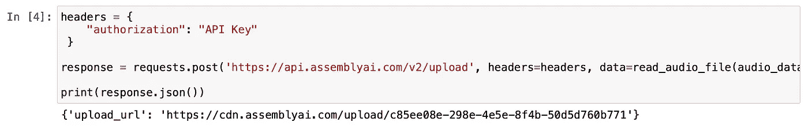
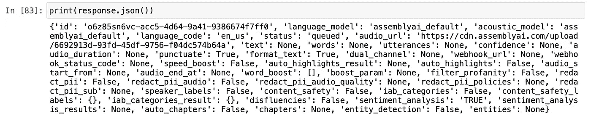
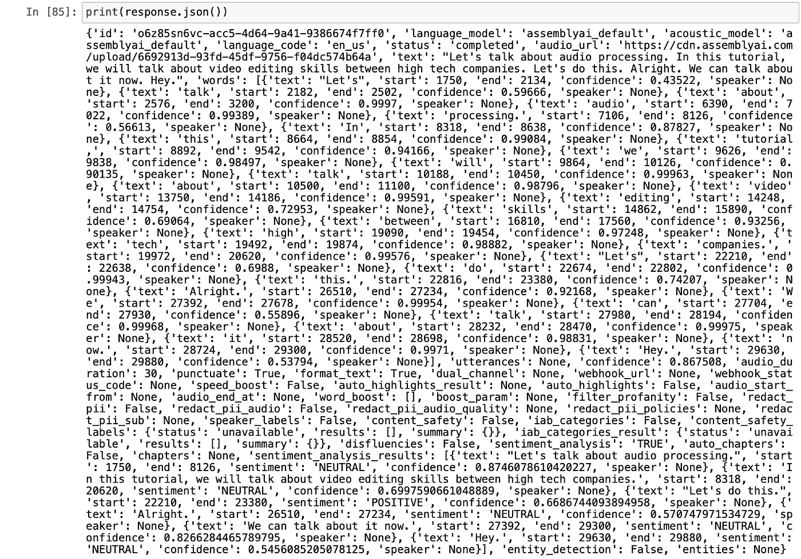
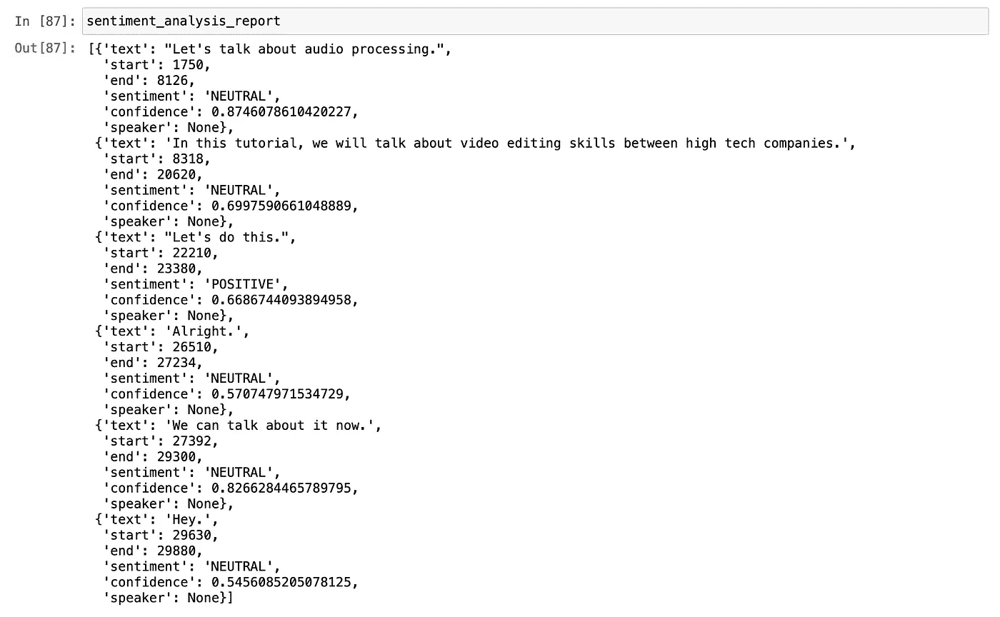

# 语音识别情感分析简介

> 原文：<https://levelup.gitconnected.com/introduction-to-sentiment-analysis-with-speech-recognition-909d49fb5430>

## 动手 Python 机器学习项目


米格尔拍摄的照片。来自[佩克斯](https://www.pexels.com/photo/two-white-message-balloons-1111368/?utm_content=attributionCopyText&utm_medium=referral&utm_source=pexels)的帕德里纳

在这篇文章中，我们将学习如何使用情感分析来分析一篇演讲。情感分析是从写句子中理解观点或情感基调的过程。这是一个很好的话题，通常包含在自然语言处理主题中。

随着人工智能模型的发展，NLP 方法在理解人类时也变得更有思想，更智能。情感分析现在被用于许多行业，从聊天机器人到产品反馈研究。

## 目录

*   *入门*
*   *第一步:库*
*   *步骤 2:音频数据*
*   *步骤 3:带有情感分析的音频转录*
*   *最后一步:了解结果*

# 入门指南

首先，我们需要一些数据来运行我们的情感分析。这些数据可以是你写在文本文档中的一句话，也可以是你在会议上的长篇演讲。

对于本教程，我将使用一些阅读句子的录音。在程序中，我将使用语音识别器将语音转换成文本格式。

我们将使用 AssemblyAI 的[语音转文本](https://www.assemblyai.com/) API。它是一个训练有素的人工智能 API。免费使用。创建帐户后，您将获得一个唯一的 API 密钥。我们将使用该 API 密钥来使用服务和功能。

让我们开始吧。

# 第一步:图书馆

作为我们的编码环境，我会选择 Jupyter 笔记本。我喜欢用它来做像这样的机器学习项目。在不影响整个代码的情况下，很容易跟踪进程并在不同的块上进行特定的更改。

我们需要的库都是 Python 内置的库。所以，我们不需要安装任何库。

让我们打开一个新的 Jupyter 笔记本并导入库。

```
import sys
import time
import requests
```

# 第二步:音频数据

正如你从标题中可以理解的，我们将在这一步导入音频数据。这些数据可以是一个简短的语音备忘录，一个长的演讲，或者任何你想使用的东西。为了简单起见，我会用一小段录音。

当我们的数据准备好了，就该把它导入程序了。由于我们将使用 API 进行转录和情感分析，我们必须将录音上传到云存储。我将使用 AssemblyAI 的云来访问更容易访问的数据。

我会将录音文件移动到我的 Jupyter 笔记本所在的文件夹中。然后在程序中定义它。

```
audio_data = "review_recording.m4a"
```

现在，是时候写一个函数来读取这个录音文件了。顺便说一下，文件格式应该是音频格式，以便我们的阅读功能正常工作。

```
def read_audio_file(audio_data, chunk_size=5242880):
    with open(audio_data, 'rb') as _file:
        while True:
            data = _file.read(chunk_size)
            if not data:
                break
            yield data
```

是时候把我们的录音上传到云端了。

```
headers = {
    "authorization": "API key goes here"
 }response = requests.post('[https://api.assemblyai.com/v2/upload'](https://api.assemblyai.com/v2/upload'), headers=headers, data=read_audio_file(audio_data))print(response.json())
```

太好了！运行完这段代码后。我们将从 API 获得响应。响应消息将包括上传文件的 URL 地址。



图片由[作者](https://lifexplorer.medium.com)提供。

# 步骤 3:带有情感分析的音频转录

快到了！这一步将运行带有情感分析特性的云转录模型。这是一个在几秒钟内获得快速响应的好方法。一切都发生在 AssemblyAI 的云中，我们不必担心我们设备的规格。

[这里的](https://docs.assemblyai.com/audio-intelligence#sentiment-analysis)是官方文档，如果你想了解更多。

好吧，我们开始吧。

我们将定义四个变量:一个字符串、两个字典和一个 POST 请求。当我们添加分配的真实值时，情感分析被启用。如果为 false，请求将进行常规语音识别。

```
speech_to_text_api = "[https://api.assemblyai.com/v2/transcript](https://api.assemblyai.com/v2/transcript)"data = {
  "audio_url": "The upload url address from the previous step",
  "sentiment_analysis": "TRUE"
}headers = {
    "authorization": "API key goes here",
    "content-type": "application/json"
}response = requests.post(speech_to_text_api, json=data, headers=headers)print(response.json())
```

运行这个代码块后，我们的请求订单将进入云队列，等待处理。以下是我收到的回复:



图片由[作者](https://lifexplorer.medium.com)提供。

该 id 是我们的请求 id。我们需要它来跟踪整个过程。状态键显示我们的订单状态。

# 最后一步:了解结果

在最后一步中，我们将检查请求的结果并进行分析。让我们通过运行下面的代码块来检查响应。

```
request_url = "[https://api.assemblyai.com/v2/transcript/o6z85sn6vc-acc5-4d64-9a41-9386674f7ff0](https://api.assemblyai.com/v2/transcript/o6z85sn6vc-acc5-4d64-9a41-9386674f7ff0)"headers = {
    "authorization": "API key goes here"
}response = requests.get(request_url, headers=headers)print(response.json())
```

以下是整个回复的截图:



图片由[作者](https://lifexplorer.medium.com)提供。

让我们继续从这个长字典中筛选出情感分析的关键。

```
sentiment_analysis_report = response.json()['sentiment_analysis_results']sentiment_analysis_report
```



图片由[作者](https://lifexplorer.medium.com)提供。

看起来很完美！我们得到了一份带有几行代码的演讲录音的情感分析报告。情感分析将录音中发现的每个句子分解，然后进行分析以确定它们是积极的、中立的还是消极的。该报告甚至包括模型对其决策的信心程度。是不是很酷？

我们在本教程中所做的只是一个简单的练习；看看这个模型在更长的语音记录中的表现会很有趣。现在，您已经了解了情感分析在实际项目中是如何工作的。从事像这样的动手编程项目是提高编码技能的最好方式。

> 我是贝希克·居文，我喜欢分享关于编程、教育和生活的故事。[订阅](https://lifexplorer.medium.com/membership)我的内容，保持灵感。泰，

**如果你想知道我写什么样的文章，这里有一些:**

*   [使用 Python 设计个性化报价图片](https://towardsdatascience.com/python-for-art-design-personalized-quote-images-using-python-44ef4d8876d8)
*   [分步指南—用 Python 构建预测模型](https://towardsdatascience.com/step-by-step-guide-building-a-prediction-model-in-python-ac441e8b9e8b)
*   [我最近在谷歌的面试经历](https://towardsdatascience.com/my-recent-interview-experience-with-google-c7e8e1206260)