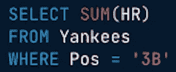

# SQL 简介:聚合函数

> 原文：<https://levelup.gitconnected.com/introduction-to-sql-aggregate-functions-c61197043edb>

## 简介:

SQL(结构化查询语言)是一种特定于领域的语言，在编程中用于管理存储在关系数据库管理系统中的数据。它最初是由 IBM 的 Donald D. Chamberlin 和 Raymond F. Boyce 在 20 世纪 70 年代早期开发的。该系统是为了管理和检索存储在 IBM 原始关系数据库管理系统 System R 中的数据而设计的。SQL 帮助引入了用一个命令访问许多记录的概念，并消除了指定如何访问记录的需要。除了查询数据库之外，SQL 还可以用来创建和修改数据库。

## 聚合函数:

在 SQL 中，您经常想要执行某些函数来进一步分析数据并得出结论。SQL 中的某些函数允许您分析数据，以确定数据框中行或列的最大值、最小值、平均值和总和。

对于下面的例子，我们将假设有一个标题为“Yankees”的纽约扬基队的数据帧。它包括 2019-2020 赛季每个球员的统计数据。列是:球员姓名，位置，命中，人力资源，打点，SB 和平均。

**最大值:**

让我们假设，我们想弄清楚纽约洋基队的哪个球员在 2019-2020 赛季打出了最多的本垒打。为此，我们将使用 MAX 函数。对于本例，代码如下所示:

**最低:**

现在，让我们假设我们想要找出纽约扬基队中哪个球员在 2019-2020 赛季的击球率最低。为此，我们将使用 MIN 函数。对于本例，代码如下所示:

**平均:**

现在，让我们假设我们想要找出纽约扬基队的每个球员在 2019-2020 赛季的平均击球次数。为此，我们将使用 AVG 函数。对于本例，代码如下所示:

**总和:**

最后，让我们假设我们想要找出纽约洋基队的球员在 2019-2020 赛季中被盗垒的总数。为此，我们将使用 SUM 函数。对于本例，代码如下所示:

## 带有 WHERE 子句的聚合函数:

通常，有必要根据规范执行聚合功能。你可能想算出每个位置击出的本垒打总数，而不是全队击出的本垒打总数。通过这样做，您可以从数据中得出进一步的观察和结论。

例如，假设我们想要确定纽约扬基队三垒手击出的本垒打总数。这段代码类似于:

## SQL 算法:

除了对数据框使用聚合函数之外，您还可以使用 SQL 执行基本运算。要执行算术运算，您不需要数据框。用于执行算术运算的符号是不言自明的:

*   Add = +
*   减去= -
*   乘法= *
*   Divide = /

要执行这些函数，您可以使用 SELECT，后跟括号中的等式。

有趣的是，当你将一个整数除以另一个整数时，SQL 将返回一个整数，而不管结果是否应该有小数点。为了解决这个问题，你需要在你的等式中插入带小数位的数字(不是 7/4，而是 7.0/4.0)。

## **参考文献:**

*   唐纳德·张伯伦(2012)。《SQL 的早期历史》。 *IEEE 计算历史年鉴*。**34**(4):78–82。[doi](https://en.wikipedia.org/wiki/Doi_(identifier)):[10.1109/mahc . 2012.61](https://doi.org/10.1109%2FMAHC.2012.61)。[S2CID](https://en.wikipedia.org/wiki/S2CID_(identifier))1322572
*   “欢迎参加本课程！:SQL。*Campus.datacamp.com*，camp . data camp . com/courses/introduction-to-SQL/aggregate-functions。