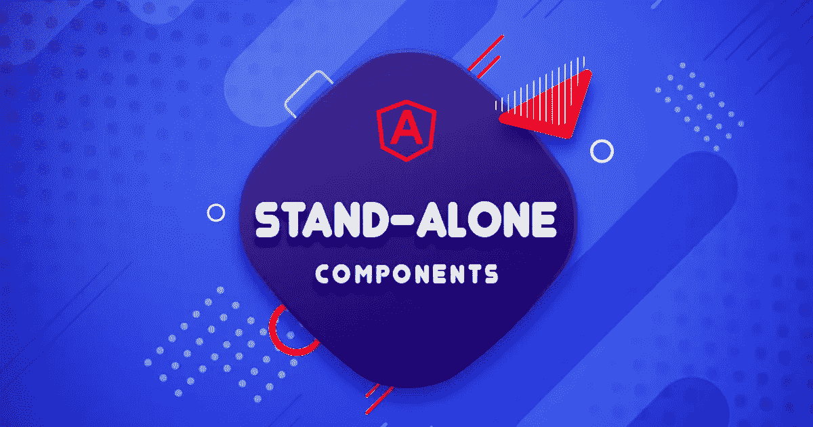
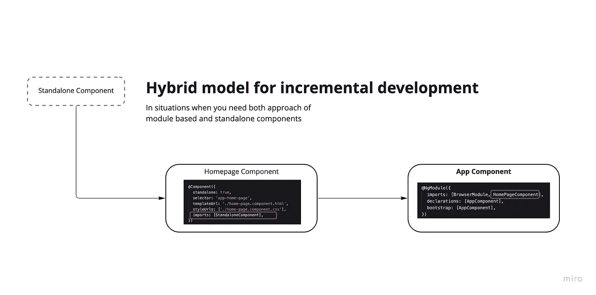

# 带角度 14°的独立组件简介

> 原文：<https://levelup.gitconnected.com/introduction-to-standalone-components-with-angular-14-8cb3079f8f74>



Angular 的 v14 发布的主要特性之一是构建一个独立的组件，而不需要将其导入 NgModules。现有的应用程序也可以逐渐被采用。

> 请注意，这仍然是在开发人员预览模式，这意味着它可能会改变之前，它是一个稳定的版本。

# **在模块内部导入**

以下示例展示了如何在现有模块中导入独立组件。让我们用 Angular cli 快速创建一个新组件

```
***ng g c home-page --standalone=true***
```

> 注意:我使用了一个新选项——standalone，这将在组件“ ***standalone: true*** ”中设置一个标志。

生成后，将主页组件导入到 ***app.module.ts*** 中，如下所示:

```
imports: [AppRoutingModule] //*app.module.ts*
```

当您正处于从早期版本 Angular 升级的位置，并且不想重构整个应用程序时，这种方法非常有用。这就是我在介绍中提到的，采用独立组件可以是一种渐进的方法。

# **导入另一个组件内部**

这是独立组件的真实形式，也是它的导入方式。在这种方法中，组件不在任何模块中声明，而是可以直接导入到另一个组件中。

让我们使用下面的代码生成一个独立的组件

```
ng g c standalone --standalone=true
```

将生成的组件导入到主页组件中

```
@Component({
    selector: 'app-homepage',
    standalone: true,
    imports: [StandaloneComponent],
    templateUrl: './homepage.component.html',
    styleUrls: ['./homepage.component.scss']
})
```

显示如何在不同组件中完成导入的流程图



**演示 Stackblitz**

[https://angular-14-standalone-component . stack blitz . io](https://angular-14-standalone-component.stackblitz.io)

**GitHub 项目**

[https://github.com/ssunils/angular-standalone-component](https://github.com/ssunils/angular-standalone-component)

# 分级编码

感谢您成为我们社区的一员！更多内容请参见[升级编码出版物](https://levelup.gitconnected.com/)。
跟随:[推特](https://twitter.com/gitconnected)，[领英](https://www.linkedin.com/company/gitconnected)，[通迅](https://newsletter.levelup.dev/)
**升一级正在改造理工大招聘➡️** [**加入我们的人才集体**](https://jobs.levelup.dev/talent/welcome?referral=true)