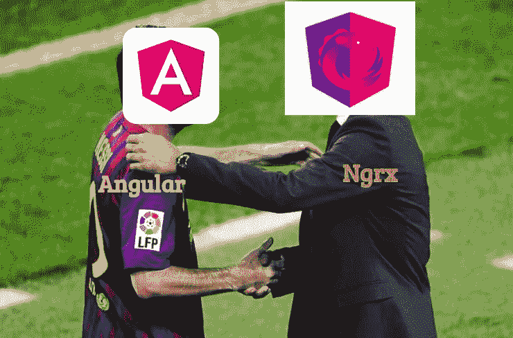
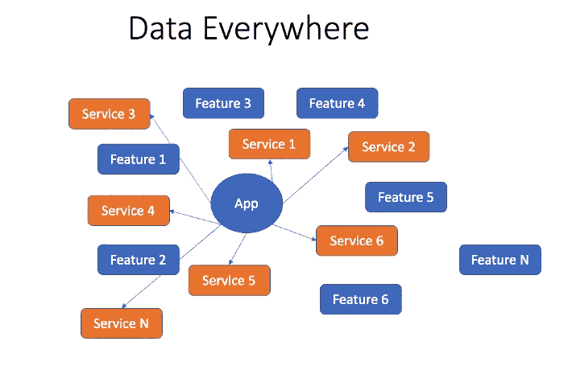
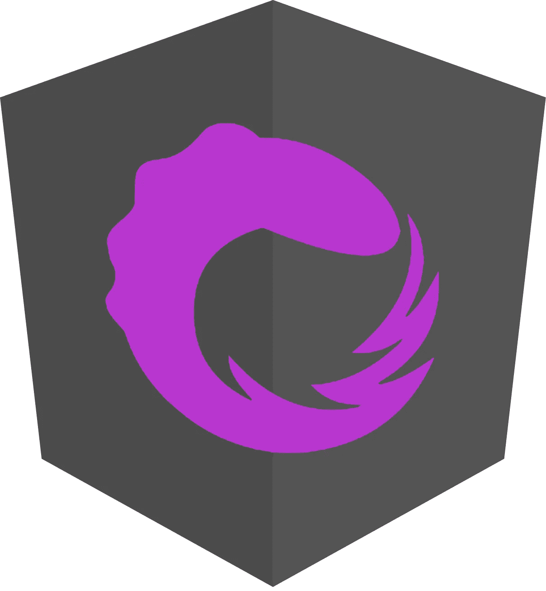
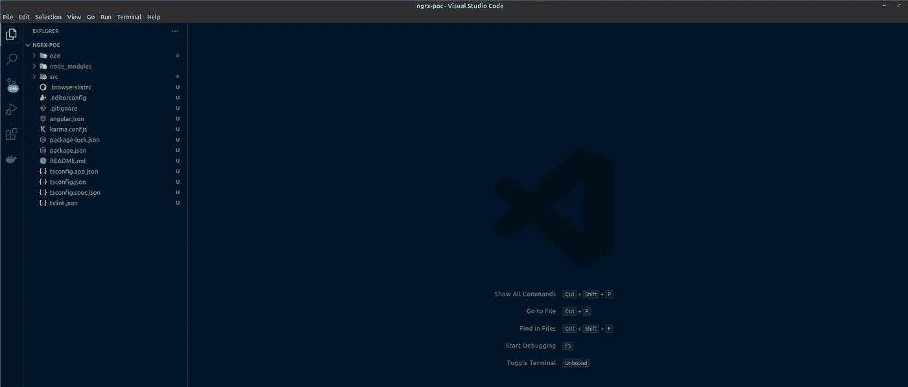
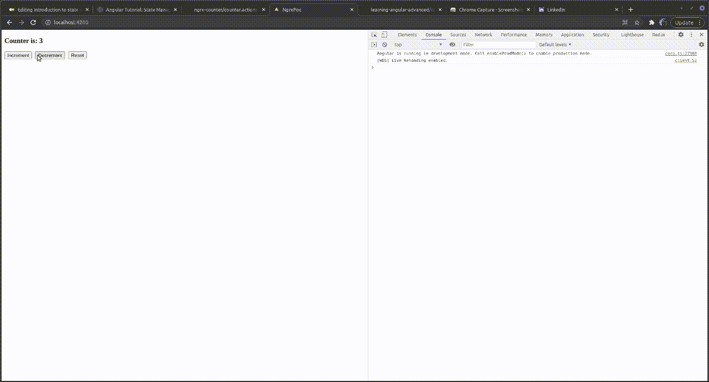
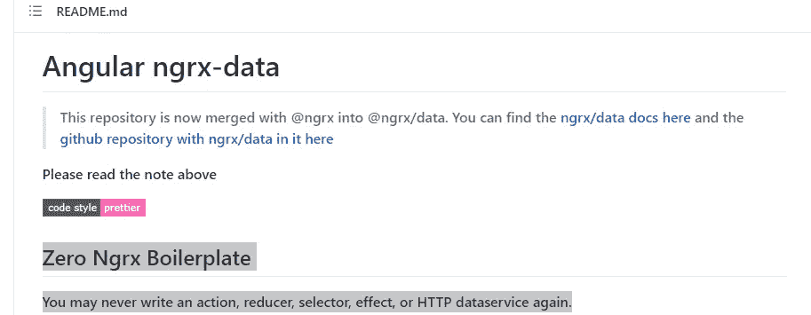
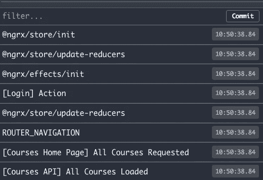
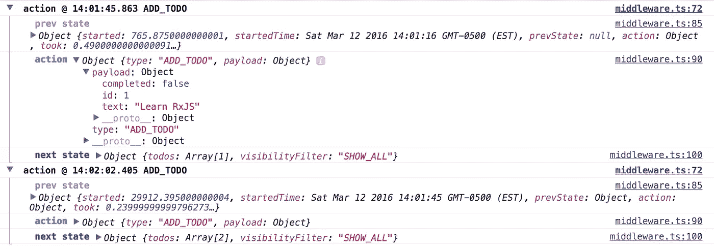
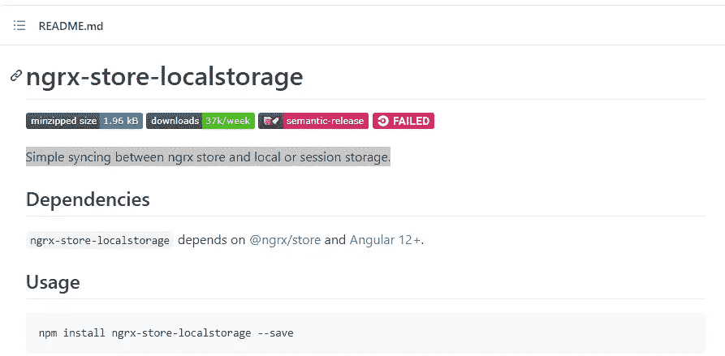

# Ngrx 和 Angular 状态管理简介

> 原文：<https://levelup.gitconnected.com/introduction-to-state-management-with-ngrx-and-angular-91f4ff27ec9f>



# 什么是国家管理📝

在定义状态管理之前，让我们定义什么是状态

"一个状态是一个系统在给定时间内的**表示."**

对于前端应用，状态可以是:

## 状态类型📰

*   **导航状态:**当前用户和带有当前参数的当前路线在哪里？
*   **UI 状态**:模态是否打开，按钮提交是否开启等...
*   **应用程序状态**:可以被应用程序的不同部分调用的状态，比如**当前用户是否登录**
*   **网络状态:**当前是否有从 API 获取数据的进程
*   **通信状态**:描述对其他服务器请求的值(如“加载”值)

## 状态管理📰：

**问题** ❌ **:**

**如今，** web 应用程序的复杂性正在增长，结果**管理像**(在组件间共享**数据、**、**用户动作、UI 状态**等)**这样的任务**变得很难


## 解决方案:

定义一种方法，该方法负责定义跨所有应用程序的全局状态，并对该状态进行操作(添加、删除、更改等)..)并促进跨组件的通信和数据共享

# 国家管理的好处🔥 💥：

将状态管理模式应用到您的前端应用程序可以提供许多优势和好处:

*   **集中状态**:存储中的状态保存在一个目录中。这使得预测商店的更新或变化以及追踪问题(单一来源的事实)变得更加容易✔️
*   **性能**(数据单向流动)✔️
*   应用程序变得**更容易测试**(更有条理，状态表示易于阅读，数据可在我们需要 it)✔️时随时访问
*   **调试更容易** ✔️
*   自动与**本地存储器**同步。这使您可以在刷新✔️页面时保留数据
*   **避免**大量不必要的 API 调用✔️

# 状态管理的用例:💶 💶

在我们的应用程序中，有一些需要应用状态管理架构的常见情况，例如:

*   存在需要在多个组件中访问/共享的变量(获取当前用户)
*   创建/更新数据后更新页面而不刷新
*   整个应用程序的 Ui 全局主题变化(黑暗模式示例)

# 在没有状态管理的情况下，数据如何通过角度❓流动


对于 Angular 项目，一个常用的解决方案是通过服务共享数据，功能的数量增加了，服务的数量也增加了，这会给数据管理和项目维护带来一些困难！

正如下图中提到的，没有状态管理解决方案，数据无处不在，我们没有数据的**单一来源**，项目看起来很难维护。🙏🏻 🙏🏻 🙏🏻



# 使用角度✒️ ✂️:进行状态管理的可用工具

有一些流行的工具可以为我们的 Angular 应用程序进行状态管理

# ☝️本地 Rxjs:

我们可以通过使用简单的 **Rxjs** 操作符，如 **BehaviorSubject** 来保存状态，使用 **pipeable 操作符**来修改状态，从而在应用程序的不同部分之间共享数据。


# 秋田↖️:

> [Akita 是一种建立在 RxJS 之上的状态管理模式，它采用 Flux 中的多个数据存储和 Redux 中的不可变更新的概念，以及流数据的概念，来创建可观察的数据存储模型。](https://datorama.github.io/akita/)


# NGXS ⚓:

> NGXS 模仿了在 Redux 和 NGRX 等库中普遍实现的 CQRS 模式，但通过使用现代的类型脚本特性(如 classes 和 decorato *rs)减少了样板文件。*


# Ngrx ✈️ ✈️:



## Ngrx 是什么？

Ngrx 是一组用于反应式扩展的角度库，它实现了 Redux 模式，并且通过 **RXJS** 得到了增强

它为 Angular 应用程序的状态管理提供了一个解决方案

是由 Rxjs 超级大国(`RxJS`)打造的。`BehaviorSubject`、`Subject`和`Observable)`

## 为什么我们会选择 Ngrx ⁉️

老实说， **Ngrx** 是用于状态管理的最著名的库，我没有结合其他工具来做一些深入的技术比较

所以作为一个初学者和博客的标题说“简介 **Ngrx**

## Ngrx 核心概念:


来源:[https://ngrx.io/guide/store](https://ngrx.io/guide/store)

## 商店:


商店是我们前端应用程序的数据库

它将不同状态的所有应用组合在一个实体中，我们称之为单一的真理来源，并且是不可变的

## 状态:

状态呈现了彩妆店的数据结构，以及数据库中的字段！

可以是**服务器端 API 响应**，用户输入，路由器状态

状态存在于商店的环境中

## 动作:


动作表示将由用户触发以更新商店的事件，

“它们代表从应用程序发送到商店的有效信息负载”

“在代码中，一个动作由一个普通的旧 JavaScript 对象表示，该对象有两个主要属性，即`type`和`payload`。`payload`

一个**动作**的示例定义:

并且应该在组件内部调用这个方法来

## 减速器:


如果我们可以用一个传统的数据库来替代，那么存储就是整个数据库，缩减者吃表

它是一个负责改变状态的纯函数，接受两个参数:动作和前一个状态，进行修改并返回新的状态对象

## 效果:


*   **Effect** :“一种机制，在可观察的流中监听分派的动作，处理服务器响应，并立即或异步地向 reducer 返回新的动作以改变状态。请注意，我们在这个示例应用程序中没有使用‘效果’。”

当一个动作被分派到商店时，执行副作用的效果

[@ngrx/effects](https://github.com/ngrx/platform/tree/master/docs/effects) 库提供了一种将副作用隔离到自己模型中的方法

## 选择器:


**选择器**:选择器是从存储器中获取一部分状态的功能。

这些是对我们商店的询问

**选择器优点:**

选择器是一个纯粹的函数，它保存着以前执行的记忆。只要输入没有改变，就不会重新计算输出”

## Ngrx 的缺点🚫 ❌ :

*   刚开始使用 NgRx 时的学习曲线。
*   这个应用程序会有点冗长(介绍几个概念减少器、选择器、效果、新艺术、包大小！
*   NgRx 指数级地增加了代码的复杂性，带来了大量不必要的样板代码

# 应用示例(反应用)💻：

在这一部分，我将尝试向您解释一个用 angular 和 **Ngrx** 构建的小应用程序，以掌握和操作我们在其他部分讨论过的一些理论概念

## **1)使用 Angular-CLI 生成角度 App:**

第一步，我们将使用 angular-CLI 生成一个项目

```
**ng new ngrx-poc --style=scss --routing=false**
```

## **2)使用 Vscode 打开您的项目:**

只需输入代码。在您的终端中有当前的项目目录

```
code .
```



## **3)运行 App :**

按照这些命令运行项目

```
**cd ngrx-poc****npm start**
```

## **4)安装 NgRx 和工具:**

我们需要安装 **Ngrx 依赖关系**和 **devtools**

```
**npm install @ngrx/store --save****npm install @ngrx/effects --save****npm install @ngrx/store-devtools --save**
```

## 5)定义你的状态

我们将定义的第一件事是将在我们的应用程序中使用的存储结构

通过在 **/app/store** 下创建文件 **counter.state.ts**

```
*export* *interface* CounterState {*counter:* number;}*export const initialState: CounterState = {**counter: 4**}*;
```

## 6)定义我们的行动

下一步，我们将定义可应用于商店的不同操作，

在 **/store** 下创建一个文件 **counter.actions.ts**

```
*import* { *createAction*, *props* } *from* '@ngrx/store';*export const increment = createAction(*'increment'*)*;*export const decrement = createAction(*'decrement'*)*;*export const reset = createAction(*'reset'*)*;*export const incrementAction = createAction(*'[Counter] Increment'*,**props<{ count: number }>()**)*;
```

## 7)定义我们的减速器

在定义了我们的存储和动作之后，让我们准备 reducer 函数负责更新存储的元素

```
*import* { *Action*, *createReducer*, *on*, *State* } *from* '@ngrx/store';*import* { *CounterState*, *initialState* } *from* './counter.state';*import* * *as* *CounterActions* *from* './counter.actions';*const counterReducer = createReducer(**initialState,**on(CounterActions.increment, (*state*) => {**return {**...state,**counter: state.counter + 2,**};**}),**on(CounterActions.decrement, (*state*) => {**return {**...state,**counter: state.counter - 2,**};**}),**on(CounterActions.reset, (*state*) => {**return {**...state,**counter: 0,**};**})**)*;*export* *function* *reducer*(state*:* CounterState *|* undefined, action*:* Action) {*return* *counterReducer*(*state*, *action*);}
```

## 8)用于存储数据选择的选择器

正如我们在前一部分所解释的，选择器是负责从状态中选择必要数据的部分

在/store 文件夹下创建一个 **counter.selector.ts** 文件

```
*import* { *createFeatureSelector*, *createSelector* } *from* '@ngrx/store';*import* { *CounterState* } *from* './counter.state';*export const COUNTER_STATE_NAME =* 'counter';*export const selectCounter =**createFeatureSelector<CounterState>(COUNTER_STATE_NAME)*;*export const getCount = createSelector(**selectCounter,**(*state*: CounterState) => state.counter**)*;
```

## 9)将商店和减压器添加到 app。组件

我们现在需要将 **StoreModule** 导入到 app 模块并链接到 reducer

```
*@NgModule*({declarations: [*AppComponent*],imports: [*BrowserModule*,*StoreModule*.*forFeature*(*COUNTER_STATE_NAME*,*reducer*)],providers: [],bootstrap: [*AppComponent*]})*export* *class* AppModule { }
```

## 10)生成计数器组件和子组件

现在，我们需要定义应用程序的 **UI** 部分，通过定义将成为计数器组件的 ***容器组件*** 和将成为计数器组件的 ***e 表示组件***

## 10.1:生成计数器组件

```
ng g c counter
```

## 10.2:生成计数器按钮组件

```
ng g c counter-buttons 
```

将这段 HTML 代码添加到**counter-buttons.component.html**

```
<div><button *class*="btn btn-primary" *(click)*="onIncrement()">Increment</button>&nbsp;<button *class*="btn btn-warning" *(click)*="onDecrement()">Decrement</button>&nbsp;<button *class*="btn btn-info" *(click)*="onReset()">Reset</button></div>
```

并将此 ts 代码发送到**counter-buttons . component . ts:**

正如代码中提到的，我们需要在组件中注入'**Store:Store<CounterState>**来连接我们的存储

```
*import* { *Component*, *OnInit* } *from* '@angular/core';*import* { *Store* } *from* '@ngrx/store';*import* { *decrement*, *increment*, *reset* } *from* '../store/counter.actions';*import* { *CounterState* } *from* '../store/counter.state';*@Component*({selector: 'app-counter-buttons',templateUrl: './counter-buttons.component.html',styleUrls: ['./counter-buttons.component.scss']})*export* *class* CounterButtonsComponent *implements* OnInit {*constructor*(***private* store*:* Store<CounterState>**) { }*ngOnInit*()*:* void {}*onIncrement*(){***this*.*store*.*dispatch*(*increment*())**}*onDecrement*(){***this*.*store*.*dispatch*(*decrement*())**}*onReset*(){***this*.*store*.*dispatch*(*reset*())**}}
```

***“这个*。*储存*。*分派* ( *增量* ())** "是一个如何分派动作的例子，该动作将由更新状态的减速器解除(通量模式数据流)

## 11)组件计数器输出以输出数据

现在我们需要定义一个新的组件“计数器输出”,一个显示当前状态计数器值的表示性组件！

**计数器输出组件 ts** :

***本*。*储存*。*选择*(*get count*)**从存储器中选择计数器值

```
*import* { *Component*, *OnInit* } *from* '@angular/core';*import* { *Store* } *from* '@ngrx/store';*import* { *Observable* } *from* 'rxjs';*import* { *getCount* } *from* '../store/counter.selector';*import* { *CounterState* } *from* '../store/counter.state';*@Component*({selector: 'app-counter-output',templateUrl: './counter-output.component.html',styleUrls: ['./counter-output.component.scss']})*export* *class* CounterOutputComponent *implements* OnInit {*counter$* *:* Observable<number>*constructor*(*private* store*:* Store<CounterState>) {}*ngOnInit*()*:* void {*this*.*counter$* *=* *this*.*store*.*select*(*getCount*)}}
```

**counter-output . component . html:**

用 **async** | pipe 显示当前计数器值:

```
<div><h3>Counter is: {{ counter$ | async }}</h3></div>
```

## 12)计数器容器组件最终代码:

最后，这就是我们应该如何在内部集成子组件代码

**counter.component.html**

```
<div *class*="row"><div *class*="col-md-12"><div *class*="my-6"><app-counter-output></app-counter-output></div><div *class*="my-6"><app-counter-buttons></app-counter-buttons></div></div></div>
```

**app.component.html**

```
<div><app-counter></app-counter></div>
```

## **运行 App:**

```
**npm start**
```

## 最终输出:



可以找到源代码:[https://github . com/Rebaiahmed/learning-angular-advanced/tree/main/ngrx/ngrx-POC](https://github.com/Rebaiahmed/learning-angular-advanced/tree/main/ngrx/ngrx-poc)

# 附录📘 📙：

## [角度 ngrx-数据:](https://github.com/johnpapa/angular-ngrx-data)



零 Ngrx 样板文件您可能再也不会编写动作、缩减器、选择器、效果或 HTTP 数据服务了。

## @ngrx/entity

是管理不可变集合的好方法。

## [@ ngrx/router-store**:**](https://ngrx.io/guide/router-store)

> 连接 Angular 路由器和商店的绑定。在每个路由器导航周期中，会调度多个操作来监听路由器状态的变化。然后，您可以从路由器的状态中选择数据，为您的应用程序提供附加信息

## [@ngrx/schematics](https://ngrx.io/guide/schematics)

提供脚手架。NgRx 命令被集成到 angular CLI 中，并且大多数 NgRx 元素可以使用 Angular CLI 创建。那么，让我们添加 NgRx 原理图。(您可以使用新的终端窗口，或者通过按 Ctrl+C 键退出正在运行的 angular 应用程序)

*   `**ng add @ngrx/schematics@latest**`

## [@ngrx/store-devtools :](https://ngrx.io/guide/store-devtools)

Store Devtools 为[商店](https://ngrx.io/guide/store)提供开发工具和仪器。



Ngrx devtools 截图示例

## [ngrx-store-logger:](https://github.com/btroncone/ngrx-store-logger)

@ngrx/store 应用程序的高级日志记录，从 [redux-logger](https://github.com/fcomb/redux-logger) 移植而来。



## [ngrx-商店-本地存储:](https://github.com/btroncone/ngrx-store-localstorage)



ngrx 存储和本地或会话存储之间的简单同步。

## [Nx :](https://nx.dev/)

是一套用于 monorepos 的可扩展开发工具，它扩展了 Angular CLI。Nx 附带了一组实用程序，帮助编写处理路由器和服务器通信更简单的效果


## 参考📓 📕：

*   [https://www . top tal . com/angular-js/ngrx-angular-reaction-application](https://www.toptal.com/angular-js/ngrx-angular-reaction-application)
*   [https://stackoverflow.com/search?page=3&tab =票数& q=ngrx](https://stackoverflow.com/search?page=3&tab=Votes&q=ngrx)
*   [https://blog . nrwl . io/using-ngrx-4-to-manage-state-in-angular-applications-64e 7a 1 f 84 b 7 b](https://blog.nrwl.io/using-ngrx-4-to-manage-state-in-angular-applications-64e7a1f84b7b)
*   【https://stackabuse.com/beginners-guide-to-ngrx-and-angular/ 
*   [https://ngrx.io/](https://ngrx.io/)
*   [https://medium . com/bb-tutorials-and-thoughts/why-state-management-is-important-for-angular-apps-e 2e 7 ba 8872 f1](https://medium.com/bb-tutorials-and-thoughts/why-state-management-is-important-for-angular-apps-e2e7ba8872f1)
*   [https://github.com/search?q=ngrx](https://github.com/search?q=ngrx)
*   [https://dzone . com/articles/angular-app-state-management-with-ngrx](https://dzone.com/articles/angular-app-state-management-with-ngrx)
*   [https://react-community-tools-practices-cheat sheet . netlify . app/state-management/overview/](https://react-community-tools-practices-cheatsheet.netlify.app/state-management/overview/)
*   [https://ordina-jworks . github . io/angular/2018/10/08/angular-state-management-comparison . html](https://ordina-jworks.github.io/angular/2018/10/08/angular-state-management-comparison.html)

# 结论❤️:

作为结论，我试图用**角度的**应用程序的优点、缺点和核心概念来解释状态管理的概念，

我还添加了一个小例子来探索 Ngrx 工具和 angular 术语

如果您有任何问题，请随时添加您的评论或在 GitHub [repo](https://github.com/Rebaiahmed/learning-angular-advanced/tree/main/ngrx/ngrx-poc) 中提出问题

通过编码学习