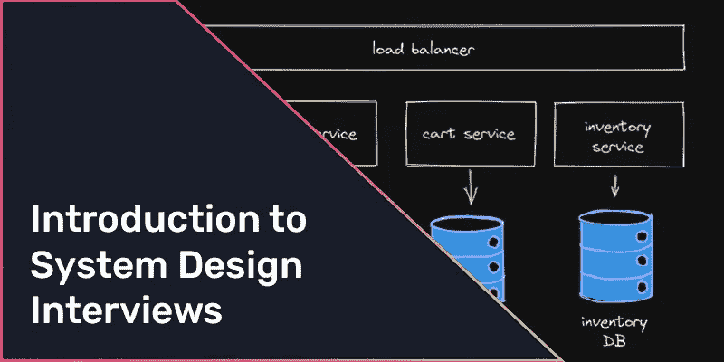

# 系统设计面试介绍

> 原文：<https://levelup.gitconnected.com/introduction-to-system-design-interviews-56d4cfa0ee36>

本文将概述在高级系统设计面试中需要关注的实践和领域。我希望这些信息对有 1-3 年工作经验的工程师或从未参加过系统设计面试的人最有帮助。

此外，本文预计将作为一个起点，读者可能需要利用其他资源来更深入地挖掘所引用的概念和术语。

# 你能期待什么

系统设计面试的形式很大程度上取决于你面试的公司和你申请的职位级别。例如，实习生或准候选人可能会被要求画出一个系统中的多个类或模块是如何相互作用的。相反，一个更有经验的候选人可能会被要求设计一个完整的分布式系统。

## 白板

这些面试通常以“白板”的形式进行，面试官会要求应聘者用图表展示他们的答案。在远程工作越来越流行之前，这将在物理白板上进行；然而，随着越来越多的工程人员转向远程工作，这些面试越来越多地使用类似于 [Excalidraw](https://excalidraw.com) 、 [tldraw](https://www.tldraw.com/) 、[diagrams.net](https://app.diagrams.net/)以及类似的在线白板工具进行。理想情况下，雇主会让你知道他们在面试中使用哪些工具，我强烈建议你提前熟悉这些工具。如果雇主没有让你知道他们希望你使用哪种工具，不要担心，面试官不应该根据你使用工具的熟练程度来给你打分。

## 问题

系统设计问题旨在了解候选人深入思考系统及其需求的能力。这些问题通常要求候选人谈论他们已经工作过的系统，或者更常见的是，谈论一个理论场景。

以下是我、他人或我自己被问到的问题示例:

*   你能描述一下你最近工作过的一个系统吗？
*   你会如何设计社交媒体应用的后端？
*   你会如何设计停车库的系统？
*   你会如何设计一个电子商务网站？
*   你会如何为一个大型博客设计内容管理系统？

对于特殊的行业，面试官可能会问你一个特定于他们所在领域的问题，所以了解他们行业的一些复杂性不会有什么坏处。然而，面试官很可能会问你一个一般性的问题，所以在你准备的时候，不要太过深究专业的解决方案。

# 准备面试

系统设计面试可以也应该是你刻意准备的，就像其他面试一样。

实践系统设计的一个简单方法是画出你当前正在工作的系统的图表，并识别出你没有定义或不知道的组件或区域。这个练习应该可以帮助你确定额外的准备领域。例如，您的系统可能使用特定类型的数据库或利用云提供商进行数据块存储。您知道最初的设计者为什么选择了特定的数据库技术吗？还是块存储的优势和权衡？更深入地研究这些和相关的话题应该是你面试准备的一部分。

## **你目前的工作**

如果你目前工作的系统不是非常复杂或者令人兴奋，你可能缺乏经验，因此在从头开始设计系统时处于不利地位。如果这适用于你，建议花时间回答上面的一些示例问题，在 YouTube 等平台上观看模拟面试，甚至请你的朋友或信任的同事与你一起进行模拟面试。

# 寻找顾客

一个系统只有服务于客户的需求才有帮助。

## 识别客户

“客户”是系统的任何用户。这些“客户”可能是使用移动应用程序与您的系统交互的实际人员，也可能是公司微服务架构内的其他服务。作为系统设计师，你需要问自己，“谁是我的主要客户？”，然后在设计系统时将客户放在心上。

确定谁是系统的主要客户以及这些客户对系统有什么要求是至关重要的。如果在面试时不清楚谁是客户，建议直接问面试官:“谁是这个系统的主要客户？”。面试官应该能够接受这类问题。

此外，你可以根据面试官的陈述做出假设，从而确定主要客户。例如，如果面试官让你“设计抖音”(一款流行的视频分享应用)，你可以假设客户是主要使用智能手机与系统互动的全球用户。一旦你认为你知道谁是主要客户，你应该和面试官一起验证这个假设；“假设我的主要客户是使用智能手机应用程序的全球用户是否安全？”。

# 确定客户需求

客户的“需求”通常可以定义为“功能性需求”或“非功能性需求”在你开始提供你的解决方案之前，有必要和面试官一起确认需求(功能性和非功能性的)。

## 功能需求

一般来说，你应该从定义系统的功能需求开始，你的面试官应该能够接受你关于这些需求的问题。例如，对于“设计抖音”这个问题，你可以问你的面试官下面列出的功能需求是否满足客户的需求。面试官可能会回答，“我觉得很棒！”如果没有，你应该试着挖掘你可能错过的功能需求。

*   上传短视频(长度<= 3 minutes)
*   view a “feed” of videos
*   “like” videos
*   comment on videos

As you dig into your system design, these functional requirements should also expand to include the fundamental ways they will be satisfied. For example, it would be a good idea to list out the various API endpoints needed to satisfy each requirement and maybe even which database structures (tables, documents, etc.) might be required to support those API endpoints. Later on, we’ll touch a bit more on when you should go into detail and also when you should leave things vague.

## Non-functional requirements

Along with functional requirements, non-functional requirements should be identified and vetted with the interviewer before you dig into or decide on system architecture and start creating a diagram. These non-functional requirements could include concepts such as:

*   High Availability
*   Low Latency
*   Eventually Consistent (or Strongly Consistent)

When determining which of these are relevant to your system, you should always ask yourself how this requirement would serve or impact your customer (the end-user). For example, in the question to “design TikTok,” you might presume that this system could support an architecture that is “Eventually Consistent.” You could argue that it is more important that users can quickly access videos in their feed than for those videos to be the latest or most up-to-date. This argument would suggest that eventual consistency is sufficient.

When making these arguments or assumptions, you should again validate them with your interviewer. If you fail to validate your assumptions, you may be leaving yourself open to a “curveball” later if the interviewer decides to introduce a constraint contrary to an assumption you made and that your design does not support.

To validate your assumptions, you may pose the question to your interviewer; “Is it safe to assume that it is more important for the video feed to load quickly than it is for the videos to be the most up to date?”.

# **知道适当的详细程度**

在回答系统设计问题时，一个常见的失误是提供的细节太多或太少。了解并确定面试官对你的要求的详细程度，对于正确而充分地回答你的问题至关重要。记住面试是求职者和面试官之间的双向对话，问这些问题变得舒服会让你更成功。当描述系统的一个特定组成部分时，花一点时间停下来问你的面试官，“这是你期望的详细程度吗，还是你希望我给出更多或更少？”。

例如，过早地给出太多的细节会妨碍你，特别是当你比其他人更详细地深入挖掘系统的某个特定部分时。例如，您正在设计的系统可能需要一些数据库或数据存储，您可能急于脱口而出想到的第一种数据库技术，或者您最喜欢的技术。除非你已经和面试官确定他们对这些细节感兴趣，否则尽量避免这样做。如果你很想推荐一个具体的解决方案，一定要和面试官确认他们当时是否想要这些细节，但是推迟这个决定也是有利的。

通过避免不必要的细节，你可以让自己在以后有更多信息的时候灵活地做出决定。您还可以避免对可能不符合系统需求的解决方案或技术表现出潜在的偏见。如果你甚至声称数据库将是 NoSQL 数据库，甚至更糟的是，将专门使用 Cassandra，你已经强烈表示你认为这些技术将为系统提供重要的价值。采访者完全有权利深入质疑这些决定。

# **不要带着解决方案出现**

您可能已经在一些不同的架构中工作过，您甚至可能有一个您认为最好的最喜欢的设计或模式。经验和观点都很棒，但这在回答系统设计问题时可能是个陷阱。最好避免使用僵化的现有解决方案或设计来接近系统。

例如，假设你是事件驱动架构的忠实粉丝，并且已经开始或幻想如何将这种模式应用到面试官描述的任何场景中。在这种情况下，当系统的功能性或非功能性需求不符合您预先确定的解决方案的限制时，您很快就会失败。

最好是理解标准组件和方法，以及在什么情况下可以使用它们来满足任何给定场景的不同需求，而不是在脑海中出现一个架构。虽然下面的列表并不全面，而且最佳组件和方法会因系统而有很大差异，但建议您了解每种组件和方法的价值以及它们的利弊。这些主题可能是中级和高级后端工程面试的预期知识。

*   垂直与水平缩放
*   整体架构与微服务架构
*   数据库方法(关系、NoSQL、图表)
*   事件/消息队列
*   负载平衡器
*   数据块/云存储
*   内容交付网络(CDN)
*   无服务器/Lambdas

# 后续步骤

我希望这篇文章能让你对系统设计面试有所了解，并能让你成功地通过面试。正如开头所说，这篇文章可能不是你准备工作的终点，而是它刚刚开始的地方。我强烈建议通过其他资源深入挖掘上述概念，并观看模拟系统设计面试(或 ten ),以更广泛地了解常见问题和合适的方法。

如果你是在准备即将到来的面试时读到这篇文章的，我祝你好运😊。请随时在下面留下任何问题/评论，如果你喜欢这篇文章，请查看我的其他[社交媒体账户](https://linktr.ee/viglucci)！

*最初发表于* [viglucci.io](https://www.viglucci.io/introduction-to-system-design-interviews) *。*