# Angular 中的单元测试介绍

> 原文：<https://levelup.gitconnected.com/introduction-to-unit-test-in-angular-3d9fc704eaa8>


# 介绍

欢迎大家！在这个新的系列—**Angular 中的单元测试**中，我们将回顾在 Angular 中进行单元测试所需要知道的每一个知识。在本教程中，我们将首先介绍单元测试的一些基本概念，然后在接下来的每个教程中重点介绍 Angular 中单元测试的不同方面。说的够多了，让我们以 Angular 的方式跳入单元测试的世界。这个系列是为绝对的初学者准备的。我们将从 Angular 中非常基本的单元测试思想开始，逐步增加每一章来涵盖 Angular 中单元测试的整个方面。不需要预先了解单元测试，所以如果你觉得这个主题对你来说太基础了，可以跳到下一个合适的教程。

# 如何在 Angular 中运行测试？

当您开始一个全新的 Angular 项目时，您会注意到除了用于 app 组件的 HTML、Javascript 和 CSS 文件之外，还有另一个名为 **app.component.spec.ts** 的文件。

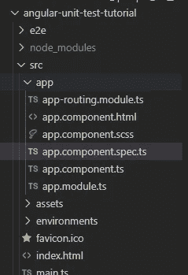

第一个测试文件— app.component.spec.ts

默认情况下，Angular 会为使用 ng 命令创建的每个文件创建一个测试文件。Angular 中的测试文件以 ***.spec.ts** 扩展名指定。因此，根据您想要测试的文件，为您创建的测试文件 Angular 可能会被命名为 xxx.component.spec.ts 或 xxx.service.spec.ts。当您开始在 Angular 中运行测试时，Angular 会找到所有带有 spec.ts 扩展名的测试文件，并逐一执行测试用例。

角度测试可以通过命令 **ng test** 开始。当你输入命令时，默认情况下会打开一个 Chrome 窗口，你会在那里看到你的测试结果。

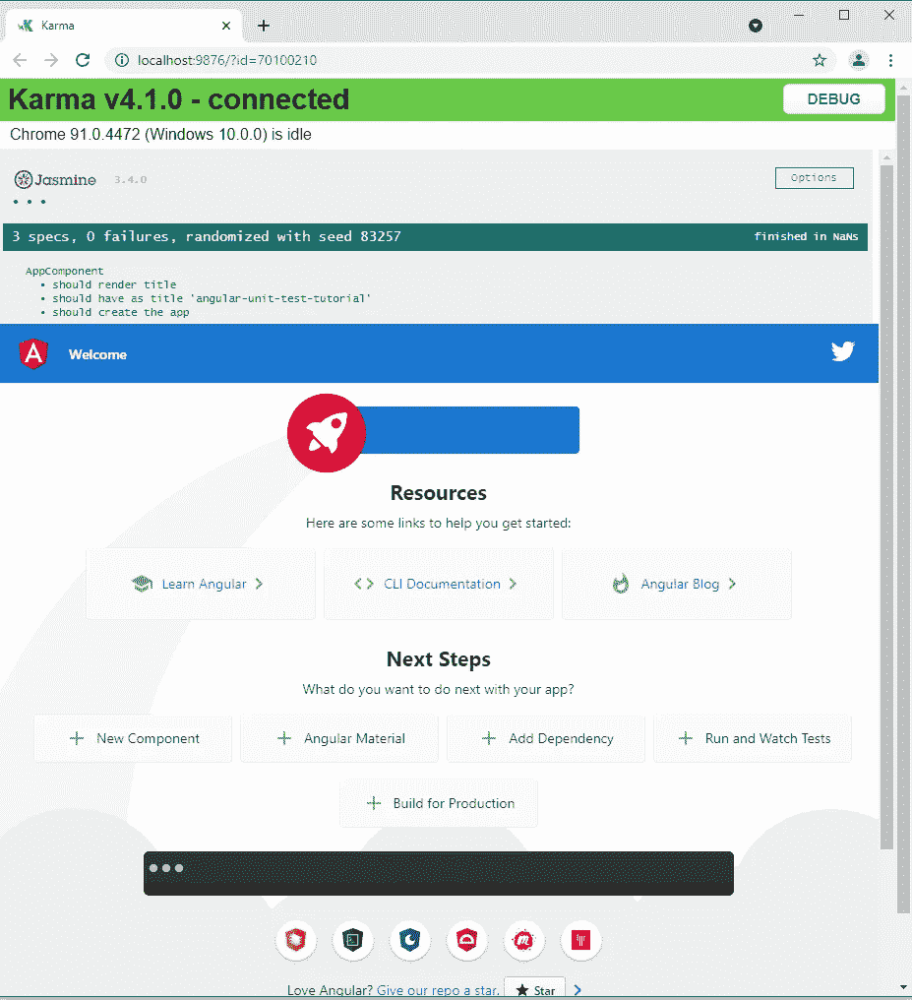

测试窗口

在 Angular 中，测试是用 Jasmine 编写的——一个 Javascript 框架，它允许我们以人类可读的格式编写测试。Jasmine 不仅用于 Angular，还用于纯 Javascript 以及其他前端框架，如 Vue 或 React。它附带了测试套件、测试用例，以及一些内置的匹配器，我们将在本系列的后面介绍这些。

在 Jasmine 之上，我们使用 Karma 为我们运行测试。当我们用 Karma 开始测试时，它会打开一个浏览器并监控我们的文件。每当文件发生变化，Karma 都会为我们刷新浏览器，这样我们的测试结果就会一直反映最新的代码。

# 了解测试结果

在角度测试中，每个测试有三种可能的结果:成功(通过)、失败或跳过。

通过的测试用例将由一个绿点表示。
失败的测试用例将由一个红色叉号表示，后跟失败原因。一个被跳过的测试用例将由一个黄色的星形符号表示。

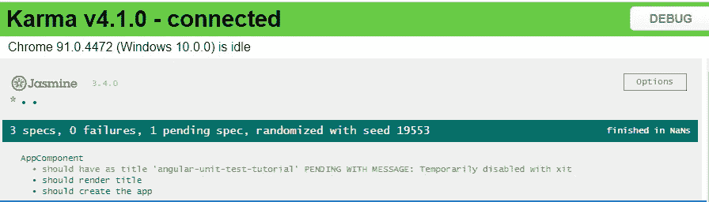

成功和跳过的测试

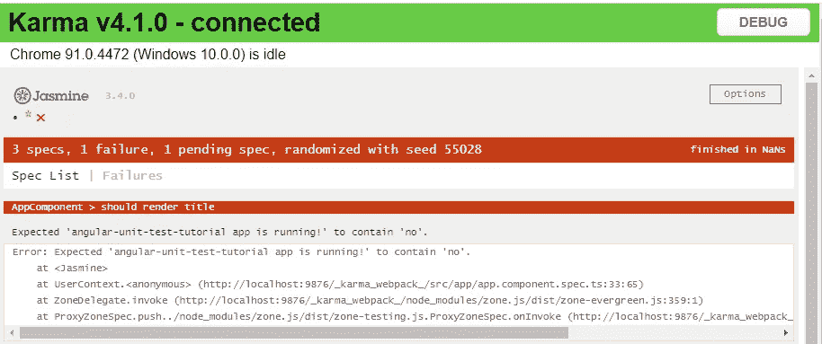

成功、跳过和失败的测试

# 术语

让我们通过查看测试文件来理解一些术语。

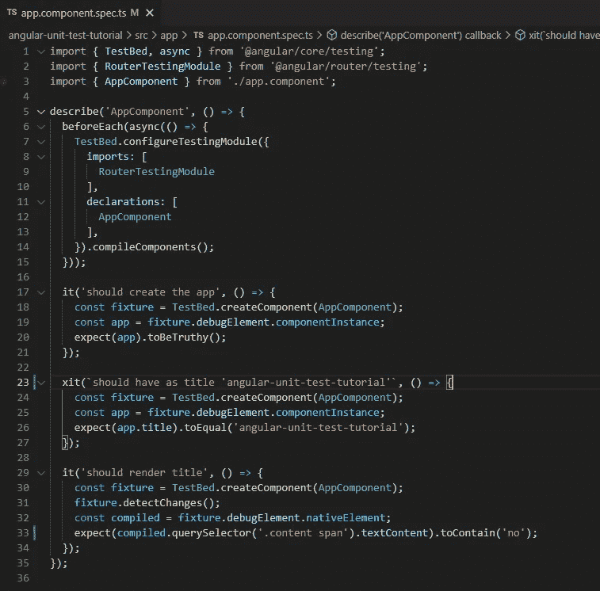

样本测试文件内容

## 测试套

每个角度测试文件都以一个名为**描述**的函数开始，也称为**测试套件**。describe 函数接受两个参数，**测试套件的名称**和**一个包含所有测试用例的回调函数**。默认情况下，测试套件的名称将被设置为文件名，这样您就可以直接从测试结果窗口中轻松地区分哪个测试文件包含失败的测试。

## 安装和拆卸功能

在测试套件中，我们将在每个函数之前看到一个**，它为我们准备了**测试平台**。顾名思义, **beforeEach** 函数将在每个测试用例之前由 Angular 执行。在 beforeEach 函数中注册的实例将在每个测试用例之前重新初始化，以确保所有实例在新测试开始之前都处于干净状态。这个过程被称为**设置过程**。**

相比之下，在每个之后有另一个被称为**的函数，它将在每个测试用例之后执行。afterEach 函数的目的是让您做一些清理工作。即使在每次测试之前对 beforeEach 函数中声明的实例进行了重新初始化，仍有一些数据可能会在测试之间持续存在。例如，存储在浏览器中的数据，如 localStorage 或 sessionStorage。如果您有可能跨测试用例持续存在的数据，那么在 afterEach 函数中进行清理总是一个好的做法。这个过程被称为**拆卸过程**。**

**在每个**之前—在每个测试用例
之前**之后**之后—在每个测试用例
之后**之前**之前—在所有测试开始时
执行一次**之后**执行一次—在所有测试结束时执行一次

## 试验台

**测试平台**是我们准备测试环境的地方。测试环境中不包含任何东西，除非它们在测试床中被特别注册或提供。你可以把它想象成任何文件中模块和构造函数的组合。如果您需要导入任何模块以使您的组件工作，您将需要在测试床中导入该模块。如果您在组件的构造函数中提供服务，那么您也需要在测试床中提供它。

## 判例案件

在 Angular 中，测试用例被写在 **it** 函数中。it 函数接受两个参数，**测试用例的描述**和**定义测试的回调函数**。尽管这不是强制性的，Angular 建议开发人员按照模式来编写测试描述:**应该做点什么**。遵循这种模式有几个好处:首先，你的测试结果窗口看起来非常有条理，因为所有的测试用例描述都以同一个词“应该…”开始；其次，人们只要看一下测试用例描述，就很容易理解测试用例的目的。

# 省略的测试用例及测试套件

如果你想跳过单个测试用例或者整个测试套件，你可以简单地在你想省略的测试用例/测试套件前添加一个 **x** 来实现。

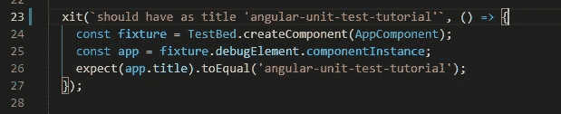

省略的测试用例

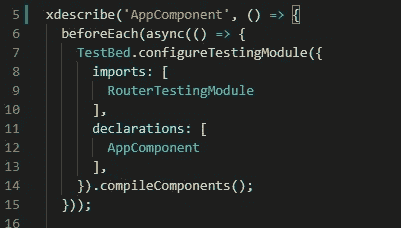

省略的测试套件

# 聚焦测试用例及测试套件

相反，如果你希望 Angular 只运行一个测试用例或者一个测试套件，你可以在你希望 Angular 关注的测试用例/测试套件之前添加一个 **f** 。

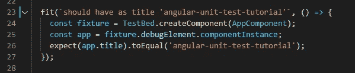

聚焦测试用例

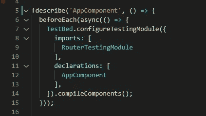

集中测试套件

# 测试覆盖率

Angular 提供了一个方便的命令，允许您快速识别测试中覆盖了哪些功能以及缺少哪些功能。使用以下 ng 命令开始测试

```
**ng test — code-coverage**
```

这将在控制台中打印出测试摘要

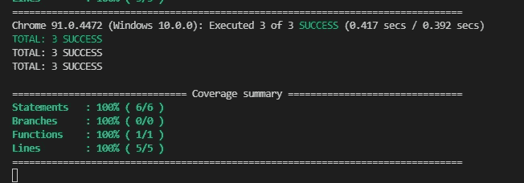

测试覆盖率总结

以及包含详细测试报告的新目录。

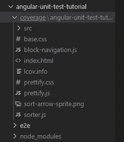

测试覆盖率输出目录

如果您在浏览器中打开 index.html，您可以详细查看代码覆盖率的总百分比

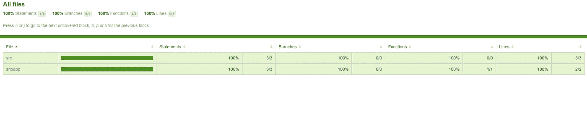

代码覆盖率百分比

如果你点击一个单独的文件，你可以看到哪些代码行还没有被测试到。测试中未涉及的程序将以红色突出显示。测试中已经包含的程序将以绿色突出显示，在左边显示一个数字来表示程序已经运行了多少个测试用例。

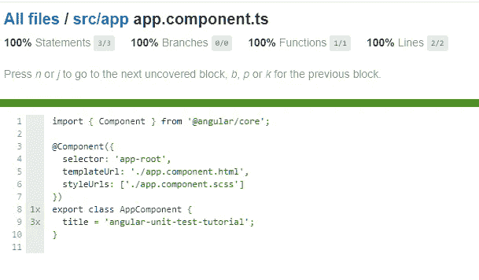

逐行代码覆盖率

一般来说，70%的测试覆盖率就足够了，但是这可能会因你所在的公司而异。

# 摘要

在本教程中，我们将介绍 Angular 中单元测试的一些基本概念。我们学习了如何执行测试，一些重要的术语，以及如何理解测试结果。尽管我们在本教程中讨论了许多主题，但我们仅仅触及了皮毛。然而，在我们前进之前，记住这些概念是很重要的。在下一章，我们将学习测试用例是如何编写的，我们还将介绍一些角度测试中常用的重要辅助函数。

原帖:
[https://simple web learning . com/introduction-to-unit-test-in-angular](https://simpleweblearning.com/introduction-to-unit-test-in-angular)