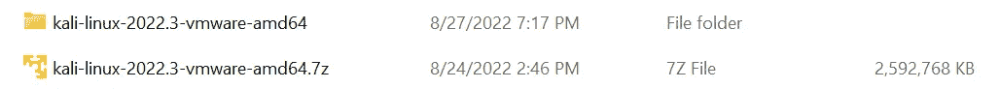
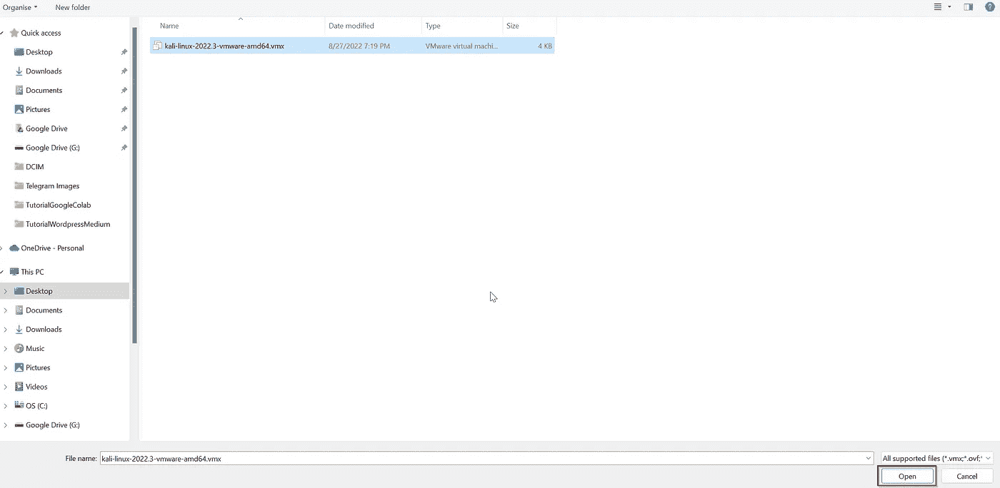
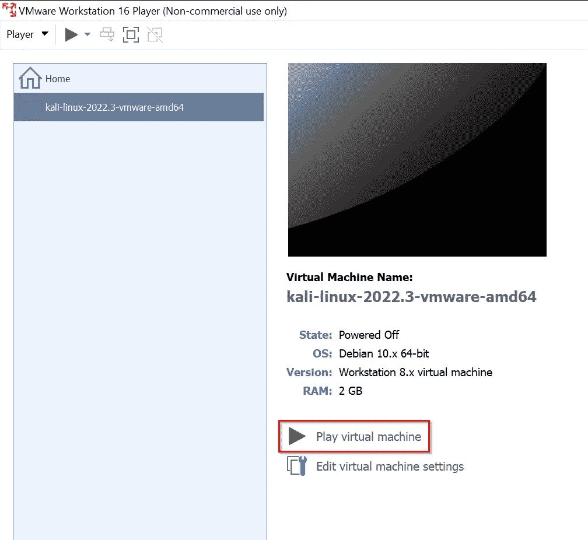
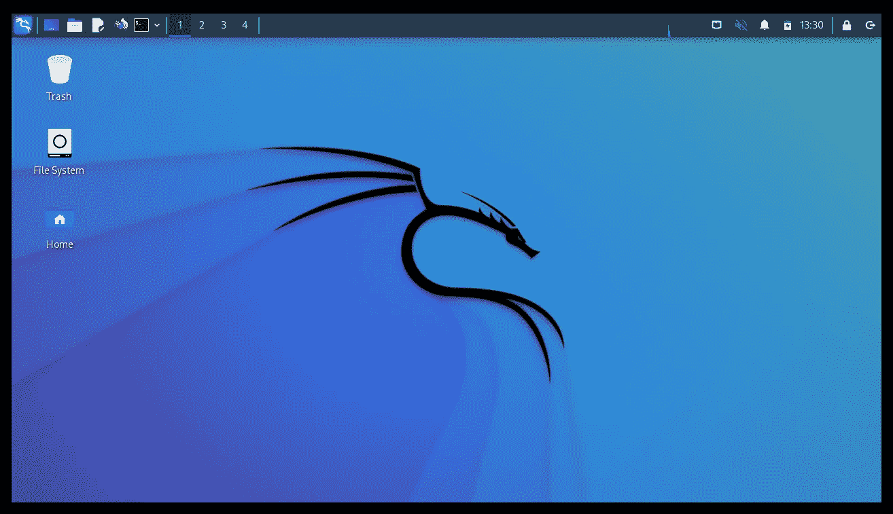
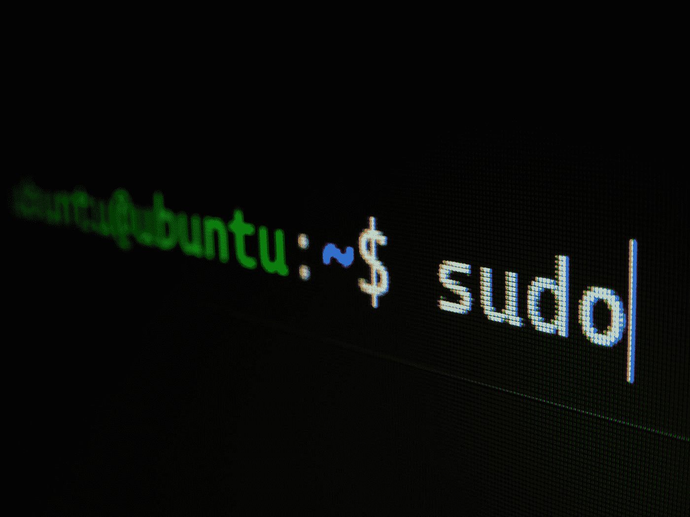
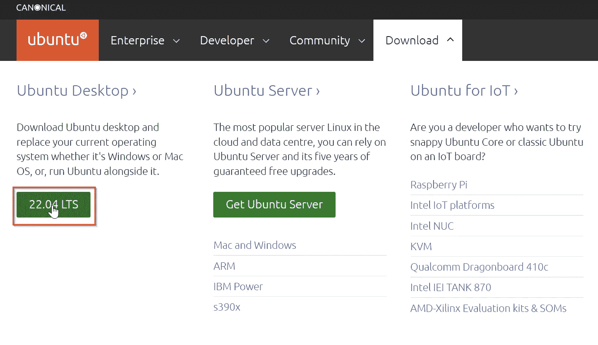
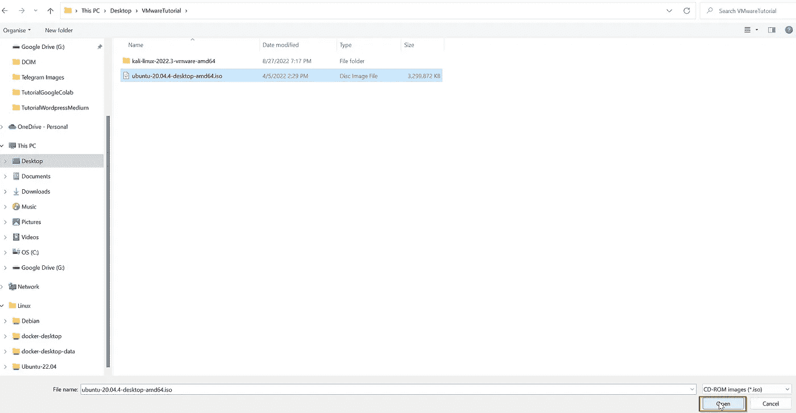
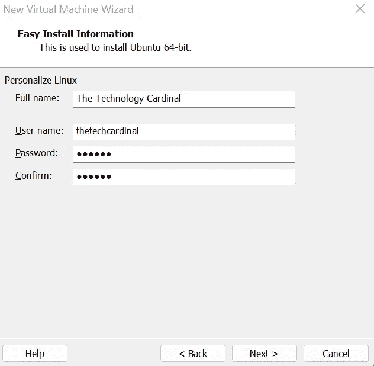
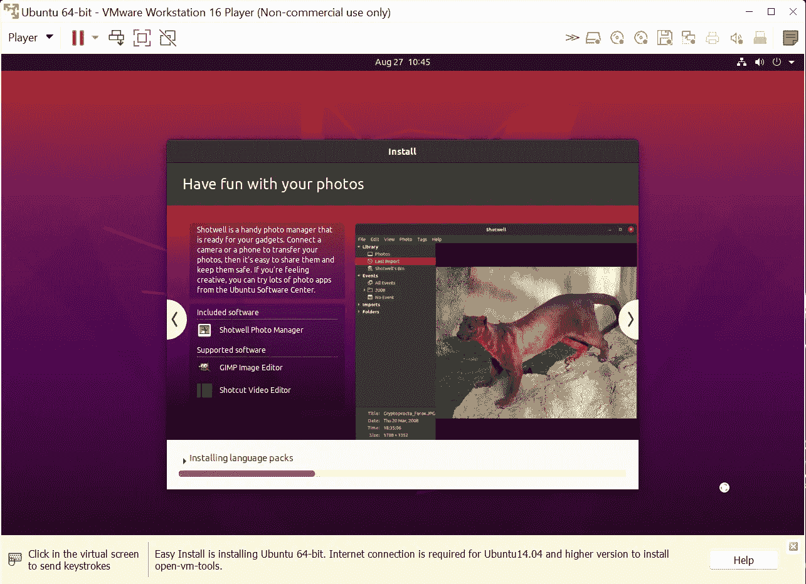
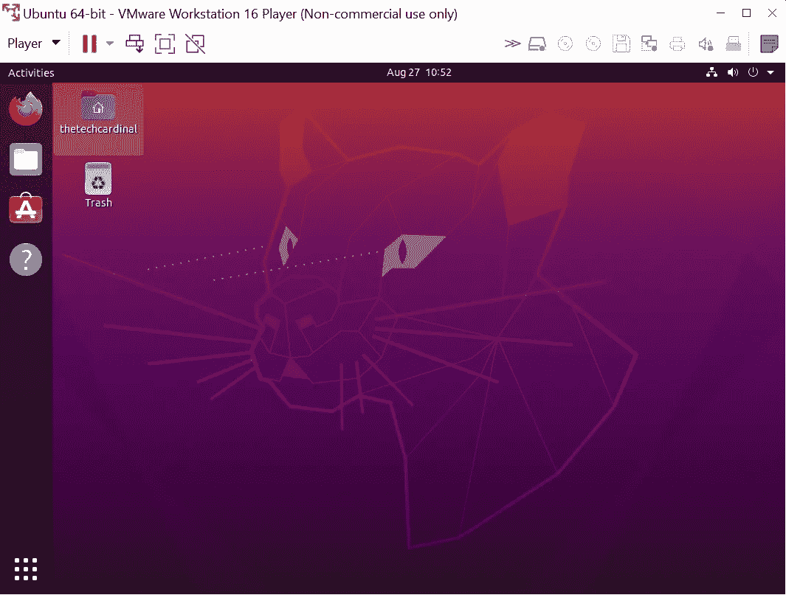

# 虚拟机简介，VMware、Kali Linux 和 Ubuntu 的示例

> 原文：<https://levelup.gitconnected.com/introduction-to-virtual-machines-an-example-with-vmware-kali-linux-and-ubuntu-72b0a5775f41>

## 用 VMware 测试不同的操作系统，如何在 VMware 内部安装 Kali Linux 和 Ubuntu

克里斯·劳顿在 [Unsplash](https://unsplash.com?utm_source=medium&utm_medium=referral) 上的照片

## 为什么你应该操作流畅

如今，很难在单一操作系统上从事 it 行业的工作，有时你可以在 Windows 上开发软件，但通常情况下，你应该通过 SSH 连接到生产中的机器，其中许多机器将运行基于 Linux 的操作系统。

拥有一个日常使用的首选操作系统是合法的，但这里我们谈论的是熟悉不同类型的操作系统，这样当你需要在不同的操作系统中做一些操作时，你就不会笨拙。

## 虚拟机简介

虚拟机只是其他独立的操作系统，可以在主操作系统上创建和运行。

要创建虚拟机，你需要使用一个虚拟化程序，这里有 3 个你可以使用的著名的有效替代方案:1 . [VMware 工作站播放器](https://www.vmware.com/products/workstation-player.html)2。[VirtualBox](https://www.virtualbox.org/)3。[纬线](https://www.parallels.com/it/)

## 额外收获:模拟操作系统的其他工具

如今，有很多有效的替代方案。
- **双重引导** 你可以进入你的 BIOS，直接在你的硬件上安装另一个 OS。
- **在线仿真器** OnWorks 平台让您可以用自己选择的 Linux 发行版测试演示环境

 [## 如何在没有安装 Linux 的情况下从 Windows 编写 Bash 脚本

### 使用您的浏览器编写 Bash 脚本，无需安装任何带有 OnWorks 的 Linux 发行版

levelup.gitconnected.com](/how-to-write-a-bash-script-from-windows-without-having-linux-installed-141d5b17c93b) 

-**(WSL)Linux 的 Windows 子系统** WSL 是一个非常有趣的话题，我会写一些关于它的东西。就目前而言，我仍然喜欢这样的想法，即虚拟机在主操作系统中有一个独立的操作系统，可以在特定状态下构建、删除、重新创建和冻结(通过拍摄快照)。
- **Docker** Docker 功能强大，有很多好看的功能。你绝对应该去看看 Docker，了解一下它，但是我认为虚拟机可以更好更完整地模拟一个完整的系统，你会有置身于一个完全不同的环境中的感觉。

## 为什么我不喜欢双启动选项

很多人建议使用双启动选项，我总是更喜欢使用虚拟机，因为它们的灵活性。
是的，您可以创建一个 Windows 和 Linux 的双引导系统，但是，我总是更喜欢主操作系统，并在其上安装您需要的所有虚拟机。
想想常见的日常使用，你正在跟随一个教程，想要在你的主操作系统和你的辅助操作系统之间来回做笔记。通过使用双引导选项，这是不可能的，相反，通过使用虚拟化方法，您可以在两个操作系统之间毫无问题地移动文件。
只有当您对性能有所顾虑，并且需要第二个/第三个操作系统的全部功能时，我才建议您选择双启动选项。

## Windows 笔记本电脑上的一个例子

下面是我们将要创建的设置:
主操作系统:安装了 VMware 的 Windows。
在 VMware 上:Kali Linux 和 Ubuntu

## 下载并安装 VMware

转到 [VMware](https://www.vmware.com/products/workstation-player.html) 网站，然后点击“免费下载”，安装您刚刚下载的文件。安装过程很简单。

## VMware 上的 Kali Linux

如果你想一步一步地遵循这个教程，去 Kali Linux 网站下载 VMware64 版本。

现在，您必须提取刚刚下载的文件。

VMware 已提取

然后按照这些说明操作:
-打开 VMware
-打开一个虚拟机
-进入文件夹并选择`kali-linux.vmx`文件
-点击打开。

vmx 文件

然后你会看到你的新虚拟机与 Kali Linux，点击“玩虚拟机”。

Kali Linux 虚拟机

进入你的虚拟机，用以下凭证登录:
-用户名:kali
-密码:kali

VMware 内部的 Kali Linux

恭喜你，现在你可以使用 Kali Linux 了。

## VMware 上的 Ubuntu

由[加布里埃尔·海因策](https://unsplash.com/@6heinz3r?utm_source=medium&utm_medium=referral)在 [Unsplash](https://unsplash.com?utm_source=medium&utm_medium=referral) 拍摄的照片

转到 [Ubuntu](https://ubuntu.com/download/desktop) 网站，然后点击下载，在 Ubuntu 桌面部分下检查，并点击带有版本号的绿色按钮。
下载将自动开始。

打开您的 VMware 并遵循以下说明:
-单击“创建新虚拟机”
-选择“安装光盘映像(iso)”
--“浏览……”
-选择`ubuntu.iso`(查看下图)
-单击“打开”
现在，遵循安装过程。

Ubuntu Iso 图像

只是一个提示，如果这是您第一次使用虚拟机，请遵循以下说明:
-单击“下一步”
-插入您的信息
-始终“下一步”
-单击“完成”
不要做任何更改，您始终可以删除您的虚拟机并从零开始重新创建。

VMware 内部 Ubuntu 的信息表单

VMware 为您提供了自定义虚拟机的可能性，但现在，请使用默认设置，并开始使用操作系统。您可以在以后找到有关 VMware 所有功能的更多信息。

在 VMware 内部安装 Ubuntu

等到安装过程结束，使用之前在创建 Ubuntu 虚拟机时设置的凭据登录。

VMware 内部的 Ubuntu 虚拟机

这是我们新开发的装有 Ubuntu 的虚拟机。

## 结论

在本教程中，我们看到了如何在 VMware 内部设置不同的虚拟机，一个使用 Kali Linux，另一个使用 Ubuntu。现在，您可以在一个安全的环境中开始探索所有这些不同的操作系统。

感谢您花时间阅读这篇文章，我希望您觉得这是有帮助的和有趣的。

## 资源

[VMware Workstation Player](https://www.vmware.com/products/workstation-player.html)[VirtualBox](https://www.virtualbox.org/)[Parallels](https://www.parallels.com/it/)
[Kali Linux](https://www.kali.org/get-kali/#kali-virtual-machines)
[Ubuntu](https://ubuntu.com/download/desktop)

# 分级编码

感谢您成为我们社区的一员！在你离开之前:

*   👏为故事鼓掌，跟着作者走👉
*   📰查看[级编码出版物](https://levelup.gitconnected.com/?utm_source=pub&utm_medium=post)中的更多内容
*   🔔关注我们:[推特](https://twitter.com/gitconnected) | [LinkedIn](https://www.linkedin.com/company/gitconnected) | [时事通讯](https://newsletter.levelup.dev)

🚀👉 [**加入升级人才集体，找到一份惊艳的工作**](https://jobs.levelup.dev/talent/welcome?referral=true)