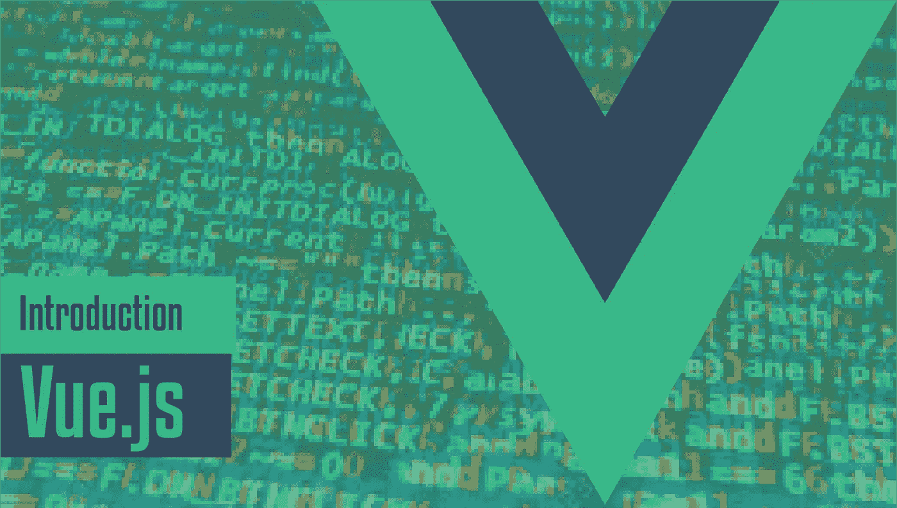
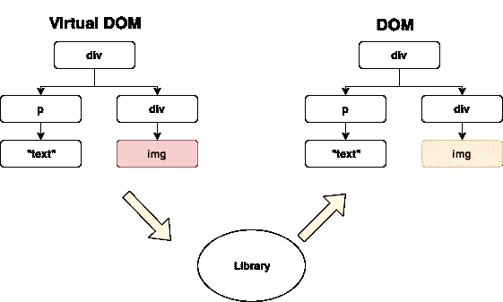

# Vue.js 简介

> 原文：<https://levelup.gitconnected.com/introduction-to-vue-js-956a7f96c9ba>



今天的文章将是关于 Vue.js，它的新概念和实现。Vue(读作/vjuː/，类似视图)是一个用于构建用户界面的渐进式框架。在我们开始之前，我们应该问一个问题为什么是 Vue？有很多其他的前端框架和库，但是 Vue 是最近才出现的。

# 为什么是 Vue？

嗯，Vue 和其他单片框架的主要区别是，Vue 从创建之初就完全可以被采用。因为核心层只关注视图层，所以 Vue 很容易集成到我们的项目中。这意味着我们不会被长时间的设置所困扰。此外，Vue 非常有能力构建强大的单页面应用程序。选择 Vue 的其他原因将在文章中讨论。

将涵盖以下主题:

*   Vue 语法
*   虚拟 DOM
*   Vue 实例
*   成分
*   小道具
*   时间

# 1.Vue 语法

Vue.js 的模板语法是基于 HTML 的，这使得我们可以将渲染器 DOM 绑定到主要的 Vue 实例数据。因为所有 Vue.js 模板都是基于 HTML 的，所以它们很容易被符合规范的浏览器和 HTML 解析器解析。另一方面，Vue 也使用了虚拟 DOM 的概念。

> 虚拟 DOM 只是一个代表文档对象模型(DOM)的 JavaScript 对象。您的应用程序将更新虚拟 DOM，实际上永远不必直接更新 DOM。大多数 JavaScript 库通过对虚拟 Dom 进行修改来更新 DOM。



包括 Vue.js 在内的库使用虚拟 DOM 来跟踪变化并将它们应用到 DOM

Vue 将模板编译成虚拟 DOM 渲染函数。使用反应系统，Vue 能够自动识别要重新呈现的组件的最小数量，并在应用程序状态改变时减少 DOM 操作。

*   **连接 Vue.js**

我们可以使用 CDN link 或 Vue CLI 将 Vue.js 连接到我们的项目。

1.  CDN 链接:

```
<script src="https://cdn.jsdelivr.net/npm/vue@2.5.22/dist/vue.js"></script>
```

2.Vue CLI

Vue 为快速构建单页面应用程序提供了一个官方的 T4。它提供了现代前端工作流程的所有设置。要使用 Vue CLI，您应该先下载并[安装 Node.js](https://nodejs.org/en/download/) 。然后，转到 Node.js 命令提示符来设置项目。

```
yourpath>npm i @vue-cli
```

当您安装 Vue CLI 时，您可以进一步创建项目:

```
yourpath>vue create ProjectName
```

您可以保留所有的默认值，等待创建项目样板文件。你可以在这里了解更多关于 Vue CLI [的信息。](https://cli.vuejs.org/guide/)

*   Vue.js 的基本语法

```
//Mustache Syntax
//Simplest method to bind myName variable
<div> My name is: {{ myName }} </div>//Attributes
//Class changes whenever the dynamicClass variable changes
<div v-bind:class="dynamicClass"></div>//Directives
<p v-if="true">Show me</p>//Modifiers
<form v-on:submit.prevent="onSubmit"></form>
```

# 2.Vue 实例

当我们编写一个 Vue 应用程序时，我们从创建一个新的 Vue 实例开始。按照惯例，我们将 Vue 实例称为`vm`:

```
var vm = new Vue({
 //options
})
```

Vue 的设计灵感来自 MVVM，但又不完全相同。当我们创建一个 Vue 实例时，我们应该传入一个对象来创建我们想要的行为。您可以在这里看到选项参考[的完整列表。](https://vuejs.org/v2/api/#Options-Data)

当我们创建一个 Vue 实例时，`data` 对象内部的属性是反应性的，这意味着当`data` 对象内部的属性发生变化时，它会寻找更新，并通过“反应”这些变化来重新呈现 DOM。

```
var vm = new Vue({
  data: {
    name: 'Ilkin',
  }
})
```

# 3.成分

组件是应用程序中可重用的部分。这个概念在 Vue.js 和 React、Angular 等其他前端框架中被广泛使用。在任何应用程序中，我们都不希望我们所有的数据、方法、计算属性等等。生活在根实例上。随着时间的推移，这将变得不可收拾。相反，最好将我们的代码分解成模块化的部分，这样工作起来更容易、更灵活。为了深入理解组件，我建议你在这里学习模块概念[。](https://medium.freecodecamp.org/javascript-modules-a-beginner-s-guide-783f7d7a5fcc)

**创建组件:**

```
//Registering Component
Vue.component('component-name',{ template: '<div>This is a component view</div>',
  data(){ return {//data here} },
  methods: { //methods here },
  computed: { //computed properties here }})
```

现在，我们可以将该组件用作根 Vue 实例中的自定义元素:

```
//Vue Instance
new Vue({ el: '#app' })//Using our component as a custom element
<div id="app">
     <component-name></component-name>
</div>
```

组件可以重复使用任意多次。这是因为组件也是 Vue 实例，每次使用组件时，都会创建一个新的实例。组件的`data`选项必须是一个函数(而不是根实例中的对象)，这样每个实例都可以维护返回数据对象的独立副本。

**组织组件:**

从零开始启动应用程序时常见的基本结构是一个包含 Vue 组件 iside 的`components`文件夹，以及一个`main.js`条目文件和一个`App.vue`组件:

```
src/         
  main.js         
  App.vue         
  components/
      Header.vue
      Footer.vue
```

除了单个组件，我们还可以有组件组，比如页面。因此，我们可以在放置页面组件时创建一个`pages` 文件夹:

```
src/         
  main.js         
  App.vue         
  components/
      Header.vue
      Footer.vue
  pages/
      About.vue
      Home.vue
      Contact.vue
```

这是一个简单的划分，已经给了我们一些结构，这样当我们知道在哪里放置和搜索页面组件时。在所有真正的应用程序中，我们也有通用的组件，比如按钮、面板、模态和其他 UI 组件。因此，我们可以在 components 文件夹中创建另一个名为`ui` 的文件夹。

```
src/         
  main.js         
  App.vue         
  components/
      Header.vue
      Footer.vue
      ui/
         Button.vue 
         Panel.vue
  pages/
      About.vue
      Home.vue
      Contact.vue
```

创建组件后，我们可以在任何地方导入(ES2015+)任何组件并直接使用。

```
//inside of Home.vue
<template>
  <div>
    <Header></Header>
    //Some content here
    <Footer></Footer>
  </div>
</template><script>
import Header from '../components/Header.vue'
import Footer from '../components/Footer.vue'export default {
  name: 'Home',
  components: {
    Header,
    Footer
  }
}
</script>
```

# 4.小道具

当我们将应用程序划分为组件以使它们可重用时，我们还需要将一些数据从父组件传递给组件。为此，我们使用`props`。

```
 Vue.component('child-component', {
  props: ['someText'],
  template: `<div>{{ someText }}<div>`
});new Vue({
  el: "#app",
  data() {
    return {
      textToPass: 'Hey! I am passed into child component'
    }
  }
});<div id="app">
  <child-component :someText="textToPass"></child-component>
</div>
```

在这个例子中，我们已经创建了可以从父组件传递数据的`someText`属性。我们已经把 `Hey! I am passed into child component`句传给了`child-component`。

我们还可以在我们的道具中添加验证，这类似于 React 中的`PropTypes`。这很好，因为它是自文档化的，如果不是我们所期望的，它将返回一个错误，但只在开发模式下。

```
Vue.component('child-component', {
  props: {
    text: {
      type: String,
      required: true
    }
  },
  template: `<div>{{ someText }}<div>`
});
```

我们可以将属性类型设置为 JavaScript 数据类型(数字、字符串、布尔、空、数组、对象等。).

# **5。插槽**

当我们有两个略有不同的组件，无论是内容还是风格的偏差，会发生什么？我们可以通过 props 将所有不同的内容和风格传递到组件中，每次都将所有内容切换出来，或者我们可以将组件本身分叉，并创建它们的不同版本。但是如果我们可以重用组件，并用相同的数据或功能填充它们，那就太好了。这就是老虎机派上用场的地方。

为了允许父组件将 DOM 元素传递给子组件，在子组件中提供一个`<slot></slot>`元素。然后，您可以用`<child-component><p>MyContent</p></child-component>`填充该槽中的元素。

```
**//Child Component**
<template>
  <div>
    <p>I'm the child component!</p>
    <!-- Content from the parent gets rendered here. -->
    <slot></slot>
  </div>
</template>**//Parent Component**
<template>
  <div>
    <child-component>
      <p>I will be rendered in slot of child component!</p>
      <p>Any data can be binded like this {{someText}}</p>
    </child-component>
  </div>
</template><script>
import ChildComponent from './ChildComponent.vue';export default {
  components: {
    ChildComponent
  },data() {
    return {
      someText: `I'll be binded in slot!`
    }
  }
}
</script>
```

## 命名插槽

有时我们需要在同一个组件中使用多个插槽。在这种情况下，我们使用*命名插槽。*假设我们正在构建基本布局组件。

```
**//base layout component**
<div class="container">
  <header>
    <slot name="header"></slot>
  </header>
  <main>
    <slot></slot>
  </main>
  <footer>
    <slot name="footer"></slot>
  </footer>
</div>**//any page**
<base-layout>
  <template slot="header">
    <h1>Page title or smth. else</h1>
  </template>

  <p>Your main content here</p>

  <template slot="footer">
    <p>Footer related information here</p>
  </template>
</base-layout>
```

## 后备内容

如果父元素没有向子元素的槽中注入任何内容，子元素将会呈现其`<slot></slot>`标签中的任何元素，如下所示:

```
**//child component**
<template>
  <div>
    <slot>
      <p>Hello from the child!</p>
    </slot>
  </div>
</template>
```

这里，如果我们没有从父内容中注入任何内容到 slot 中，默认呈现的内容将是`<p>Hello from the child!</p>`。

这就是今天的文章。我希望这是一个熟悉前端框架 Vue 的良好开端。我计划继续 Vue.js 系列来帮助人们更好地理解它的概念。

更多:**鼓掌分享**:)

如有任何疑问:contact@ilkin-guluzada.com

[](https://levelup.gitconnected.com)[](https://gitconnected.com/learn/vue-js) [## 学习 Vue.js -最佳 Vue.js 教程(2019) | gitconnected

### 27 大 Vue.js 教程-免费学习 Vue.js。课程由开发人员提交并投票，使您能够…

gitconnected.com](https://gitconnected.com/learn/vue-js)