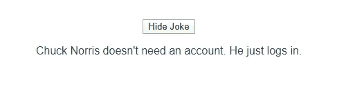

# Vue.js 测试简介

> 原文：<https://levelup.gitconnected.com/introduction-to-vue-js-testing-d09dd4e21969>


照片由 [Mael BALLAND](https://unsplash.com/@mael_bld?utm_source=medium&utm_medium=referral) 在 [Unsplash](https://unsplash.com?utm_source=medium&utm_medium=referral) 上拍摄

随着应用程序变得越来越复杂，自动测试它们变得非常重要。我们可以通过单元测试做到这一点，然后我们就不必手动测试所有的东西了。

在本文中，我们将通过编写一个简单的应用程序并测试它来看看如何测试 Vue.js 应用程序。

# 入门指南

首先，我们创建一个应用程序，从 Chuck Norris 的笑话 API 中获取笑话。

我们首先创建一个空文件夹，进入该文件夹，然后通过运行以下命令来运行 Vue CLI:

```
npx vue create .
```

在向导中，我们选择单元测试，然后选择 Jest，然后继续。

现在我们已经生成了文件，我们可以更改一些代码。我们可以删除`components`文件夹，并将`App.vue`中的代码替换为:

```
<template>
  <div id="app">
    <button [@click](http://twitter.com/click)='toggleJoke()'>{{jokeHidden ? 'Show' : 'Hide'}} Joke</button>
    <p v-if="!jokeHidden">{{data.value.joke}}</p>
  </div>
</template><script>
export default {
  name: "app",
  data() {
    return {
      jokeHidden: false,
      data: { value: {} }
    };
  },
  beforeMount() {
    this.getJoke();
  },
  methods: {
    async getJoke() {
      const res = await fetch("[http://api.icndb.com/jokes/random](http://api.icndb.com/jokes/random)");
      this.data = await res.json();
    }, toggleJoke() {
      this.jokeHidden = !this.jokeHidden;
    }
  }
};
</script><style>
#app {
  font-family: "Avenir", Helvetica, Arial, sans-serif;
  -webkit-font-smoothing: antialiased;
  -moz-osx-font-smoothing: grayscale;
  text-align: center;
  color: #2c3e50;
  margin-top: 60px;
}
</style>
```

代码只是从 API 获取一个笑话，然后显示出来。此外，它还有一个显示和隐藏笑话的按钮。

我们的应用程序如下所示:



# 创建测试

既然我们有了要测试的东西，我们就可以实际编写测试了。

在`tests/unit`文件夹中，我们删除我们在那个文件夹中创建的`app.spec.js`。

然后，我们打开我们创建的文件，并添加:

```
import { mount } from '[@vue/test-utils](http://twitter.com/vue/test-utils)';
import App from '@/App.vue'const mockResponse = {
  "type": "success",
  "value": {
    "id": 178,
    "joke": "In an act of great philanthropy, Chuck made a generous donation to the American Cancer Society. He donated 6,000 dead bodies for scientific research.",
    "categories": []
  }
}
```

为了导入我们将要测试的组件，`mount`函数让 Vue 测试工具构建并呈现用于测试的组件，以及`mockResponse`对象，我们将使用它来设置模拟数据。

然后，我们通过编写以下内容为我们的测试添加框架:

```
describe('App.vue', () => {
  beforeEach(() => {
    jest.clearAllMocks()
  })
})
```

我们有测试套件的字符串描述和我们添加测试的回调。

在回调函数中，我们使用了`beforeEach`钩子通过运行`jest.clearAllMocks()`来清除所有的模拟。

我们需要这样做，因为稍后我们将模拟组件中的一些函数。

## 添加我们的第一个测试

接下来，我们编写第一个测试。这个测试将模拟从 API 获取数据，然后在屏幕上显示笑话。

它实际上不会得到来自服务器的笑话，因为我们希望我们的测试在任何地方和任何时间运行。从服务器获取它不会让我们这样做。

API 在我们每次调用它的时候都会返回不同的东西，而且它可能并不总是可用的。

考虑到这一点，我们写道:

```
it('renders joke', async () => {
    const wrapper = mount(App, {
      methods: {
        getJoke: jest.fn()
      }
    });
    wrapper.vm.data = mockResponse;
      expect(wrapper.find('p').text()).toMatch(mockResponse.value.joke)
  })
```

在回调中，我们在`beforeEach`调用后传递给了`describe`函数。

上面的测试调用我们的`App`组件上的`mount`来构建和呈现组件，并返回一个`Wrapper`对象让我们访问它。

在第二个参数中，我们传递带有`methods`属性的选项，这样我们就可以用带有`jest.fn()`的 Jest 来模拟`getJoke`方法。我们想要模仿它，这样我们的测试就不会调用 API。

一旦有了`wrapper`，我们就运行:

```
wrapper.vm.data = mockResponse;
```

将`mockResponse`数据设置为组件实例的`data`属性。

一旦我们这样做了，我们检查我们得到的笑话在我们的`mockResponse`中通过写:

```
expect(wrapper.find('p').text()).toMatch(mockResponse.value.joke)
```

因为我们将笑话放在了`App`组件的`p`标签中。

`expect`方法和`toMatch`来自 Jest。


[Toa Heftiba](https://unsplash.com/@heftiba?utm_source=medium&utm_medium=referral) 在 [Unsplash](https://unsplash.com?utm_source=medium&utm_medium=referral) 上拍摄的照片

## 编写与 UI 元素交互的测试

编写一个对 UI 元素(如按钮)做一些事情的测试并不需要太多的工作。

为了测试我们添加到应用程序中的按钮实际显示和隐藏笑话，我们编写:

```
it('toggles joke', () => {
    const wrapper = mount(App, {
      methods: {
        getJoke: jest.fn()
      }
    });
    wrapper.vm.data = mockResponse;
    expect(wrapper.find('button').text()).toMatch('Hide Joke');
      expect(wrapper.find('p').text()).toMatch(mockResponse.value.joke); wrapper.find('button').trigger('click');
    expect(wrapper.find('button').text()).toMatch('Show Joke');
    expect(wrapper.find('p').exists()).toBe(false); wrapper.find('button').trigger('click');
    expect(wrapper.find('button').text()).toMatch('Hide Joke');
      expect(wrapper.find('p').text()).toMatch(mockResponse.value.joke);
  })
```

第一部分:

```
const wrapper = mount(App, {
  methods: {
    getJoke: jest.fn()
  }
});
wrapper.vm.data = mockResponse;
```

和以前一样。我们用`jest.fn()`模拟`getJoke`函数，这样我们的测试就不会调用 API。然后设置模拟数据。

接下来，我们通过编写以下内容来检查按钮文本:

```
expect(wrapper.find('button').text()).toMatch('Hide Joke');
```

我们被嘲笑的笑话显示在`p`元素中:

```
expect(wrapper.find('p').text()).toMatch(mockResponse.value.joke);
```

然后，我们单击按钮，运行:

```
wrapper.find('button').trigger('click');
```

然后检查按钮的文本以及`p`元素是否被我们的`v-if`指令删除:

```
expect(wrapper.find('button').text()).toMatch('Show Joke');
expect(wrapper.find('p').exists()).toBe(false);
```

最后，我们可以再次点击并检查笑话是否再次显示，如下所示:

```
wrapper.find('button').trigger('click');
expect(wrapper.find('button').text()).toMatch('Hide Joke');
expect(wrapper.find('p').text()).toMatch(mockResponse.value.joke);
```

# 运行测试

总之，我们在`app.test.js`中有以下测试代码:

```
import { mount } from '[@vue/test-utils](http://twitter.com/vue/test-utils)';
import App from '@/App.vue'const mockResponse = {
  "type": "success",
  "value": {
    "id": 178,
    "joke": "In an act of great philanthropy, Chuck made a generous donation to the American Cancer Society. He donated 6,000 dead bodies for scientific research.",
    "categories": []
  }
}describe('App.vue', () => {
  beforeEach(() => {
    jest.clearAllMocks()
  }) it('renders joke', async () => {
    const wrapper = mount(App, {
      methods: {
        getJoke: jest.fn()
      }
    });
    wrapper.vm.data = mockResponse;
      expect(wrapper.find('p').text()).toMatch(mockResponse.value.joke)
  }) it('toggles joke', () => {
    const wrapper = mount(App, {
      methods: {
        getJoke: jest.fn()
      }
    });
    wrapper.vm.data = mockResponse;
    expect(wrapper.find('button').text()).toMatch('Hide Joke');
      expect(wrapper.find('p').text()).toMatch(mockResponse.value.joke); wrapper.find('button').trigger('click');
    expect(wrapper.find('button').text()).toMatch('Show Joke');
    expect(wrapper.find('p').exists()).toBe(false); wrapper.find('button').trigger('click');
    expect(wrapper.find('button').text()).toMatch('Hide Joke');
    expect(wrapper.find('p').text()).toMatch(mockResponse.value.joke);
  })
})
```

然后我们通过`npm run test:unit`运行测试。

我们应该得到:

```
PASS  tests/unit/app.spec.js
  App.vue
    √ renders joke (19ms)
    √ toggles joke (11ms)Test Suites: 1 passed, 1 total
Tests:       2 passed, 2 total
Snapshots:   0 total
Time:        2.102s
Ran all test suites.
```

自从我们篡改数据后，每次我们进行测试。

# 结论

如果我们选择包含单元测试，Vue CLI 会创建一个内置了单元测试的项目。这节省了我们很多工作。

Jest 是一个简单的测试运行器，有很多我们可以使用的功能，比如嘲讽和`expect`匹配器。

为了测试 UI 组件，我们使用由`mount`返回的包装器对象，该对象具有呈现的组件。然后我们可以使用`find`在 DOM 中搜索我们想要寻找的东西。

如果元素存在，我们也可以通过调用我们想要触发的事件的`trigger`方法来触发事件。

最后，我们有`exists`方法来检查我们寻找的元素是否确实存在。