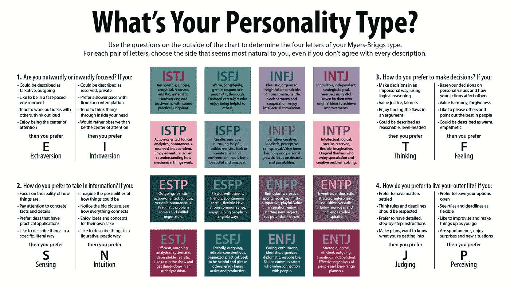
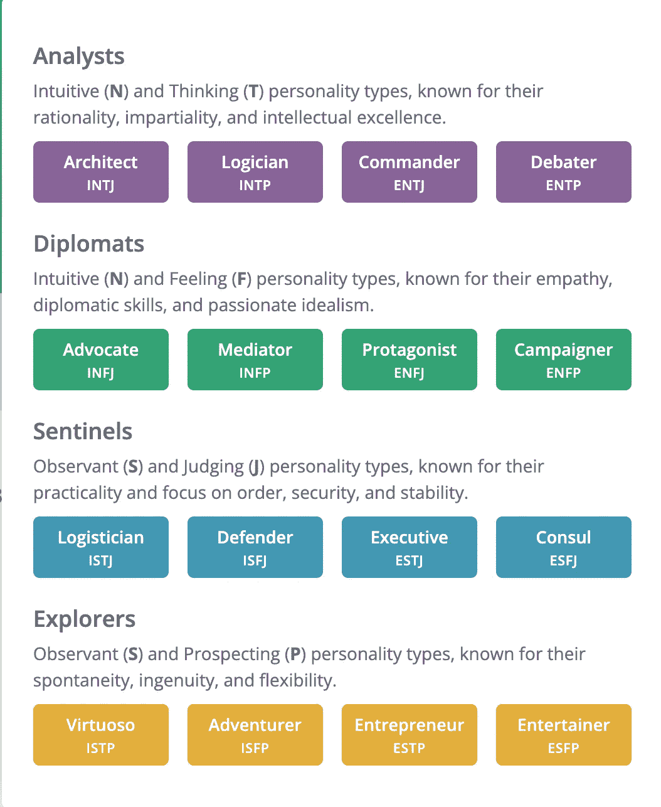

# 内向的人，你需要 3 个特质来成为一个伟大的软件架构师

> 原文：<https://levelup.gitconnected.com/introverts-you-need-3-traits-to-become-a-great-software-architect-26baed8bd560>

[廷杰伤害律师事务所](https://unsplash.com/@tingeyinjurylawfirm?utm_source=medium&utm_medium=referral)在 [Unsplash](https://unsplash.com?utm_source=medium&utm_medium=referral) 上的照片

当我进入软件行业时，我被我的公司对外向程序员的极端偏见惊呆了。

说话比任何人都多的人总能得到他们想要的结果:加薪、升职或发达国家永久移民担保。

> 世界天生偏向外向者

我并不是一个内向的人，但在谈论技术时，我缺乏严肃的表达技巧。我坚信，编程专业知识的缺乏永远不能用空话来弥补。但不知何故，在我当时的团队设置中，这种特质带来了巨大的成功。

我不知道，我所经历的是一个全球性的问题。不到十年，畅销书《**安静:在一个不停说话的世界里内向者的力量》**[的作者苏珊·凯恩宣称](https://www.theguardian.com/technology/2012/apr/01/susan-cain-extrovert-introvert-interview)世界天生偏向外向者。

我的沮丧状态一直伴随着我，直到我遇到了一些真正伟大的内向的软件专业人士，并舒适地把它做大。

我不仅钦佩他们，还发现了让他们钦佩的确切特征。虽然在像软件这样充满压力的行业中，赢得某人的赞赏是一个崇高的理想，但很多时候，人们可以通过满足一个简单的要求来获得它:适合公司，不仅仅是为了面试，而是为了工作执行的整个时间。

这篇文章描述了使内向的程序员非常适合软件公司的三个特征。但是在我们深入研究它们之前，我想先了解一下是什么让它们适合每个软件公司的背景。

# 迈尔斯·布里格斯类型:

世界各地的企业长期以来一直采用心理测量技术来评估候选人在多大程度上符合公司文化，更具体地说，就是他/她申请的角色。

其中最著名的是 MBTI 心理测试。迈尔斯·布里格斯类型指标是一种独特的人格类型，来源于 4 种基本人格特质的组合。

根据 MBTI，任何人都可以被定义为四个字母的性格类型。每个字母都可以是:

*   **表情** : *外向者 vs 内向者(E vs I)* —你可以是 E，也可以是 I，但不能两者都是。
*   **把握** : *感知 vs 直觉(S vs N)* —你可以是 S，也可以是 N，但不能两者兼而有之。
*   **决策** **决策** : *思维 vs 感觉(T vs F)* —你可以是 T，也可以是 F，但不可兼得。
*   **策划** : *判断 vs 感知(J vs P)* —你可以是 J，也可以是 P，但不可兼得。

基于 MBTI 的心理测试向候选人提出许多问题，每个问题代表一个对联(**外向与内向**是一个对联)，并根据答案给特征打分。

在一个 32 分的 MBTI 测试中，每个特质的分数可以是:

**表达式** : E: 5，I:3 = > **E 胜**

**抓** : S:2，N:6 = > **N 胜**

**决定** : T: 3，F: 5 = > **F 胜**

**策划** : J: 1，P: 7 = > **P 胜**

根据结果，你是一个 **ENFP** 角色。

来源:[维基百科](https://en.wikipedia.org/wiki/Myers%E2%80%93Briggs_Type_Indicator)

如果我们从上图中读出 ENFP 人的特征:

*   热情，有创造力，自发，乐观，支持，爱玩。
*   重视灵感。
*   享受开始新项目的乐趣。
*   看到别人身上的潜力。

然而，按照 MBTI 的说法，你不可能是一个 **ESNT** 的人，也不可能是一个 **ISTF** 的人，因为你不可能同时是**感知**和**直觉**，也不可能同时是**思考**和**感受**。

这种原子性质的特征最近引起了一些对 MBTI 的批评，因为它带来了不完善的评价。出现相互冲突的特征完全是人之常情，但 MBTI 测试的本质迫使候选人选择其中一种双重特征——从而掩盖了他的真实身份。

在我最新的关于高级开发人员面试的电子书中，我专门用了一章来讲述 MBTI 是如何影响软件心理测试的。虽然 MBTI 完美地评估了角色匹配，但在评估文化匹配时却不那么完美。

然而，我确信基于 MBTI 的测试在软件研究机构和 R & D 的部门很普遍，在那里角色匹配的重要性取代了文化匹配的重要性。一些拒绝发展的主流软件公司可能也在进行 MBTI 面试。亚马逊广为人知的明星访谈形式也源于 MBTI 的人格分类。

# 最适合内向者的软件角色:

根据 16 个性网站的说法，每种 MBTI 个性类型都适合组织中的特定角色。

来源: [16 个性](https://www.16personalities.com/)

正如你在图中观察到的，内向的人(有一个 I)可以适合这 8 个角色:建筑师、逻辑学家、倡导者、调停者、后勤人员、捍卫者、艺术大师和冒险家。

在这 8 种性格中，架构师是软件方面唯一合适的性格类型。作为其他 7 种类型中的一种，你肯定可以为组织增加价值，但是这些类型在受限格式的编程面试中很难展示。

> 建筑师不是天生的。开发人员必须通过结构化的蜕变成为架构师。

此外，建筑师是行业中最受欢迎的角色之一，因为建筑师不是天生的。开发者必须通过结构化的蜕变[成为建筑师](https://medium.com/codex/how-to-turn-into-a-software-architect-c6f30ce91e33)。

作为一个内向的人，你已经具备了一个高级开发人员最重要的特质:把你的想法留给自己，直到它们成熟

*   要么是时机成熟，你的团队急需新的想法/视角，**和**
*   其他人都已经发言了。

成为一名建筑师还需要什么？从 **INTJ** ，一个人需要获得 **N** (直觉) **T** (思考) **J** (判断)技能。

让我们用 MBTI 特质来填补空白。

# n-直观:

> 数据是有帮助的。但是直觉可以让你省下很多不必要的数据实验，既费钱又费时。

在我最近的一次团队会议上，产品经理提议每当用户访问产品屏幕时，生成一个分析事件。

每个人都同意，除了负责实现该功能的最资深的人。他很沉默——一个内向开发人员的完美例子。

和往常一样，他的沉默让产品经理特意询问了他的意见。

他说，“我有预感这会是过度杀戮。每当用户点击“更多信息”按钮时，让我们记录一个事件——这是在“购买”按钮之前更有意义的交互。如果我们记录产品屏幕访问，我们将为分析服务器增加大量不是潜在买家的访问者的负担。”

产品经理说:“但是我们不能依赖预感。”

对此，开发人员说，“在没有先验数据的情况下，我们只能靠直觉。”

他停顿了一下，然后继续说。

“问问你自己:如果你决定从我们的网站购买某种产品，就在你按下“购买”按钮之前，哪个事件的可能性更大？”

*   你在参观产品展示区吗？运筹学
*   你按了“更多信息”

产品经理无言以对。房间里的每个人都知道答案。是后者。

数据是有帮助的。感知挑战和改进更有帮助。但是直觉让你在不必要的数据实验和对抗昂贵+耗时的挑战上节省了很多。

一个菜鸟开发者依靠技能和数据，并交付任何被要求的东西。一个有经验的架构师依靠他的直觉，即使他避免做某事，也能交付价值。

# t 型思维:

> 一个好的架构师总是以公司的最佳商业利益为出发点，并且他足够聪明地将个人职业发展与公司的职业发展交织在一起。

一个好的建筑师总是理性的。他信奉伟大软件的最佳原则。与此同时，他并不坚定地拘泥于书本。他知道什么时候必须遵守规则，什么时候可以打破规则以保护更大的利益，什么时候打破规则是不可避免的。

虽然他心中有每个人的优点，但他远没有偏见。他不是容易被激怒的人。他从不在任何情绪压力或恐惧下行动。他总是从公司的最佳商业利益出发行事，而且他足够聪明，能够将个人职业发展与公司的发展紧密联系在一起。

一个好的建筑师不是用耳朵听，而是用大脑。他给队友和管理层足够的空间来发泄他们的情绪，但当涉及到判断时，他只依靠自己的智慧。

最后但同样重要的是，一个好的架构师的想法最好通过他编写/设计的代码或者他起草的文档来表达。他不是那种花费过多精力向他人解释自己想法的人。

# j-判断:

当谈到 MBTI 定义时，判断意味着制定团队中任何人都可以轻松执行的规则，而不考虑时间表或资历。

不管是建筑还是软件，一个好的建筑师会精确到毫米来设计他的计划。此外，他还将自己的工作模板化，以使未来的队友能够遵循相同的格式。他花了过多的时间来制定严格的规则，以利用可伸缩性，并且不留下任何混淆的空间。

一个普通的架构师能够快速构建特性。但是一个好的架构师会构建特性构建能力。这些功能使得即使是初级开发人员也能在最短的时间内添加任何功能。

沟通是任何团队良好运转的重要促成因素。但是在制定了大规则之后，当涉及到标准细节时，沟通是生产力的最大障碍。一个好的架构师会精确地记录文档，以最小化对沟通的需求，并最大化团队的生产力。

# 结论:

尽管其完美的特征定义，MBTI 评估并不是编程候选人最真实的标志。人力资源和招聘人员并不总能很好地将 MBTI 特质转化为相关问题。

我见过许多有能力的建筑师被大公司拒绝。尽管掌握得很好，我还是被拒绝了很多次建筑师的角色。

然而，已经是一个内向的人了，如果你总是把 NTJ 的特质记在心里，你向建筑师角色的转变会变得更顺利更快。这只是一个时间问题，直到你遇到你的 MBTI 灵魂伴侣面试官，他会认识到你潜在的建筑师。

当它发生时，是时候建立伟大的事业了，收获你内向的不公平优势。

# 分级编码

感谢您成为我们社区的一员！更多内容见[级编码出版物](https://levelup.gitconnected.com/)。
跟随:[推特](https://twitter.com/gitconnected)，[领英](https://www.linkedin.com/company/gitconnected)，[通迅](https://newsletter.levelup.dev/)
**升一级正在改造理工大招聘➡️** [**加入我们的人才集体**](https://jobs.levelup.dev/talent/welcome?referral=true)