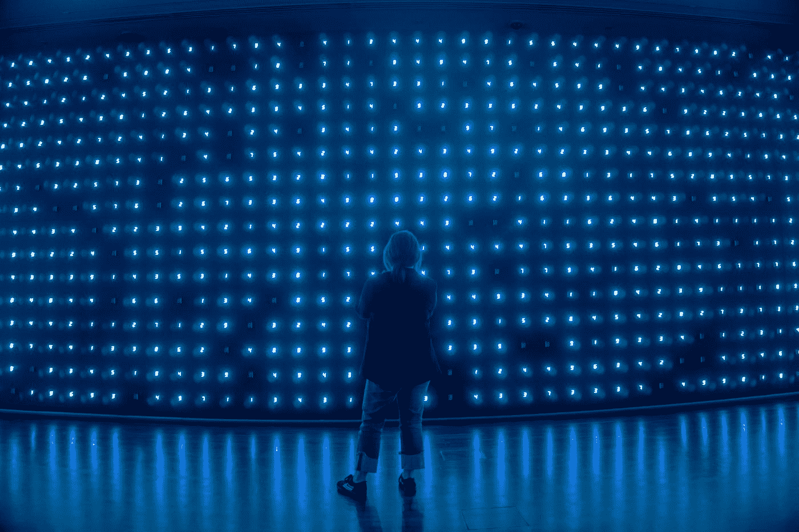
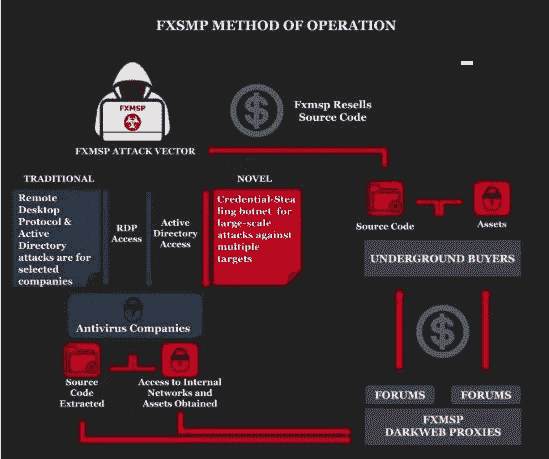

# 隐形神黑客身份暴露

> 原文：<https://levelup.gitconnected.com/invisible-god-hacker-identity-revealed-fbba7e6e2287>

这位臭名昭著的黑客被认为从 44 个国家的政府和大约 300 家公司窃取了 150 万美元的信息。在网上被称为“fxmsp ”,各种联邦犯罪与一个多产的、以经济为动机的网络犯罪集团有关，该集团入侵了世界各地各种企业实体、教育机构和政府的计算机网络。— [美国司法部的官方声明。](https://www.justice.gov/usao-wdwa/pr/citizen-kazakhstan-known-fxmsp-charged-computer-fraud-wire-fraud-and-conspiracy-hacking)

[Yeo Khee](https://unsplash.com/@yokeboy?utm_source=medium&utm_medium=referral) 在 [Unsplash](https://unsplash.com?utm_source=medium&utm_medium=referral) 上的照片

Andrey Turchin，37 岁，被控共谋实施电脑黑客行为，两项电脑欺诈和滥用(黑客行为)，共谋实施网络欺诈和接入设备欺诈。如果每项罪名都被判最高刑期，他可能面临 55 年的监禁。他在 2019 年成名，当时他声称他可以让客户成为“无形的网络之神”。这是真的，他有一个隐藏的身份直到现在。他的技术大部分也不为人知。他还补充说，他可以访问赛门铁克、迈克菲和趋势科技三大网络安全公司的数据。为了获取上述信息和网络，他向人们收取 50 万至 100 万美元的费用。

# 他会被引渡到美国吗？

人们普遍认为，安德烈早就料到美国和欧洲当局会提出这些指控，这只是时间问题。他是哈萨克斯坦公民，他们的法律不引渡其国民。然而，该案件将通过地方当局继续审理。据熟悉此案的消息人士透露，安德烈已经被当局拘留。必须指出，起诉书中的指控只是指控，直到嫌疑人在法庭上被证明有罪。

照片由[雷南·卡米科加](https://unsplash.com/@renankamikoga?utm_source=medium&utm_medium=referral)在 [Unsplash](https://unsplash.com?utm_source=medium&utm_medium=referral) 上拍摄

“网络犯罪没有国界，阻止这些犯罪需要一系列国际合作伙伴之间的合作。我对哈萨克斯坦在调查中给予的协助表示赞赏，”美国司法部长布莱恩·t·莫兰(Brian T. Moran)说。

# 他的组织是如何运作的？

FXSMP 和他的同谋在黑客经常光顾的论坛上出售网络访问权。他们开发了过多的方法来渗透系统。他的黑客技术包括在互联网上搜索开放的远程桌面协议(RDP)端口，并进行暴力攻击，最初危及用户的系统，然后安装更多的恶意软件，使他在用户继续正常工作的同时保持对网络的访问。右边的图表也揭示了整个组织的工作方式。想象一下他们手中掌握的权力是多么可怕。此外，这只是一个成员的身份被透露。对于其他同伙，没有任何信息，传闻他们仍在用不同的化名活动。在 2017 年和 2018 年之间，Fxmsp 创建了一个受信任的代理经销商网络，以促进他们在地下犯罪上的突破。

朋友们，上网要注意安全。不要点击你不应该点击的链接，远离粗略的网站。