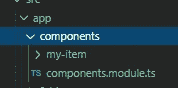
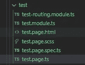
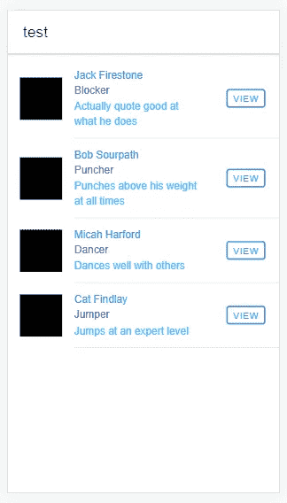

# Ionic 5:在列表中使用预制组件

> 原文：<https://levelup.gitconnected.com/ionic-5-using-a-prefabricated-component-in-a-list-26b53da1229e>


萨姆·穆卡达姆在 [Unsplash](https://unsplash.com?utm_source=medium&utm_medium=referral) 上拍摄的照片

如果你熟悉构建一个应用程序，你喜欢一遍又一遍地重用代码的某些部分。有时候，你已经建立了一些列表，需要在 Ionic 应用的不同部分反复使用。

例如，在主页上，您希望以某种方式显示一个姓名列表，然后您希望在另一个页面上显示相同样式的姓名列表。

这里的解决方案是使用一个组件。它看起来更好，你可以在应用程序的几个地方重用它。

在本文中，我将向您展示这是如何做到的。在撰写本文时，我将使用的软件版本是:

```
Ionic version 5
Ionic CLI version 6.12.4
```

## 先决条件

我想你对爱奥尼亚非常熟悉。这里描述的方法将使用**离子角度**。Ionic 是一个混合框架，使用 HTML、TypeScript(JavaScript 的一个子集)和 CSS 开发渐进式 web 应用程序(PWA)和移动应用程序。如果之前做过 web 开发，接起来很简单。

如果你不熟悉 Ionic，我建议你阅读 Ionic 官方网站的“入门”部分，这应该足以让你开始用 Ionic 构建一个应用程序:

[](https://www.ionicframework.com) [## Ionic -跨平台移动应用开发

### Ionic 是面向 web 开发者的应用开发平台。构建令人惊叹的跨平台移动、web 和桌面应用程序…

www.ionicframework.com](https://www.ionicframework.com) 

## 步骤 1:设置组件

假设您已经正确设置了离子角度应用程序，您需要做的第一件事是添加一个组件。这可以通过在您的终端或 Ionic 项目中的命令提示符下键入以下命令来完成:

```
ionic g component components/my-item
```

这应该会在应用程序的`components/my-item` 文件夹中生成几个与`my-item`组件相关的文件。在`my-item`文件夹里应该有一个`HTML`文件、`scss`文件、`spec.ts`文件和一个`ts`文件。

## 步骤 2:简化导入，生成一个模块

为了更容易地将`my-item`组件导入到您的应用程序中，以及以后您想使用它的任何地方，我通常会生成一个模块来处理这个问题。要生成模块，您需要在终端中输入以下命令:

```
ionic g module components
```

这应该会在`components/`文件夹中生成一个名为`components.module.ts` 的模块。



`components.module.ts`文件与 `my-item`文件夹在组件文件夹内

编辑您的`components.module.ts`文件以添加`my-item`组件，如下所示:

我已经标记了我在上面的`components.module.ts`中添加的行

只是逐行简要解释一下添加的内容:

第 2、6 和 7 行:导入`CUSTOM_ELEMENTS_SCHEMA`、my-item 组件本身和将在组件中使用的 Ionic 库。

第 13 行:`my-item`组件的声明

第 17 行:将离子组件导入到组件中

第 20 行:导出将在整个应用程序中使用的 my-item 组件

第 22 和 23 行:模式，定义`CUSTOM_ELEMENTS_SCHEMA`。

以上文件现在可以导入并在应用程序中的任何地方使用。但首先，让我们编辑`my-item`组件。

## 步骤 3:编辑`my-item`组件

打开`my-item.component.html`，让我们在`my-item.component.html`文件中创建一个`<ion-item>`。

然后我们可以使用`@Input()`关键字来设置`HTML` 文件中的名称、标题和信息。编辑`my-item.component.ts`文件，如下所示:

请注意，我们已经在第 1 行导入了`@Input()`，然后在第 12、13 和 14 行使用它来声明`name`、`title` 和`info`变量

## 步骤 4:将组件模块添加到页面中

我们就快到了，现在我们需要做的就是测试组件。为此，我将创建一个名为 test page 的新页面。要生成新页面，我需要运行以下命令:

```
ionic g page test
```

这应该会生成测试，并且您应该已经准备好您的测试页面，其文件夹结构如下所示:



自动生成测试页面

这里您需要做的第一件事是将步骤 2 中创建的组件模块包含在`test.module.ts`中。为此，您需要编辑`test.module.ts`并包括以下内容:

我在`test.module.ts`中添加了第 10 行和第 18 行，这很重要，这样我们就可以在应用程序中使用`my-item`组件。

## 步骤 5:创建一个数组并添加到 HTML 中

在我们继续之前，让我们创建一个包含 4 个项目的简单数组，并用我们刚刚构建的组件列出它。在这种情况下，我将创建一个由 4 个对象组成的数组，其中包含名称、标题和详细信息。这将在`test.page.ts`中完成

在上面的例子中，我创建了一个名为`person`的数组。然后，我们可以使用`test.page.html` 中的`*ngFor`来遍历数组，并以组件的样式列出项目，如下所示:

如果您注意到了第 11 行，这是在`my-item.component.ts`文件中使用了`@Input()`。它获取插入此处的值，并将其用作组件中的输入。

这将在你的 Ionic 应用程序中创建一个列表，如下所示:



使用*ngFor 填充列表的预制组件

在这个例子中，它能够将在`test.page.ts`中创建的数组输出到一个预制组件中，我们可以随心所欲地修改它，并且它将在整个应用程序中更新，因为预制组件将在应用程序中的其他地方使用。只需重复第 4 步和第 5 步即可。这消除了在每个页面中放置相同的列表和浏览单个 HTML 设计的麻烦，相信我，这是一个麻烦。只需在预制组件的帮助下重复使用它。

## 结论

如果你已经开发了一个应用程序，并且不想一遍又一遍地重复，那么组件是一个很好的方法。它可以节省时间，让你的代码看起来更整洁、更高效。我以前写过关于在 Ionic 应用程序中使用多个组件的文章，所以如果你想了解更多关于在应用程序中使用多个组件的信息，请阅读这篇文章:

[](/adding-multiple-components-to-your-ionic-application-8ba5d5523aa7) [## 为您的离子应用添加多种组件

### 这个组件的用例范围从创建一部分需要重用的代码。例如，一家公司…

levelup.gitconnected.com](/adding-multiple-components-to-your-ionic-application-8ba5d5523aa7) 

*塞拉马特·孟加图拉*