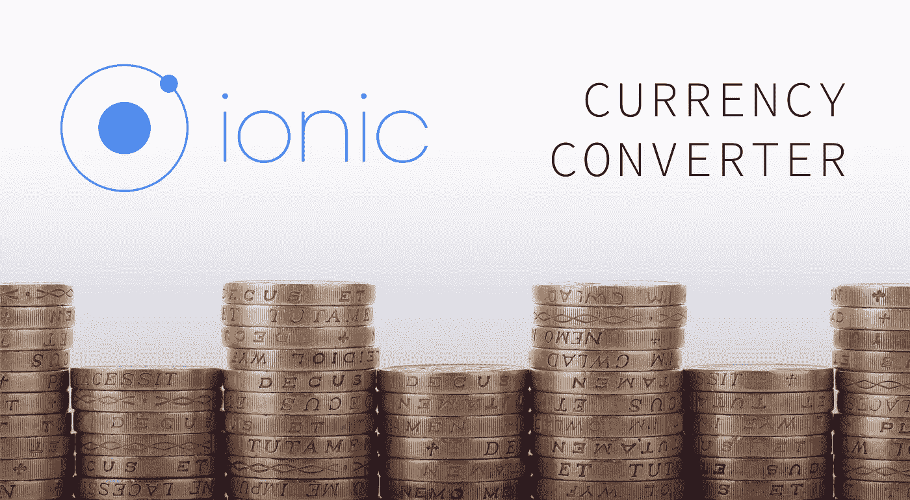
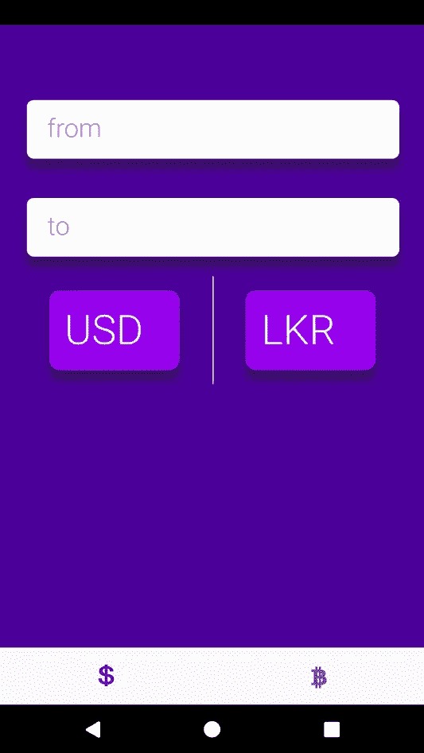
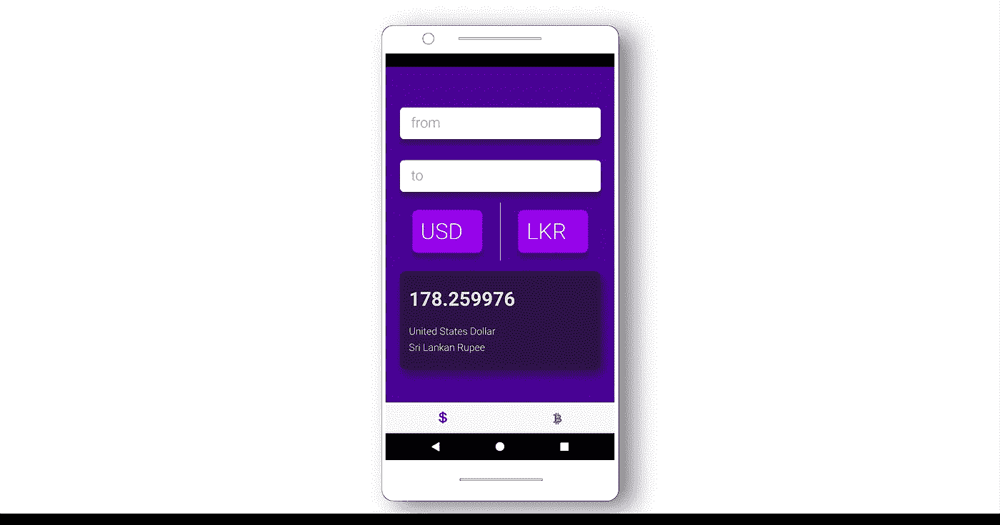

# 离子货币转换器

> 原文：<https://levelup.gitconnected.com/ionic-currency-converter-8f33d3d76d2d>

## 让我们通过创建一个简单的实际应用程序来学习 ionic。



学分:Pexels

最近一直在用 Angular 开发 web 应用。因为我决定不仅扩展我在 web 开发方面的知识，还扩展我在移动应用程序开发方面的知识，所以我决定用 Ionic 框架构建一个应用程序。

我想用 Ionic 的原因是它完全是关于 JavaScript 的(我喜欢 JavaScript)。此外，爱奥尼亚也遵循与角形相同的概念。

*   和 Angular 一样，它有自己的 UI 组件结构。
*   它使用 TypeScript，这是 JavaScript 的超集。
*   它包含有棱角的特征。

现在我们跳到正题。你不能通过阅读或跟随教程来学习任何东西。为了学习任何编程语言或框架，您应该在现实世界中进行尝试。这就是我学习任何编程语言的基础。说了这么多，我将带你看一个我用 Ionic 框架写的应用程序。

让我们建立一个简单的货币转换器。

# 假设

本文假设您事先了解

*   棱角分明的框架。
*   打字稿。

假设您对这些技术有一些基本的了解，我不会涵盖所有的基础知识。

# 入门指南

首先，让我们创建一个空白的 ionic 应用程序。在命令行中:

```
npm install -g cordova ionic
```

该命令将安装 Ionic CLI，它是 Ionic 的命令行工具。这样，您就可以创建一个 ionic 应用程序，在您的工作区文件夹中包含所有必需的文件。创建一个您想要维护工作空间的文件夹，从这个位置打开命令行并执行(*我将为应用程序的未来增强创建标签*):

```
ionic start <name of the application> tabs
```

# 创建布局

让我们先做一个布局，这样我们就可以开始编写功能和服务来从一个免费的 API 中获取值，该 API 可以立即提供货币汇率。导航到项目工作区中的以下位置，并将代码复制到文件中。

```
*src/pages/home/home.html*
```

那我们就给它加点风格吧！转到:

```
*src/pages/home/home.scss*
```

并将下面的代码复制到您的文件中。



为了给标签栏添加图标，让我们在 src 文件夹的 index.html 中添加以下标签( *'src/index.html '* )

```
<link rel=”stylesheet” href=”https://use.fontawesome.com/releases/v5.6.3/css/all.css" integrity=”sha384-UHRtZLI+pbxtHCWp1t77Bi1L4ZtiqrqD80Kn4Z8NTSRyMA2Fd33n5dQ8lWUE00s/” crossorigin=”anonymous”>
```

然后添加

```
<ion-tabs>
<ion-tab [root]=”tab1Root” tabIcon=”logo-usd”></ion-tab>
<ion-tab [root]=”tab2Root” tabIcon=”logo-bitcoin”></ion-tab>
</ion-tabs>
```

在位于*' src/pages/tabs/tabs . html '*内的*tabs.html*中，然后让我们删除一个额外的选项卡。

# 正在创建服务类别

创建骨架后，让我们开始真正的工作。我们需要一种获取汇率的方法。不用担心，有一些 API 在一定的限制下免费提供给你。这是我在这个项目中使用的一个。

```
[https://free.currencyconverterapi.com](https://free.currencyconverterapi.com)
```

如果您访问这个 URL，您可能会找到关于获取 JSON 格式的各种数据的说明。所以我们如何获取这些值才是真正的问题。您可以直接在 *home.ts* 文件中编写代码，但这根本不是一个好的做法。我们有一个解决方案，那就是服务。

服务是一个很好的实践，因为它极大地降低了代码的可重用性，并使代码更加通用，可以从任何地方访问。现在让我们创建一个服务类。在您的 *pages* 文件夹中，创建一个名为 *services* 的文件夹，并使用您喜欢的任何名称创建一个 typescript 文件。在这个项目中，我将其命名为 *cu-service.ts.*

服务类应该总是可导出和可注入的。现在你可能想知道`@Injectable`到底是什么？它只不过是 Angular 中常用的依赖注入。`@Injectable`的工作是将它标识为一个服务类，这个特定的 CurrencyService 类将在导入该类的任何地方可用。

摘要:通过使类*可注入*，我们可以在代码中的任何地方使用服务类。如果我们看一下类内部，我们实现了两个新的函数，叫做`getCountries()`和`getExchangeRate()` ***。*** 在这两个函数中，我们从那些特定的 API 中返回 JSON 数据，我们还将使用`toPromise()` 方法将它们作为承诺返回。默认情况下，`HttpClient` 从 HTTP 方法调用中返回 observables，但是将它们作为**承诺**返回的原因是这些承诺可以利用 async/await 功能。这有助于我们用 javascript 编写异步代码。

*   `getCountries()` : *返回带有货币代码的国家列表。*
*   `getExchangeRate()` : *返回两个特定国家的货币汇率。*

创建完服务类后，确保将它包含在 app 文件夹*的***app . module . ts***文件中的 **providers** 中。*

使用我们返回到服务类的承诺，我们可以获取必要的数据。为了和平地获取它们，让我们使用 async/await。

# 履行

## 异步/等待

使用异步函数，您可以使用 try/catch 块平稳地处理来自承诺的未处理错误。Async 关键字可以写在函数之前，async 确保函数返回一个承诺，并且函数在事件循环中异步执行。在函数中使用 await 关键字，我们可以让 javascript 等待，直到函数返回的承诺得到解决。

让我解释一下 home.ts 文件中的代码。

`fetchCountries()` : 这个函数从服务中获取国家列表，它将一直等到承诺得到解决，因为我们在其中使用了 *await* 关键字。使用 for 循环，我将从 JSON 对象中返回的每一个值都压入，并且将货币名称压入映射。通过使用映射，我们可以拥有键值对。稍后，我们可以使用货币代码获得货币名称，货币代码是地图中的关键。

`getCurrencyRate()`:使用这个特殊的函数，我们可以获取两种特定货币的汇率。

在应用程序启动时，为了获取货币汇率和货币代码列表，我们应该在`ngOnInit()`函数中调用上述两个函数。

我们现在几乎完成了！我们剩下要做的就是计算最终结果，即货币价值。为此，我们必须在 *home.ts* 文件中再添加两个函数。

要添加到 home.ts 文件中的两个函数

通过调用这两个函数，我们可以立即以两种方式计算结果值。好吧，我们该怎么做？这就是我们接下来要看到的。

## 数据绑定和事件绑定

数据绑定在 web 应用程序中非常流行，因为它显示动态数据，这意味着它改变由用户或应用程序触发的值。

我们将使用数据绑定和事件绑定来实现一个货币转换器，如上面的 gif 所示。在 HTML 布局中，使用 ngModel 绑定我们在 home.ts 文件中创建的变量。通过这样做，用户在数字字段中输入的任何值都可以被动态使用。同样，为了在用户在输入字段中输入值时触发事件，我们可以使用事件绑定。在这种情况下，[*keyup*](https://developer.mozilla.org/en-US/docs/Web/Events/keyup)*事件会帮助我们。所以让我们用括号把它括起来，并调用必要的函数。你可以查看下面的代码来获得帮助。*

*此外，我还附上了一张卡片，展示货币汇率和货币名称。现在要在浏览器中运行这个应用程序，请在您的终端中运行下面的命令。*

```
*ionic serve*
```

*这将构建应用程序并在您的默认浏览器中运行。你可以在 iOS、Android、Windows 等所有三个平台上查看这个应用的样子。*

**

# *结论*

*在这篇文章中，我们试图使这个教程尽可能简单。希望你能从这篇博文中学到一些东西。如果你在评论区遇到任何问题或错误，请随时告诉我。*

> *你可以在我的 Github 句柄中找到这个项目的源代码。*