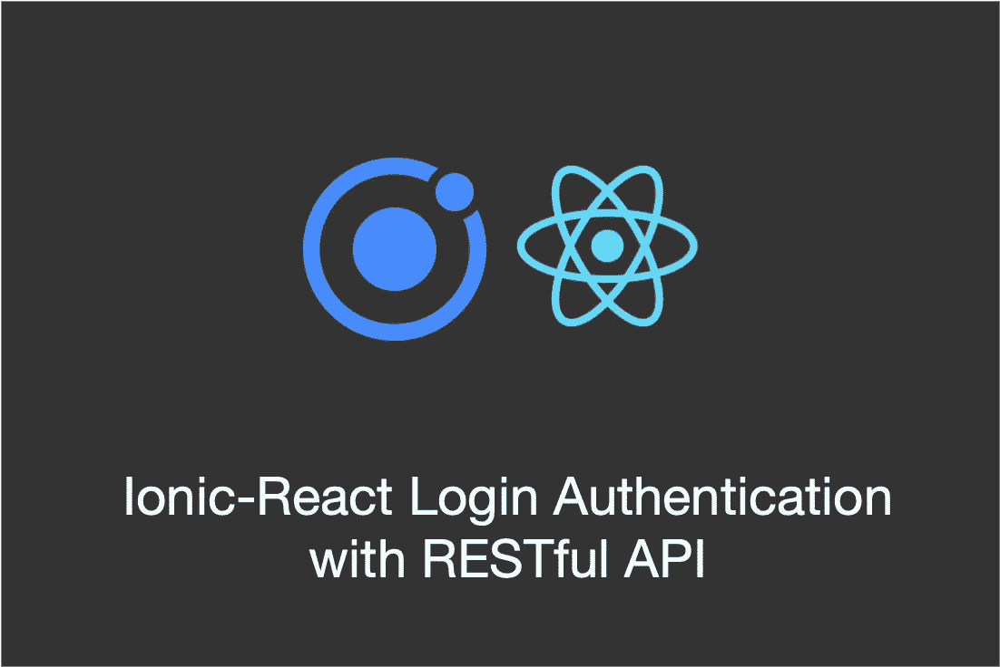
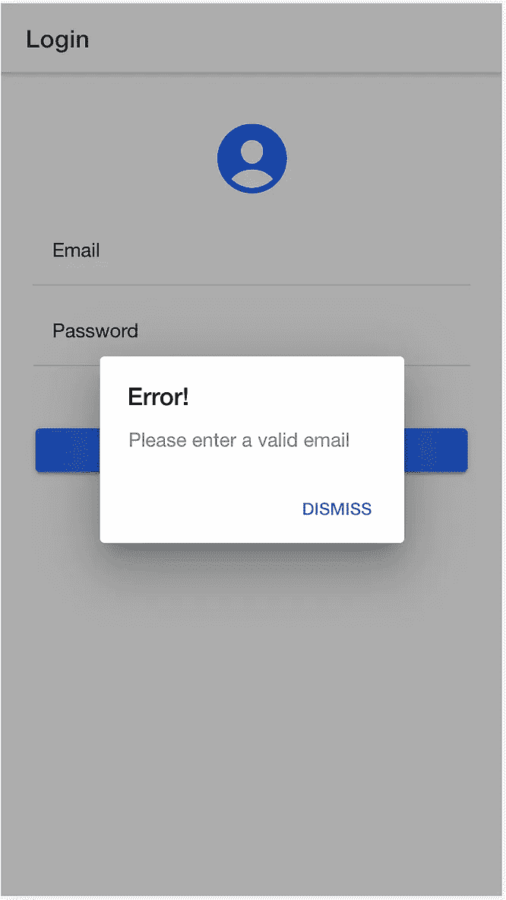
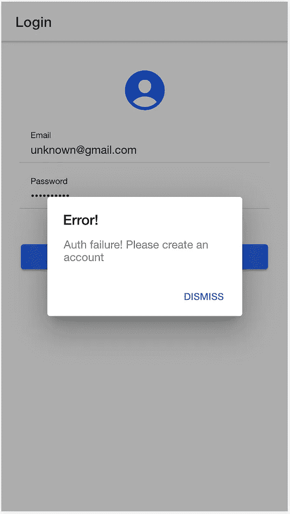
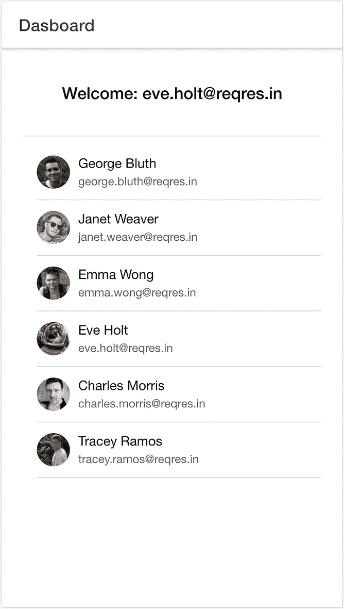

# Ionic-React 使用 RESTful API 进行登录认证

> 原文：<https://levelup.gitconnected.com/ionic-react-login-authentication-with-restful-api-79352883b9f3>

## 了解如何使用 Ionic-React 框架编写本地移动应用程序。



在本教程中，我将通过构建一个简单的登录认证应用程序来帮助您开始使用 Ionic-React 框架。下面的视频展示了我们将一起开发的应用程序。

那么，什么是[离子反应](https://ionicframework.com/docs/react)以及为什么使用它？Ionic-React 是“React Native”的 Ionic 版本，用于构建“本地”移动应用程序。该框架提供了许多现成的移动 UI 组件，用于构建很酷的移动应用程序。与“React Native”相比，该框架的一个主要优势是它允许您利用现有的 CSS 技能。这意味着你可以使用“日常”的 css 元素，如按钮、h1 标签、p 标签等来创建整个移动用户界面。多酷啊！

我假设你有基本的 React 知识，并且理解组件和钩子等概念。我已经创建了一个很棒的教程来帮助你开始使用 R icon={personCircle}
/>
</IonCol>
</IonRow>

与大多数 css 框架类似，Ionic-React 允许我们在网格布局中，即在行/列中布局内容。上面的代码片段使用*io icon*组件呈现页面图标，即人物图标。请注意，我们可以使用传统的 css 来改变图标样式，这是 Ionic-React 相对于 React-Native 框架的优势之一。

```
<IonRow>
  <IonCol>
    <IonItem>
      <IonLabel position="floating"> Email</IonLabel>
      <IonInput
        type="email"
        value={email}
        onIonChange={(e) => setEmail(e.detail.value!)}
        >
      </IonInput>
    </IonItem>
  </IonCol>
</IonRow>
```

上面的代码片段使用 *IonLabel* (用于显示标签)和 *IonInput* 显示实际的电子邮件输入字段，显示页面的电子邮件区域。注意，我们可以指定类似于传统 css 的输入类型(文本、电子邮件、密码)。当用户通过 *onIonChange* 函数输入电子邮件地址时，我们改变“电子邮件状态”对象。这类似于输入元素的传统 css *onChange* 事件。

```
<IonRow>
  <IonCol>
    <p style={{ fontSize: "small" }}>
      By clicking LOGIN you agree to our <a href="#">Policy</a
    </p> <IonButton expand="block" onClick={handleLogin}>
      Login
    </IonButton> <p style={{ fontSize: "medium" }}>
      Don't have an account? <a href="#">Sign up!</a>
    </p>
  </IonCol>
</IonRow>
```

上面的代码片段显示了助手文本和登录按钮。请注意，我们可以使用传统的 css 元素来显示文本，并根据我们的喜好设置样式。Ionic-React 为我们提供了用于呈现按钮的 *IonButton* 组件。我们使用了“block”属性来允许按钮跨越整个屏幕宽度。注意，点击按钮时会调用 *handleLogin* 函数。接下来我们来看看这个函数。

```
const handleLogin = () => {
  //validate inputs code not shown const loginData = {
    email: email,
    password: password,
  }; const api = axios.create({
    baseURL: `https://reqres.in/api`,
  }); api.post("/login", loginData)
    .then((res) => {
      history.push("/dashboard/" + email);
    })
    .catch((error) => {
      setMessage("Auth failure! Please create an account");
      setIserror(true);
    });
};
```

上面显示了 *handleLogin* 函数代码片段。首先，我们验证用户输入(为了简单起见，这里没有显示代码，但是可以在项目源代码中找到)。接下来，我们使用 axios 包发起一个 api 请求。这个包很适合启动 api 调用，可以使用“***NPM install axios***”来安装请注意，我们正在向后端 api 发出 post 请求，并传入一个包含用户登录凭证(即电子邮件和密码)的 *JSON* 对象。接下来，我们处理服务器(API)响应，并决定要执行的正确操作。如果我们收到错误代码(例如 400、401)，这意味着出现了问题，服务器无法验证用户。在这种情况下，我们捕捉错误并向用户显示一条好消息。另一方面，如果一切顺利，我们只需将用户重定向到仪表板屏幕。



**左**:无效邮件。**中间**:认证失败。**右侧**:登录成功——仪表板页面

上面的截图显示了上面讨论的一些案例。Dashbord 页面显示了从 RESTful API 获取的使用列表。使用 *IonList* 组件显示获取的数据。

**总结**

我已经向您展示了如何通过开发一个简单的身份验证应用程序，使用 Ion-React 组件和来自 RESTful API 的数据快速开始移动应用程序开发。本教程阐释了可用于构建其他复杂移动应用程序的核心概念。

Ion-React 确实是一个伟大的框架，包含了大量用于快速移动应用开发的组件。与 React-Native 相比，学习曲线更快，因为我们可以利用现有的 css 知识，而不是像 React-Native 那样学习新的组件样式。我相信你会喜欢用 Ionic-React 学习和构建很酷的应用程序。

我希望你在这篇教程中学到了一些东西。

请随意在 Github 上下载/克隆项目源代码。

如果你是 haven't☺️ 的话，可以看看我其他的关于 [React/Material UI](/react-material-table-crud-operations-with-restful-api-data-ca1af738d3c5?source=friends_link&sk=971af34c01f09c724d94a9de67c8e70b) 和[python 网络游戏编程的教程](/program-your-first-multiple-user-network-game-in-python-9f4cc3650de2?source=friends_link&sk=312059e7967875fdbf4c7b67520bbdc9)

祝编程愉快！