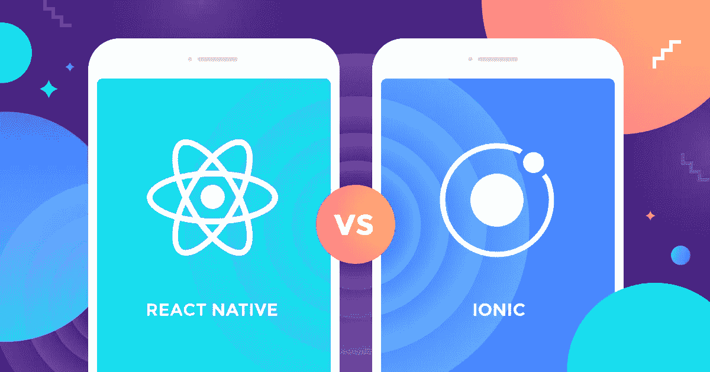
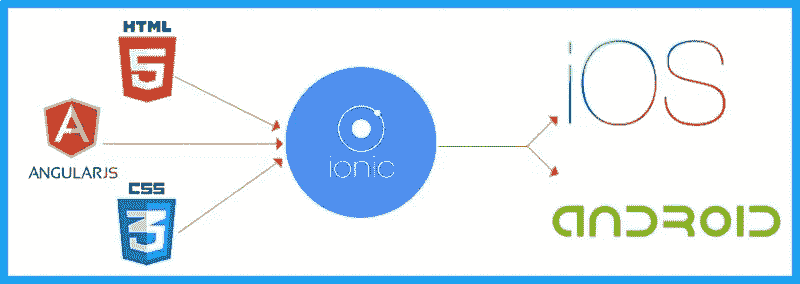

# Ionic vs React Native:哪个更好？

> 原文：<https://levelup.gitconnected.com/ionic-vs-react-native-which-one-is-better-ac5aa2022227>

在寻求使用跨平台工具开发移动应用时，我发现自己将 Ionic 和 React Native 作为两个最常见的选项。两者都有一个由热情的开发人员组成的大型社区，在大型企业中被大量使用，并且可以声称拥有许多流行的消费者应用程序。

在这篇文章中，我将尝试比较 Ionic 和 React 原生框架。这两种技术都允许你使用相同的代码库为 iOS 和 Android 开发移动应用。

我之所以写这篇文章，是因为经常有人问我——“我应该为我的企业应用程序开发选择什么平台？”

# 什么是离子 4？

**Ionic** 是一款用于混合移动应用开发的完整开源 SDK，由 Drifty 公司的 [Max Lynch](https://medium.com/u/a76fa51de1ba?source=post_page---------------------------) 、 [Ben Sperry](https://medium.com/u/14b1be5c1354?source=post_page---------------------------) 和 Adam Bradley 于 2013 年创建。Ionic 提供使用 CSS、HTML5 和 Sass 等 Web 技术开发混合移动应用的工具和服务。可以使用这些 web 技术构建应用程序，然后通过本地应用程序商店分发，并利用 Cordova 安装在设备上。

所以，换句话说——如果你用 Android 创建原生应用，你就用 Java 编码。如果你在 iOS 中创建原生应用，你用 Obj-C 或 Swift 编码。这两种语言都是强大但复杂的语言。**使用 Cordova(和 Ionic ),你可以为你的应用编写一段代码，它可以在 iOS 和 Android 上运行**(和 windows！)与 HTML、CSS、JS 的简单性。

# 什么是 React Native？

React Native 是一个 JavaScript 框架，用于为 iOS 和 Android 编写真实的、本地呈现的移动应用程序。它基于 React，脸书用于构建用户界面的 JavaScript 库，但它的目标不是浏览器，而是移动平台。换句话说，web 开发人员现在可以编写看起来和感觉上都真正“原生”的移动应用程序，所有这些都来自我们已经熟悉和喜爱的 JavaScript 库。此外，因为您编写的大部分代码可以在平台之间共享，React Native 使同时为 Android 和 iOS 开发变得很容易。

与 React for Web 类似，React 本机应用程序是使用 JavaScript 和 XML 标记的混合编写的，称为 JSX。然后，在幕后，React 本机“桥”调用 Objective-C(对于 iOS)或 Java(对于 Android)中的本机呈现 API。因此，您的应用程序将使用真正的移动 UI 组件呈现，而不是 webviews，并且它看起来和感觉起来像任何其他移动应用程序。React Native 还为平台 API 公开了 JavaScript 接口，因此 React Native 应用程序可以访问手机摄像头或用户位置等平台功能。

React Native 目前支持 iOS 和 Android，并且有潜力扩展到未来的平台。我们编写的绝大多数代码都是跨平台的。是的，您确实可以使用 React Native 来构建生产就绪的移动应用程序！一些例子:[脸书](http://bit.ly/1YipO7A)、[帕兰蒂尔](http://bit.ly/1PPEiZH)和 [TaskRabbit](http://bit.ly/1PPEjNg) 已经在面向用户的应用程序中使用它。

## 混合移动应用 vs .本地应用:一场流行的辩论

在我们开始之前，你应该考虑一些重要的事情。Ionic 是一个用于混合移动应用开发的框架，React Native 是一个用于构建原生应用的跨平台框架。

原生应用是为特定平台用特定语言构建的。例如，当您在 iOS 平台上使用 Objective C 编写代码，或者在 Android 平台上使用 Java 时，该应用程序就被称为本机应用程序。原生 app 开发的主要优势是性能优越。与此相反，混合应用程序是使用 HTML、CSS 和 JavaScript 等 web 技术开发应用程序的 web 应用程序。为了提供原生体验和访问 Android、iOS 或任何其他平台的原生功能，它使用 PhoneGap/Cordova。

# 因素

为了决定哪一个更适合跨平台移动应用程序开发，我选择定义一些参数，在此基础上我将尝试进行清晰的比较。这些是:

*   语言堆栈
*   不要重复自己(干)
*   丰富的预样式组件库
*   表演
*   用户界面
*   生态系统/第三方库
*   市场和社区
*   访问本机设备功能
*   支持的平台
*   热门应用
*   定价
*   可维护性

## 1.语言堆栈

根据这一标准，我想了解哪个框架利用了哪些编程语言，并提供了哪些好处:

React Native: 它利用了当前最流行的编程语言之一 JavaScript。它结合了 JavaScript 和 React 的优点，并得到了脸书的支持。

React Native 的一个好处是，当开发人员需要时，它允许用 Swift、Objective-C 或 Java 编写一些组件。利用 React 本机应用程序中的本机模块和库，您可以管理计算量大的操作，如视频处理或图像编辑。

**Ionic framework:** 它使用 HTML5、CSS 和 JS 来开发和运行应用程序，并需要 Cordova 包装器来访问本机平台控制器。利用 Ionic，您还可以使用 TypeScript 来提高代码的质量。

下面是如何根据这些框架的编程语言所提供的优势对它们进行排序:

1.  反应自然(反应)
2.  离子框架(角形)

## 2.不要重复自己(干)

有了这个指标，我想探究我们编写的代码中有多少可以在两个平台上重用。

Ionic: 超棒的可重用性！“包装的 web 应用程序”的概念确保您可以轻松地重用您的代码——最终您只是构建了一个包装的 web 应用程序。自适应组件的强大组件库(即自动为应用运行的平台定制)也有所帮助。

**React Native:** 也可以编译成本地默认值，但是只提供一组基本的组件。你必须自己设计大部分的样式，因此需要更多的工作来在两个平台上实现合适的样式。一般来说，代码可以重用(因为你仍然只使用一种语言，像 [Redux](http://redux.js.org/) 这样的库不需要调整)。

以下是如何根据代码可重用性对这些框架进行排序

1.  离子框架
2.  反应自然

## 3.丰富的预样式组件库

构建漂亮的 ui 有多容易？您必须自己创建和设计许多组件(UI 元素)吗？或者您有一套丰富的预构建组件吗？组件是否自动适应底层平台？这就是这个指标的意义所在。

**Ionic:** Ionic 的核心是一大套预先构建(和预先样式化)的组件。生成本地应用的编译器/工具链也是 Ionic 包的一部分(通过其 CLI 处理)，但它利用了其他包，如 [Cordova](https://cordova.apache.org/) 或[电容器](https://capacitor.ionicframework.com/)。Ionic 提供的组件会自动适应应用程序运行的平台，因此，Ionic 使创建漂亮的、具有本机外观的应用程序变得轻而易举！

**React Native:** 提供了一组不错的内置组件，但其中许多组件需要您进行定制。它们是非自适应的，相反——就像 Flutter 一样——你可以选择两种操作系统。这需要在代码中进行调整，您必须有条件地选择小部件的使用和样式。

下面是如何根据预先设计好的组件库对这些框架进行排序

1.  离子框架
2.  反应自然

## 4.表演

这个指标是最重要的，也是不言自明的——在不同框架中开发的应用在运行时表现如何？

**React Native:** 它提供的性能与本机应用程序非常相似，因为它专门为本机 API 呈现代码元素。React 还允许开发人员使用用本地语言编写的本地模块来编写复杂操作的代码。但是，它们不能跨两个平台重用；他们的主要目的是提供更高的性能。

**爱奥尼亚:**性能方面，爱奥尼亚输了比赛。它的性能不如 React Native 或 Flutter，因为它利用 web 技术来呈现应用程序。这种方法大大降低了速度。此外，它没有利用本地组件，而是试图通过使用 web 技术来创建本地外观。

Ionic 的优势在于它的快速测试过程可以在浏览器中即时运行，从而简化了开发过程。

Ionic 在这些应用中表现较差，因为它最终是一个包装好的 web 应用。**但这经常被误解！**“更糟”听起来非常糟糕，但“更糟”实际上并不意味着“可怕”甚至“糟糕”。相反，您会得到比其他方法更差的性能。事实上，在我们现在拥有的设备上，你的应用程序运行起来可能会更加流畅！如果你只(假想！)获得 100fps 而不是 105fps —您会注意到区别吗？你不会，所以在你的下一个应用程序中保持离子状态！

以下是如何根据这些框架提供的性能对它们进行排名:

1.  反应自然
2.  离子的

## 5.用户界面

用户在使用的最初几秒钟内就会对应用做出判断，这就是为什么应用的用户界面必须既吸引人又简单易用——让我们看看这些框架提供了什么:

**React Native:** React 与原生 UI 控制器相关联的原生模块，提供了非常接近原生应用的惊人用户体验。此外，它还利用 React 库和丰富的 UI 元素，简化了 UI 开发。

Ionic: Ionic UI 根本不使用原生元素，而是以 HTML 和 CSS 的形式呈现一切。然后，它应用科尔多瓦给原生移动体验。伴随框架的角形组件也使 Ionic 应用程序看起来像是原生的。

以下是如何根据这些框架提供的用户界面对它们进行排序:

1.  反应自然
2.  离子的

## 6.生态系统/第三方库

生态系统是什么样子的？是否容易找到帮助(在 [Stackoverflow](https://stackoverflow.com/) 等上)以及是否有足够的第三方库来添加你的应用需要的那个特性？

**Ionic:** Ionic 的逻辑使用 JavaScript——虽然您可以将它与任何(或没有)JavaScript 框架一起使用，但它为 Angular 提供了特别强大的支持。因此，你从这些生态系统中受益。JavaScript 和 Angular 生态系统是巨大的！ [Stackoverflow](https://stackoverflow.com/) 上的数千个线程和 [npm](https://www.npmjs.com/) 上的包帮助你解决问题。

**React Native:** 它使用 JavaScript 和 React，因此你得到了那些可用的生态系统。此外，React Native 本身有一个非常活跃的生态系统和社区，因此您可以在 Stackoverflow 上找到许多线程和许多添加了缺失功能的第三方包。缺点是你经常需要依赖生态系统(比如插件、启动器等)。)因为 React Native 本身只包含核心特性。React Native 的生态系统不如别人强大，经常不停的变化或者第三方插件跟不上变化的 React Native

以下是如何根据生态系统/第三方库对这些框架进行排名

1.  离子的
2.  反应自然

## 7.市场和社区

拥有一个动态的生态系统是一件值得庆幸的事情——但一个选项有多受欢迎又有什么关系呢？让我们看看:

**React Native:** React Native 在市场和社区认可度方面是王者。它的开发者网络正在迅速发展，目前已经有了许多经验丰富的 React 本地工程师。这使得启动 React 项目变得容易。它利用了一个非常流行的库(React)和最基本的 web 开发语言(JavaScript ),并提供了真正的本地应用程序。这些品质使它成为一个强大的平台，也是它出名的原因。

**Ionic:** 它是仅次于 React 的第二大流行框架。它使开发者能够以最快的方式构建原生移动应用。Ionic 拥有巨大的社区支持，以及一个[巨大的市场](https://market.ionicframework.com)，在那里你可以找到许多启动器和模板来启动从[优步](https://market.ionicframework.com/starters/taxi-booking-complete-platform-ionic-4)到 [Spotify](https://market.ionicframework.com/starters/ionic-4-spotify-pwa-and-app-starter) 的任何应用。

以下是如何根据这些框架的行业认知度和可靠性对其进行排名:

1.  反应自然
2.  离子的

## 8.访问本机设备功能

您的移动应用程序很可能需要访问一些本机设备功能，如相机或 GPS。获得这种权限有多容易？以及相对较新的功能(如 Android/ iOS 提供的 AR APIs)的难易程度？

**Ionic:** Ionic 使用 Cordova 或其自己的解决方案——电容器，为您提供原生设备功能。它提供了一套[非常体面的包](https://ionicframework.com/docs/native/)来访问常见的本地设备功能，如相机。当然，您也可以围绕本机功能编写自己的包装器，然后将它们包含在您的代码中。此外，Ionic/Cordova 和/或 Angular 插件非常稳定，并且很容易随着平台更新而更新。

**React Native:** 作为最流行的解决方案，您会发现一组丰富的第三方包以及一些用于访问本机平台功能的内置 API。依赖第三方包(这是你经常要做的)当然有一个缺点，那就是该包的核心维护者可能会退出，因此对它的支持和对 Ionic 或 NativeScript 的支持不在一个水平上。

以下是如何根据访问本机设备的功能对这些框架进行排序:

1.  反应自然
2.  离子的

## 9.支持的平台

**反应原生:**安卓 4.1+，iOS 8+

**Ionic:** 安卓 4.4+，iOS 8+，Windows 10

## 10.热门应用

**React Native:** 脸书，Instagram，UberEats，Airbnb(他们后来把 RN 从用法中去掉了。在这里阅读更多— [为什么 Airbnb 离开 React Native](https://softwareengineeringdaily.com/2018/09/24/show-summary-react-native-at-airbnb/)

**Ionic:** JustWatch、Pacifica、Nationwide 等等。

## 11.定价

**React Native:** 完全开源的框架。工程师可以免费使用这个系统和他们的库。

**Ionic:** 是一个开发跨平台移动应用的免费开源框架。但是，该组织提供有偿的专业开发环境。该公司保证 Ionic Pro 加速开发过程。

## 12.可维护性

使用 React Native，您可能使用的任何第三方库都可能会过时或与您更新的代码库不兼容。因此，可维护性仍然是一个大问题。

在 Ionic 中，你只需要维护一个应用程序(你必须在 React Native 中维护 iOS 和 Android 版本)。

然而，Ionic 应用程序可维护性的最大挑战是，随着 Ionic 和 Cordova 上频繁的发布周期，框架本身正在经历不断的变化。

# 结论

如果你想提供高性能的应用程序，接近于为用户提供原生性能，那么 React Native 将是你的最佳选择。另一方面，如果你的项目要求允许你交付一个对用户来说看起来不错的执行应用，那么你总是可以使用 Ionic 框架。这完全取决于项目要求。如有任何其他问题，请随时评论或联系我们。

本文最初发表于 [Enappd](https://enappd.com) 。