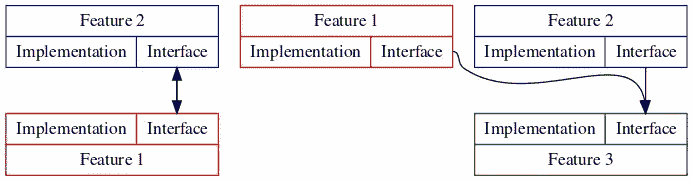

# iOS 应用即微服务—构建强大的应用架构

> 原文：<https://levelup.gitconnected.com/ios-app-as-a-microservice-build-robust-app-architecture-e3dedee4269a>

## MVVM，MVC，毒蛇？如何在更大范围内构建你的应用？


照片由[万花筒](https://unsplash.com/@kaleidico?utm_source=ghost&utm_medium=referral&utm_campaign=api-credit) / [Unsplash](https://unsplash.com/?utm_source=ghost&utm_medium=referral&utm_campaign=api-credit) 拍摄

你会选择什么:MVVM，MVC，毒蛇？这些都是局部的和特定问题的架构。但是，如何在更大的范围内构建你的应用程序，使其具有可扩展性和良好的组织性呢？

在这篇文章中，我将讨论微特征架构，简单地说，当在 iOS 应用程序中正确实现时，它是惊人的。

## 下一集

*   关于用 **SwiftUI** 实现的想法
*   使用 **tuist** 构造微特征应用
    **UPD** :已发布！

[](/ios-app-as-a-microservice-modularize-your-app-with-tuist-f706e8fae650) [## iOS App 即微服务。使用 Tuist 模块化您的应用

levelup.gitconnected.com](/ios-app-as-a-microservice-modularize-your-app-with-tuist-f706e8fae650) 

```
Originally published on [alexdremov.me](https://alexdremov.me/ios-app-as-a-microservice-modularize-your-app-with-tuist/)
```

# 核心理念

这个想法来自微服务服务器端应用基础设施。整个应用程序被划分为对应于应用程序不同功能区域的逻辑组件。

> 💥考虑到移动应用程序可以如此复杂，为什么不将相同的架构应用于 iOS 应用程序呢？

简而言之，微特征架构意味着将你的应用分成不同的组件，这些组件接受其他组件的接口或数据作为**显式依赖**。

因此，您的应用程序可以表示为相互明确交互的模块图。

# 主要优势

*   **改进的可维护性** —每个组件都很小，因此更容易理解和更改。
*   **更好的可测试性** —组件明确定义了它们的公共接口。因此，它们更容易被模仿和测试。
*   **团队组织** —不同的团队可以独立完成不同的组件。
*   **可伸缩性，代码重用** —当一个应用是模块的组合时，你可以通过重组模块来改变应用的行为。如果你决定创建一个应用程序扩展、watchOS 应用程序或应用程序剪辑，只需选择所需的组件，一切就都准备好了。
*   **显式依赖**——隐式依赖是应用架构中最糟糕的事情之一。这种架构要求为每个模块定义明确的依赖关系。

# 细节

那么，一旦决定使用微特征架构，如何架构一个 iOS 应用呢？核心概念是分离。但是您仍然可以使用一个 Xcode 项目来实现这个目的，并且完全按照架构来分离特性。

> 💥你可以把每个特性放到单独的 Xcode 项目中。这将促使你严格分离组件。
> 
> 我将在下一集用 **tuist** 讲述如何有效地做到这一点！

您的代码库将被分成几个块:

## 特征

这是你的应用程序的元素所在的地方。在这篇文章的后面，我将举例说明这部分包括什么。

组件是应用程序的逻辑块。每个组件都显式定义了一个与之交互的接口。

> 💡Swift 没有名称空间，但是您可以使用枚举来隐藏内部模块逻辑。

## 应用程序

你可以拥有一个 WatchOS 应用、widgets 和主 iOS 应用。每个应用程序都依赖于功能，并使用功能构建最终的应用程序，像砌砖一样组合它们。


照片由[Ashkan Forouzani](https://unsplash.com/@ashkfor121?utm_source=ghost&utm_medium=referral&utm_campaign=api-credit)/[Unsplash](https://unsplash.com/?utm_source=ghost&utm_medium=referral&utm_campaign=api-credit)拍摄

## 测试+测试数据和模拟

这种逻辑也不同于特性的主要部分。它是独立的，因为:

*   我们不想在应用程序中意外使用模拟数据
*   我们不想在最终的应用程序二进制文件中包含不相关的数据

# 特征设计

该功能由四个块组成。测试和模拟可能不存在，但是特性总是有一个接口和实现。


## 连接

该零件定义了对其他特征可见的零件。功能的公共接口和模型或实体留在这里。

接口定义了与功能交互的方式。

模型或实体是简单的结构，几乎没有逻辑，只是简单地定义用于与特征通信的数据。

您可以在接口中包含其他组件，但请记住**接口不得公开实现细节**

> 💥如果特性依赖于另一个特性，那么它依赖于另一个特性的接口。
> 
> 特性**不得**依赖于其他特性的实现

## 履行

实现依赖于接口，并提供符合接口中定义的协议的类和结构。资源、图像和其他实现细节也留在这里。

> 💡分离接口/实现迫使您编写符合字母 **D** from **SOLID** 的代码。当其他模块知道接口而不知道实现时，依赖倒置自然发生。

了解这些信息后，我们可以为应用程序的图形图像添加细节:


请注意，没有一个功能依赖于另一个功能的接口。每个特性接口都严格依赖于另一个特性的接口。

现在你看到应用程序采用构建模块，并将它们组合成一个应用程序。

订阅，不要错过帖子！

# 案例示例

让我们设计一个日程表应用程序。它将具有:

*   日程视图
*   添加事件/编辑视图
*   计划 WatchOS 视图

很简单。

让我们把这个应用分成几个功能:

*   **UICommon**

包含可用于创建更复杂视图的通用 UI 元素

*   **日程**

包含主计划视图和与之相关的逻辑。该接口定义了与视图交互或显示视图的方式。

*   **值班表**

包含特定于观察器的计划视图和与之相关的逻辑

*   **事件修改**

包含事件修改逻辑和视图

*   **预定数据**

数据提供者。定义数据结构和实体以获得它们。

该接口将包含简单的数据实体和定义获取这些实体的方法的模型协议。

实现定义了符合接口中定义的协议的模型。例如，您可能想要定义本地存储模型或网络模型。由最终的应用程序决定使用哪个选项。

# 应用图表


正如你所看到的，WatchOS 和主要的 iOS 应用程序重用了通用组件。此外，每个应用程序决定选择哪个模块接口的实现。例如，WatchOS 应用程序可以在 ScheduleData 功能中选择不同的数据源，而不是主 iOS 应用程序。

在一个单一的应用程序中，你可能需要编写第二个应用程序并复制大量代码

## 下一集

在接下来的帖子中，我将分享我关于使用微特征架构和 **SwiftUI** 和 **tuist** 高效构建代码的想法。

## 常见问题解答

## 什么时候应该创建新功能，什么时候最好不要创建？

这完全取决于具体情况，取决于你认为最好的选择是什么。如果你能想出一些用例，当你的特性在一些其他的上下文中被重用时，那么它就是一个独立的特性。

> 💥不要把事情复杂化！为每个职业增加一个新功能弊大于利。

如果有些块可能不会被重用，但是你觉得它是逻辑上独立的功能，那么也可以使用新的特性，因为它有助于保持你的架构整洁。

## 如何处理循环引用？

循环引用可能是一种痛苦，如果两个特性依赖于彼此的接口，就会发生这种情况。如果出现这种情况，请认真考虑您的特征分离是否正确。有两种可能的选择。

*   两个功能其实是一个功能。然后，你可以合并这两个特性，去掉循环引用。
*   两个特征其实是三个特征。如果特性相互依赖，那么两个特性都需要某些部分。如果这部分是独立的特征呢？如果是这种情况，提取第三个特征并修复从属关系。



## 关于使依赖关系显式化，已经说了很多。有什么意义？

当组件隐式依赖时，几乎不可能扩展或修改大型应用程序。想象一下，如果你通过一个单例来修改一个依赖于所有其他模块的类，会发生什么样的混乱。

你的应用程序可能开始出现意想不到的行为，你甚至不知道你的修改会如何影响整个应用程序。

就像坐在一箱 TNT 炸药上。


照片由[迈赫迪·梅瑟罗](https://unsplash.com/@messrro?utm_source=ghost&utm_medium=referral&utm_campaign=api-credit) / [Unsplash](https://unsplash.com/?utm_source=ghost&utm_medium=referral&utm_campaign=api-credit) 拍摄

我鼓励你尽可能避免隐式依赖。微特征架构将帮助你做到这一点。

# 参考

*   [推斯特](https://docs.tuist.io/building-at-scale/microfeatures)
*   [https://speaker deck . com/pepibumur/developing-modular-apps-on-IOs](https://speakerdeck.com/pepibumur/developing-modular-apps-on-ios)

# 分级编码

感谢您成为我们社区的一员！在你离开之前:

*   👏为故事鼓掌，跟着作者走👉
*   📰查看[升级编码出版物](https://levelup.gitconnected.com/?utm_source=pub&utm_medium=post)中的更多内容
*   🔔关注我们:[Twitter](https://twitter.com/gitconnected)|[LinkedIn](https://www.linkedin.com/company/gitconnected)|[时事通讯](https://newsletter.levelup.dev)

🚀👉 [**加入升级人才集体，找到一份神奇的工作**](https://jobs.levelup.dev/talent/welcome?referral=true)