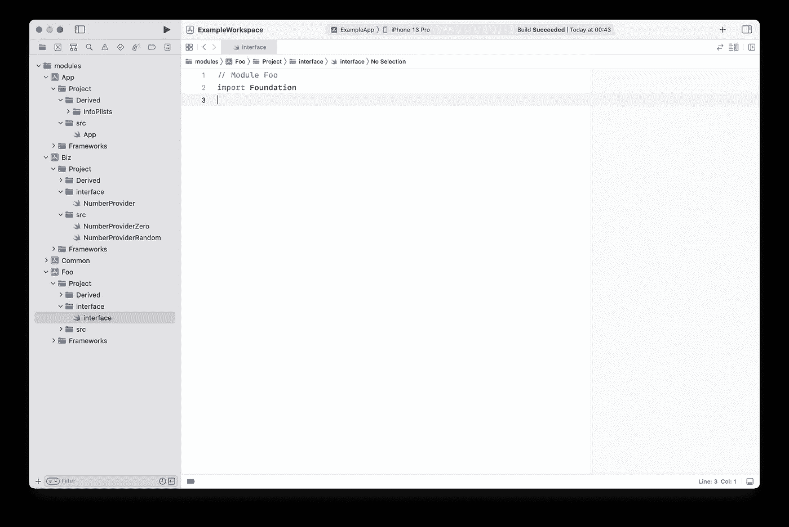
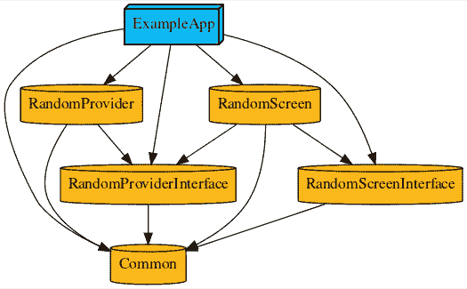

# iOS App 即微服务。使用 Tuist 模块化您的应用

> 原文：<https://levelup.gitconnected.com/ios-app-as-a-microservice-modularize-your-app-with-tuist-f706e8fae650>

## 这是模块化应用程序架构系列的第二篇文章。在这篇文章中，我将介绍使用 Tuist 的实现细节


弗拉多·保诺维奇 / [Unsplash](https://unsplash.com/?utm_source=ghost&utm_medium=referral&utm_campaign=api-credit) 摄影

这是模块化应用程序架构系列的第二篇文章。在这篇文章中，我将使用 **Tuist** 讲述实现细节。这是一个优秀的命令行工具，可以帮助您生成、维护 Xcode 项目并与之交互。

> 💥我在上一篇文章中介绍了模块化架构的核心思想。
> 如果你还没有，就去看看吧！

[](https://alexdremov.me/ios-app-as-a-microservice-build-robust-app-architecture/) [## iOS App 即微服务。构建强大的应用架构

### MVVM，MVC，毒蛇，你会怎么选择？这些都是局部的和特定的问题…

alexdremov.me](https://alexdremov.me/ios-app-as-a-microservice-build-robust-app-architecture/) 

# 下一步是什么？

在本系列的下一篇也是最后一篇文章中，我将介绍 SwiftUI 的实现技巧。订阅吧，这样你就不会错过了

UPD:活在当下！

[](https://alexdremov.me/ios-app-as-a-microservice-using-swiftui-in-modular-app/) [## iOS App 即微服务。在模块化应用中使用 SwiftUI

### Alex Dremov iniOS & Swift——模块化架构非常出色。但是如何用 SwiftUI 有效实现呢…

alexdremov.me](https://alexdremov.me/ios-app-as-a-microservice-using-swiftui-in-modular-app/) 

# 为什么是 Tuist？

它鼓励您进一步代码模块化，因为它提供了一种优雅的方式来为不同的模块创建单独的 Xcode 项目，使得紧密耦合或隐式依赖变得不太可行

此外，这对团队合作也很有好处。你有没有尝试过将 Xcode 项目委托给 GitHub 这样的 VCS？

真是一团糟

修改后的 Xcode 项目的 Diff 不是人类可读的。根本不可能追踪变更或审查 PR。如果可以在一个简单的配置文件中定义 Xcode 项目会怎么样？Tuist 就是这么做的。而且**tuist**配置文件是用 Swift 编写的。

# 我们的目标

我们希望根据我在上一篇文章中提出的架构，将我们的项目划分为单独的 Xcode 项目。

再次重申，我们的应用程序将由模块的组合组成，对于每个模块或功能，我们将创建一个新的 Tuist 项目。

> 💡请记住，每个功能不应该依赖于其他功能的实现。只有接口应该是公共的

因此，对于每个特性，我们将创建几个与特性接口、实现以及测试或模拟目标(如果需要的话)相对应的目标。

# 定义项目

> 💥这篇文章的来源发表在 GitHub 上。因此，在阅读本文之前，您可以看到使用 Tuist 描述项目是多么优雅

[](https://github.com/AlexRoar/TuistExample) [## GitHub-Alex roar/Tuist 示例:将 Tuist 用于模块化应用架构

### 此时您不能执行该操作。您已使用另一个标签页或窗口登录。您已在另一个选项卡中注销，或者…

github.com](https://github.com/AlexRoar/TuistExample) 

# 结构

Tuist 项目是一个简单的文件夹，包含描述工作空间结构的配置文件

> 💥使用`tuist edit`编辑您的 Tuist 文件。这将为您生成并打开一个临时 Xcode 项目

但是正如我前面所说的，*每个*模块至少应该有一个实现和接口目标

> 💡可能存在包含公共工具并且不依赖于任何其他模块的模块。那么，它可能只有实现

所以，让我们据此修改结构

在定义模块之前，我们需要定义 Tuist 应该在哪里搜索这些模块。这可以在`Workspace.swift`文件中完成

## 项目文件

Tuist 用一个简单的 Swift 文件定义了 Xcode 项目。

但是这篇文章不仅仅是对 Tuist 的评论

让我们定义一个项目，知道我们需要有一个接口和实现目标。同样，让我们为特性名创建一个枚举，这样我们就不必使用字符串并记住所有的命名

> 💡由于 config 是在 Swift 中定义的，因此在定义项目结构时，您可以使用 Xcode 中的建议和自动完成功能。
> 
> 例如，Xcode 在使用枚举时会建议其他模块的名称

通过几个简单的助手，我们可以用 Swift 的魅力定义项目结构:

特性将成为独立的框架。

> 💡所有有助于描述 tuist 配置的`swift`文件都应放在`ProjectDescriptionHelpers`文件夹中

然后，我们可以定义什么是特征

最后，我们在一个应用程序目标中组合模块。它的定义是一样的

就是这样。

现在我们可以创建不同的特征和它们之间的状态依赖关系。之后，我们只需使用`tuist generate`命令，它就会为我们生成 Xcode 工作空间和 Xcode 项目。



Tuist 生成的工作空间

太好了！

现在我们已经启动了我们的项目，它在漂亮的 Swift 文件中被完全定义，具有清晰的结构和明确的依赖关系。你可以将所有的`.xcodeproj`和`.xcworkspace`添加到 gitignore，忘记 GitHub 仓库中的混乱。

> 💥为了这篇文章的简洁，一些细节没有涉及。完整的例子发布在 GitHub 上，请不要犹豫在评论中问我任何问题！

[](https://github.com/AlexRoar/TuistExample) [## GitHub-Alex roar/Tuist 示例:将 Tuist 用于模块化应用架构

### 此时您不能执行该操作。您已使用另一个标签页或窗口登录。您已在另一个选项卡中注销，或者…

github.com](https://github.com/AlexRoar/TuistExample) 

# 使用 Tuist 创建应用程序

我已经在上面的例子中展示了如何定义项目结构。让我们更具体地编写一个简单的应用程序，显示一个范围内的随机值。



**RandomProvider** 定义了生成随机数的协议及其几种实现

**RandomScreen** 定义了几个 UI 屏幕来显示随机数并重新生成。请注意，它仅取决于**随机提供者接口**，而不取决于作为实现的**随机提供者**

**常用**是提供常用工具的模块。实际上，它只被应用程序模块使用，但是我想展示许多模块可以依赖它

**ExampleApp** 是一个 App 模块，结合其他模块，构建最终的 app

这是唯一可以依赖于其他模块实现的模块。此外，它会根据场景选择使用哪种实现。在示例应用程序中，`NumberProvider`实现在运行时被更改

# 最终注释

因此，在这篇文章中，我们使用 Tuist 构建了微功能或模块化应用程序。在示例项目中，我添加了有用的工具，如

*   对默认信息列表的补充
*   用于创建可由
    `tuist scaffold framework --name ModuleName`调用的新特征的模板。这将创建新的模块文件夹 Project.swift 文件
*   为发布模式而构建。您可以使用环境变量调用生成，这将使所有模块成为静态的。使用静态框架提高了应用程序的速度，有利于生产。
    `TUIST_BUILD_TYPE_RELEASE=TRUE tuist generate --no-cache`

此外，如果您还没有读过我关于模块化架构概述的文章，请查看一下！

[](https://alexdremov.me/ios-app-as-a-microservice-build-robust-app-architecture/) [## iOS App 即微服务。构建强大的应用架构

### MVVM，MVC，毒蛇，你会怎么选择？这些都是局部的和特定的问题…

alexdremov.me](https://alexdremov.me/ios-app-as-a-microservice-build-robust-app-architecture/) 

不要犹豫，在评论中提出任何问题

```
This post was originally published on [alexdremov.me](https://alexdremov.me/ios-app-as-a-microservice-modularize-your-app-with-tuist/)Check out my blog!
```

# 参考

[](https://tuist.io/) [## 类固醇上的 xcode | Tuist

### Tuist 是一个通过利用项目生成来帮助开发人员管理大型 Xcode 项目的工具。此外，它…

tuist.io](https://tuist.io/)