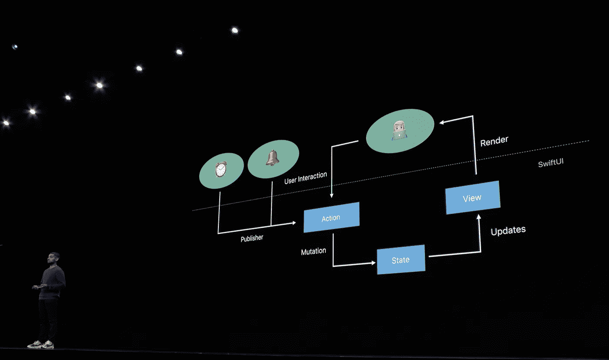

# iOS App 即微服务。在模块化应用中使用 SwiftUI

> 原文：<https://levelup.gitconnected.com/ios-app-as-a-microservice-using-swiftui-in-modular-app-f40182f5e52a>

## 如何用 SwiftUI 有效实现模块化架构？在这篇文章中，我将描述在模块化应用程序设计中使用 SwiftUI 的技巧


由[凯利·西克玛](https://unsplash.com/@kellysikkema?utm_source=ghost&utm_medium=referral&utm_campaign=api-credit) / [Unsplash](https://unsplash.com/?utm_source=ghost&utm_medium=referral&utm_campaign=api-credit) 拍摄

模块化架构非常出色。但是如何用 SwiftUI 有效实现呢？从其核心来看，SwiftUI 是状态驱动的，模块化应用程序并定义准确的责任边界可能很棘手。

在这篇文章中，我将描述 SwiftUI 在模块化设计中工作良好的特性，以及那些最好避免的特性。

> 💥这是模块化架构系列的第三篇也是最后一篇文章。查看之前的问题，以加深您对关键概念的理解！

[](https://alexdremov.me/ios-app-as-a-microservice-build-robust-app-architecture/) [## iOS App 即微服务。构建强大的应用架构

### MVVM，MVC，毒蛇，你会怎么选择？这些都是局部的和特定的问题…

alexdremov.me](https://alexdremov.me/ios-app-as-a-microservice-build-robust-app-architecture/) [](https://alexdremov.me/ios-app-as-a-microservice-modularize-your-app-with-tuist/) [## iOS App 即微服务。使用 Tuist 模块化您的应用

### Alex Dremov iniOS & Swift——这是模块化应用架构系列的第二篇文章。在这篇文章中，我将…

alexdremov.me](https://alexdremov.me/ios-app-as-a-microservice-modularize-your-app-with-tuist/) 

# 有什么问题吗

为什么 SwiftUI 在模块化设计中的使用是不同的，为什么我需要一个全新的帖子？正如我已经提到的，SwiftUI 是状态驱动的，试图避免这种情况会导致无效和混乱的解决方案。

例如

建议你有设置和主页模块。用户可以在设置屏幕上注销，您的应用程序需要*正确处理*这种情况。第一个目的是将一个闭包传递给 settings 模块，该模块将在按下 logout 按钮时被调用。听起来很合理，对吧？

好吧，但是它怎么和 SwiftUI 连接呢？注意*处理*动作并不一定意味着状态会发生变化。不过，这是一个合乎逻辑的变化。但是 SwiftUI 怎么会知道呢？

> 💡状态驱动意味着视图是状态的函数。因此，更新视图的唯一方法是改变它的状态。

# 数据流

苹果在 WWDC19 上发布了一个关于 SwiftUI 中数据角色的不错的演示。该演示涵盖了`@Binding`、`@EnvironmentObject`等情况。是最适用的。



苹果 WWDC19 — Swift 数据流

但是也指出了关键的一点——视图不是一系列事件的结果，而是数据或状态的**表示。数据的来源也很重要。真理应该只有一个来源。**

[](https://developer.apple.com/videos/play/wwdc2019/226/) [## 通过 SwiftUI 的数据流- WWDC19 -视频-苹果开发者

### SwiftUI 是从头开始构建的，让您可以编写漂亮而正确的用户界面，避免不一致…

developer.apple.com](https://developer.apple.com/videos/play/wwdc2019/226/) 

记住这一点，让我们转到将解决本文“问题”部分提出的问题的第一个技巧。

# 使用数据流而不是回调

*处理**注销动作的问题在于`*handle*`这个词本身。状态没有明确的变化，即使定义了状态，也不知道谁负责改变状态。*

*所以，如果 SwiftUI 是状态驱动的，我们来定义一下这个状态的真值来源。它必须是存储当前`logged-in` / `logged-out`状态的变量。根据状态的复杂性，它可以是 bool、enum 或 struct。*

*单一国家还是全球国家？号码*

> *💥如前几篇文章所述，**依赖关系应该是显式的**。
> 
> 在这种情况下，登录/注销变量应该作为一个依赖项传递给设置模块和主页模块。*

*但是我们需要监听这个变量的变化，并分别更新视图。还有，如果每个模块都可以改变这个变量就不好了。应该限制哪些模块可以修改状态，哪些模块只能读取。*

## *SwiftUI +联合收割机。这是一个匹配*

*您可能已经知道 SwiftUI 会自动监听`ObservableObject`变化，并在发生变化时更新视图。所以，我们可以创建这样一个类:*

*稍后可以将它注入到 SwiftUI 视图中，就这么简单*

*你不认为为每个州创建这样一个不同的类是不好的吗？这对于复杂的数据类型可能没问题，但对于单个布尔值肯定不行。*

*另外，注意`HomePageModule`和`SettingsModule`都可以改变状态。如果您有更多依赖于`logInState`的模块怎么办？他们都可以改变它！*

> *💥如果你的应用程序的每一部分都可以假设性地改变共享状态，那么如果一个 bug 出现，你就开始玩一个惊人的游戏
> “到底是谁改变了这个值？”*

# *更好地结合使用*

*好了，我们已经解决了回调的问题。尽管我们仍然有定义新的`ObservableObject`所需的样板代码的问题，以及状态修改特权的问题。*

*我们可以通过创建一个自定义的 ObservableObject 来解决这些问题！*

> *💡您也可以使用第三方反应式框架，但是我将介绍使用 Combine 的实现，因为它与 SwiftUI 无缝集成*

*要使用 SwiftUI 的自动监听更新，我们需要符合`ObservableObject`。这里有一个泛型类，可以使任何类型可见。它还利用了`@propertyWrapper`和`@dynamicMemberLookup`功能。*

*可以这么简单的使用*

> *💥但是，ObservableProperty 仅适用于值类型。传递引用类型不会触发更新*

# *将模块限制为只读变量*

*在上例中，`MyView`可以修改该值。但是我们如何将它限制为只读模式呢？我们可以创建一个类似的类来禁止修改*

*然后，我们可以将`projectedValue`添加到`ObservableProperty`中，从中创建`ObservableValue`。*

*太好了！*

*现在我们可以创建一个可观察的真理源，并将其传递给模块，将其中一些模块限制为只读模式。看看这个例子:*

*因此，回调问题解决了，我们可以继续下一个想法*

# *不要使用环境对象*

*是的，我对此非常肯定。核心的 Envoronment 对象是创建隐式依赖关系的全局变量。此外，它们很容易被忽略，如果没有设置，可能会导致意外的崩溃。*

*除此之外，你不能设置两个相同类型的环境对象，这会导致混乱的决策和代码修改。*

*第三个原因是，它们根本不支持依赖倒置。您不能将环境对象隐藏在协议后面，因为只有 ObservableObject 可以作为环境对象传递。*

# *进行程序化导航*

*SwiftUI 正在尝试引入实现程序导航的方法，但它还没有准备好。尽管如此，由于松耦合，它对于模块化架构是必不可少的。*

*有一些框架可以用来实现这一点。我有一个关于这个话题的帖子。看看吧！*

*[](https://alexdremov.me/swiftui-navigation-is-a-mess-heres-what-you-can-do/) [## SwiftUI 导航一塌糊涂。你可以这样做

### Alex dre mov iniOS & Swift——在 pure SwiftUI 中管理导航很难，并且会导致混乱的解决方案。在这篇文章中，我…

alexdremov.me](https://alexdremov.me/swiftui-navigation-is-a-mess-heres-what-you-can-do/) 

或者，您可以使用其他开源解决方案。例如，我最近发现了一个类似的框架:

[](https://github.com/johnpatrickmorgan/FlowStacks) [## GitHub-johnpatrickmorgan/flow stacks:flow stacks 允许你提升 SwiftUI 导航和…

### FlowStacks 允许您用一个简单的数组管理复杂的 SwiftUI 导航和演示流程。这使得它…

github.com](https://github.com/johnpatrickmorgan/FlowStacks) 

一如既往，让我知道你在评论中的想法！

```
This post was originally published on [alexdremov.me](https://alexdremov.me/ios-app-as-a-microservice-using-swiftui-in-modular-app/)
```

# 参考

[](https://developer.apple.com/videos/play/wwdc2019/226/) [## 通过 SwiftUI 的数据流- WWDC19 -视频-苹果开发者

### SwiftUI 是从头开始构建的，让您可以编写漂亮而正确的用户界面，避免不一致…

developer.apple.com](https://developer.apple.com/videos/play/wwdc2019/226/)  [## Apple 开发者文档

### 编辑描述

developer.apple.com](https://developer.apple.com/documentation/combine)*