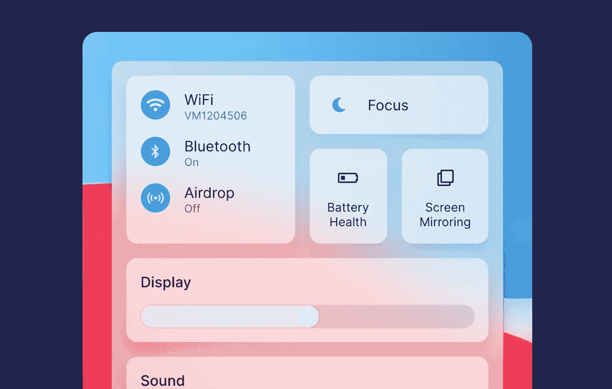
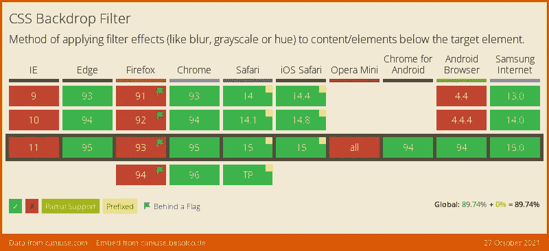

# 带有 CSS 背景滤镜的 iOS 水晶模糊背景

> 原文：<https://levelup.gitconnected.com/ios-crystaline-blurred-backgrounds-with-css-backdrop-filters-4fe7945d7ee4>



这是我们将实现的纯 CSS 效果

iOS 充满了酷炫的' **crystaline** '玻璃效果。当您可以轻松访问图形着色器时，这种效果很容易实现，因为这些着色器可以计算层下面的内容，并将其模糊到前景中。然而，很长一段时间以来，这在 CSS 中是不可能的——直到现在。

在最近的 CSS 规范中，我们终于得到了`backdrop-filter`。它主要用于情态动词，也可以应用于网络上常见的风格化下拉菜单。

在这个教程**中，我们将看看如何用现代 CSS** 制作一个有色模糊玻璃效果。

# 它是如何工作的

为了突出显示这一点，我制作了一个功能演示。**注意:如底部的支持表所示，Firefox 不会正确显示这些内容**——所以最好在 Webkit 或基于 Blink 的浏览器中查看，如 **Chome** 或 **Safari** 。

每一个都使用纯 CSS——但是你可以看到背景图像模糊到下拉菜单，创造了一个非常酷的水晶，透明，模糊的效果。

为了更好地理解这是如何工作的，我复制了下面的代码。**要检查的通知样式的 CSS 属性是**`backdrop-filter`——这将一个过滤器应用到背景层。我们可以在这里使用任何滤镜，但是这里我们使用`blur(33px)`来模糊透明的背景色。

# 半铸钢ˌ钢性铸铁(Cast Semi-Steel)

```
.effect-holder {
    height: auto;
    width: calc(33.3% - 1rem);
    border-radius: 16px;
    float: left;
    background-size: 100%;
    background-repeat: no-repeat;
    background-image: url(image.png);
}
.dropdown-style {
    margin: 0 1rem 0 0;
    background-color: #ffffff7d;   
    margin: 2rem;
    border-radius: 12px;
    padding: 1rem;
    position: relative;
    box-shadow: 0 10px 15px rgb(0 0 0 / 20%);
    box-sizing: border-box;
    width: calc(100% - 4rem);
    color: rgba(0,0,0,0.8);
    backdrop-filter: blur(33px);
    background-blend-mode: overlay;
    display: flex;
    align-items: center;
}.dropdown-style > img {
    width: 32px;
    margin: 0 1rem 0 0;
}
```

# 超文本标记语言

```
<div class="effects">
    <div class="effect-holder">
        <div class="dropdown-style">
            
            <span>Some Message</span>
        </div>
    </div>
    <div class="effect-holder dark">
        <div class="dropdown-style black">
            
            <span>Some Message</span>
        </div>
    </div>
    <div class="effect-holder">
        <div class="dropdown-style black">
            
            <span>Some Message</span>
        </div>
    </div>
</div>
```

# 其他滤镜和混合模式

既然我们可以像使用`filter`一样使用`backdrop-filter`，我们也可以使用`mix-blend-mode`，我们可以做一些其他的酷效果。下面是一个使用**变亮**混合模式的透明文本示例:

一些信息

```
.el {
    mix-blend-mode: lighten;
    backdrop-filter: blur(33px);
}
```

# 通知中心

对我来说，尝试用它来做一个简单的通知风格演示是不够的。所以我尝试了更大一点的东西，用这种效果让**成为 Mac OS 通知中心**。它并没有完全模仿他们所拥有的，但它是一个很酷的例子，说明了如何在更复杂的前端用户体验中部署这种效果。

# 支持

和所有新特性一样，`backdrop-filter`并没有完全的支持。然而，它确实有足够的支持来保证它在今天的项目中的使用。唯一不支持的主流浏览器是 Firefox，可以在 Firefox 标志中启用它进行实验。



# 结论

这个新的 CSS 属性非常简洁，它在不支持它的浏览器中可以优雅地降级。我希望你喜欢这个简短的调查。如果你想看最终演示的源代码，请点击这里的 Codepen 链接查看。