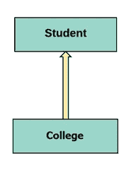
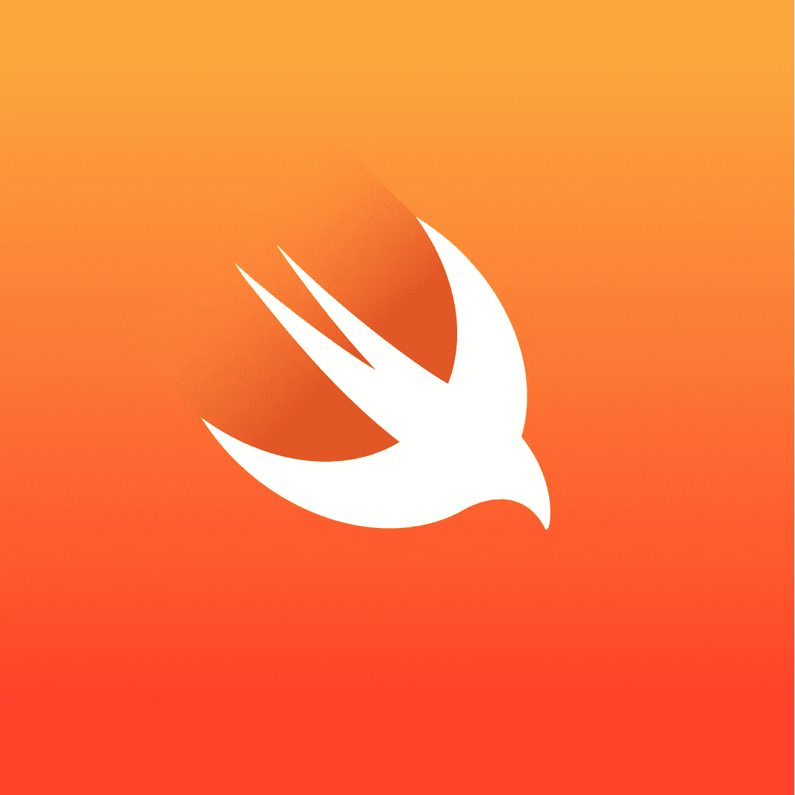

# iOS 设计模式

> 原文：<https://levelup.gitconnected.com/ios-design-patterns-c2a37bac4468>

## 核心 iOS 设计模式介绍

# 设计模式

## 定义

设计模式可以被解释为开发问题的可重用解决方案，或者是用于解决经常出现的问题的最佳实践工具。

## 类似

假设你想从头开始建一栋房子。在建造房子之前，你需要考虑很多因素，比如精确的测量、电力、管道等等。如果你有工具和设计模式，建造房子的过程可以大大加快——当有效利用时，它们是可以帮助你达到最终目标的工具。

## 类型

有 3 种主要的设计模式:

1.  结构化——这些模式描述了组合对象如何形成更大的结构。
2.  行为模式——这些模式描述了对象如何相互通信
3.  创造性的——这些模式描述了如何为您创建或实例化对象

**模型视图控制器(MVC)** 、**模型视图模型(MVVM)** 和**外观**设计模式都属于结构化类别。

**委托**、**策略**和**观察者**设计模式属于行为类别。

**构建者**、**单件**和**原型**设计模式属于创造范畴。

# 类图

为了完全理解设计模式，能够阅读类图是很重要的。

## 定义

类图可以被看作是工程蓝图，它允许你通过使用图片、符号和注释来传达关于系统的精确信息。

这些图可以包括所有范围的编程概念，如类、协议、属性、方法和关系。

统一建模语言(UML)是创建类图、建筑图和其他系统说明的标准语言。

## 箭头的类型

在这个类图中，College 继承了它的超类 Student。

1.  继承箭头总是指向超类。
2.  使用普通箭头表示属性，换句话说就是“有一个”。在上图中，如果箭头不是继承箭头，而是一个指向学生方向的普通箭头，那么类图将表示大学有一个学生。
3.  使用带虚线的开放箭头表示类符合协议。
4.  使用带虚线的普通箭头表示类委托给协议。

## 要点

不管你选择什么方向，箭头的方向决定了它的含义。

1.  即使是一对多的关系，你也应该在类图中使用类名的单数形式。在上面的例子中，我们不会说“学生”,即使一个学院通常包含不止一个学生。
2.  您也可以使用一个框来表示一个协议，但是为了将它与一个类区分开来，您需要在框内的名称前写“<<protocol>>”。</protocol>
3.  您可以在类图中表示属性和方法
4.  如果箭头的含义是显而易见的，您可以省略任何解释文本(带直线的开放箭头[继承]、带虚线的开放箭头[协议]、带直线的普通箭头[有一个])。但是，对于带有虚线[委托给]的普通箭头，建议保留说明性文本。

# 结论

如果你还没有，加入我的不和谐服务器！我希望创建一个开发人员社区，这样我们就可以加强，激励，并在我们的编程之旅中相互了解。

[不和](https://discord.gg/ZBJ5QZ6B)

如果您有任何问题或意见，请不要害怕在社交媒体上问我或与我联系！你也可以发邮件到 jkim@cloudiosx.com 给我

[领英](https://www.linkedin.com/in/john-kim-developer/?source=about_page----------------------------------------)

[AngelList](https://angel.co/u/john-kim-175?source=about_page----------------------------------------)

[GitHub](https://github.com/cloudiosx?source=about_page----------------------------------------)

[投资组合](https://cloudiosx.com/)