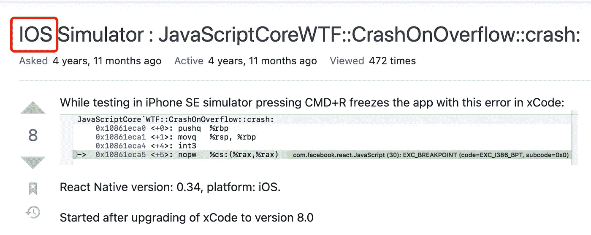

# iOS 还是 IOS？

> 原文：<https://levelup.gitconnected.com/ios-or-ios-7c7d23905c35>

如你所见，这是一个关于 iOS 或 IOS 的故事。


由苹果公司于[https://www.apple.com.cn/iphone-13-pro](https://www.apple.com.cn/iphone-13-pro/)

这里我有一个简单的问题给你，iOS 这个词怎么写？

我见过很多这样的文字:

```
iosIOSiOS
```

但是苹果的广告和开发者的文档用的是 iOS。第一个字母是小写，接下来的两个字母是大写。我选择跟随苹果。



类似地:

```
iPhone, not iphoneiPad，not ipadXcode, not XCode
```

您可以从以下链接中找到证据:

 [## 法律-商标列表-苹果

### 特殊和许可商标和/或版权在商标首次出现时使用此处显示的商标符号…

www.apple.com](https://www.apple.com/legal/intellectual-property/trademark/appletmlist.html) 

但是，它没有列出 iOS。我在里面找到的只有这个:

> IOS 是思科在美国和其他国家的商标或注册商标，经许可使用。

你怎么想呢?如果你知道什么，请留言。

# 如果你喜欢这个故事，请为它鼓掌。跟我来，让我们在接下来的帖子里见面。